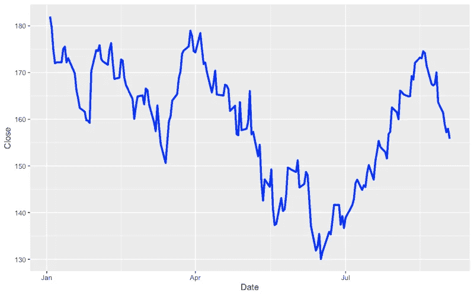
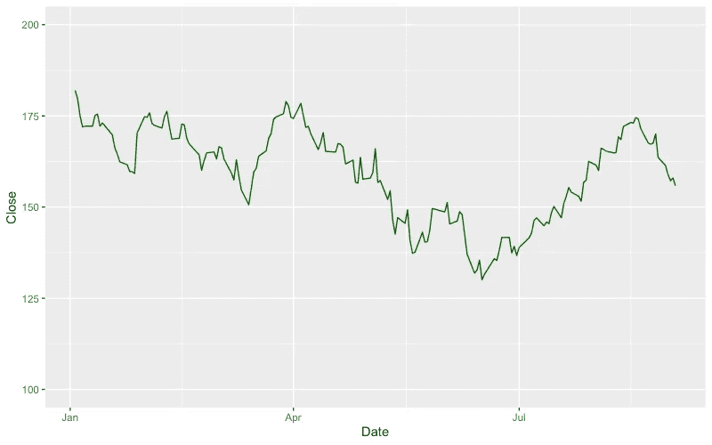
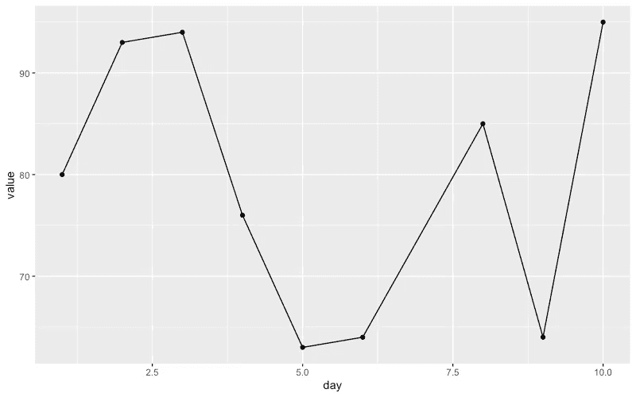
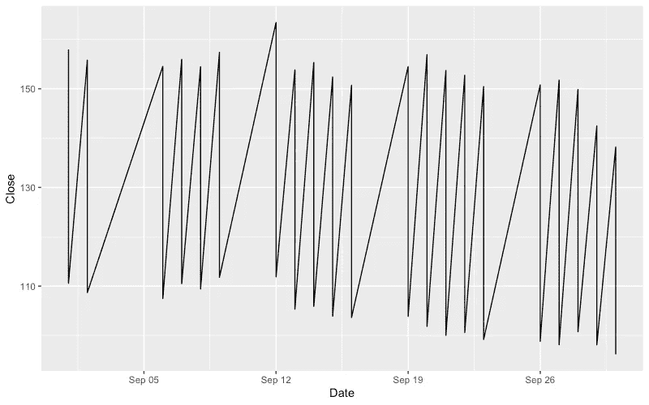
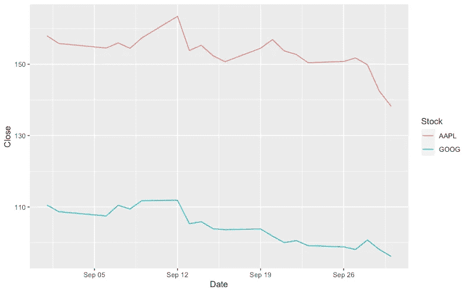
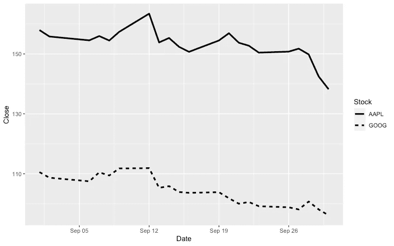
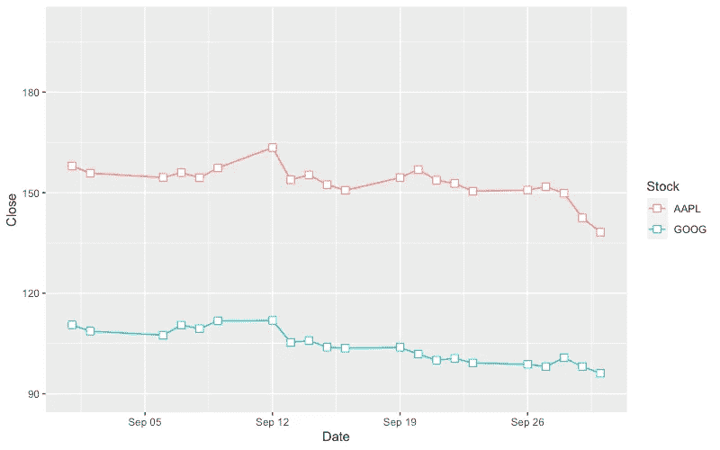
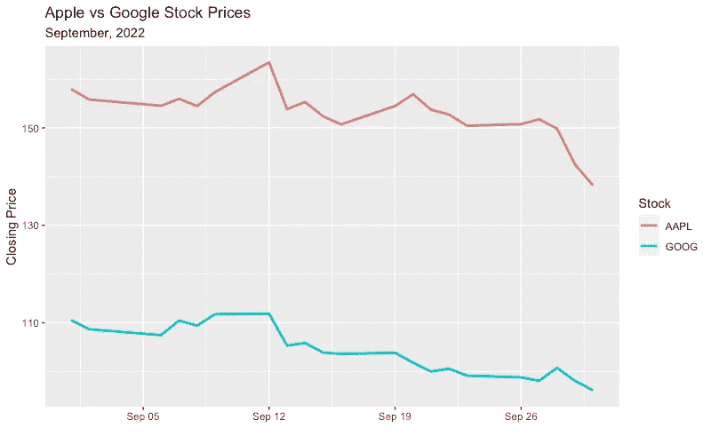

# 掌握 ggplot2 的 10 个示例:线形图

> 原文：<https://towardsdatascience.com/10-examples-to-master-ggplot2-line-plots-3e43e9aec8f>

## R 的绘图包


约翰尼斯·安德森在 [Unsplash](https://unsplash.com/s/photos/master?utm_source=unsplash&utm_medium=referral&utm_content=creditCopyText) 上拍摄的照片

你如何传递信息和信息本身一样重要。数据可视化是数据科学中传递信息、讲故事或分析的必要工具。

数据科学生态系统中最大的两个参与者是 Python 和 r。它们都有大量的包来加速和简化常见的任务。

在本文中，我们将通过 10 个示例来学习如何使用 ggplot2 创建和定制线图，gg plot 2 是 tidyverse 中的一个数据可视化包，它是数据科学的 R 包集合。

*你可以成为* [*媒介会员*](https://sonery.medium.com/membership) *解锁我的全部写作权限，外加其余媒介。如果你已经是了，别忘了订阅*[](https://sonery.medium.com/subscribe)**如果你想在我发表新文章时收到电子邮件。**

*我们将在示例中使用 3 个不同的数据集。你可以从我的 GitHub 页面上的[数据集](https://github.com/SonerYldrm/datasets)库中下载它们。*

*第一个是包含 2022 年苹果股票价格的 CSV 文件。我们先用数据表包的 fread 函数创建一个数据表。*

```
*library(data.table)
library(ggplot2)apple <- fread("datasets/apple_stock_prices_2022.csv")head(apple)
**# output** Date   High    Low   Open  Close    Volume Adj Close
1: 2022-01-03 182.88 177.71 177.83 182.01 104487900  181.2599
2: 2022-01-04 182.94 179.12 182.63 179.70  99310400  178.9595
3: 2022-01-05 180.17 174.64 179.61 174.92  94537600  174.1992
4: 2022-01-06 175.30 171.64 172.70 172.00  96904000  171.2912
5: 2022-01-07 174.14 171.03 172.89 172.17  86709100  171.4605
6: 2022-01-10 172.50 168.17 169.08 172.19 106765600  171.4804*
```

## *示例 1*

*我们将创建一个简单的线图，在 x 轴上显示数据，在 y 轴上显示收盘价。*

```
*ggplot(apple, aes(x = Date, y = Close)) + 
  geom_line()*
```

*ggplot 函数指定数据以及到 x 和 y 的映射。aes 代表美学映射，描述数据中的变量如何映射到 geom 的视觉属性(例如 geom_line)。*

*geom_line 是绘制线图的函数。以下是上述代码片段的输出:*

**

*(图片由作者提供)*

## ***例二***

*我们可以在外观上做很多定制。让我们改变线条的大小和颜色，这可以在 geom_line 函数中完成。*

```
*ggplot(apple, aes(x = Date, y = Close)) + 
  geom_line(size = 1.2, color = "blue")*
```

**

*(图片由作者提供)*

*我们也可以使用 linestyle 参数(linestyle = "dashed ")将其设为虚线。*

## *示例 3*

*y 轴上的范围根据数据集中的值自动定义。但是，可以使用 ylim 函数对其进行更改。*

*默认值通常是好的，但我们有时需要调整它们，以保持多个图之间的标准或有一个从零开始的轴。让我们将范围设置为 100–200。*

```
*ggplot(apple, aes(x = Date, y = Close)) + 
  geom_line(color = "darkgreen") + 
  ylim(100, 200)*
```

**

*(图片由作者提供)*

## *实例 4*

*我们可以添加点来指示数据点的位置。当我们没有很多数据点时(即观察的密度很低)，这是很有帮助的。*

*在本例中，我们将使用测量数据集。*

```
*measurements <- fread("datasets/measurements.csv")measurements
**# output**
   day value
1:   1    80
2:   2    93
3:   3    94
4:   4    76
5:   5    63
6:   6    64
7:   8    85
8:   9    64
9:  10    95*
```

*让我们创建一个线图，在 x 轴上显示日期，在 y 轴上显示数值。我们还将使用 geom_point 函数添加点。*

```
*ggplot(measurements, aes(x = day, y = value)) + 
  geom_line() + 
  geom_point()*
```

**

*(图片由作者提供)*

*这些点被放置在我们在数据集中进行观察的位置。例如，数据集没有第 7 天，所以不显示。*

## *实例 5*

*在前面的例子中，观察值的 x 值不是很清楚。为了在 x 轴上显示每一天的值，我们可以将其转换为一个因子，并使用 ggplot 函数的 group 参数。*

```
*measurements[, day := factor(day)]ggplot(measurements, aes(x = day, y = value, group = 1)) + 
  geom_line() + 
  geom_point()*
```

**

*(图片由作者提供)*

## *实例 6*

*我们可以在一个线图上有多条线。对于这个例子，我们将使用另一个数据集，它包含 2022 年 9 月苹果和谷歌的股票价格。*

```
*stock <- fread("datasets/apple_google_stock_prices_092022.csv")head(stock)
**# output** Date   High    Low   Open  Close   Volume Adj Close Stock
1: 2022-09-01 158.42 154.67 156.64 157.96 74229900    157.96  AAPL
2: 2022-09-02 160.36 154.97 159.75 155.81 76905200    155.81  AAPL
3: 2022-09-06 157.09 153.69 156.47 154.53 73714800    154.53  AAPL
4: 2022-09-07 156.67 153.61 154.82 155.96 87449600    155.96  AAPL
5: 2022-09-08 156.36 152.68 154.64 154.46 84923800    154.46  AAPL
6: 2022-09-09 157.82 154.75 155.47 157.37 68028800    157.37  AAPL*
```

*股票栏表示股票的名称。*

*对于每一天，我们有两个不同的值，一个是苹果的，一个是谷歌的。因此，如果我们像前面一样绘制日期和收盘价，我们最终会得到如下图:*

**

*(图片由作者提供)*

*我们需要用不同的线条显示苹果和谷歌的股票价值。做这件事有几种不同的方法。例如，我们可以使用颜色参数并指定区分苹果和谷歌的列。*

```
*ggplot(stock, aes(x = Date, y = Close, colour = Stock)) + 
  geom_line()*
```

**

*(图片由作者提供)*

## *例 7*

*让我们重新创建以前的情节，但对苹果和谷歌使用不同的线条样式。我们只需要使用线型参数，而不是颜色。*

```
*ggplot(stock, aes(x = Date, y = Close, linetype = Stock)) + 
  geom_line(size = 1.2)*
```

**

*(图片由作者提供)*

## *实施例 8*

*在示例 4 和 5 中，我们添加了点来标记数据集中的观察值。这些点的大小和形状也可以定制。*

*让我们在示例 7 的图中添加点，并更改 y 轴的取值范围。*

```
*ggplot(stock, aes(x = Date, y = Close, color = Stock)) + 
  geom_line() +
  geom_point(size = 3, shape = 22, fill = "white") +
  ylim(90, 200)*
```

**

*(图片由作者提供)*

## *示例 9*

*我们可能想要更改默认的轴标签或给绘图添加标题。让我们通过这样做使我们的情节更有知识性和吸引力。*

*labs 功能可用于添加标题和副标题。可以使用 xlab 和 ylab 函数更改轴标签。*

```
*ggplot(stock, aes(x = Date, y = Close, color = Stock)) + 
  geom_line(size = 1) +
  labs(title = "Apple vs Google Stock Prices",
       subtitle = "September, 2022") +
  xlab("") +
  ylab("Closing Price")*
```

**

*(图片由作者提供)*

## *实例 10*

*我们可以为情节添加一个主题，这允许进行许多自定义，包括:*

*   *更改标题和副标题的字体大小和样式*
*   *更改轴标签的字体大小和样式*
*   *更改刻度线的字体大小、样式和方向*

*让我们使用这些来定制前一个例子中的情节。*

```
*ggplot(stock, aes(x = Date, y = Close, color = Stock)) + 
  geom_line(size = 1) +
  labs(title = "Apple vs Google Stock Prices",
       subtitle = "September, 2022") +
  xlab("") +
  ylab("Closing Price") +
  theme(
    plot.title = element_text(size = 18, face = "bold.italic"),
    plot.subtitle = element_text(size = 16, face = "bold.italic"),
    axis.title.y = element_text(size = 14, face = "bold"),
    axis.text.x = element_text(size = 12),
    axis.text.y = element_text(size = 12)
  )*
```

**

*(图片由作者提供)*

*Ggplot2 是一个高效的库，提供了很大的灵活性。我认为它与 Matplotlib 相似，我们可以在图上定制几乎任何东西。*

*本文中的示例涵盖了创建和定制线图所需的大部分内容。在一些边缘情况下，您需要做一些进一步的定制，但是到了那个时候，您可以担心它们。*

*感谢您的阅读。如果您有任何反馈，请告诉我。*