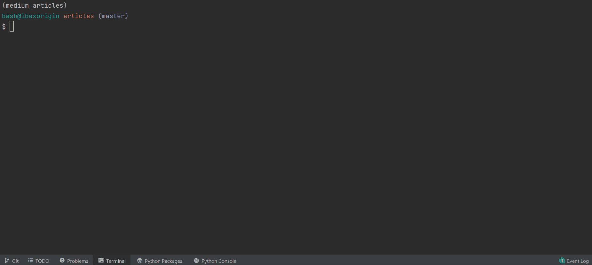
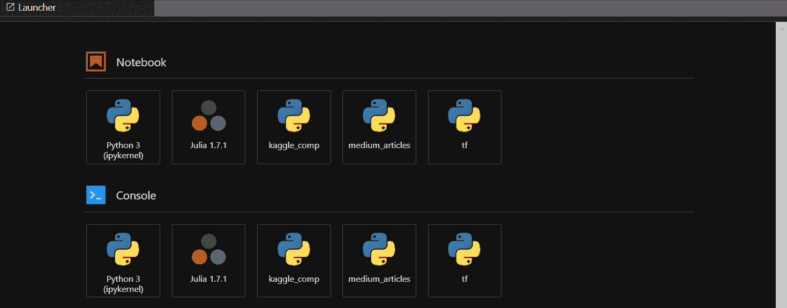
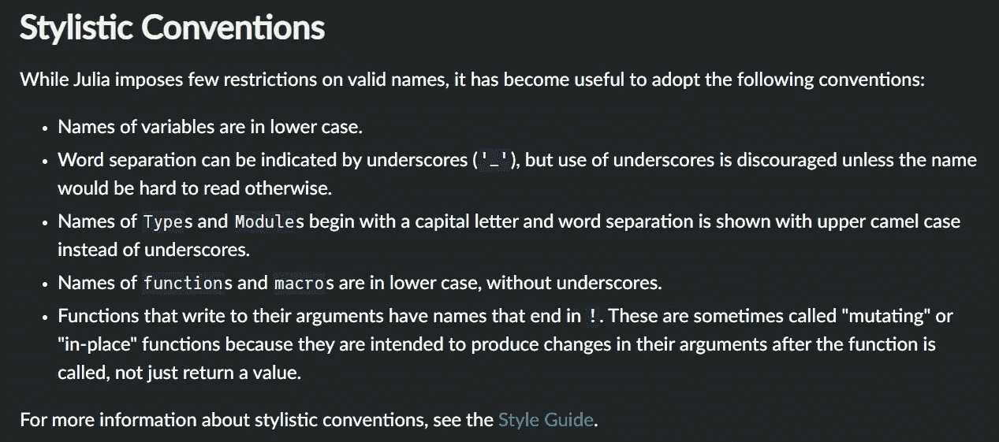
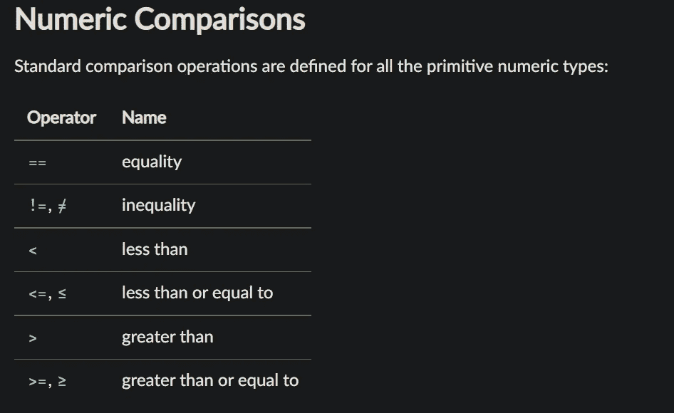

# 给铁杆 Python 爱好者的 10 分钟 Julia 指南

> 原文：<https://towardsdatascience.com/10-minute-guide-to-julia-for-die-hard-python-lovers-a2fcf7dcb860>

## 你不能再忽视她了，你不能


**照片由** [**艾玛**](https://www.pexels.com/@emma-bauso-1183828?utm_content=attributionCopyText&utm_medium=referral&utm_source=pexels) **上** [**像素**](https://www.pexels.com/photo/girl-wearing-white-dress-2253896/?utm_content=attributionCopyText&utm_medium=referral&utm_source=pexels)

不要误解我。我不是一个讨厌 Python 的人。我喜欢它，在事实改变之前，我的眉毛可能会变成蓝色。但是朱莉娅似乎好得不像真的。

所有的编程语言在特定的任务上都很优秀，但在其他方面却很糟糕。Julia 的创造者很贪婪——他们想要最好的语言的所有超能力并创造一种超级语言。

他们做到了。正如创作者在《朱莉娅的贪婪》中所描述的那样，这种语言已经实现了他们 90%以上的宏伟梦想。

尽管 Julia 相对年轻，但它已经可以和 Python 一较高下了。考虑到 Python 花了很多年才成熟并被认真对待，Julia 正在以惊人的速度增长。在一个小得多的社区中，这种语言已经有了几乎任何可以用 Python 完成的任务的包和框架。

在本文中，您将了解核心语言，即使没有额外的模块，它也包含了令人敬畏的特性。

[](https://ibexorigin.medium.com/membership) [## 通过我的推荐链接加入 Medium-BEXGBoost

### 获得独家访问我的所有⚡premium⚡内容和所有媒体没有限制。支持我的工作，给我买一个…

ibexorigin.medium.com](https://ibexorigin.medium.com/membership) 

获得由强大的 AI-Alpha 信号选择和总结的最佳和最新的 ML 和 AI 论文:

[](https://alphasignal.ai/?referrer=Bex) [## 阿尔法信号|机器学习的极品。艾总结的。

### 留在循环中，不用花无数时间浏览下一个突破；我们的算法识别…

alphasignal.ai](https://alphasignal.ai/?referrer=Bex) 

## 安装和设置

安装 Julia 并将其添加到 JupyterLab 只需要几分钟的时间。从[这里](https://julialang.org/downloads/)下载安装程序，并勾选安装时将 Julia 添加到`PATH`的选项。你甚至不需要重启你的机器。如果您在自己选择的 CLI 上键入`julia`并得到以下输出，Julia 就正常了:



作者 GIF

对于 IDE，你可以为 PyCharm 安装 Julia 插件。对于 VSCode，扩展市场已经覆盖了你。

如果你想试试 JupyterLab 里面的 Julia，输入`julia`进入 REPL 模式后这两行应该就够了:

```
using Pkg
Pkg.add("IJulia")
```

只需记住重新启动任何正在运行的 JupyterLab 会话，以使更改生效。然后，你可以从开始菜单打开一个带有 Julia 内核的笔记本:



作者 GIF

## 变量

Python 和 Julia 之间有很多语法上的相似之处。两者读起来几乎都像自然英语。

假设您已经熟悉 Python，我将主要提到 Julia 中在基本编程原则方面与 Python 语法完全不同的部分。先说变量。

Julia 是一种动态类型语言，这意味着 Julia 和 Python 中的变量没有太大的区别。在这两种情况下，变量都区分大小写，没有语义含义，并且允许在创建时使用大多数 Unicode 符号。

在[风格指南](https://docs.julialang.org/en/v1/manual/variables/#Stylistic-Conventions)中有一些小的不同:



[茱莉亚文件](https://docs.julialang.org/en/v1/)截图

除此之外，Julia 中的一个变量可以替代它们的 Pythonic 对应物。

## 数字和数学

Julia 是一种科学语言，比 Python 更科学，它对数学计算有极好的、极快的支持。

所有的数学运算符都是一样的，除了乘方运算符，在 Julia 中用`^`表示，以及底除数，用`÷`表示(我不知道你如何在键盘上用一个简单的击键产生它)。还有一个额外的运算符，用*反斜杠* ( `\`)执行逆除法:

默认情况下，整数和浮点用 Int64 和 Float64 数据类型表示。Julia 非常重视正确的类型用法，因为它们对记忆有很大的影响:

不幸的是，Julia 还不支持全局变量的类型声明:

无穷大和空值表示为`Inf`和`NaN`:

但是，奇怪的是，在 Julia 中没有零除法误差:

现在，我们到了 Julia 开始觉得自己是一种真正的科学的、以数学为目的的语言的部分。Julia 允许你写出多项式的系数，而不用那些讨厌的乘法符号:

然而，也有例外——像这样的东西是行不通的:

尽管如此，允许数字紧接在变量之前，使得公式和表达式的编写更加简洁明了。

Julia 还在全局范围内提供了广泛的标准函数，无需导入额外的模块:

```
>>> factorial(10)3628800
```

下面是除法函数的列表:


[茱莉亚文件](https://docs.julialang.org/en/v1/)截图

幂、对数和根函数的列表更加令人印象深刻:


[茱莉亚文件](https://docs.julialang.org/en/v1/)截图

也没有遗漏触发功能:


[朱莉娅文件的截图](https://docs.julialang.org/en/v1/)

## 条件式

在 Julia 中，缩进是没有语义意义的(但是请大家为了大家的利益使用它，就像你在写 Python 一样)。因此，诸如条件、循环和函数等代码块应该以关键字`end`结束。

条件关键字(if，else if(Python 中的 elif)，else)的逻辑是一样的。数字比较运算符也是如此:



[朱莉娅文件的截图](https://docs.julialang.org/en/v1/)

复合语句的条件运算符略有不同:

`&&`和`||`操作人员称为短路`**and**` 和`**or**` 操作人员。我们只探索它们的标准功能；优秀的[短路特性](https://docs.julialang.org/en/v1/manual/control-flow/#Short-Circuit-Evaluation)将在文章结尾进行探讨。

在 Julia 中还有严格的等式运算符— `===`。这将检查值和数据类型是否相等:

像任何现代语言一样，Julia 支持三元运算符:

不幸的是，与 Python 版本相比，这个版本*非常不可读*:

最后，Julia 中的值没有 Python 中的真值:

所以，语法`if value`在 Julia 中不起作用。为了完善这种奇怪性，Julia 中有四种类型的空值:

我特别喜欢`nothing`。现在，我可以明确地在函数中不返回任何东西。

## 复合表达式

复合表达式在 Julia 中比在 Python 中成熟得多。

在 Python 中有很多这样的情况，一些代码行就宽度而言非常短，但仍然占据了一整行。Julia 中的复合表达式解决了这个问题，让你的代码更加紧凑。这里有一个简单的例子:

将多个表达式放在括号内并用分号分隔，就构成了一个复合表达式。此外，您不必将它们写成单行语句:

在复合语句中创建的变量在语句结束后仍将留在它们的作用域内:

```
>>> println(x + y)31
```

您也可以使用`begin` / `end`语法创建复合表达式，这样可以避免分号:

## 用线串

先简单说一下字符串:

尽管在数据类型方面很相似，但是在 Julia 和 Python 中字符串方法有很大的不同。例如，串联是用乘法符号非直觉地完成的:

或者是`string`函数，它也将数字转换成字符串(如何转换...好玩):

分割字符串也有点不寻常。第一个字符不像 Python 中那样用`0`索引，而是使用关键字`begin`:

哦，没有负数的反向切片。相反，Julia 使用了`end`关键字:

也可以用`SubString`功能分割字符串:

使用`$`符号进行字符串插值:

在 Julia 中没有针对字符串的`in`关键字，所以您必须使用`occursin`函数来检查子字符串:

```
>>> occursin("was", long_str)true
```

重复一个字符串是通过电源符号或重复功能完成的:

```
>>> str ^ 3"JuliaJuliaJulia"
```

你可以从 Julia docs 的 [this](https://docs.julialang.org/en/v1/base/strings/) 链接中找到标准字符串函数的列表，它包括了几乎所有你喜欢的 Python 字符串函数等等。

## 环

Julia 中的循环与 Python 相同，除了缺少冒号和在末尾添加了`end`关键字:

您可以使用`:`创建一个 iterable 对象，尽管 Julia 中也存在`range`函数。

令人惊讶的是，您还可以使用`=`符号来循环遍历一个 iterable:

`break`、`continue`逻辑按预期工作。`zip`功能也是如此。

对于嵌套循环，Julia 提供了更紧凑的语法:

每次在`for`块中的逗号后添加 iterable 时，都会创建一个内部循环，如下所示:

`while`循环也几乎与 Python 的相同:

## 功能

函数用关键字`function`定义，并以`end`结束:

类型声明用双分号书写(对于返回类型也是如此):

Julia 还允许为上面这样的短函数定义单行函数:

您也可以将函数分配给其他变量:

这是 Julia 的另一个特质——即使是操作符也是函数，因此可以被重新赋值(不要忘记分号):

这些类型的技巧也有效:

使用`->`运算符对`lambda`进行如下定义:

要更全面地了解 Julia 中的函数，请查看[文档](https://docs.julialang.org/en/v1/manual/functions/)。

## 数组

创建基本数组的语法与 Python 类似:

由于 Julia 是一种科学语言，基本数组被认为是向量。vector 中的元素不需要是相同的类型，就像 Python 中一样。

您可以使用`collect`函数从迭代中创建向量:

或者使用熟悉的`range`功能输入一系列数字:

Julia 还内置了对快速强大的 2D 和 3D 矩阵的支持。只要去掉元素之间的逗号，你就得到一个 2D 数组。记住用分号分隔各行:

列表理解与 Python 中的相同:

您也可以在生成器表达式上使用`collect`函数来创建向量:

你可以阅读关于创建和操作向量和矩阵的所有方法的 Julia 文档，在这方面你可以学到很多东西。

## 字典

创建字典需要与 Python 不同的语法，但逻辑是相同的:

不变性约束仍然有效——键应该只是不可变的类型，比如数字、字符串和元组。从字典中添加和检索值与 Python 中的相同。但是删除有点不同:

令我高兴的是，字典中的理解在 Julia 中也有效:

要检查字典中是否存在关键字，使用`haskey`功能:

```
haskey(dict1, "missing")false
```

获取所有的键和值都有各自的功能:

不幸的是，没有像 Python 中那样的`items`方法来获取键/值对。

你可以阅读[文档](https://docs.julialang.org/en/v1/base/collections/#Dictionaries)来了解更多关于 Julia 中的字典。

## 短路的魔力

在前面的部分中，我们简要地讨论了逻辑`and`和`or`如何具有短路行为。我们来细说一下。

短路评估可用于替换短条件表达式。用逻辑**和**T9 来考虑这个例子:

您可能会在以下条件下产生上述行为:

因此，如果条件为真，短路`&&`可以用于我们想要评估表达式的情况。下面是一个总是执行的短路`&&`表达式:

换句话说，如果短路表达式的左侧计算结果为`true`，则执行右侧部分。

短路`||`则相反。只有当左侧为`false`时，`||`的右侧才运行；

短路可以清除许多繁琐的条件语句。

## 结论

我想 Julia 在使用方面接近 Python 还需要一段时间。Julia 可能比 Python 好几个数量级，但可能仍然无法说服许多长期的 Python 爱好者做出改变。

你呢？你认为未来像数据科学、机器学习和人工智能这样的领域会由朱莉娅一个人统治吗？

留下你的想法，感谢你的阅读！

**您可以使用下面的链接成为高级媒体会员，并访问我的所有故事和数以千计的其他故事:**

[](https://ibexorigin.medium.com/membership) [## 通过我的推荐链接加入 Medium。

### 作为一个媒体会员，你的会员费的一部分会给你阅读的作家，你可以完全接触到每一个故事…

ibexorigin.medium.com](https://ibexorigin.medium.com/membership) 

**或者订阅我的邮件列表:**

[](https://ibexorigin.medium.com/subscribe) [## 每当 Bex T .发布时收到电子邮件。

### 每当 Bex T .发布时收到电子邮件。注册后，如果您还没有中型帐户，您将创建一个…

ibexorigin.medium.com](https://ibexorigin.medium.com/subscribe) 

**你可以在**[**LinkedIn**](https://www.linkedin.com/in/bextuychiev/)**或**[**Twitter**](https://twitter.com/BexTuychiev)**上联系我，友好地聊一聊所有的事情数据。或者你可以读我的另一个故事。这些怎么样:**

[](/good-bye-pandas-meet-terality-its-evil-twin-with-identical-syntax-455b42f33a6d) [## 再见熊猫！遇见 Terality——它邪恶的孪生兄弟有着相同的语法

### 编辑描述

towardsdatascience.com](/good-bye-pandas-meet-terality-its-evil-twin-with-identical-syntax-455b42f33a6d) [](/github-copilot-crushes-data-science-and-ml-tasks-ultimate-review-c8bcbefb928a) [## GitHub Copilot 碾压数据科学和 ML 任务:终极回顾

### 编辑描述

towardsdatascience.com](/github-copilot-crushes-data-science-and-ml-tasks-ultimate-review-c8bcbefb928a) [](/6-pandas-mistakes-that-silently-tell-you-are-a-rookie-b566a252e60d) [## 6 个熊猫的错误，无声地告诉你是一个菜鸟

### 编辑描述

towardsdatascience.com](/6-pandas-mistakes-that-silently-tell-you-are-a-rookie-b566a252e60d) [](/8-booming-data-science-libraries-you-must-watch-out-in-2022-cec2dbb42437) [## 2022 年你必须小心的 8 个蓬勃发展的数据科学图书馆

### 编辑描述

towardsdatascience.com](/8-booming-data-science-libraries-you-must-watch-out-in-2022-cec2dbb42437) [](/7-cool-python-packages-kagglers-are-using-without-telling-you-e83298781cf4) [## Kagglers 正在使用的 7 个很酷的 Python 包

### 编辑描述

towardsdatascience.com](/7-cool-python-packages-kagglers-are-using-without-telling-you-e83298781cf4) [](/22-2-built-in-python-libraries-you-didnt-know-existed-p-guarantee-8-275685dbdb99) [## 22–2 个您不知道存在的内置 Python 库| P(保证)= .8

### 编辑描述

towardsdatascience.com](/22-2-built-in-python-libraries-you-didnt-know-existed-p-guarantee-8-275685dbdb99)