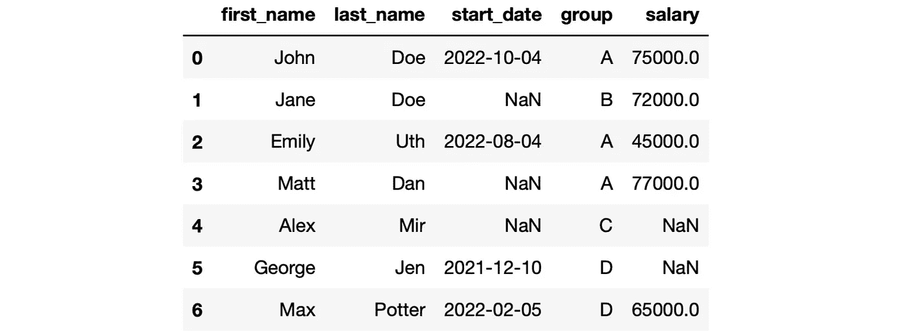
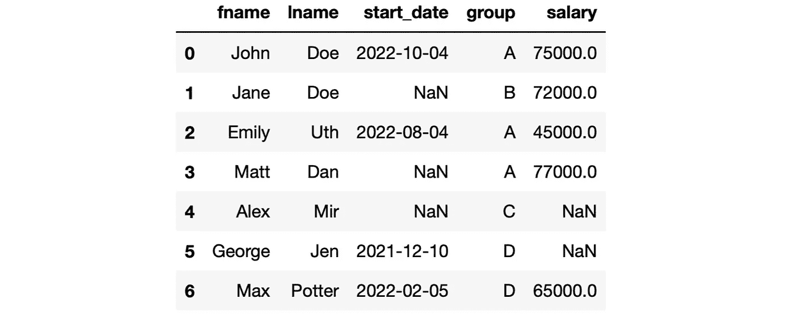
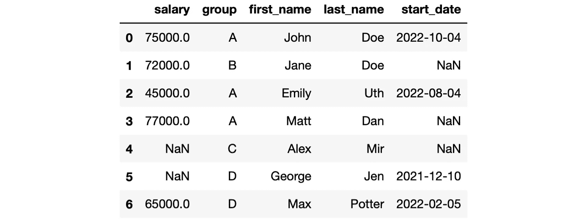

# 关于堆栈溢出的 10 个最常见的熊猫问题

> 原文：<https://towardsdatascience.com/10-most-frequently-asked-pandas-questions-on-stack-overflow-b9d7d94cd83e>

## 来自现实生活的问题


在 [Unsplash](https://unsplash.com/s/photos/question?utm_source=unsplash&utm_medium=referral&utm_content=creditCopyText) 上由[Towfiqu barb huya](https://unsplash.com/@towfiqu999999?utm_source=unsplash&utm_medium=referral&utm_content=creditCopyText)拍摄的照片

Stack Overflow 是最大的在线社区，它不断地在软件、编码、数据科学和许多其他主题中提问和回答问题。

我认为使它成为无价资源的是问题来自现实生活。人们会发帖询问他们在工作中遇到的困难。答案通常来自经历过同样挑战并找到解决方案的人。

在这篇文章中，我们将讨论关于栈溢出的 10 个最常见的问题。如果你正在或计划学习熊猫，你可能会搜索这些问题中的一些。

在撰写本文时，我根据投票数和对堆栈溢出的看法选择了问题。

让我们从创建一个用于问题的样本数据框架开始。

```
import numpy as np
import pandas as pd

df = pd.DataFrame({

    "first_name": ["John", "Jane", "Emily", "Matt", "Alex", "George", "Max"],
    "last_name": ["Doe", "Doe", "Uth", "Dan", "Mir", "Jen", "Potter"],
    "start_date": ["2022-10-04", np.nan, "2022-08-04", np.nan, np.nan, "2021-12-10", "2022-02-05"],
    "group": ["A", "B", "A", "A", "C", "D", "D"],
    "salary": [75000, 72000, 45000, 77000, np.nan, np.nan, 65000]

})

df
```



df(作者图片)

## 1.如何在 Pandas 中迭代数据帧中的行

尽管这个问题是最重要的，但是通常不建议对行进行迭代。矢量化运算比执行迭代更实用、更快速。

我认为这个问题的浏览量最高，因为它是在将近 10 年前提出的。当时很少有人对数据科学感兴趣。

如果一定要遍历行，可以使用 iterrows，它返回行及其索引。这里有一个简单的例子:

```
for index, row in df.iterrows():
    print(row[0], row[1])

# output
John Doe
Jane Doe
Emily Uth
Matt Dan
Alex Mir
George Jen
Max Potter
```

## 2.如何根据列值从数据帧中选择行？

这个问题是关于根据一列或多列中的值过滤数据帧。根据数据类型，有几种不同的过滤方式。

最重要的是把条件写好。例如，我们可以选择工资高于 70000 的行，如下所示:

```
df[df["salary"] > 70000] 

# output
  first_name last_name start_date group  salary
0       John       Doe 2022-10-04     A 75000.0
1       Jane       Doe        NaN     B 72000.0
3       Matt       Dan        NaN     A 77000.0
```

我们也可以基于多个条件过滤数据帧。下面是我们如何选择工资高于 7000 且属于 a 组的行。

```
df[(df["salary"] > 70000) & (df["group"] == "A")] 

# output
  first_name last_name start_date group  salary
0       John       Doe 2022-10-04     A 75000.0
3       Matt       Dan        NaN     A 77000.0
```

另一种常用的筛选方法是 isin 方法，它将值与一组给定的值进行比较。

以下代码行选择 A、B 或 c 组中的行。

```
df[df["group"].isin(["A", "B", "C"])] 

# output

  first_name last_name start_date group  salary
0       John       Doe 2022-10-04     A 75000.0
1       Jane       Doe        NaN     B 72000.0
2      Emily       Uth 2022-08-04     A 45000.0
3       Matt       Dan        NaN     A 77000.0
4       Alex       Mir        NaN     C     NaN
```

## 3.在 Pandas 中重命名列名

rename 函数可用于更改 Pandas 中的列名。新旧列名在 Python 字典中被写成键值对。

让我们重命名数据框架中的名字和姓氏列。

```
df = df.rename(columns={"first_name": "fname", "last_name": "lname"})

df
```



df(作者图片)

## 4.从熊猫数据框架中删除一列

drop 函数可用于删除行和列。为了将它用于列，需要将轴参数的值设置为 1。

我们在 Python 列表中写入要删除的列名或索引。

```
# dropping the start_date and group columns
df_new = df.drop(["start_date", "group"], axis=1)

df_new.columns

# output
Index(['fname', 'lname', 'salary'], dtype='object')
```

drop 函数返回删除了列的数据帧，但不修改原始数据帧。为了保存更改，我们需要:

1.  将它赋给一个新变量
2.  使用 inplace 参数

在上面的例子中，我们选择了第一个选项，并将返回的数据帧赋给了 df_new。

以下代码行修改了原始数据帧(df)。

```
# dropping the start_date and group columns
df.drop(["start_date", "group"], axis=1, inplace=True)
```

## 5.我如何获得熊猫数据帧的行数？

DataFrame 是一个带有标记行和列的二维数据结构。

为了获得行数，我们可以使用 shape 函数返回一个显示行数和列数的元组。另一种选择是使用 Python 的 len 函数，它将只返回行数。

```
df.shape

# output
(7, 5)

len(df)

# output
7
```

## 6.在熊猫数据框架中选择多个列

这是根据列过滤数据帧的另一种方式。我们可以通过将列写入 Python 列表来选择它们的子集。

```
cols = ["first_name", "last_name", "salary"]

df[cols]
```


(图片由作者提供)

我们还可以使用 loc 和 iloc 方法，通过列名或索引来选择多个列。如果你想了解更多，我之前写过一篇关于 loc 和 iloc 方法的教程。

## 7.如何更改数据帧列的顺序

完成这项任务有不同的方法。一种选择是使用 loc 方法。

```
new_cols = ["salary", "group", "first_name", "last_name", "start_date"]

df.loc[:, new_cols]
```



(图片由作者提供)

逗号前的冒号表示我们需要所有的行。逗号后面的列表决定了列的新顺序。

我写了一篇关于这个任务的详细文章，展示了[改变列顺序的 4 种方法](/4-methods-for-changing-the-column-order-of-a-pandas-data-frame-a16cf0b58943)。

## 8.在 Pandas 中更改列类型

我使用了与堆栈溢出完全相同的短语。这个问题意味着改变列数据类型。

更改数据类型最直接的方法是使用 astype 函数。

让我们首先检查数据框架中的列数据类型。

```
df.dtypes

# output
first_name     object
last_name      object
start_date     object
group          object
salary        float64
dtype: object
```

开始日期列的数据类型是 object，但最好将其转换为 datetime 数据类型。

```
df["start_date"] = df["start_date"].astype("datetime64[ns]")

df.dtypes

# output
first_name            object
last_name             object
start_date    datetime64[ns]
group                 object
salary               float64
dtype: object
```

我们可以在一次操作中改变多列的数据类型。列名和新的数据类型被写成 Python 字典中的键值对。

```
df = df.astype({
    "start_date": "datetime64[ns]",
    "first_name": "string",
    "last_name": "string"
})

df.dtypes

# output
first_name            string
last_name             string
start_date    datetime64[ns]
group                 object
salary               float64
dtype: object
```

## 9.如何删除熊猫数据帧中某一列的值为 NaN 的行

dropna 函数可用于删除缺少值的行和列。默认情况下，它会删除行。为了将其更改为列，轴参数的值被设置为 1。

```
df.dropna()
```


(图片由作者提供)

默认情况下，至少有 1 个任务值的行将被删除。我们可以使用 subset、how 和 thresh 参数来定制这种行为。这里有一篇关于如何处理熊猫数据帧中缺失值的更详细的文章。

[](/8-methods-for-handling-missing-values-with-python-pandas-842544cdf891)  

## 10.从 Pandas DataFrame 列标题获取列表

我们简单地使用 columns 方法和 list 构造函数。

```
col_headers = list(df.columns)

col_headers

# output
['first_name', 'last_name', 'start_date', 'group', 'salary']
```

截至撰写本文时，堆栈溢出上有 267，037 个问题被标记为熊猫。我们已经知道了这个庞大的列表和资源的前 10 个问题的答案。

你可以成为[媒介会员](https://sonery.medium.com/membership)来解锁我的作品的全部访问权限，以及媒介的其余部分。如果你已经是了，别忘了订阅[如果你想在我发表新文章时收到电子邮件的话。](https://sonery.medium.com/subscribe)

感谢您的阅读。如果您有任何反馈，请告诉我。