# Python 中多元数据分析的 10 个必知的 Seaborn 可视化图

> 原文：<https://towardsdatascience.com/10-must-know-seaborn-functions-for-multivariate-data-analysis-in-python-7ba94847b117>

## 了解如何使用 Seaborn 的轴级和图形级绘图来可视化数据


由[米卡·鲍梅斯特](https://unsplash.com/@mbaumi?utm_source=medium&utm_medium=referral)在 [Unsplash](https://unsplash.com?utm_source=medium&utm_medium=referral) 拍摄的照片

许多初学者课程专注于 [Matplotlib](https://matplotlib.org/) 的可视化，原因是底层功能和定制每个情节细节的能力。但是，我发现自己陷入了所有的文档、社区讨论和许多创建简单情节的方法中，感谢上帝我找到了 Seaborn。

Seaborn 是一个建立在 Matplotlib 之上的接口，它使用几行简短的代码从 Pandas datafames 创建统计图表并设置其样式。它在引擎盖下利用了 Matplotlib，最好对[图](https://matplotlib.org/stable/api/figure_api.html)、[轴](https://matplotlib.org/stable/api/axes_api.html)、[轴](https://matplotlib.org/stable/api/axis_api.html)对象有一个基本的了解。

[](/8-seaborn-plots-for-univariate-exploratory-data-analysis-eda-in-python-9d280b6fe67f)  

我们将使用来自 Kaggle 的[车辆数据集](https://www.kaggle.com/datasets/nehalbirla/vehicle-dataset-from-cardekho?ref=hackernoon.com&select=Car+details+v3.csv)，该数据集受[开放数据库](https://opendatacommons.org/licenses/dbcl/1-0/)许可。下面的代码导入所需的库，设置样式，并加载数据集。

```
import pandas as pd
import numpy as np
import matplotlib.pyplot as plt
import seaborn as snssns.set_style('darkgrid')
sns.set(font_scale=1.3)cars = pd.read_csv('edited_cars.csv')
```

在我们继续之前，请注意 seaborn 地块属于两个组之一。

*   [**轴级**](https://seaborn.pydata.org/tutorial/function_overview.html#figure-level-vs-axes-level-functions) **图** —这些图模仿 Matplotlib 图，可以使用`ax`参数捆绑成子图。它们返回一个 axes 对象，并使用普通的 Matplotlib 函数来设置样式。
*   [**人物级**](https://seaborn.pydata.org/tutorial/function_overview.html) **图** —这些提供了一个围绕轴的包装图，只能创建有意义的相关支线图，因为它们控制整个人物。它们返回 [FacetGrid](https://seaborn.pydata.org/generated/seaborn.FacetGrid.html#seaborn.FacetGrid) 、 [PairGrid](https://seaborn.pydata.org/generated/seaborn.PairGrid.html#seaborn.PairGrid) 或 [JointGrid](https://seaborn.pydata.org/generated/seaborn.JointGrid.html#seaborn.JointGrid) 对象，并且*不*支持`ax`参数。他们使用[不同的](https://seaborn.pydata.org/tutorial/function_overview.html#customizing-plots-from-a-figure-level-function)风格和定制输入。

对于每个情节，我会提到它属于哪一组。

## **第一部分:探索数字列之间的关系**

数字要素包含连续数据或数值。

前两个图将是矩阵图，其中您传递整个数据框架以在一个图中可视化所有成对分布。

## 1.配对图

[成对图](https://seaborn.pydata.org/generated/seaborn.pairplot.html)创建散点图网格，以比较成对数值变量的分布。它还为对角线框中的每个特征提供了一个[直方图](https://seaborn.pydata.org/tutorial/distributions.html#plotting-univariate-histograms)。

要使用的功能:

*   `sns.pairplot()` —图形级绘图

`kind`参数改变用`kind= ‘scatter’ (default)`、`‘kde’, ‘hist’`或`‘reg’`创建的二元图的类型。

*每个网格两列(双变量)*

```
sns.pairplot(cars);
```

需要注意的事项:

*   散点图显示正线性关系(如果 x 增加，y 增加)或负线性关系(如果 x 增加，y 减少)。
*   对角线框中的直方图显示了各个特征的分布。

在下面的配对图中，圆圈图显示了明显的线性关系。对角线指出了每个特征的直方图，pair 图的顶部三角形是底部的镜像。

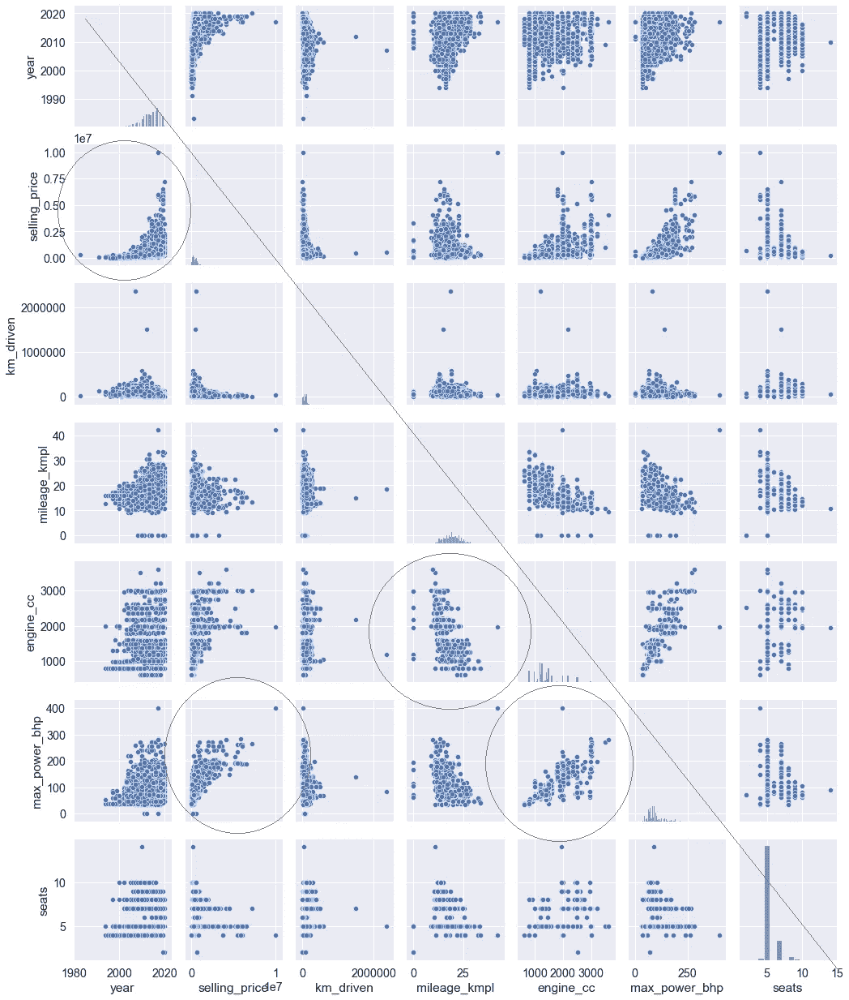

作者的 Pairplot

*三列(多变量):两个数字和一个分类*

我们可以添加第三个变量，使用参数`hue=’cat_col’`按颜色分割散点图。

```
sns.pairplot(
    data=cars, 
    aspect=.85,
    **hue='transmission'**);
```

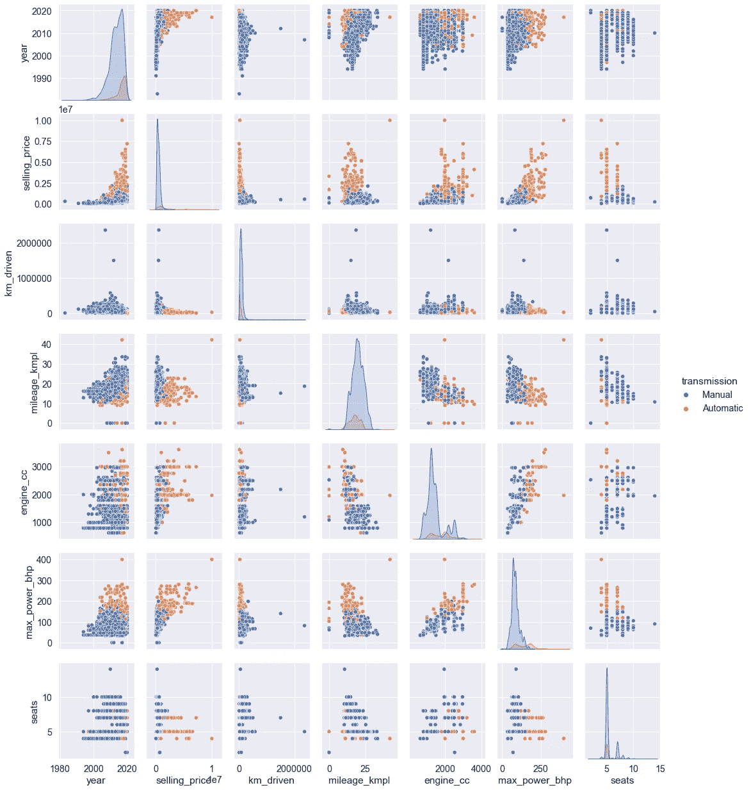

作者的多元配对图

需要注意的事项:

*   散点图中不同颜色的簇。

## **2。热图**

[热图](https://seaborn.pydata.org/generated/seaborn.heatmap.html)是网格中数值的颜色编码图形表示。遵循配对图是一个理想的图，因为绘制的值代表显示线性关系度量的配对的[相关系数](https://www.statisticshowto.com/probability-and-statistics/correlation-coefficient-formula/)。

简而言之，配对图显示数据的直观趋势，而热图使用颜色绘制实际的相关值。

要使用的功能:

*   `sns.heatmap()`—轴级绘图

首先，我们运行`df.corr()`来获得相关系数表。该表也被称为[相关矩阵](https://www.geeksforgeeks.org/create-a-correlation-matrix-using-python/)。

```
cars.corr()
```


作者相关矩阵

`**sns.heatmap()**` —由于上表不太直观，我们将创建一个热图。

```
sns.set(font_scale=1.15)
plt.figure(figsize=(8,4))sns.heatmap(
    cars.corr(),        
    cmap='RdBu_r', 
    annot=True, 
    vmin=-1, vmax=1);
```

`cmap=’RdBu_r’`设置颜色方案，`annot=True`绘制单元格内的值，`vmin`和`vmax`确保颜色代码从-1 到 1 开始。

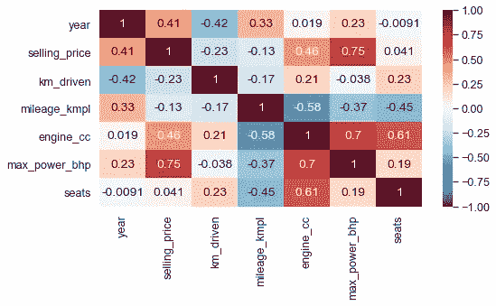

作者热图

需要注意的事项:

*   高度相关的特征。这些是暗红色和暗蓝色的细胞。接近 1 的值表示高度正线性关系，而接近-1 的值表示高度负线性关系。


图片来自[www.statisticshowto.com](https://www.statisticshowto.com/probability-and-statistics/correlation-coefficient-formula/)

在下面的情节中，我们将进一步探讨这些关系。

## **3。散点图**

一个[散点图](https://seaborn.pydata.org/generated/seaborn.scatterplot.html)显示了两个数字特征之间的关系，使用点来可视化这些变量如何一起移动。

要使用的功能:

*   `sns.scatterplot()` —轴级绘图
*   `sns.relplot(kind=’line’)` —图形级

有回归线的函数；

*   `sns.regplot()`-轴级
*   `sns.lmplot()` —图形级

*两个数字列(双变量)*

`[**sns.scatterplot(x='num_col1', y='num_col2', data=df)**](https://seaborn.pydata.org/generated/seaborn.scatterplot.html)` — 让我们用车辆的`mileage`(效率)来形象化的描述`engine size`。

```
sns.set(font_scale=1.3)sns.scatterplot(
    x='engine_cc', 
    y='mileage_kmpl', 
    data=cars)plt.xlabel(
    'Engine size in CC')
plt.ylabel(
    'Fuel efficiency')
```

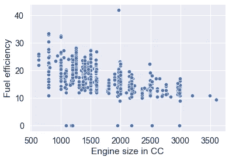

作者散点图

`**sns.regplot(x, y, data)**`

一个 [**reg 图**](https://seaborn.pydata.org/generated/seaborn.regplot.html) 绘制一个散点图，用一条[回归线](https://www.dummies.com/article/academics-the-arts/math/statistics/how-to-calculate-a-regression-line-169795/)表示数据的趋势。

```
sns.regplot(
    x='engine_cc', 
    y='mileage_kmpl', 
    data=cars)plt.xlabel(
    'Engine size in CC')
plt.ylabel(
    'Fuel efficiency');
```


作者的回归图

三列(多变量):两个数字和一个分类。

`**sns.scatterplot(x, y, data, hue='cat_col')**` **—** 我们可以使用`hue`通过分类变量进一步分割散点图。

```
sns.scatterplot(
    x='mileage_kmpl',
    y='engine_cc', 
    data=cars,
    palette='bright',
    **hue='fuel'**);
```


由作者绘制的带色调的散点图

`**sns.relplot(x, y, data, kind='scatter', hue='cat_col')**`

[**相关图**](https://seaborn.pydata.org/generated/seaborn.relplot.html) 或关系图用于使用`kind=’scatter’`(默认)创建散点图，或使用`kind=’line’.`创建线图

在我们下面的图中，我们使用`kind='scatter'`和`hue=’cat_col’`按颜色分段。请注意下图与上图的结果相似。

```
sns.relplot(
    x='mileage_kmpl', 
    y='engine_cc', 
    data=cars, 
    palette='bright',
    **kind='scatter', 
    hue='fuel'**);
```

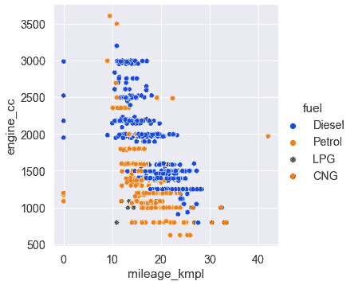

由作者重新绘制

`**sns.relplot(x, y, data, kind='scatter', col='cat_col')**` **—** 我们也可以使用`col=’cat_col’`按列和/或`row=’cat_col’`按行创建片段的支线剧情。下图按`transmission`类别将数据分成不同的图。

```
sns.relplot(
    x='year', 
    y='selling_price', 
    data=cars, 
    **kind='scatter', 
    col='transmission'**);
```

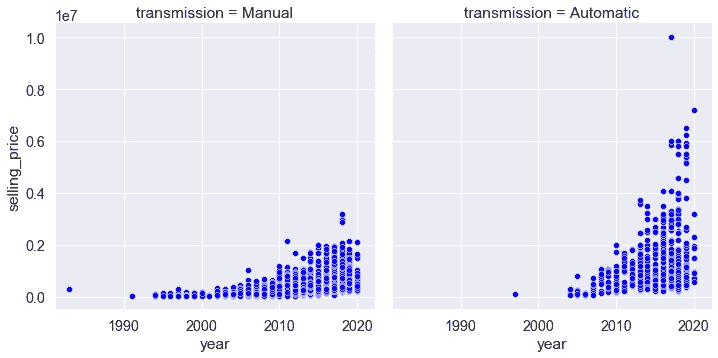

由作者重新绘制

*四列:两个数字和两个分类。*

`**sns.relplot(x,y,data, hue='cat_col1', col='cat_col2') —**` `col_wrap`参数在此宽度后换行，以便子情节跨越多行。

```
sns.relplot(
    x='year', 
    y='selling_price', 
    data=cars,
    palette='bright',
    height=3, aspect=1.3,
    **kind='scatter', 
    hue='transmission',
    col='fuel',
    col_wrap=2**);
```

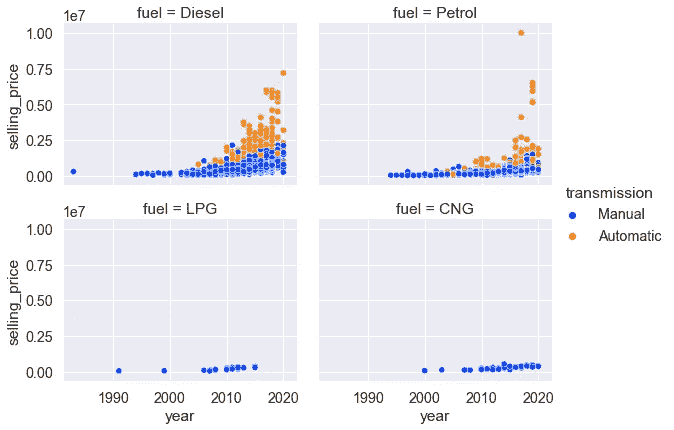

按作者划分的关系散点图

`**sns.lmplot(x, y, data, col='cat_col1', hue='cat_col2')**`

[**lmplot**](https://seaborn.pydata.org/generated/seaborn.lmplot.html#seaborn.lmplot) 是 regplot 的图形级[版本](https://seaborn.pydata.org/tutorial/regression.html#conditioning-on-other-variables)，它用回归线将散点图绘制到面网格上。它的*没有*有一个`kind`参数。

```
sns.lmplot(
    x="seats", 
    y="engine_cc", 
    data=cars,
    palette='bright',
    **col="transmission", 
    hue="fuel"**);
```

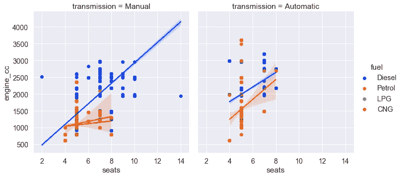

由作者绘制

## **4。线图**

一个[线图](https://www.splashlearn.com/math-vocabulary/geometry/line-graph)包括由一条线连接的点，显示 x 和 y 变量之间的关系。x 轴通常包含时间间隔，而 y 轴包含一个数值变量，我们希望跟踪它随时间的变化。

要使用的功能:

*   `sns.lineplot()` —轴级绘图
*   `sns.relplot(kind=’line’)` —图形级绘图

两列(双变量):数字和时间序列。

`**sns.lineplot(x=’time’, y=’num_col’, data=df)**`

```
sns.lineplot(
    x="year", 
    y="selling_price",
    data=cars)
```


作者绘制的线图

*三列(多变量):时间序列、数字和分类列。*

`**sns.lineplot(x, y, data, hue='cat_col')**`**—我们可以通过使用`hue.`的分类变量来拆分行**

```
sns.lineplot(
    x="year", 
    y="selling_price",
    data=cars,
    palette='bright',
    **hue='fuel'**);
```

****

**由作者绘制的带色调的线图**

**上述结果可通过使用`sns.relplot`和 `kind=’line’`以及`hue` 参数获得。**

**`**sns.relplot(x, y, data, kind='line', col='cat_col')**` —如前所述，一个相关图的`kind=’line’`参数绘制一个线形图。我们将使用 `col=’transmission’`为两个传输类创建列方向的子图。**

```
sns.relplot(
    x="year", 
    y="selling_price",
    data=cars,
    color='blue', height=4
    **kind='line',
    col='transmission'**);
```

**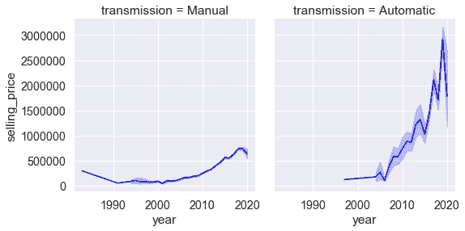**

**作者绘制的关系线图**

***四列:时间序列、数字和两个分类列。***

**`**sns.relplot(x, y, data, kind='line', col='cat_col1', hue='cat_col2')**`**

```
sns.relplot(
    x="year", 
    y="selling_price", 
    data=cars,
    palette='bright', 
    height=4,
    **kind='line', 
    col='transmission',
    hue="fuel"**);
```

**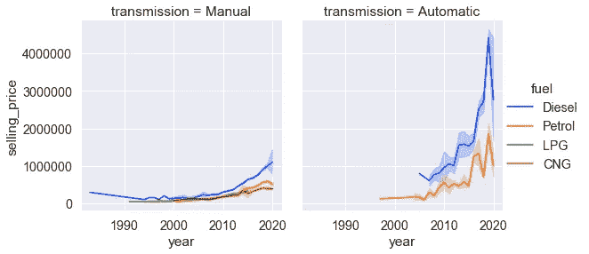**

**作者使用色调绘制的关系线图**

## ****5。联合地块****

**一个[联合图](https://ajaytech.co/2020/09/28/8780/)由三个图表组成。中心包含 x 和 y 变量之间的二元关系。顶部和右侧的图分别显示了 x 轴和 y 轴变量的单变量分布。**

**要使用的功能:**

*   **`sns.jointplot()` —图形级绘图**

***两列(双变量):两个数字***

**`**sns.**[**jointplot**](https://seaborn.pydata.org/generated/seaborn.jointplot.html)**(x='num_col1, y='num_col2, data=df)**` —默认情况下，中心图是散点图，`(kind=’scatter’)`，而侧边图是直方图。**

```
sns.jointplot(
    x='max_power_bhp', 
    y='selling_price', 
    data=cars);
```

**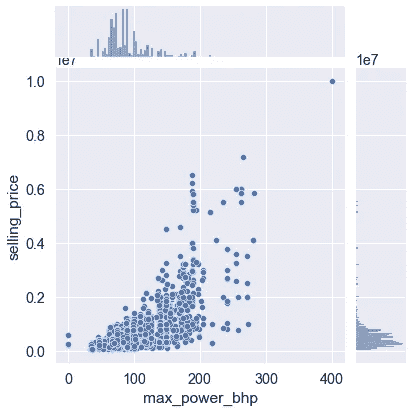**

**作者联合策划**

**下图中的关节图利用了不同的`kind`参数(`‘kde’`、`‘hist’`、`‘hex’`或`‘reg’)`，如每个图中所标注的。**

**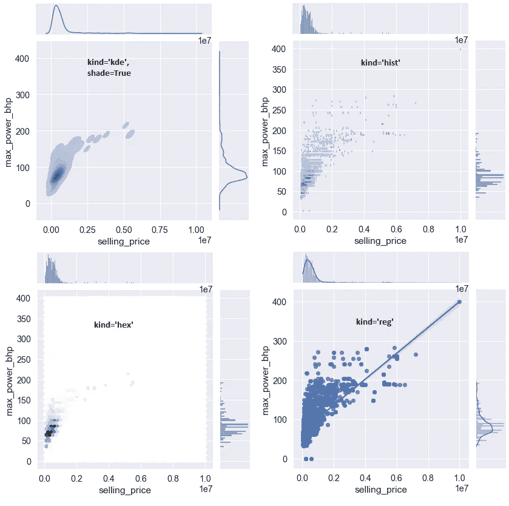**

**作者使用不同“种类”参数的联合图**

***三列(多变量):两个数值，一个分类***

**`**sns.jointplot(x, y, data, hue=’cat_col’)**`**

```
sns.jointplot(
    x='selling_price', 
    y='max_power_bhp', 
    data=cars,  
    palette='bright',
    **hue='transmission'**);
```

**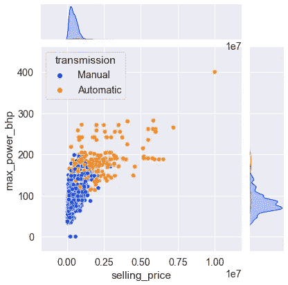**

**作者使用色调参数的联合绘图**

## ****第二部分:探索分类关系和数字关系之间的关系****

**在下面的图表中，x 轴表示分类变量，y 轴表示数值变量。**

## **6.条形图**

**[条形图](https://www.statisticshowto.com/probability-and-statistics/descriptive-statistics/bar-chart-bar-graph-examples/)使用不同高度的条形来比较数字变量在分类变量组之间的分布。**

**默认情况下，条形高度是使用“平均值”来估计的。`estimator` 参数通过使用 python 的[内置](https://github.com/jmbejara/comp-econ-sp18/issues/24)函数如`estimator=max`或`len`或 [NumPy](https://www.pythonprogramming.in/numpy-aggregate-and-statistical-functions.html) 函数如`np.max`和`np.median`来改变这个聚合函数。**

**要使用的功能:**

*   **`sns.barplot()` —轴级绘图**
*   **`sns.catplot(kind=’bar’)` —图形级绘图**

***两列(双变量):数字和分类***

**`**sns.barplot(x=’cat_col’, y=’num_col’, data=df)**`**

```
sns.barplot(
    x='fuel', 
    y='selling_price', 
    data=cars, 
    color='blue',
    *# estimator=sum,
    # estimator=np.median*);
```

**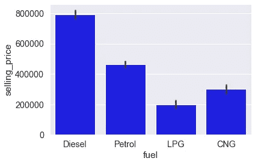**

**作者柱状图**

***三列(多变量):两个分类列和一个数字列。***

**`**sns.barplot(x, y, data, hue=’cat_col2')**`**

```
sns.barplot(
    x='fuel', 
    y='selling_price', 
    data=cars, 
    palette='bright'
    **hue='transmission'**);
```

**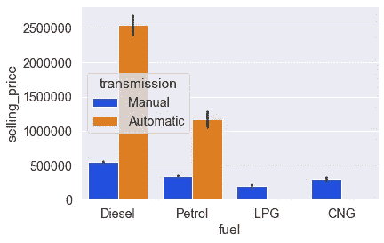**

**带作者色调的条形图**

**`**sns.catplot(x, y, data, kind='bar', hue=’cat**_**col'**)`**

**一个 [catplot](https://seaborn.pydata.org/generated/seaborn.catplot.html) 或分类图，使用`kind`参数指定绘制什么分类图，选项为`‘strip’`(默认)、`’swarm’, ‘box’, ‘violin’, ‘boxen’, ‘point’` 和`‘bar’`。**

**下图使用 catplot 创建了一个与上图相似的图。**

```
sns.catplot(
    x='fuel', 
    y='selling_price', 
    data=cars,
    palette='bright',
    **kind='bar',
    hue='transmission'**);
```

**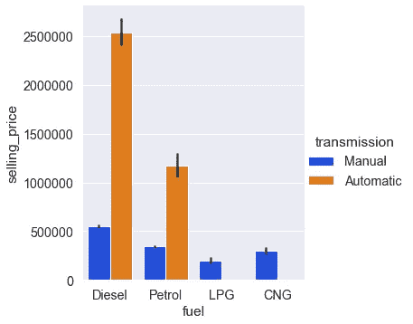**

**作者的带色调参数的条形图**

***四列:三个分类和一个数字***

**`**sns.catplot(x, y, data, kind='bar', hue=’cat**_**col2', col='cat_col3') —**` 使用`col_wrap`参数在该宽度后换行，这样子情节就可以跨越多行。**

```
g = sns.catplot(
        x='fuel', 
        y='selling_price', 
        data=cars,
        palette='bright',
        height=3, aspect=1.3,
        **kind='bar',
        hue='transmission', 
        col ='seller_type',
        col_wrap=2**)g.set_titles(
    'Seller: {col_name}');
```

**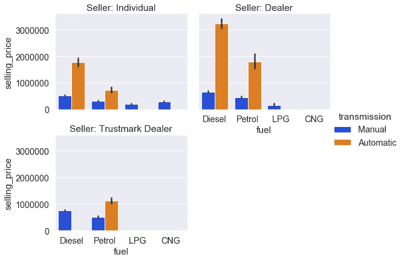**

**作者分类柱状图**

## **7.点图**

**与条形图中的条形不同，[点图](https://seaborn.pydata.org/generated/seaborn.pointplot.html)绘制点来代表每个类别组的平均值(或另一个估计值)。然后用一条线将这些点连接起来，这样就很容易比较 y 变量的中心趋势在各组中是如何变化的。**

**要使用的功能:**

*   **`sns.pointplot()` —轴级绘图**
*   **`sns.catplot(kind=’point’)` —图形级绘图**

***两列(双变量):一个分类列和一个数字列***

**`**sns.pointplot(x=’cat_col’, y=’num_col’, data=df)**`**

```
sns.pointplot(
    x='seller_type', 
    y='mileage_kmpl', 
    data=cars);
```

**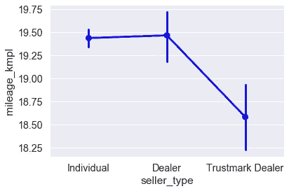**

**作者的点图**

***三列(多变量):两个分类和一个数字***

**当您使用`hue`添加第三个类别时，点状图比条状图更能提供信息，因为每一个“色调”类都有一条线，这使得比较该类在 x 变量组中的变化变得更加容易。**

**`**sns.catplot(x, y, data, kind='point', col='cat_col2')**` —这里，catplot 与`kind=’point’`和`hue=’cat_col’`一起使用。使用`sns.pointplot`和`hue`参数可以获得相同的结果。**

```
sns.catplot(
    x='transmission', 
    y='selling_price', 
    data=cars, 
    palette='bright',
    **kind='point', 
    hue='seller_type'**);
```

**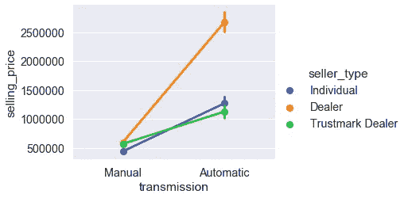**

**作者分类点图**

**`**sns.catplot(x, y, data, kind='point', col='cat_col2', hue='cat_col')**` —这里，我们在`hue`和`col`参数中使用相同的分类特征。**

```
sns.catplot(
    x='fuel', 
    y='year', 
    data=cars, 
    ci=None,  
    height=5, #default 
    aspect=.8,
    **kind='point',
    hue='owner', 
    col='owner', 
    col_wrap=3**);
```

**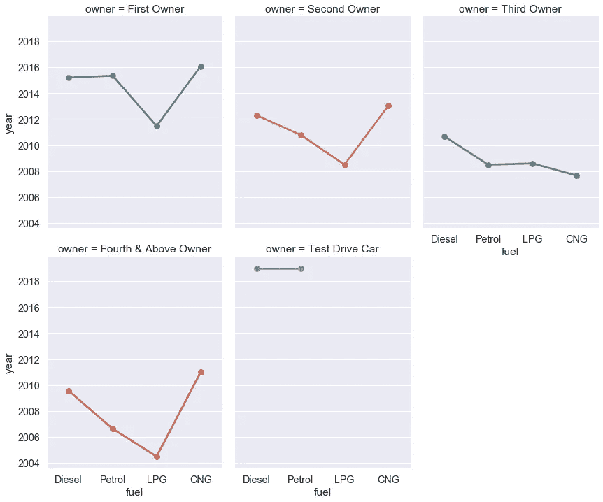**

**作者使用色调和颜色的点图**

## **8。箱形图**

**一个[箱线图](https://seaborn.pydata.org/generated/seaborn.boxplot.html)通过显示关于[四分位数](https://en.wikipedia.org/wiki/Quartile)的信息来可视化数值和分类变量之间的分布。**

****

**作者的箱线图插图**

**从图中，您可以看到每个类别的最小值、中值、最大值和异常值。**

**要使用的功能:**

*   **`sns.boxplot()` —轴级绘图**
*   **`sns.catplot(kind=’box’)` —图形级绘图**

***两列(双变量):一个分类列和一个数字列***

**`**sns.boxplot(x=’cat_col’, y=’num_col’, data=df)**`**

```
sns.boxplot(
    x='owner', 
    y='engine_cc', 
    data=cars, 
    color='blue')plt.xticks(rotation=45, 
           ha='right');
```

**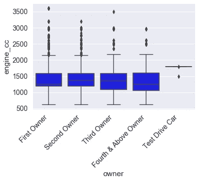**

**作者的箱线图**

***三列(多变量):两个分类和一个数字***

**`**sns.boxplot(x, y, data, hue='cat_col2')**` —这些结果也可以通过`sns.catplot`使用`kind=’box’`和`hue`重新创建。**

```
sns.boxplot(
    x='fuel', 
    y='max_power_bhp', 
    data=cars,
    palette='bright',
    **hue='transmission'**);
```

****

**作者使用色调的箱线图**

**`**sns.catplot(x, y, data, kind='box', col='cat_col2'**` **)** —将`catplot`函数与`kind=’box’`配合使用，并提供`col`参数来创建支线剧情。**

```
sns.catplot(
    x='fuel', 
    y='max_power_bhp',
    data=cars,
    palette='bright',
    **kind = 'box', 
    col='transmission'**);
```

**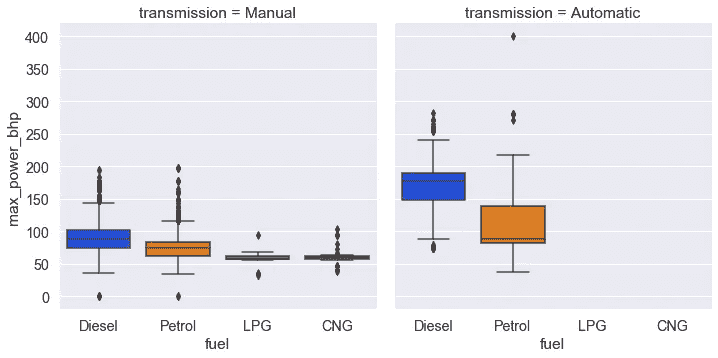**

**按作者分类的箱线图**

***四列:三个分类和一个数字***

**`**sns.catplot(x, y, data, kind='box', hue='cat_col2', col=’cat_col3')**`**

```
g = sns.catplot(
        x='owner', 
        y='year', 
        data=cars,
        palette='bright',
        height=3, aspect=1.5,
        **kind='box', 
        hue='transmission', 
        col='fuel',
        col_wrap=2**)g.set_titles(
    'Fuel: {col_name}');g.set_xticklabels(
    rotation=45, ha='right')
```

**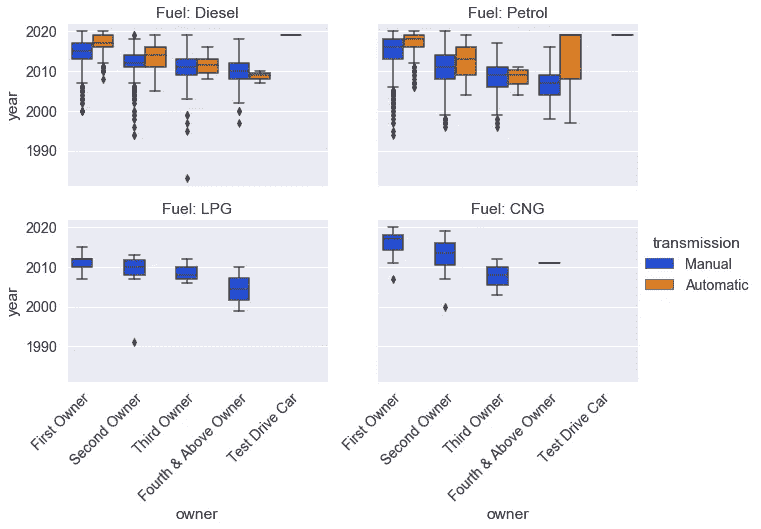**

**按作者分类的箱线图**

## ****9。小提琴剧情****

**除了箱线图显示的四分位数外，[小提琴图](https://seaborn.pydata.org/generated/seaborn.violinplot.html)绘制了一个[内核](https://mathisonian.github.io/kde/)密度估计曲线，显示了不同区域的观察概率。**

****

**图片来自[来源](https://orangedatamining.com/widget-catalog/visualize/violinplot/)**

**要使用的功能:**

*   **`sns.violinplot()` —轴级绘图**
*   **`sns.catplot(kind=’violin’)` —图形级绘图**

**两列(双变量):数字和分类。**

**`**sns.violinplot**` ( `**x=’cat_col’, y=’num_col’, data=df**`)**

```
sns.violinplot(
    x='transmission', 
    y='engine_cc', 
    data=cars, 
    color='blue');
```

**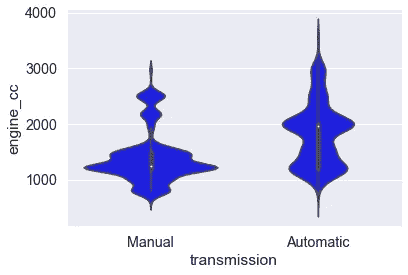**

**作者的小提琴情节**

***三列(多变量)—两个分类列和一个数字列。***

**`**sns.catplot(x, y, data, kind='violin', hue='cat_col2')**` —通过`kind=’violin’`和`hue=’cat_col’`使用 catplot 功能。使用带有`hue`参数的`sns.violinplot`可以复制以下相同的结果。**

```
g = sns.catplot(
        x='owner', 
        y='year', 
        data=cars,
        palette='bright',
        height=3,
        aspect=2
        **split=False, 
        # split=True
        kind='violin', 
        hue='transmission'**)g.set_xticklabels(
        rotation=45, 
        ha='right')
```

**violin plot 支持`split`参数，该参数为每个分类类绘制一半的 violin plot。请注意，这在`hue`变量只有*和*两个类时有效。**

****

***四列:三个分类和一个数字***

**`**sns.catplot(x, y, data, kind='violin', hue='cat_col2', col=’cat_col3')**` —这里，我们只过滤`‘diesel’`和`‘petrol’`燃料类型的数据。**

```
my_df = cars[cars['fuel'].isin(['Diesel','Petrol'])]g = sns.catplot( 
        x="owner", 
        y="engine_cc", 
        data=my_df,
        palette='bright',
        **kind = 'violin', 
        hue="transmission",
        col = 'fuel'**)g.set_xticklabels(
        rotation=90);
```

**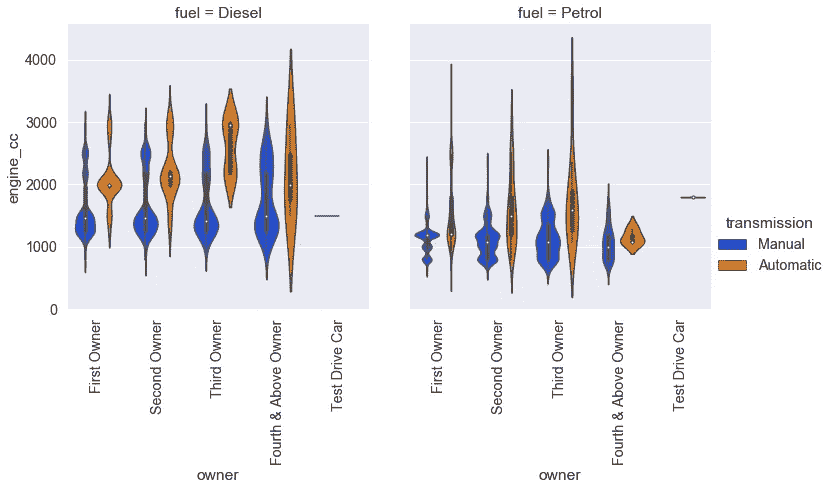**

**作者的小提琴情节**

## **10.带状图**

**一个[带状图](https://seaborn.pydata.org/generated/seaborn.stripplot.html)使用点来显示一个数字变量是如何在一个分类变量的类别中分布的。把它想象成一个散点图，其中一个轴是分类特征。**

**要使用的功能:**

*   **`sns.stripplot()` —轴级绘图**
*   **`sns.catplot(kind=’strip’)` —图形级绘图**

***两个变量(双变量):一个分类变量和一个数字变量***

**`**sns.stripplot(x=’cat_col’, y=’num_col’, data=df)**`**

```
plt.figure(
    figsize=(12, 6))sns.stripplot(
    x='year', 
    y='km_driven', 
    data=cars, 
    linewidth=.5, 
    color='blue')plt.xticks(rotation=90);
```

**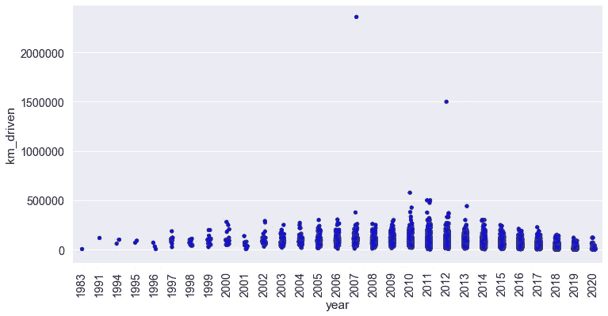**

**作者的脱衣舞表演**

***三列(多变量):两个分类和一个数字***

**`**sns.catplot(x, y, data, kind='strip', hue='cat_col2')**` —通过`kind=’strip’`使用 catplot 函数(默认)，并提供`hue`参数。参数`dodge=True`(默认为`dodge=False`)可用于按颜色分隔垂直点。**

```
sns.catplot(
    x='seats', 
    y='km_driven', 
    data=cars, 
    palette='bright', 
    height=3,
    aspect=2.5,
    **# dodge=True,
    kind='strip',
    hue='transmission'**);
```

****

***四列:三个分类和一个数字***

**`**sns.catplot(x, y, data, kind='strip', hue='cat_col2', col='cat_col3')**`**

```
g = sns.catplot(
        x="seller_type", 
        y="year", 
        data=cars, 
        palette='bright', 
        height=3, aspect=1.6,
        **kind='strip',  
        hue='owner',
        col='fuel',
        col_wrap=2**)g.set_xticklabels(
        rotation=45, 
        ha='right');
```

****

**按作者分类的带状图**

****结合条形剧情和小提琴剧情****

**带状图可以与小提琴图或盒状图一起使用，以显示数据中缺口或异常值的位置。**

```
g = sns.catplot(
        x='seats', 
        y='mileage_kmpl', 
        data=cars,
        palette='bright',
        aspect=2,
        **inner=None,
        kind='violin'**)sns.stripplot(
    x='seats', 
    y='mileage_kmpl', 
    data=cars,
    color='k', 
    linewidth=0.2,
    edgecolor='white',
    **ax=g.ax**);
```

**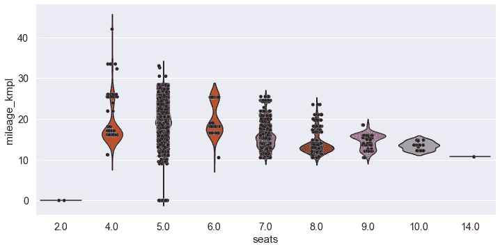**

**作者的连环漫画和小提琴情节**

## **附加备注**

*   **对于条形图和箱线图等分类图，可以通过向上切换 x 和 y 变量，将条形方向重新定向为水平条形。**
*   **一起使用的 [FacetGrid](https://seaborn.pydata.org/generated/seaborn.FacetGrid.html) 人物级对象的`row`和`col`参数可以给支线剧情增加另一个维度。然而，col_wrap *不能与 row 参数*在一起。**
*   **FacetGrid 支持不同的参数，具体取决于基础绘图。例如，`sns.catplot(kind=’violin’)`支持`split`参数，而其他种类的*不支持*。本文档中有关于种类特定选项的更多信息。**
*   **数字级函数也创建二元图。例如，`sns.catplot(x=’fuel’, y=’mileage_cc’, data=cars, kind=’bar’)`创建一个基本的条形图。**

## **结论**

**在本文中，我们对数据集进行了二元和多元分析。**

**我们首先创建了矩阵图，在网格中可视化关系，以识别具有高相关性的数字变量。然后，我们使用不同的轴级和数字级函数来创建图表，探索数字列和分类列之间的关系。在 GitHub 上的这里找到代码[。](https://github.com/suemnjeri/medium-articles/blob/main/Seaborn%20plot%20functions/Multivariate%20analysis%20vehicle%20dataset.ipynb)**

**我希望你喜欢这篇文章。每当我发表文章时，想收到更多这样的消息，请在这里订阅。如果你还不是一个媒体成员，并且愿意支持我作为一个作家，跟随[这个链接](https://medium.com/@suemnjeri/membership)，我将赚取一小笔佣金。感谢您的阅读！**