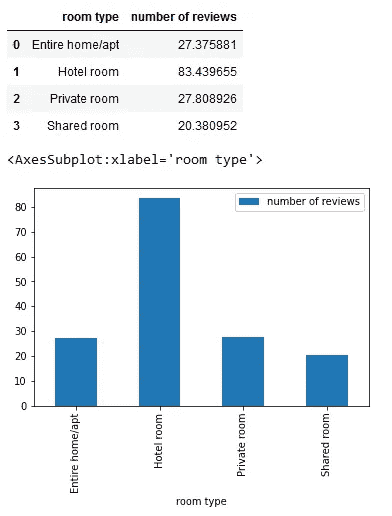
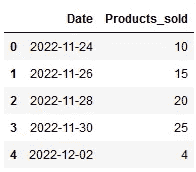

# 为你的分析项目注入活力的 10 个熊猫小窍门

> 原文：<https://towardsdatascience.com/10-quick-pandas-tricks-to-energize-your-analytics-project-2333a144946b>

## 数据科学

## 使用这些技巧让你的分析师生活变得轻松


SpaceX 在 [Unsplash](https://unsplash.com?utm_source=medium&utm_medium=referral) 上拍摄的

Pandas 是 Python 中流行的数据分析库。它无疑为您提供了处理数据所需的灵活性和工具。

然而，你必须知道节省时间和易于使用的高效率工作的技巧。这就是为什么我要分享熊猫的 10 个快速但非常有用的技巧，你可以在 10 分钟内掌握。

即使您已经非常熟悉 pandas 的方法和功能，您仍然会发现其中一些技巧是可行的。如果你是一个绝对的初学者，那么这篇文章是你开始学习的好地方。

这里有一个快速索引供你参考—

[调整要显示的列数或行数](#b151)
[用 sample()](#b002)
[用 query()方法随机采样行子集一个数据帧](#4a3d)
[用 Round()方法舍入数据帧中的值](#6107)
[用 explode()方法解包列表值](#3208)
[用 plot()方法创建快速图](#4fa1)
[用 display()方法返回多个数据帧](#de5e)

> 为了举例，我将使用 [Airbnb 开放数据](https://www.kaggle.com/datasets/arianazmoudeh/airbnbopendata)，你可以免费使用，因为它在 [ODbL 许可](https://opendatacommons.org/licenses/odbl/1-0/)下公开可用！

不要忘了在阅读结束时获取包含所有示例的*笔记本*！

数据分析任务从将数据集导入 pandas DataFrame 开始，所需的数据集通常在中提供。csv 格式。

然而，当您在 pandas 数据帧中读取一个包含大量列的 csv 文件时，您只能看到后面跟有`**. . . . .**`的几个列名和几个列名，如下所示。

```
import pandas as pd
df = pd.read_csv("Airbnb_Open_Data.csv")
df.head()
```


在笔记本|作者图片中显示有限数量的列

`.head()`背后的主要目的是先睹为快。有了这些隐藏在`. . . . .`后面的列名，你就看不到那些列中的数据了。因此，这里的第一个技巧是确定您想要显示的列数和行数。

# 调整要显示的列数或行数

默认情况下，pandas 在屏幕上只显示 60 行 20 列。这可能是几根柱子藏在`. . . . .`后面的原因。

您可以使用下面的熊猫显示选项自己检查这个限制。

```
**pd.options.display.max_rows**#Output
60**pd.options.display.max_columns**#Output
20
```

您可以使用完全相同的选项来设置屏幕上显示的最大行数和列数。

例如，您可以将最大列数设置为 30，如下所示。

```
pd.options.display.max_columns = 30
df = pd.read_csv("Airbnb_Open_Data.csv")
df.head()
```


熊猫设置最大行数和列数|作者图片

在上图中，您可以看到数据集中的所有列。红框内的柱子先前隐藏在`. . . . .`后面。并且在输出中不可见。

此外，您可以使用如下所示的功能`.reset_option()`将选项重置回默认值。

```
pd.reset_option('display.max_rows')
pd.options.display.max_rows

#Output
60
```

当您在 pandas 中更改多个默认选项时，您可以使用`.reset_options()`函数中的`‘all’`参数在单个语句中将所有选项重置回初始值。

为了先睹为快，您可以在。这限制了您只能看到前/后几行。在 pandas 中，您总是可以从任何随机选择的记录中检查数据，甚至可以使用随机选择来检查数据的子集。

# 用 sample()随机对行进行采样

从第一行或最后几行看，数据可能组织得很好，很干净。因此，查看数据集中的任何随机记录以更好地理解它总是有好处的。

`pandas.DataFrame.sample`提供从数据集中随机选择任何记录的灵活性，有 7 个可选和可调参数。

例如，假设您想从 Airbnb 数据集中选择 4 条随机记录。您可以简单地输入— `df.sample(4)` —获得下面的输出。


作者从数据帧|图像中随机选择记录

或者，您也可以使用 fraction 来指定要随机选择整个数据集的多少部分。只需将分数(小于 1)赋给`sample()`函数中的参数`frac`，如下所示。

```
df.sample(frac = 0.00005)
```


熊猫随机样本使用分数|图片由作者提供

这里，您简单地获取了 DataFrame 中总行数的 0.005% 。

但是，每次执行这个单元格时，记录都是随机选择的。所以，为了每次都得到相同的输出，你可以将参数 random state 设置为任意整数。

假设你想每次都检索相同的三行，那么你可以使用下面的`sample()`函数。

```
df.sample(3, random_state = 4)
```


熊猫随机抽样，每次输出相同|图片由作者提供

当您想要选择不同的记录时，您可以简单地将`random_state`参数更改为另一个整数。

一旦检查了数据集中可用的数据，下一个任务就是选择所需的数据集子集。当然你可以用`.loc`和。`iloc`方法后跟一系列方括号，用于提取选定的行和列。

但是，还有一个方法`.query()`可以帮助您去掉多个方括号来创建数据帧子集。

# 使用 query()方法对数据帧进行子集化

函数`pandas.DataFrame.query(expression)`为您提供了有条件选择数据帧子集的灵活性。该函数中提供的表达式是一个或多个条件的组合。你可以用一种绝对随和的方式来写，不用任何方括号。

例如，假设您想要从数据集中提取所有记录，其中*邻域*是 *Kensigton* 。使用`query()`方法很简单，如下所示。

```
df.query("neighbourhood == 'Kensington'")
```


使用 query()的熊猫数据帧子集|作者图片

您还可以在同一列上使用多个条件以及它们之间的任何逻辑，例如`AND`、`OR`、`NOT`。

要了解更多关于这种方法的信息，我强烈推荐阅读—

[](/10-pandas-query-examples-that-will-make-you-use-pandas-query-easily-12a45b1e115)  

选择子集后，您将进入分析中的数据清理阶段。数字列的一个常见问题是，小数点后的位数超过了要求。让我们看看如何处理这样的列。

# pandas 数据帧中的舍入值，使用 Round()

有时，一列中的数字数据在小数点后包含多个数字，最好将其限制在 2-3 位。

在这种情况下，方法`[pandas.DataFrame.round](https://pandas.pydata.org/docs/reference/api/pandas.DataFrame.round.html)`会非常方便。您所需要做的就是在方法中提到所需的位数，如下所示。

```
df.round(2)
```


将数据帧四舍五入到可变的小数位数|作者图片

在 Airbnb 数据集中，只有列 *lat* 和 *long* 包含小数点后 5 位数的值。DataFrame 方法`round()`只是将数据集中所有列的位数向上舍入。

但是，假设您只想对这个数据集中的单个列的位数进行舍入。方法`pandas.Series.round`在这种情况下很有用，如下所示。

```
df['lat'].round(2)

#Output

0         40.65
1         40.75
2         40.81
          ...  
102596    40.68
102597    40.75
102598    40.77
Name: lat, Length: 102599, dtype: float64
```

`pandas.Series.round`的输出又是一个序列。要使它成为同一个数据帧的一部分，需要将更改后的列重新分配给原始列，如下所示。

```
df['lat'] = df['lat'].round(2)
df.head()
```


将系列或列中的每个值四舍五入到给定的小数位数|按作者排序的图像

它仅将列 *lat* 中的值更改为小数点后两位数，而列 *long* 中的值保持不变。

继续操作列数据，让我们看看另一个方法 explode()，它有一个更具体的用例——将类似列表的值的每一项转换为单独的行。

# 使用 explode()方法解包列表值

有时您会遇到数据集，其中列中的值是列表。从长远来看，很难处理这样的值，最好是为列表中的每个值创建一行。

为了更好地理解这个概念，让我们创建一个数据框架。

```
df = pd.DataFrame({"Country":["India","Germany"],
                   "State":[["Maharashtra", "Telangana", "Gujarat"],
                            ["Bavaria", "Hessen"]]})
df
```


样本数据集|作者提供的图像

上述数据帧中的列*状态*包含列表作为值。要为每个列表中的每个值获取一行 *State* 列，可以使用方法`pandas.DataFrame.explode`，如下所示。

```
df.explode("State")
```


Python |作者图片中的 df.explode()

您所需要做的就是在`explode()`中提到包含列表的列名作为它的值。您可能会注意到，在上面的输出中，它只是复制了列表中每一项的索引值。

数据清洗后的常见任务是数据可视化。图表和图形可以很容易地识别潜在的趋势、模式和相关性。

当您使用 pandas 进行数据分析时，您不需要导入任何其他库来创建图表。熊猫有自己的方法和灵活的选项来快速创建各种图表。

# 使用 plot()方法创建快速绘图

通常，您的分析任务的目的不是数据可视化，而是您希望从数据中看到简单的图表/图形。Pandas 是一个非常灵活的包，它允许你使用自己的方法来可视化数据帧的内容。

假设，您想查看每种类型房间的平均评论数。你可以通过制作系列图或数据帧图的方法`pandas.DataFrame.plot`来实现。

您可以创建一个更小更简单的 DataFrame — *df_room* —只需要两列，就像我在这里做的那样。

```
df_room = pd.DataFrame(df.groupby('room type')['number of reviews'].mean())
df_room.reset_index(drop=False, inplace=True)

display(df_room)

df_room.plot(x='room type', y='number of reviews', kind='bar')
```



熊猫。DataFrame.plot |作者图片

新创建的数据帧和图表都显示在输出中。

您可以随时使用`**.plot()**`中的参数“*种类”*将图表类型从条形图更改为折线图。您可以在本[笔记本](https://github.com/17rsuraj/data-curious/blob/master/TowardsDataScience/10%20Useful%20Python%20Tricks%20You%20Should%20Know.ipynb)中找到可用图表类型的完整列表。

> 但是熊猫是如何在没有图表样式输入的情况下创建条形图的呢？

`pandas.DataFrame.plot`使用选项`plotting.backend`指定的后端。绘图后端是 pandas 用来创建图表的绘图库，它使用 matplotlib 作为默认库。

您可以通过设置`pd.options.plotting.backend`或使用选项`pd.set_option(‘plotting_backend’, ‘name_of_backend’)`随时更改。

回到整体处理数据帧，让我们看看如何同时显示多个数据帧。

# 使用 display()返回多个数据帧

通常，您会创建多个数据帧，但是当您提到它们的名称或者在同一个单元格中对它们使用`.head()` / `.tail()`方法时，只有最新的数据帧会显示在输出中。

例如，让我们创建两个数据帧，并尝试在输出中查看它们。

```
df1 = pd.DataFrame({"Country":["India","Germany"],
                   "State":[["Maharashtra", "Telangana", "Gujarat"],
                            ["Bavaria", "Hessen"]]})

df2 = df1.explode("State")

# Get both DataFrames as output
df1
df2
```


单元格输出|作者图片

虽然，你在代码末尾提到了`df1`和`df2`；它在输出中只显示了`df2`。

但是，您希望看到两个数据帧，一个在另一个下面。这就是函数`display()`有用的地方。您只需要将 DataFrame 传递给 display()函数，如下所示。

```
df1 = pd.DataFrame({"Country":["India","Germany"],
                   "State":[["Maharashtra", "Telangana", "Gujarat"],
                            ["Bavaria", "Hessen"]]})

df2 = df1.explode("State")

# Get both DataFrames as output
display(df1)
display(df2)
```


按作者显示输出|图像中的所有数据帧

简单！

现在，您可以在输出中看到两个(或所有)数据帧——一个堆叠在另一个之上。

前面的技巧也是函数显示()的一个很好的例子，您可以在输出中看到数据帧和条形图相互堆叠。

一旦探索了数据集并研究了其中的趋势和模式，下一步就是进行描述性分析。这可以通过数据转换来实现。

从一个基本的数据转换开始—使用不同的内置函数调查分类列中的不同值。

# 用 nunique()计算唯一值

当数据集中有分类列时，有时需要检查一列中有多少不同的值。

使用最简单的函数— `**nunique()**`就可以得到。例如，假设您想查看数据集中有多少种不同的房间类型，您可以使用 nunique()快速查看。

```
df['room type'].nunique()

#Output
4
```

它只告诉你有多少唯一值可用，但要得到不同的值，即房间类型，你可以使用另一个函数— `**unique()**`

```
df['room type'].unique()

#Output
array(['Private room', 'Entire home/apt', 'Shared room', 'Hotel room'],
      dtype=object)
```

它返回一个包含所有唯一值的数组。

检查完唯一值后，检查每个值在数据集中出现的次数也很有意义，即每种类型的房间在数据集中记录了多少次。

你可以用另一种方法得到它——T2——如下所示。

```
df.value_counts('room type')

#Output
room type
Entire home/apt    53701
Private room       46556
Shared room         2226
Hotel room           116
```

通过这种方式，您可以使用一行代码获得唯一值的数量以及它们出现的次数。

数据转换从不局限于分类列，事实上大多数可操作的见解都是从数字列中获得的。

因此，让我们研究两个与数字列相关的常用操作。第一件事是看看如何获得数据帧中一列的累积摘要。

# 返回带有 cumsum()的累计汇总

累积总和也称为运行总和，用于显示数据随时间增长的总和。所以在任何时间点，它会告诉你到那时为止所有值的总和。

pandas DataFrame 有自己的方法`pandas.DataFrame.cumsum`，它返回 DataFrame 列的累积和。

让我们创建一个简单的日期和售出产品数量的数据框架。

```
daterange = pd.date_range('2022-11-24', periods=5, freq='2D')
df1 = pd.DataFrame({ 'Date': daterange,
                    'Products_sold' : [10, 15, 20, 25, 4]})
df1
```



虚拟数据集|作者提供的图像

这是一个虚拟数据集，其日期范围从 2022 年 11 月 24 日到 2022 年 12 月 2 日，以及每个日期销售的产品数量。

现在，假设您想查看截至 2022 年 11 月 30 日售出的产品总数。你不需要手动计算它，而是方法`pandas.DataFrame.cumsum`会在一行代码中为你得到它。

```
df1["Products_sold"].cumsum()

#Output
0    10
1    25
2    45
3    70
4    74
```

它只是返回特定列的运行总数。但是，这很难理解，因为您在输出中看不到任何日期或原始值。

因此，您应该将累积总和分配给同一数据帧中的新列，如下所示。

```
df1["Total_products_sold"] = df1["Products_sold"].cumsum()
df1
```


熊猫数据框|作者图片中的累计总和或累计总数

答对了。

您只用一行代码就获得了您的专栏的运行总数！！

通常观察到的累积和用例是理解"*到目前为止有多少*"例如

*   到目前为止，这条河的水位上升了多少
*   特定时间之前销售了多少产品
*   每次交易后，账户里还有多少余额

因此，知道如何在数据集中获得[累计值](https://pandas.pydata.org/docs/reference/api/pandas.DataFrame.cumsum.html)可能是您分析项目的真正救星。

此外，在处理数字数据时，您必须知道如何汇总数据并以汇总形式呈现出来。

# 使用 agg()通过多个函数进行聚合

您可以随时汇总原始数据，以提供统计见解，如最小值、最大值、总和以及计数。但是，当您使用 pandas 进行数据分析时，您真的不需要手动操作。

Pandas 提供了一个函数—— `agg()`——可以在 pandas 数据帧上按对象分组使用。当 DataFrame 方法`groupby()`用于将数据分组到类别中时，创建该对象。

使用`agg()`函数，您可以将聚合函数应用于数据集中的所有数值列。

例如，您可以按房间类型对 Airbnb 数据集进行分组，以创建一个`pandas.DataFrame.groupby`对象。

```
df_room = df.groupby('room type')
df_room

#Output
<pandas.core.groupby.generic.DataFrameGroupBy object at 0x0000029860741EB0>
```

现在，您可以对列*点评数*和*最低住宿天数*应用聚合函数`sum` ，如下所示。

```
df_room.agg({'number of reviews': sum,
             'minimum nights': sum})
```


熊猫|作者图片中的数据聚合

您所需要做的就是向函数`agg()`传递一个字典，其中键是列名，值是聚合函数名，比如`sum`、`max`、`min`。

您还可以在同一列上应用多个函数，甚至在不同的列上应用不同的函数。

为了更好地理解数据聚合，我强烈推荐阅读—

[](/5-pandas-group-by-tricks-you-should-know-in-python-f53246c92c94)  

我希望你很快读完这篇文章，并发现它对使用 pandas 提高数据分析技巧很有用。

我使用 Python 已经 4 年多了，我发现这些技巧非常省时。这些概念在实际项目中非常有用。

> *对阅读介质上的无限故事感兴趣？？*

💡考虑 [**成为媒体会员**](https://medium.com/@17.rsuraj/membership)**访问媒体上无限的**故事和每日有趣的媒体文摘。我会得到你的费用的一小部分，没有额外的费用给你。

> 我也是一个中等会员&这真是太神奇了。我可以从这里张贴的每一篇文章中阅读和学习。

💡请务必 [**注册我的电子邮件列表**](https://medium.com/subscribe/@17.rsuraj) 以免错过另一篇关于数据科学指南、技巧和提示、SQL 和 Python 的文章。

**感谢您的阅读！**

💡**[**【Jupyter】-笔记本配实例！**](https://github.com/17rsuraj/data-curious/blob/master/TowardsDataScience/10%20Useful%20Python%20Tricks%20You%20Should%20Know.ipynb)**