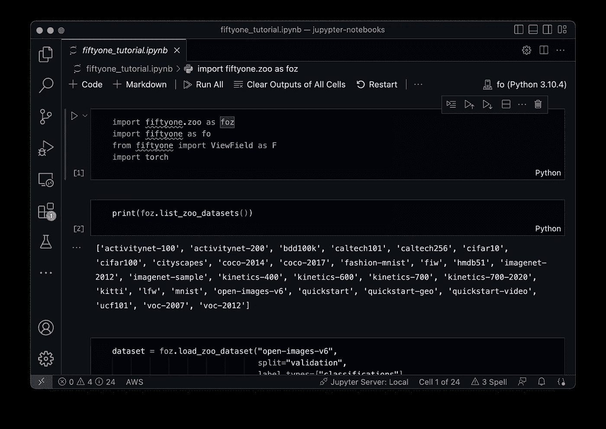
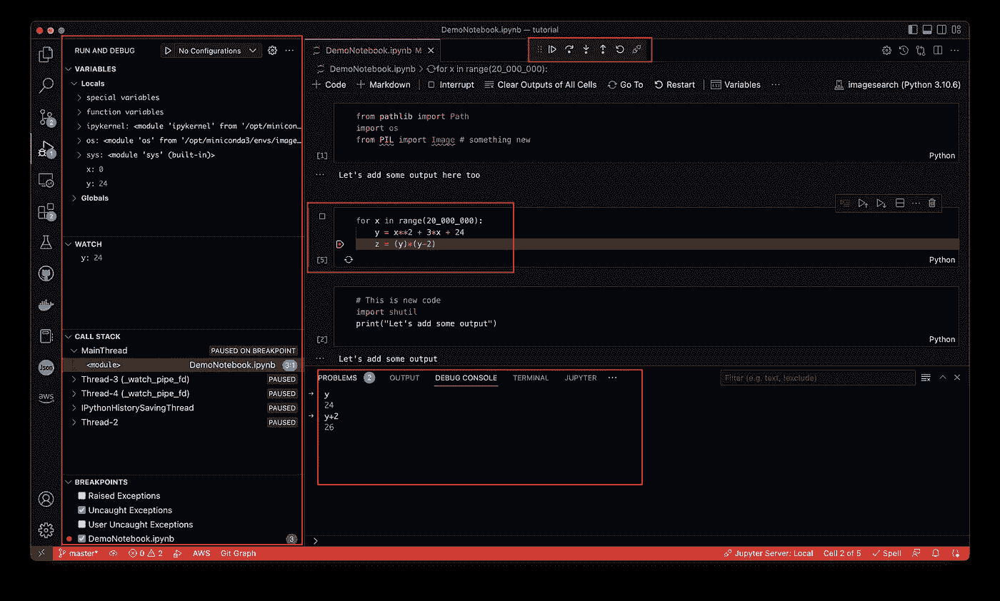
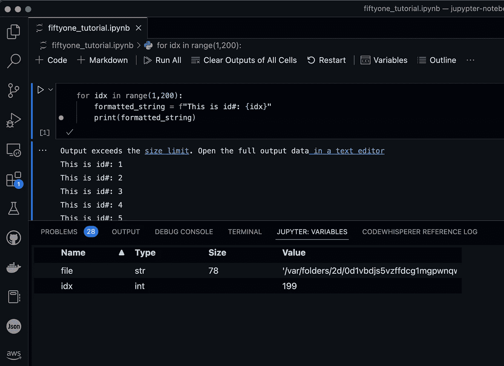
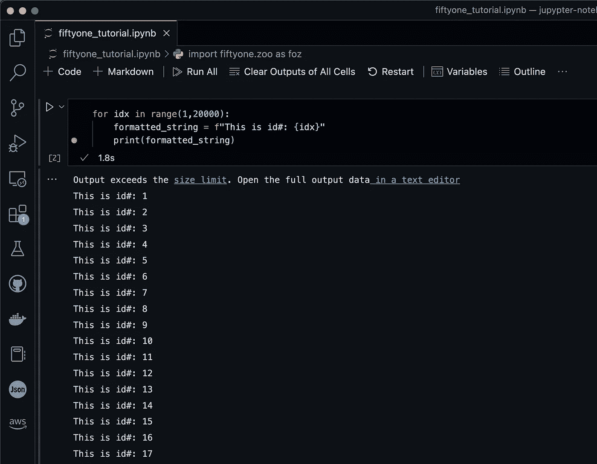

# 我在 Jupyter 笔记本上使用 VS 代码的 10 个原因

> 原文：<https://towardsdatascience.com/10-reasons-why-i-stopped-using-jupyter-lab-498e958424ac>

## 阅读了解 10 个增强 Jupyter 笔记本编程体验的优秀 VS 代码特性

照片由 [Fotis Fotopoulos](https://unsplash.com/@ffstop?utm_source=medium&utm_medium=referral) 在 [Unsplash](https://unsplash.com?utm_source=medium&utm_medium=referral) 上拍摄

我已经在学术研究和工业环境中从事 Python、深度学习和计算机视觉工作近 5 年了。我从 Jupyter 笔记本开始，但是因为几个原因很快就转到了 Jupyter 实验室。我喜欢使用它，直到我开始使用 VS 代码编程。比起为大多数任务创建笔记本，我更喜欢编写合适的 CLI 程序。然而，对于数据分析和快速可视化，没有什么能打败 Jupyter 细胞的互动性质！我甚至没有意识到，我已经习惯了 VS 代码中提供的特性，以至于当它不再为我工作(由于一个愚蠢的错误)并且我不得不短暂地切换到 Jupyter 实验室时，我意识到我再也回不去了！

在本文中，我将分享让 VS 代码工作变得非常高效的主要原因。

# VS 代码 Jupyter 支持

**1。完整的 IDE 功能**:仅此一点就足以成为切换的理由。不像你们中的一些人，我不是一个用文本编辑器(vim，nano 等)编程的人。【无意冒犯。])并使用单独的终端进行程序编译、执行等。我非常喜欢使用 ide 进行开发。集成开发环境(IDE)是一个软件应用程序，它为计算机程序员提供软件开发的综合设施[1]。它们的存在是有原因的，在使用 Jupyter 笔记本电脑时，拥有它们所有的功能是一种解放的体验。从自动完成到能够使用你已经习惯的配色方案，这是我所感激的。IDE 的好处非常多，超出了本文的范围。

来源:作者

**2。令人敬畏的远程开发体验:**在云计算盛行的今天，远程开发不再是可选的，而是开发人员技能中不可或缺的一部分。对于初学者来说，启动一个远程实例、连接到它并进行开发可能是具有挑战性的。在云上开始使用 Jupyter 笔记本可能会很困难。设置需要对实例进行适当的 ssh 访问，然后使用正确的选项运行 Jupyter Lab(或笔记本)(例如，端口、启动目录、无浏览器标志等)。)最后用一个端口转发来完成。所有这些对有经验的人来说都是小菜一碟，但仍然是需要执行的步骤。用 VS 代码远程开发简直不可思议！事实上，它太棒了，我写了一篇关于它的文章。可以在这里了解:[使用 Visual Studio 代码(VS 代码)在云(AWS/Azure/GCP)上进行深度学习/计算机视觉的远程开发和调试](/remote-development-and-debugging-on-the-cloud-aws-azure-gcp-for-deep-learning-computer-vision-5333fc698769?sk=93de07ab80f9f92a2a1051e6e12d4689)。简而言之，您在 VS 代码上的远程开发体验与本地开发一样接近。

**3。调试器:**对于任何开发人员来说，调试并找到问题的根本原因或解决 bug 的能力都是至关重要的。使用 print 语句进行调试是很好的，但是你只能做到这一步。使用调试器可以极大地提高生产率和性能。一个合适的调试器允许你在代码中的任何地方放置断点，这些断点可以是有条件的，然后让你在断点处停止程序执行。你将可以访问所有的局部和全局变量，堆栈跟踪等。程序的一部分。此外，您还将有能力步入、走出、跨过和恢复执行。有一个调试器控制台(并非总是如此，也不是每种语言都支持)，在其中您可以像在解释器中一样操作局部变量。使用 VS 代码，你可以在你的 Jupyter 笔记本中放置断点，并调试单元格！多酷啊。这是我在用笔记本工作时渴望的一件事。

来源:作者

**4。变量查看器:** VS 代码支持 **Jupyter: Variables** 视图，该视图允许您检查内存中的所有变量。它很好地将熊猫数据帧格式化成表格！如果您想查看某些变量的内容，而不一定想调试，这非常方便。您可以单击顶部 Jupyter 工具栏中的变量按钮来打开变量选项卡。

来源:作者

**5。输出大小限制:**这个功能看起来可能不怎么样，但是当你的笔记本需要打印大量内容时，它可以帮上忙。这导致 Jupyter Lab(或笔记本)根据大输出而冻结和挂起。然而，在 VS 代码中，输出被截断到一个设定的最大大小限制。如果您想查看整个输出，只需单击输出单元格顶部的超链接，即可在单独的只读文本选项卡中打开整个输出。

来源:作者

**6。高级终端支持:**一个强大的终端是每个开发者的梦想，对吗？您可以访问 VS 代码终端支持。这包括拆分终端，打开多个选项卡，并使其整齐地出现在一个选项卡组中，该选项卡组可通过键盘快捷键访问。你还想要什么？我知道 Jupyter 实验室有终端支持，但我从来没有能够让它工作。

**7。自动端口转发:**如果您使用远程机器，您可能需要端口转发。(咳咳)即使你想使用 Jupyter 实验室或笔记本电脑，你也需要进行端口转发！对于 FiftyOne、Streamlit 等应用程序。你还需要端口转发。VS 代码的好消息是它会自动完成，手动端口转发就像输入端口号一样简单。它在远程连接的终端组中可用。按 ctrl+`(或 cmd+`)打开该组，然后单击端口选项卡。

来源:作者

**8。强大的 git 支持:**除了 VS 代码中的原生 Git 支持和查看历史图表的扩展之外，还有对 Jupyter 笔记本令人难以置信的支持！这也可以在 Jupyter 实验室中通过额外的扩展获得(不确定 Jupyter 笔记本)。笔记本的更改在单元格级别上得到了很好的呈现，包括单元格内容、元数据和输出更改。然而，结合 VS 代码特性，git 体验变得非常愉快。

来源:作者

**9。格式细胞或笔记本:**这是另一个伟大的功能。您可以右键单击一个单元格并格式化该单元格或整个笔记本。只需右键单击并选择格式化单元格或格式化笔记本。您也可以使用键盘快捷键。这是清理你的笔记本和使用你选择的格式化程序格式化的一个非常快速的方法。

来源:作者

**10。自动单元运行时间:**在一些情况下，您可能需要知道单元执行时间。导入时间模块或 Jupyter magic 命令总是可行的。然而，VS 代码本身为您提供了每次运行的单元执行时间。这是一个非常方便的功能。

来源:作者

我们看到了 VS 代码的积极方面。然而，没有什么东西是没有缺陷的，VS 代码也很少有缺陷。

# 限制

我使用 VS 代码已经有一段时间了，有一些缺点或不足。

1.  VS 代码服务器连接有时会变得不稳定。如果您的 Jupyter 笔记本太大或者您打开了多个这样的笔记本，有时会发生这种情况。
2.  有时候，用于启动 Jupyter 内核的基础环境被搞乱了，内核就是不启动。Jupyter 很容易解决这个问题:选择解释器来启动 Jupyter 服务器。
3.  有时，如果你让你的机器进入睡眠状态，并且不重启 VS 代码，那么 python 内核将变得不可用。重启帮我解决了这个问题。

除了这几点，我对 VS 代码没有任何抱怨。

# 结论

最后，在这篇文章中，我分享了我喜欢使用 VS 代码进行 Juptyer 笔记本开发的 10 个原因。我希望这是有益的。如果你在 VS 代码上有任何你喜欢并经常使用的附加特性，请分享！Juptyer 实验室也一样！感谢您阅读文章。关注更多技术内容。你可以在 [LinkedIn](https://www.linkedin.com/in/msminhas93/) 上和我联系。

# 参考

[1][https://en . Wikipedia . org/wiki/Integrated _ development _ environment](https://en.wikipedia.org/wiki/Integrated_development_environment)