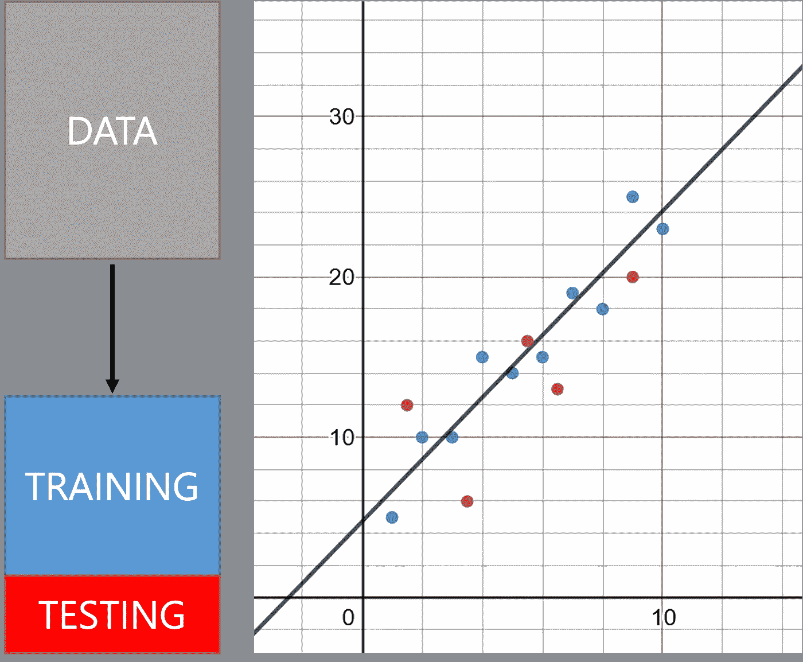

# 关于数据科学你不知道的 10 件事

> 原文：<https://towardsdatascience.com/10-things-you-are-not-told-about-data-science-3460636feeb1>

## 管理数据科学职业的期望与现实

来源 pexels.com([https://www . pexels . com/photo/abstract-accuracy-accurate-aim-262438/](https://www.pexels.com/photo/abstract-accuracy-accurate-aim-262438/))

当数据专业人员进入数据科学领域时，他们往往会措手不及。期望和现实之间有很大的差距，在这篇文章中，我将分享一些公开的秘密。我希望这将让数据科学专业人士更好地准备好进入职场后会遇到什么，并优先考虑在就业市场上提供优势的实用技能。

这些公开的秘密在我最新的奥赖利的书*中讨论。它包含了我希望在 12 年前就知道的一切，当时数据科学、人工智能和机器学习定义了未来十年的技术投资和数据专业人员的发展。虽然这本书主要侧重于构建微积分、统计和机器学习模型，但我也为读者提供了关于现实世界应用和职业管理的实用建议。*

*以下是我与读者分享的十件关于数据科学不太为人所知的事情，尤其是那些该领域的新手。*

## ***1。数据科学家不太可能在工作中使用深度学习***

*毫无疑问，深度学习帮助了数据科学作为一种职业的普及。讽刺的是，很少有数据科学家有资源做这样一个巨大的项目。数据输入工作将需要数十万(或数百万)美元，他们将花费漫长的工作日点击停车标志的图片(查看纽约时报文章 [*AI 正在向人类学习，许多人类*](https://www.nytimes.com/2019/08/16/technology/ai-humans.html) )。)之后，海量的硬件和参数实验会消耗巨大的研究成本。将这一点与深度学习的过度拟合倾向及其部署难度结合起来，你就会明白为什么大多数公司会满足于线性回归或逻辑回归。*

*尽管如此，你可以学习神经网络和深度学习来拥有这些知识，并为你的管理设定预期，我在我的书的第 7 章中写了如何从头构建神经网络。如果你获得了一两个博士学位，并在 Alphabet 或微软找到了一份工作，或许你会有机会。但对于我们其他人来说，我们没有 FAANG 公司的那种 R&D 预算。*

## ***2。SQL 可能是你能学到的最有价值的技术***

*简单的结构化查询语言(SQL)已经存在了近 50 年，但在查询数百个数据库平台时仍然保持着相关性。为什么？它只是工作。*

*当像 NoSQL 和 Apache Spark 这样的大数据平台在 2015 年出现时，有很多人猜测 SQL 将被取代。具有讽刺意味的是，出于最终用户的需求，SQL 接口被添加到这些技术中。SQL 一直是数据的通用语言，甚至在大数据繁荣时期保持了它的相关性。它的声明性和逻辑语法为检索和操作数据提供了简明易读的指导。*

*许多数据科学家进入角色时都希望使用机器学习和花哨的统计工具。事实上，他们将花费 99%的精力去寻找数据源，如果他们不懂 SQL，就很难有所作为。*

*令我惊讶的是，有这么多数据科学家不懂 SQL，而是依赖他人为他们检索数据。他们也不必要地浪费时间去做复杂的 Python/Pandas 任务，这些任务可以用 SQL 的几行代码来完成，而且数据量可能非常大，应该在数据库服务器上用 SQL 来完成。*

*想打入数据科学，先学 SQL，再学别的。如果你得不到你需要的数据，你的模型和分析毫无价值。这里还有一个无耻的自我推销:我还有一本奥赖利的书[*【SQL 入门】*](https://www.amazon.com/Getting-Started-SQL-Hands-Beginners/dp/1491938617/)*，而且只有 100 页长！**

## ****3。当你只有一把锤子时，一切都开始看起来像钉子****

**数据科学充满了专业人士寻找用机器学习解决的问题，而不是从一个问题开始，寻找正确的解决方案。正因为如此，数据科学家错过了强大、有效的工具，只是因为这些算法已经成熟、被遗忘，而不是机器学习。这些可能是代价高昂的错误，不仅对于追求错误技能的招聘经理来说如此，对于冒着将错误的解决方案与问题配对的风险的数据科学专业人员来说也是如此。**

**暂且抛开机器学习！学习正则表达式、试探法、搜索算法、基于规则的系统、线性编程、优化和其他经过时间考验并解决机器学习无法解决的实际问题的旧学校计算机科学概念。我发现最有效的解决方案往往不是制造媒体头条。我还听说过许多令人痛苦的轶事，一家大型科技公司的数据科学团队试图使用自然语言处理来解决文本模式问题，一位经验丰富的新员工在一个小时内用正则表达式解决了它。数据科学家不匹配解决方案的数量太常见了。**

## ****4。数据科学家的角色很可能变成 IT 工作****

**许多数据科学家在受雇于统计和机器学习时变得失望，但却发现自己反而成了常驻的“IT 专家”。这种现象并不新鲜，实际上早于数据科学。**

**影子信息技术(shadow IT)描述了在 IT 部门之外创建系统的办公室工作人员。这包括数据库、仪表板、脚本和代码。这在组织中过去是不被认可的，因为它不受监管并且在 it 部门的控制范围之外运行。然而，数据科学运动的一个好处是，它使 shadow IT 更被接受为创新的必需品。**

**数据科学家不会失望，而是可以精通 SQL、编程、云平台、web 开发和其他有用的技术。毕竟，数据科学家与数据打交道，而这必然会导致 IT 工作。它还可以简化他们的工作，让其他人更容易获得，并为统计和机器学习模型开辟可能性。**

## ****5。计算机和机器学习无法检测数据中的偏差****

**计算机不知道哪些数据被捕获，哪些数据没有被捕获。对计算机来说，数据只是数字。作为数据科学专业人员，数据的定性分析与实证分析一样重要。**

**我不喜欢“数据驱动”这个说法。它假设数据是真相的来源，而不是真相的线索。它忽略了数据不能捕捉现实的事实，就像照相机不能捕捉相框外面的东西一样。这导致了偏见、不完整的数据、对基础事实的假设和虚假的相关性。**

**同样重要的是，如果不是更重要的话，不仅要问数据说明了什么，还要问数据从何而来。**要“分析驱动”，而不是“数据驱动”****

**是什么产生了这些数据？是什么让它产生偏见？它是什么时候生产的？它没有捕捉到什么？最重要的是，我们如何运用自己的启发法和偏见来解释它？最后一部分是不可避免的，所以通过问这些问题来正确地塑造它。**

## **6.计算机和机器学习无法区分相关性和因果关系**

**当 *x* 和 *y* 之间存在关联时，计算机无法确定是 *x* 导致了 *y* 、 *y* 导致了 *x* ，还是第三个未捕获的变量 *z* 导致了 *x* 和 *y* 。无法确定 *x* 和 *y* 是否完全互不因果，相关性是否只是巧合。**

**这不仅对简单的回归有许多重要的影响(例如，更高的水费是否会导致更高的用水量？)还包括机器学习和深度学习。计算机视觉模型可以将空旷的场地识别为“奶牛”，因为它在场地上而不是在训练过程中与奶牛相关联。**

**请记住，机器学习最终是一个没有常识的模式识别器，因果关系是一个开放的问题。好消息是天网不会很快到来！**

## **7.数据挖掘是一种逆向进行的科学方法**

**科学方法假设然后收集数据，而数据挖掘收集数据然后假设。虽然后者看起来足够无辜，但也有可能遇到麻烦。很容易发现巧合的模式，因为你没有一个控制和测试组的发现可能是虚假的。这就是为什么在数据挖掘之后获取新的数据以观察您的发现是否仍然成立是一个好做法。**

**机器学习和深度学习是数据挖掘吗？是的，他们实际上通过在一个大的假设空间中搜索数据来自动化这个过程。因为这可能会导致过度拟合，所以我们会拿出一个“测试”和“验证”数据集来模拟“新数据”，看看拟合的回归是否成立。**

****

**具有训练/测试分割的线性回归(作者图片)**

## **8.并非所有行业生来平等**

**让我们来比较两个行业:电影流媒体(如网飞)和航天防御(如洛克希德马丁)。他们有什么共同点吗？几乎没有！两家公司都是技术驱动型公司，但一家是面向消费者的流媒体电影，另一家是用军械制造飞机。**

**数据科学和机器学习都是关于逼近的，这意味着不可避免地会有误差。相关的是，这两个行业对风险的容忍度非常不同。一家电影流媒体公司可能会吹嘘他们有一个人工智能系统，可以学习向消费者推荐什么电影，但是当它给出一个糟糕的推荐时，灾难性有多大呢？嗯，最坏的情况是，您有一个有点恼火的消费者，他浪费两个小时看了一部他们不喜欢的电影。**

**但是航天防御公司呢？如果一架战斗机上有自动射击目标的人工智能，如果它是错的，会有多灾难性？我们现在谈论的是人的生命，而不是电影推荐！这两个行业之间的风险承受能力差距很大。当然，航天防御公司在实施任何实验系统时都会更加保守。**

**作为一名数据科学专业人士，你需要了解你所在的行业及其对风险的容忍度。具有讽刺意味的是，高风险行业的高管可能会观察低风险行业并体验 FOMO(害怕错过)，这仅仅是因为这种差异没有得到足够的重视。不危及、伤害或引起争议的机器学习应用程序将更容易使用。从事高风险的应用程序将是一个更难驾驭的职业，可能需要博士证书，仍然不会使假阳性/假阴性消失。**

## **9.将机器学习投入生产很难**

**将数据科学模型和机器学习投入生产真的很难。测试和验证数据集可能在实验室环境中表现良好，但在野外数据可能会有所不同，并且充满意外事件。还有数据腐烂的问题，随着趋势的变化，数据有一个截止日期。当“自动驾驶汽车”上的传感器被重新配置时，也会发生这种情况，使之前的所有数据和模型参数变得无用。这些问题只是触及表面，吴恩达已经承认这是人工智能在放射学方面的一个公开问题。**

**数据科学家和软件工程师之间存在巨大的鸿沟，这也是为什么许多数据科学家的工作从不离开他们的笔记本电脑。除了这些数据问题之外，数据科学家还需要软件工程技能。正如前面所强调的，重要的是不仅要问数据说明了什么，还要问数据来自哪里，以及数据将被捕获到的环境的受控或不受控程度如何。此外，在您预算数十万(如果不是数百万)美元来获取标记数据之前，请确保您了解该数据的保质期！**

## **10.对你所学的东西进行优先排序是很重要的**

**在数据科学中，有一种公认的态度，那就是永远保持学习和好奇。这很好，但我认为更重要的技能是对你所学的东西进行优先排序。**

**外面有如此多的信息，对你所学的东西进行优先排序成为一种无价的技能。我认为最好的方法是找出你感兴趣的问题(而不是解决方案),然后找到解决问题的最佳方法。**

**很多年前，我意识到我对调度问题感兴趣，并希望一个“人工智能”来调度员工、教室、服务器作业和其他具有各种规则的受限资源。让我失望的兔子洞很有启发性:元启发式、线性规划、树搜索和随机优化。这些都与数据科学无关，但后来我意识到这些技术是机器学习的一个组成部分。这些见解非常有价值，我有了更多的解决方案，可以恰当地解决问题。我也认识到供应商正在销售各种算法作为“人工智能”，而不是机器学习，事实上，我以前做的很多工作都是“人工智能”🤷‍♂️**

**朋友们，优先考虑你学的东西，而不是为了学而学！**

## **结论**

**如果你试图进入数据科学职业生涯，期望和现实之间可能会有很大的差距。这绝对不意味着没有机会。有大量的工作要做，这有助于多样化技能，这样你就能熟练地找到解决问题的正确方法。**

**如果你喜欢这篇文章，请再次查看我最新的奥赖利的书*【数据科学的基本数学】。它有很多类似的信息，可以帮助初学和实践数据科学的专业人士。我涵盖了微积分、假设检验、线性回归、逻辑回归和神经网络。然而，我强调数据背后有背景的重要性，而不是仅仅关注应用数学。***