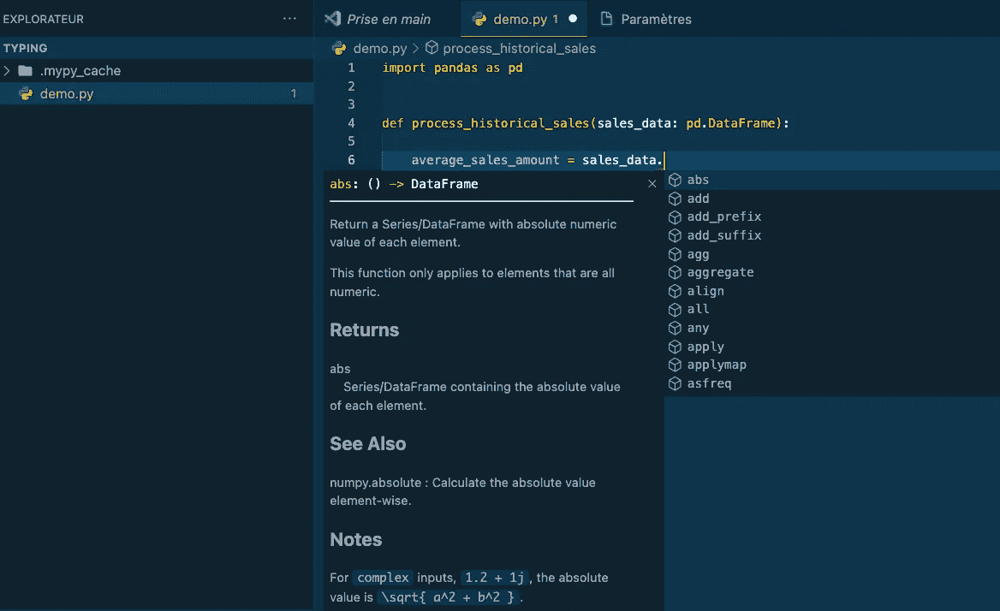

# 关于类型提示的 12 个初学者概念，以改进您的 Python 代码

> 原文：<https://towardsdatascience.com/12-beginner-concepts-about-type-hints-to-improve-your-python-code-90f1ba0ac49>

## 就像单元测试一样，类型提示花费了开发人员的时间，但从长远来看是值得的


阿里安·达尔维什在 [Unsplash](https://unsplash.com?utm_source=medium&utm_medium=referral) 上拍摄的照片

Python 是一种动态类型的编程语言。这意味着解释器只在代码运行时执行类型检查**，并且变量类型允许在其生命周期内改变。**

尽管 Python 一直保持动态类型，并且从未打算改变这一方向，但自从 [PEP 484](https://peps.python.org/pep-0484/) 以来，类型提示已经被引入，目的是将静态类型检查引入代码分析。

> 在本文中，我们将介绍类型提示，并回顾使用它们时应该熟悉的 12 个概念。

在这篇文章的最后，你应该对类型提示有一个总体的了解，它们是什么以及什么时候应该使用它们。您还将学习如何构建复杂类型和执行静态类型检查。

话虽如此，让我们深入研究一下一些代码💻

> 新到中？你可以每月订阅 5 美元，解锁我写的不限数量的关于编程、MLOps 和系统设计的文章，以帮助数据科学家(或 ML 工程师)编写更好的代码。

[](https://medium.com/membership/@ahmedbesbes) [## 加入我的介绍链接媒体-艾哈迈德贝斯

### 阅读 Ahmed Besbes 的每一个故事(以及媒体上成千上万的其他作家)。您的会员费直接支持…

medium.com](https://medium.com/membership/@ahmedbesbes) 

# 1-类型注释:支持添加类型的新语法

使用 Python 注释执行类型提示(从 [PEP 3107](https://peps.python.org/pep-3107/) 开始引入)。它们用于向变量、参数、函数参数以及它们的返回值、类属性和方法添加类型。

> ***添加类型提示没有运行时效果:这些只是提示，本身并不强制。如果你担心他们，一定要记住翻译总是忽略他们。***

**👉
变量注释**变量注释遵循以下语法:

```
***<variable_name>: <variable_type> = <variable_value>***
```

您可以使用以下基本内置类型之一来执行类型提示:`int`、`float`、`str`、`bool`、`bytes`、`list`、`tuple`、`dict`、`set`、`frozenset`、`None`。

以下是一些入门示例:

为了构建更高级的类型，我们将使用[类型化](https://docs.python.org/3/library/typing.html)模块。继续阅读，了解更多。

**👉函数注释**
你也可以给函数添加类型提示来指定它们的参数和返回值的类型。

使用前面的语法来指定参数的类型。

使用箭头`->`提示返回值。

在下面的例子中，`type_x`、`type_y`、`type_z`、`type_return`必须是有效的 python 表达式，比如内置类型或者使用类型模块的更复杂的类型。

→如果一个函数不返回任何东西，可以将返回类型(箭头后)设置为`None`。

**👉你甚至可以在你的类中标注属性和方法。**

# 2-使用 mypy 执行静态类型检查

要检查 python 是否强制类型提示，请尝试运行以下脚本，该脚本声明一个类型为`int`的变量`x`，并在稍后更改其值以存储一个浮点数。

```
# script.pyx: int = 2# ...x = 3.5
```


作者截图

没有错误。(不出所料)

现在，如果你真的对你的代码很严格，并且仍然想检测这些类型的错误，你可以使用 ***mypy*** ，一个执行静态类型检查的工具。

要安装它，只需运行`pip install mypy`。

然后，要分析您的代码，只需运行:`mypy script.py`


作者截图

在这个简单的例子中，mypy 检测到一个错误:**赋值中不兼容的类型，**这正是我们想要强调的。

通过静态分析您的代码，mypy 帮助您符合您定义的类型，提高您的代码质量，防止无声错误，并通过遵循最佳实践来标准化您的代码。

要了解更多信息，请查看 http://mypy-lang.org/的。

# 3—添加类型提示的好处

> **如果解释器不强制执行，为什么还要写类型提示呢？**

我经常听到这句话。

的确，类型提示不会改变代码的运行方式:Python 本质上是动态类型化的，并且不会很快改变。

然而，从开发人员体验的角度来看，类型提示为您的代码库带来了多种好处。

我可以不假思索地想到以下优点:

1.  使用类型提示，尤其是在函数中，通过提供信息签名来阐明关于参数类型和所产生结果类型的假设，从而记录您的代码
2.  通知类型消除了认知开销，使代码更容易阅读和调试。记住了输入和输出的类型，您就可以很容易地推理出您的对象以及它们是如何耦合的
3.  类型提示改善您的代码编辑体验:
    结合 mypy，您的 IDE 依靠它们来静态分析您的代码，并帮助检测潜在的错误(例如，传递错误类型的参数，调用错误的方法，等等。)
    另外，根据变量的类型提示，为每个变量提供自动完成功能。


mypy 根据类型提示检测支持的类型操作和不兼容的类型—作者截图



VSCode 使用类型提示信息来提供相关的自动完成功能——作者截图

在接下来的部分中，我们将讨论类型模块中的高级类型。

# 4-列表

假设你想给你的函数传递一个有点复杂的参数，由…一个浮点数列表组成。你会如何注释它？

您可以尝试通过将`list`类型与`float`类型组合来编写类似的内容。

不错的尝试。

遗憾的是，这不起作用，尽管写起来似乎很自然和直观。

为了支持这一点，您只需用从[](https://docs.python.org/3/library/typing.html)**模块导入的`**L**ist`类型替换内置的标准`list`类型。**

**列表类型的有趣之处在于，它可以包含任何类型，而不仅仅是内置类型。我们自己的类型基本上可以和 List 结合。**

**例如，如果你有一个字符串列表，你应该这样输入:**

# **5—字典**

**我喜欢使用 python 字典，因为它们很灵活。它们允许您使用不同类型的键和值。例如，您可以拥有一个包含字符串键和 dict 值的字典(在本例中，这表示一个嵌套的 dict 结构)**

**然而，作为这种灵活性的代价，并不总是清楚底层模式是什么:字典键是什么类型？字典值有哪些类型？**

**要控制字典中键和值的类型，可以使用类型模块中的 Dict 类型。**

**假设我用字符串键和字符串值处理字典。**

```
**{"name": "Ahmed", "job": "ML engineer"}**
```

**要建立这样一个字典结构的模型，可以向 Dict 传递两个参数，其中第一个是键的类型，第二个是值的类型。**

```
**from typing import Dict****my_dict_type = Dict[str, str]**
```

# **6 —联合**

> ***从 Python 3.10 开始，* `*Union*` *被* `*|*` *取代，也就是说* `*Union[X, Y]*` *现在相当于* `*X | Y*` *。***

**Union[X，Y](或 X | Y)表示 X 或 Y。**

****示例**👇**

**假设您的函数需要从缓存目录中读取一个文件并加载一个 torch 模型。这个缓存目录位置可以是一个字符串值(比如`/home/cache`)或者是来自 [Pathlib](https://docs.python.org/3/library/pathlib.html) 库中的一个路径对象。**

**在这种情况下，代码如下所示:**

# **7-类型直接**

**如果您的 Python 字典有一个固定的模式，其中包含已知的字符串键和不同类型的值，该怎么办？**

**大概是这样的:**

```
**d = {"name": "Ahmed", "interests": ["chess", "tennis"]}**
```

**你会怎么打？**

**❌使用**字典**和**联合**并不理想，因为我们丢失了关于什么键需要具有什么类型的值的信息。**

**使用 **TypedDict** 的✅允许你声明一个字典类型，期望它的所有实例都有一组特定的键，其中每个键都与一个一致类型的值相关联。**

**这是一个如何工作的例子👇**

****

**图片由作者提供—制作于[https://carbon.now.sh/](https://carbon.now.sh/)**

# **8 —可赎回**

**Callable 是当你想用一个函数作为参数时使用的。**

**你也可以指定参数的类型和可调用函数的返回值。**

```
Callable[[input_type_1, ...], return_type]
```

**下面是带有附加类型提示的相同示例:**

# **9 —任何**

**`Any`类型非常简单。事实上，写这个**

```
def bar(input: Any):
    ...
```

**相当于这样写:**

```
def bar(input):
    ...
```

**`Any`类型只是在这里明确声明 bar 函数打算接收任何输入类型作为参数。(可能是因为这个函数后面执行的内容不依赖于它的参数类型)。**

> ***这个* `*Any*` *型到底有没有用？🤔***

**老实说，我不知道。**

# **10-可选**

**如果您的任何函数使用可选的参数，比如说，因为它有一个默认值，那么您可以使用类型模块中的可选类型。**

# **11 —序列**

**类型为**序列**的对象是任何可以被索引的东西:列表、元组、字符串、对象列表、元组列表的元组，等等。**

**⚠️:请注意，集合或字典不是序列类型。**

# **12 元组**

**元组类型的工作方式与列表类型略有不同。**

**如果你不在乎你的 tuple 的每个元素的类型，你可以继续使用`tuple`内置类型。**

```
**t: tuple = (1, 2, 3, ["cat", "dog"], {"name": "John"})**
```

**但是，如果您想指定类型中每个元素的类型，请使用 Tuple。**

# **结论**

**类型提示在您的代码之上带来了一个额外的抽象层:它们有助于记录代码，阐明关于输入/输出的假设，并在静态代码分析(👋mypy)在上面执行。**

**现在剩下的问题是:*我应该开始在我的项目中使用类型提示吗？***

**如果你在一个已经实现了类型提示(和单元测试)的大型代码库上合作，那么如果你想编写现代 python 代码并提高代码质量，那么添加
是很自然的事情，类型提示是一条可行之路。**

**然而，如果您使用的是旧版本的 Python，如果您是编程语言的新手，或者如果性能确实是个问题，那么您可能应该避免添加类型提示。事实上，关于这最后一点，类型提示会在启动时引入一点开销。**

# **资源**

*   **[https://better programming . pub/twenty-type-hinting-techniques-and-tools-for-better-python-code-e 877 e 0 b 0 c 679](https://betterprogramming.pub/twenty-type-hinting-techniques-and-tools-for-better-python-code-e877e0b0c679)**
*   **[https://www.youtube.com/watch?v=dgBCEB2jVU0](https://www.youtube.com/watch?v=dgBCEB2jVU0)**
*   **[https://www.youtube.com/watch?v=QORvB-_mbZ0](https://www.youtube.com/watch?v=QORvB-_mbZ0)**
*   **[https://mypy.readthedocs.io/en/stable/cheat_sheet_py3.html](https://mypy.readthedocs.io/en/stable/cheat_sheet_py3.html)**
*   **[https://realpython.com/python-type-checking/](https://realpython.com/python-type-checking/)**
*   **[https://www . python tutorial . net/python-basics/python-type-hints/](https://www.pythontutorial.net/python-basics/python-type-hints/)**
*   **[https://realpython.com/lessons/pros-and-cons-type-hints/](https://realpython.com/lessons/pros-and-cons-type-hints/)**
*   **[https://bernat . tech/posts/the-state-of-type-hints-in-python/](https://bernat.tech/posts/the-state-of-type-hints-in-python/)**

# **新到中？您可以每月订阅 5 美元，并解锁各种主题的无限文章(技术、设计、创业……)您可以通过点击我的推荐链接[来支持我](https://ahmedbesbes.medium.com/membership)**

**[](https://ahmedbesbes.medium.com/membership) [## 加入我的介绍链接媒体-艾哈迈德贝斯

### 阅读 Ahmed Besbes 的每一个故事(以及媒体上成千上万的其他作家)。您的会员费直接支持…

ahmedbesbes.medium.com](https://ahmedbesbes.medium.com/membership)**