# 优化 BigQuery SQL 性能的 14 个最佳实践

> 原文：<https://towardsdatascience.com/14-ways-to-optimize-bigquery-sql-for-ferrari-speed-at-honda-cost-632ec705979>

## 让你的查询跑得像法拉利一样快，但像本田一样便宜。


数据管道类似于管道——我们需要在它破裂之前修复漏洞。图片来自 [Pixabay](https://pixabay.com/?utm_source=link-attribution&utm_medium=referral&utm_campaign=image&utm_content=6195292) 的[精灵月舞](https://pixabay.com/users/elf-moondance-19728901/?utm_source=link-attribution&utm_medium=referral&utm_campaign=image&utm_content=6195292)。

P 优化不当的 SQL 查询就像管道内壁上的裂缝——几乎不能保持水分。当水压较低时，会有轻微的漏水，但一切仍然正常。当我们加大负荷时，噩梦就开始了。曾经可以忽略不计的裂缝现在突然大开，我们开始消耗资源，直到基础设施的完整性崩溃。

随着大数据的激增，数据管道必须处理大量负载，成本越来越容易失控。查询不再仅仅是编写一个运行的语法。它还需要经济高效且快速。

在服务器崩溃了太多次之后，我想是时候开始问… *如何*？

*   第一:限制是一个陷阱。
*   [#2:选择尽可能少的列。](#754f)
*   [#3:用 EXISTS()代替 COUNT()。](#19aa)
*   [#4:使用近似聚合函数。](#f633)
*   [#5:用 Windows 函数替换自加入。](#f255)
*   [#6:按 INT64 列排序或联接。](#e447)
*   优化你的反连接。
*   尽早并经常整理你的数据。
*   [#9:顺序很重要(？)](#d951)
*   利用分区和/或集群。
*   [#11:将订单按推至查询末尾(？)](#6dee)
*   [#12:延迟资源密集型操作。](#509b)
*   [#13:使用搜索()。](#780b)
*   [#14:利用缓存。](#f148)

*注 1:这里所有的查询都是基于* [*BigQuery 公共数据*](https://cloud.google.com/bigquery/public-data) *编写的，每个人都可以访问。换句话说，您可以将查询复制并粘贴到 BigQuery 中，自己尝试查询。*

*注 2:虽然我们在本文中使用的是 BigQuery，但是这里描述的大部分优化技术都是通用的 SQL 最佳实践，可以应用到其他平台，比如 Amazon Redshift、MySQL、Snowflakes 等。*

# #1:限制是一个陷阱。

> **最佳实践** : `LIMIT`提高了性能，但没有降低成本。对于数据探索，可以考虑使用 BigQuery 的(免费)表预览选项。

不得不说——

大多数 SQL 从业者曾经被`LIMIT 1000`歪曲的安全错觉所欺骗。完全有理由假设，如果我们只显示 1000 行输出，数据库的负载会更少，因此成本会更低。

不幸的是，这不是真的。

在 SQL 数据库扫描全部数据后，`LIMIT`子句的行限制应用于*。更糟糕的是——大多数分布式数据库(包括 BigQuery)基于数据扫描收费，但*而不是*输出，这就是为什么`LIMIT`不能帮助节省一毛钱。*

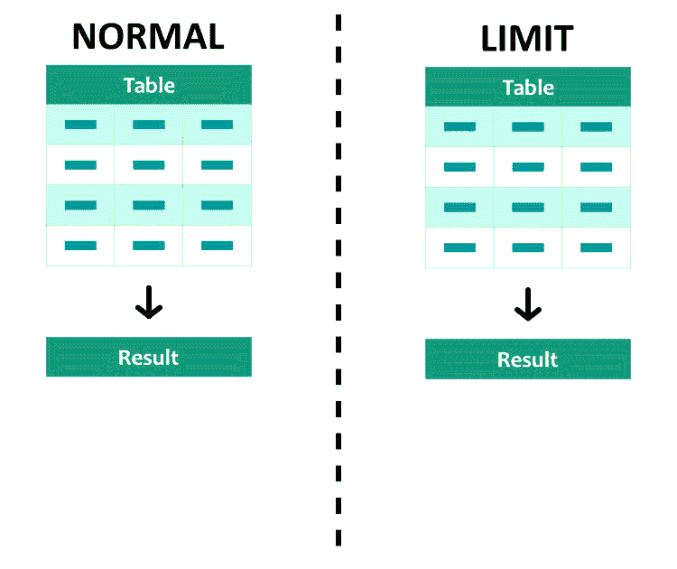

LIMIT 子句通过减少洗牌时间来提高性能。图片由作者提供。

然而，这并不都是悲观的。由于`LIMIT`对输出行设置了上限，我们需要在 BigQuery 的网络上移动更少的数据。这种字节重排的减少显著提高了查询性能。

为了进行演示，我使用了 BigQuery 公共数据存储库中的`crypto_ethereum`表，其中有 1500 万行数据。

```
# Not OptimizedSELECT
  miner
FROM
  `bigquery-public-data.crypto_ethereum.blocks`-----------------------
Elapsed Time   : 11s
Slot Time      : 162s
Bytes Processed: 617 MB
Bytes Shuffled : 1.7 GB
Bytes Spilled  : 0 B
-----------------------
```

让我们用`LIMIT`再次尝试查询。

```
# Optimized (for speed only)SELECT
  miner
FROM
  `bigquery-public-data.crypto_ethereum.blocks`
LIMIT
  1000-----------------------
Elapsed Time   : 2s
Slot Time      : 0.01s
Bytes Processed: 617 MB
Bytes Shuffled : 92 KB
Bytes Spilled  : 0 B
-----------------------
```

使用`LIMIT`提高了速度，但不增加成本。

*   成本:处理的字节保持不变，仍为 617 MB。
*   速度:字节混洗从 1.7 GB 下降到仅仅 92 KB，这解释了槽时间的巨大改进(从 162 秒到 0.01 秒)。

虽然使用`LIMIT`总比没有好，但是如果纯粹是为了研究表格，还有更好的选择。我强烈推荐使用 BigQuery 的表预览选项。这个特性允许我们一页一页地浏览表格，一次最多 200 行，而且完全免费。

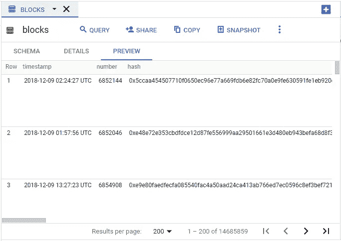

BigQuery 的表预览选项对于探索表结构非常有用。截图摘自 [BigQuery](https://console.cloud.google.com/bigquery) 。

为了成本优化，限制使用`LIMIT`。

# #2:选择尽可能少的列。

> **最佳实践:**避免使用`SELECT *`。只选择您需要的相关列，以避免不必要的、代价高昂的全表扫描。[来源](https://cloud.google.com/bigquery/docs/best-practices-costs#avoid_select_)。

BigQuery 不是传统的基于行的数据库，而是一个[列](https://dataschool.com/data-modeling-101/row-vs-column-oriented-databases/)数据库。这种区别是有意义的，因为它读取数据的方式不同。

如果一个表有 100 列，但是我们的查询只需要 2 个特定列的数据，那么基于行的数据库将遍历每一行——每行的所有 100 列——只提取感兴趣的 2 列。相比之下，列数据库将只处理 2 个相关的列，这有助于更快的读取操作和更有效的资源利用。

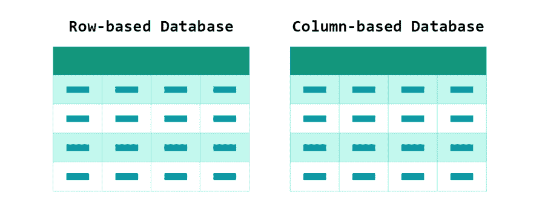

基于行的数据库和基于列的数据库读取数据是不同的。图片由作者提供。

下面是一个典型的查询，写起来很快，但是运行起来很慢。

```
# Not OptimizedSELECT
  *
FROM
  `bigquery-public-data.crypto_ethereum.blocks`-----------------------
Elapsed Time   : 23s
Slot Time      : 31 min
Bytes Processed: 15 GB
Bytes Shuffled : 42 GB
Bytes Spilled  : 0 B
-----------------------
```

由于列数据库可以跳过列，我们可以利用这一点，只查询我们需要的列。

```
# OptimizedSELECT
  timestamp,
  number,
  transactions_root,
  state_root,
  receipts_root,
  miner,
  difficulty,
  total_difficulty,
  size,
  extra_data,
  gas_limit,
  gas_used,
  transaction_count,
  base_fee_per_gas
FROM
  `bigquery-public-data.crypto_ethereum.blocks`-----------------------
Elapsed Time   : 35s
Slot Time      : 12 min
Bytes Processed: 5 GB
Bytes Shuffled : 11 GB
Bytes Spilled  : 0 B
-----------------------
```

在本例中，查询成本降低了 3 倍，因为我们需要处理的字节从 15 GB 减少到了 5 GB。除此之外，我们还观察到，随着时隙时间从 31 分钟减少到 12 分钟，性能有所提高。

这种方法的唯一缺点是我们需要输入列名，这可能很麻烦，尤其是当我们的任务需要大部分列时，除了少数几个。在这种情况下，并不是所有的都丢失了，我们可以利用`EXCEPT`语句来排除不必要的列。

```
# OptimizedSELECT
  *
  EXCEPT (
    `hash`,
    parent_hash,
    nonce,
    sha3_uncles,
    logs_bloom)
FROM
  `bigquery-public-data.crypto_ethereum.blocks`-----------------------
Elapsed Time   : 35s
Slot Time      : 12 min
Bytes Processed: 5 GB
Bytes Shuffled : 11 GB
Bytes Spilled  : 0 B
-----------------------
```

除非绝对必要，否则避免`SELECT *`。

# #3:使用 EXISTS()而不是 COUNT()。

> **最佳实践**:如果我们不需要精确的计数，使用`EXISTS()`，因为一旦找到第一个匹配行，它就退出处理循环。[来源](https://www.oreilly.com/library/view/microsoft-sql-server/9780133408539/ch45lev2sec6.html)。

当探索一个全新的数据集时，有时我们发现自己需要检查特定值的存在。我们有两个选择，要么用`COUNT()`计算值的频率，要么检查值`EXISTS()`是否。如果我们不需要知道值出现的频率，总是使用`EXISTS()`来代替。

这是因为一旦找到第一个匹配行，`EXISTS()`就会退出处理循环，如果找到目标值，则返回`True`,如果目标值不在表中，则返回`False`。

相反，`COUNT()`将继续搜索整个表，以便返回目标值的准确出现次数，浪费不必要的计算资源。


一旦找到匹配项，EXISTS()子句就退出处理。图片由作者提供。

假设我们想知道值`6857606`是否存在于`number`列中，我们使用了`COUNT()`函数…

```
# Not OptimizedSELECT
  COUNT(number) AS count
FROM
  `bigquery-public-data.crypto_ethereum.blocks`
WHERE
  timestamp BETWEEN '2018-12-01' AND '2019-12-31'
  AND number = 6857606-----------------------
Elapsed Time   : 6s
Slot Time      : 16s
Bytes Processed: 37 MB
Bytes Shuffled : 297 B
Bytes Spilled  : 0 B
-----------------------
```

因为只有一行与值匹配，所以`COUNT()`返回 1。现在，让我们用`EXISTS()`来代替。

```
# OptimizedSELECT EXISTS (
  SELECT
    number
  FROM
    `bigquery-public-data.crypto_ethereum.blocks`
  WHERE
    timestamp BETWEEN "2018-12-01" AND "2019-12-31"
    AND number = 6857606
)-----------------------
Elapsed Time   : 0.7s
Slot Time      : 0.07s
Bytes Processed: 37 MB
Bytes Shuffled : 11 B
Bytes Spilled  : 0 B
-----------------------
```

查询返回`True`，因为该值存在于表中。使用`EXISTS()`函数，我们不会得到关于其频率的信息，但是作为回报，查询性能得到了极大的提高——从 16 秒减少到 0.07 秒。

难道不庆幸`EXISTS()`功能的存在吗？

# #4:使用近似聚合函数。

> **最佳实践**:当你有一个大的数据集，并且你不需要精确的计数时，使用近似聚合函数。[来源](https://cloud.google.com/bigquery/docs/best-practices-performance-compute#use_approximate_aggregation_functions)。

一个`COUNT()`扫描整个表以确定出现的次数。因为这是逐行进行的，所以操作将以 O(n)的时空复杂度运行。对具有数亿行的大数据执行这样的操作将很快变得不可行，因为它需要大量的计算资源。

为了加剧性能问题，`COUNT(DISTINCT)`将需要大量的计算机内存来记录每个用户的唯一 id。当列表超过内存容量时，多余的容量会溢出到磁盘中，导致性能急剧下降。

在数据量很大的情况下，通过使用近似聚合函数来牺牲准确性以换取性能可能对我们最有利。例如:-

*   `[APPROX_COUNT_DISTINCT()](https://cloud.google.com/bigquery/docs/reference/standard-sql/approximate_aggregate_functions#approx_count_distinct)`
*   `[APPROX_QUANTILES()](https://cloud.google.com/bigquery/docs/reference/standard-sql/approximate_aggregate_functions#approx_quantiles)`
*   `[APPROX_TOP_COUNT()](https://cloud.google.com/bigquery/docs/reference/standard-sql/approximate_aggregate_functions#approx_top_count)`
*   `[APPROX_TOP_SUM()](https://cloud.google.com/bigquery/docs/reference/standard-sql/approximate_aggregate_functions#approx_top_sum)`
*   `[HYPERLOGLOG++](https://cloud.google.com/bigquery/docs/reference/standard-sql/hll_functions#hyperloglog_functions)`

与通常的强力方法不同，近似聚合函数使用统计信息来产生近似结果，而不是精确结果。预计误差率 1~2%。因为我们没有运行全表扫描，所以近似聚合函数在内存使用和时间方面是高度可伸缩的。

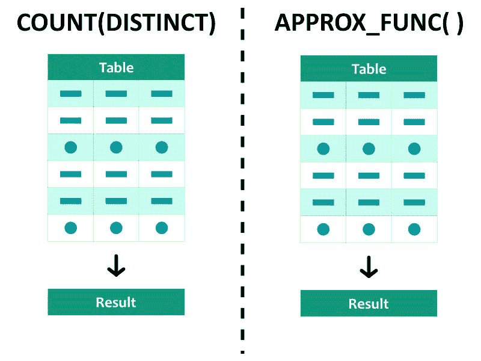

近似聚合函数使用统计信息快速提供近似结果。[放大镜](https://www.flaticon.com/free-icon/statistics_2920326?k=1650474651450)图标来自 Flaticon 的 Freepik，经作者允许编辑。

假设我们对 220 万个块中唯一以太坊矿工的数量感兴趣，我们可以运行以下查询…

```
# Not OptimizedSELECT
  COUNT(DISTINCT miner)
FROM
  `bigquery-public-data.crypto_ethereum.blocks`
WHERE
  timestamp BETWEEN '2019-01-01' AND '2020-01-01'-----------------------
Elapsed Time   : 3s
Slot Time      : 14s
Bytes Processed: 110 MB
Bytes Shuffled : 939 KB
Bytes Spilled  : 0 B
-----------------------
```

`COUNT(DISTINCT)`函数返回了 573 名矿工，但用了 14 名矿工。我们可以将其与`APPROX_COUNT_DISTINCT()`进行比较。

```
# OptimizedSELECT
  APPROX_COUNT_DISTINCT(miner)
FROM
  `bigquery-public-data.crypto_ethereum.blocks`
WHERE
  timestamp BETWEEN '2019-01-01' AND '2020-01-01'-----------------------
Elapsed Time   : 2s
Slot Time      : 7s
Bytes Processed: 110 MB
Bytes Shuffled : 58 KB
Bytes Spilled  : 0 B
-----------------------
```

令我高兴的是，`APPROX_COUNT_DISTINCT()`返回了 573 名矿工的正确数字(运气？)在一半的时隙时间内。即使只有 220 万行数据，性能上的差异也很明显，但我想随着表变大，这种差异会对我们有利。

每当不需要超精确计算时，请考虑使用近似聚合函数来获得更高水平的响应。

# #5:用 Windows 函数替换自连接。

> 最佳实践:自连接总是低效的，应该只在绝对必要的时候使用。在大多数情况下，我们可以用窗口函数来代替它。[来源](https://cloud.google.com/bigquery/docs/best-practices-performance-patterns#self-joins)。

自联接是指表与自身相联接。当我们需要一个表引用它自己的数据时，这是一个常见的连接操作，通常是在父子关系中。

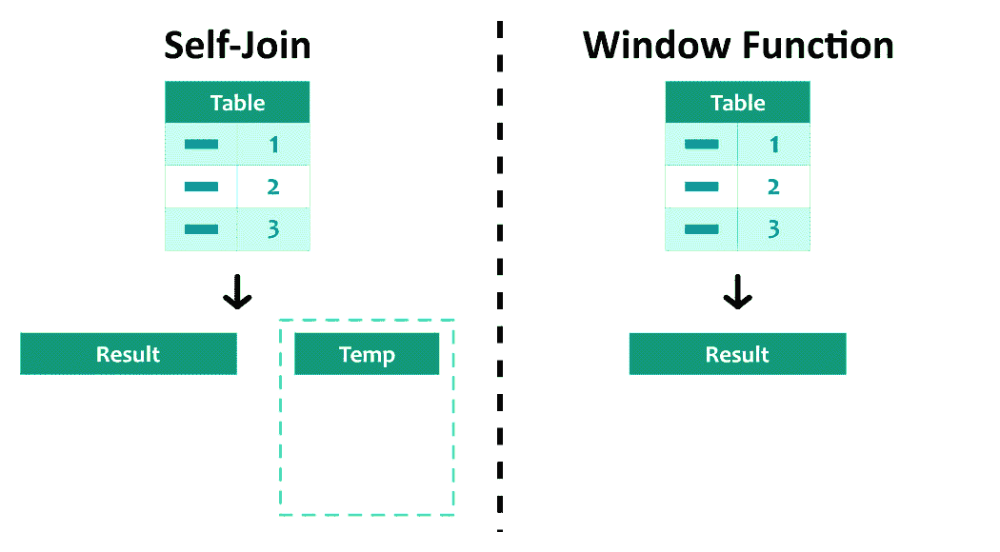

自联接通常比 windows 函数需要更多的读取，因此速度较慢。图片由作者提供。

一个常见的用例——带有 manager_id 列的 Employee 表包含所有雇员和助理经理(也是公司的雇员)的行记录，他们也可能有自己的经理。要获得所有员工及其直接主管的列表，我们可以使用 employee_id = manager_id 执行自联接。

这通常是一种 SQL 反模式，因为它可能会使输出行数平方，或者强制进行大量不必要的读取，随着表变大，这会成倍地降低我们的查询性能。

例如，如果我们想知道每个矿工今天和昨天开采的以太坊块数之间的差异，我们可以编写一个自连接，尽管这是低效的

```
# Not OptimizedWITH
  cte_table AS (
  SELECT
    DATE(timestamp) AS date,
    miner,
    COUNT(DISTINCT number) AS block_count
  FROM
    `bigquery-public-data.crypto_ethereum.blocks`
  WHERE
    DATE(timestamp) BETWEEN "2022-03-01"
    AND "2022-03-31"
  GROUP BY
    1,2
  )SELECT
  a.miner,
  a.date AS today,
  a.block_count AS today_count,
  b.date AS tmr,
  b.block_count AS tmr_count,
  b.block_count - a.block_count AS diff
FROM
  cte_table a
LEFT JOIN
  cte_table b
  ON
    DATE_ADD(a.date, INTERVAL 1 DAY) = b.date
    AND a.miner = b.miner
ORDER BY
  a.miner,
  a.date-----------------------
Elapsed Time   : 12s
Slot Time      : 36s
Bytes Processed: 12 MB
Bytes Shuffled : 24 MB
Bytes Spilled  : 0 B
-----------------------
```

与执行自连接相比，窗口功能与导航功能`LEAD()`相结合将是更好的方法。

```
# OptimizedWITH
  cte_table AS (
    SELECT
      DATE(timestamp) AS date,
      miner,
      COUNT(DISTINCT number) AS block_count
    FROM
      `bigquery-public-data.crypto_ethereum.blocks`
    WHERE
      DATE(timestamp) BETWEEN "2022-03-01" AND "2022-03-31"
    GROUP BY
      1,2
  )SELECT
  miner,
  date AS today,
  block_count AS today_count,
  LEAD(date, 1) OVER (PARTITION BY miner ORDER BY date) AS tmr,
  LEAD(block_count, 1) OVER (PARTITION BY miner ORDER BY date) AS tmr_count,
  LEAD(block_count, 1) OVER (PARTITION BY miner ORDER BY date) - block_count AS diff
FROM
  cte_table a-----------------------
Elapsed Time   : 3s
Slot Time      : 14s
Bytes Processed: 12 MB
Bytes Shuffled : 12 MB
Bytes Spilled  : 0 B
-----------------------
```

这两个查询给出了相同的结果，但是使用后一种方法在查询速度上有了显著的提高(从 36 秒的时间段减少到 14 秒的时间段)。

除了`LEAD()`函数之外，还有很多其他的[导航](https://cloud.google.com/bigquery/docs/reference/standard-sql/navigation_functions)、[编号](https://cloud.google.com/bigquery/docs/reference/standard-sql/numbering_functions)和[聚合分析](https://cloud.google.com/bigquery/docs/reference/standard-sql/aggregate_analytic_functions)函数可以用来代替自连接操作。就我个人而言，这些是我在日常工作中经常使用的功能

*   导航功能:`LEAD()`，`LAG()`
*   编号功能:`RANK()`，`ROW_NUMBER()`
*   聚合分析函数:`SUM()`、`AVG()`、`MAX()`、`MIN()`、`COUNT()`

下一次你看到自加入时，提醒自己它们只是机会之窗，让你灵活掌握窗口功能。

# #6:在 INT64 列上的 ORDER BY 或 JOIN。

> **最佳实践**:当您的用例支持时，总是优先比较`INT64`，因为评估`INT64`数据类型比评估字符串更便宜。[来源](https://cloud.google.com/bigquery/docs/best-practices-performance-compute#use_int64_data_types_in_joins_to_reduce_cost_and_improve_comparison_performance)。

连接操作通过*比较*它们的连接键将一个表映射到另一个表。如果连接键属于某些难以比较的数据类型，那么查询就会变得缓慢而昂贵。


我们的计算机比较整数比字符串快。图片由作者提供。

问题是，哪些数据类型很难比较，为什么？

一个原因是存储大小的不同。在我们的数据库中，每种数据类型都被分配了特定的存储空间块。确切的存储空间列在 [BigQuery 的定价页面](https://cloud.google.com/bigquery/pricing#data)上。

文档告诉我们，对于 BigQuery，`INT64`将总是占用 8 个字节的空间，不管它的长度如何，但是`STRING`可以根据它的长度占用不同的空间。这里我们有点过于简化了，但是我们姑且说`STRING` *一般*占用 2 + 4 * number_of_characters 字节的存储，或者换句话说，比`INT64`多很多。


在计算机内存中，整数比字符串占用更少的存储空间。图片由作者提供。

不需要数据科学家就能明白，扫描的字节越少，查询运行得越快。所以在存储大小部门，整数比字符串快。

除此之外，`INT64`比`STRING`还有一个巨大的优势，那就是[排序](https://database.guide/what-is-collation-in-databases/)。排序规则告诉我们的数据库如何对字符串进行排序和比较。例如，当我们运行 ORDER BY 子句时，排序规则决定了大写和小写是否应该被视为相同。它还关注重音、日语假名字符类型、区分宽度和区分变体选择器。

所有这些排序规则都增加了`STRING`比较的复杂性，这实际上降低了菠萝在查询中的速度。另一方面，我们并不关心所有这些，因为我们唯一能做的比较就是它们是比其他数字小还是大。

那么，加入`STRING`到底有多糟糕？

我看到了 Borna Almasi 的一篇精彩的文章，他比较了列类型对连接速度的影响。他的实验发现，整数比字节快 1.2 倍，比字符串快约 1.4 倍。

然而，一些比较的字符长度更短/更长，这可能导致读取的字节更少/更多，因此速度不同。出于好奇，我决定使用一种类似的方法，但是比较每个正好 10 个字符的字符串和整数。

```
WITH
  keys AS (
    SELECT
      *
    FROM
      UNNEST(GENERATE_ARRAY(1000000000,1001000000)) AS key
  ),
  keys_hashed AS (
    SELECT
      key AS key_int,
      CAST(key AS STRING) AS key_str,
      CAST(CAST(key AS STRING) AS BYTES) AS key_byte
    FROM
      keys
  )SELECT
  *
FROM
  keys_hashed a
LEFT JOIN
  keys_hashed b
  ON a.key_int = b.key_int
  -- Change to key_str/key_byte for other experiments
```

在实验中，我对每种数据类型运行了 10 次查询，并基于 T 统计量计算了误差幅度。以下是调查结果。


耗时只是连接阶段的持续时间，而不是整个查询的持续时间。相对持续时间越长，意味着性能越慢。图片由作者提供。

虽然我们的样本数据数量非常有限，但看起来对`INT64`应用连接操作比`BYTE`产生的性能更好，其次是`STRING`，提高了 39%以上。

下次你用 DDL 创建一个表时，我建议优先考虑`INT64`。这是一个简单的策略，但是如果我们考虑未来对这个表的所有查询所获得的性能收益，它会带来巨大的好处。

# #7:优化你的反连接。

> **最佳实践:**而不是`NOT IN`，使用`NOT EXISTS`操作符来编写反连接，因为它会触发一个更加资源友好的查询执行计划。[来源](https://www.sqlshack.com/t-sql-commands-performance-comparison-not-vs-not-exists-vs-left-join-vs-except/)。

大多数 SQL 从业者都熟悉`JOIN`操作符，但是很少有人知道反连接。这并不是说它复杂或高级，而是我们很少关心命名约定。事实上，您自己可能也在不知不觉中编写了几个反联接运算符。

从字面上看，“反连接”是一个带有 exclusion 子句(`WHERE NOT IN`、`WHERE NOT EXISTS`等)的`JOIN`操作符，如果它在第二个表中有匹配项，就删除这些行。

例如，如果我们想知道“汽车”表中的哪些汽车没有发生事故，我们可以从“汽车”表中查询汽车列表，然后过滤掉那些出现在“事故”表中的汽车。

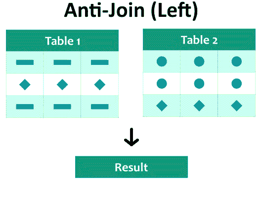

反连接返回存在于一个表中而不存在于另一个表中的结果。图片由作者提供。

为了更好地理解这一点，这里还有一个例子可以在 BigQuery 上尝试。假设我们已经跟踪所有以太坊矿工的名字超过 2 年，并且我们将数据存储在两个单独的表中(2019 年和 2020 年)。我们在这里的目标是找出哪些 2019 年的矿工在 2020 年停止采矿。

```
WITH
  miner2019 AS (
    SELECT DISTINCT
      miner
    FROM
      `bigquery-public-data.crypto_ethereum.blocks`
    WHERE
      DATE(timestamp) BETWEEN '2019-01-01' AND '2019-12-31'
  ),
  miner2020 AS (
    SELECT DISTINCT
      miner
    FROM
      `bigquery-public-data.crypto_ethereum.blocks`
    WHERE
      DATE(timestamp) BETWEEN '2020-01-01' AND '2020-12-31'
  )
```

如果我们拿出 2019 年矿工的名单，然后如果他们的名字出现在 2020 年的名单中，就把他们的名字去掉，那么我们应该会得到一份停止采矿的矿工名单。这是可以应用反连接的许多场景之一。不管是好是坏，我们有很多方法可以编写反联接子句。

*   `LEFT JOIN`方法
*   `NOT EXISTS`方法
*   `NOT IN`法
*   `EXCEPT DISTINCT`方法

语法如下:-

```
# LEFT JOIN METHOD
SELECT
  a.miner
FROM
  miner2019 a
LEFT JOIN
  miner2020 b ON a.miner = b.miner
WHERE
  b.miner IS NULL # NOT EXISTS METHOD
SELECT
  a.miner
FROM
  miner2019 a
WHERE NOT EXISTS
  (SELECT b.miner FROM miner2020 b WHERE a.miner = b.miner) # NOT IN METHOD
SELECT
  a.miner
FROM
  miner2019 a
WHERE
  a.miner NOT IN
    (SELECT miner FROM miner2020) # EXCEPT DISTINCT METHOD
SELECT
  a.miner
FROM
  miner2019 a
EXCEPT DISTINCT
SELECT
  b.miner
FROM
  miner2020 b
```

所有这些方法都将返回相同的结果(大约 491 个矿工)，因为底层逻辑是相同的。这两种方法之间的唯一区别是它们触发不同的查询计划——一些比另一些更有效。以科学的名义，我在禁用缓存的情况下对每个方法运行了 5 次，并记录了查询性能。这是我的发现


反连接的不同写作风格比较。图片由作者提供。

大多数方法都有相似的性能，除了`NOT IN`方法，它有几乎两倍的槽时间和字节混洗。

好吧，真糟糕。根据我的经验，`NOT IN`是反连接最常用的语法，因为它可读性强，但不幸的是，它的性能也最差。

出于好奇，SQLShack 在这里[花了很大力气](https://www.sqlshack.com/t-sql-commands-performance-comparison-not-vs-not-exists-vs-left-join-vs-except/)来讨论其性能不佳的根本原因。TLDR 版本是，`NOT IN`方法触发一些运行嵌套循环和计数操作的繁重操作，这显然是非常昂贵的。

这个故事的寓意？编写反连接时避开`NOT IN`。就我个人而言，我推荐默认使用`NOT EXIST`方法，因为它具有很高的性能，阅读起来同样直观。

# #8:尽早并经常整理你的数据。

> **最佳实践**:尽早并经常在查询中应用过滤功能，以减少数据混乱和在对最终查询结果没有贡献的无关数据上浪费计算资源。

我听起来就像一张破唱片，但伟大的建议值得重复——只要有机会，就用`SELECT DISTINCT`、`INNER JOIN`、`WHERE`、`GROUP BY`或任何其他过滤功能整理你的数据。我们做得越早，查询的每个后续阶段的负载就越小，因此每一步的性能增益都是复合的。

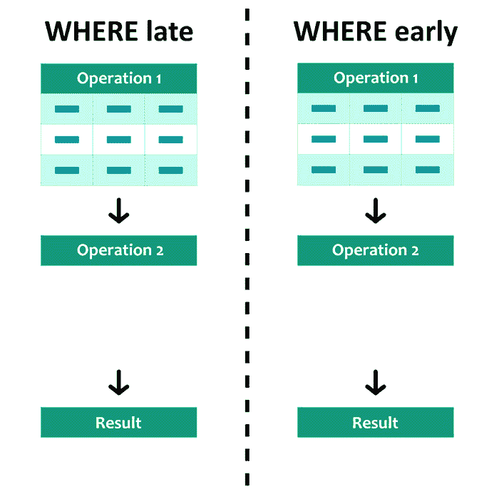

尽早整理无关数据可以节省下游的计算资源。图片由作者提供。

例如，如果我们想知道每个 GitHub 存储库的受欢迎程度，我们可以查看(I)浏览量和(ii)提交量。为了提取数据，我们可以`JOIN`表`repos`和`commits`然后用`GROUP BY`合计计数。

```
# Not OptimizedWITH
  cte_repo AS (
    SELECT
      repo_name,
      watch_count
    FROM
      `bigquery-public-data.github_repos.sample_repos`
    ),
  cte_commit AS (
    SELECT
      repo_name,
      `commit`
    FROM
      `bigquery-public-data.github_repos.sample_commits`
  )SELECT
  r.repo_name,
  r.watch_count,
  COUNT(c.commit) AS commit_count
FROM
  cte_repo r
LEFT JOIN
  cte_commit c ON r.repo_name = c.repo_name
GROUP BY
  1,2-----------------------
Elapsed Time   : 3s
Slot Time      : 8s
Bytes Processed: 50 MB
Bytes Shuffled : 91 MB
Bytes Spilled  : 0 B
-----------------------
```

在这个场景中，`GROUP BY`子句是在最外层的查询中执行的，所以每一行提交都是先`JOIN`到存储库。由于多个提交可以属于同一个存储库，这导致了一个指数级的大表，我们需要使用`GROUP BY`。

为了比较，我们可以在`commits`表中提前实现`GROUP BY`。

```
# OptimizedWITH
  cte_repo AS (
    SELECT
      repo_name,
      watch_count
    FROM
      `bigquery-public-data.github_repos.sample_repos`
    ),
  cte_commit AS (
    SELECT
      repo_name,
      COUNT(`commit`) AS commit_count
    FROM
      `bigquery-public-data.github_repos.sample_commits`
    GROUP BY
      1
  )SELECT
  r.repo_name,
  r.watch_count,
  c.commit_count
FROM
  cte_repo r
LEFT JOIN
  cte_commit c ON r.repo_name = c.repo_name-----------------------
Elapsed Time   : 2s
Slot Time      : 5s
Bytes Processed: 50 MB
Bytes Shuffled : 26 MB
Bytes Spilled  : 0 B
-----------------------
```

当我们提前 T13 时，我们看到时隙和字节混洗有了巨大的改进。这是因为所有提交都从 672，000 条记录压缩为 6 条记录，因此需要移动的数据更少。

下面是用于比较的查询计划。对于上下文，在`repos`和`commits`表中分别有 400，000 和 672，000 条记录。

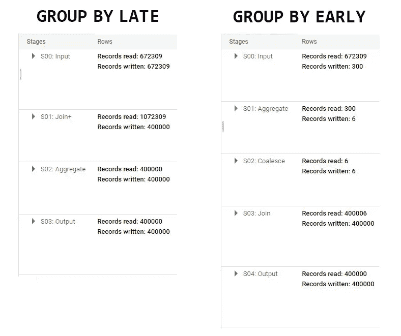

使用 GROUP BY early 可以大大减少读取的记录和写入的记录。截图摘自 [BigQuery](https://console.cloud.google.com/bigquery) ，由作者编辑。

尽可能随时随地整理数据。

# **#9:顺序很重要(？)**

> **推测的最佳实践:** BigQuery 假设用户已经在`WHERE`子句中提供了表达式的最佳顺序，并且不会尝试对表达式进行重新排序。您的`WHERE`子句中的表达式应该首先排序为最具选择性的表达式。[来源](https://cloud.google.com/blog/topics/developers-practitioners/bigquery-admin-reference-guide-query-optimization)。

这个建议激起了我的兴趣，因为如果它是真的，它将是最简单的实现，具有巨大的优化改进潜力。Google 声称，不仅在我们的查询中(在不同的表上)尽早使用`WHERE`很重要，而且在同一个表中`WHERE`的顺序也很重要。

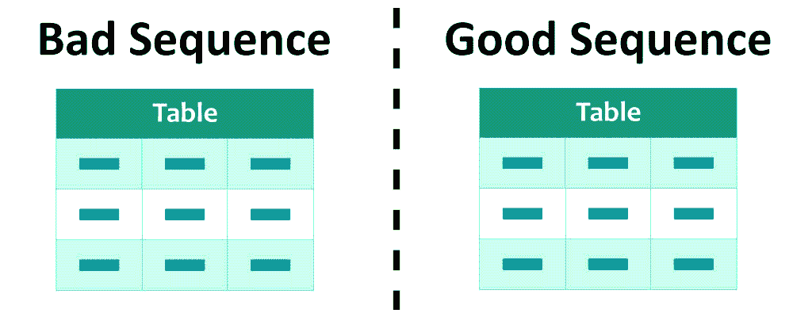

在比较子句之前先应用过滤子句是否更好？图片由作者提供。

我决定亲自测试一下。

```
# "Supposedly" Not OptimizedSELECT
  miner
FROM
  `bigquery-public-data.crypto_ethereum.blocks`
WHERE
  miner LIKE '%a%'
  AND miner LIKE '%b%'
  AND miner = '0xc3348b43d3881151224b490e4aa39e03d2b1cdea'-----------------------
Elapsed Time   : 7s
Slot Time      : 85s
Bytes Processed: 615 MB
Bytes Shuffled : 986 KB
Bytes Spilled  : 0 B
-----------------------
```

在我们使用的三个`WHERE`子句中，`LIKE`操作符是运行成本很高的字符串比较操作，而`=`操作符选择了一个非常具体的挖掘器，这大大减少了相关行的数量。

在理想状态下，`=`操作符将在其他两个操作符之前执行，因此昂贵的`LIKE`操作将只在剩余行的子集上执行。

如果`WHERE` do 的顺序很重要，那么上述查询的性能无疑会比以`=`操作符为第一操作符的类似查询差。

```
# "Supposedly" OptimizedSELECT
  miner
FROM
  `bigquery-public-data.crypto_ethereum.blocks`
WHERE
  miner = '0xc3348b43d3881151224b490e4aa39e03d2b1cdea'
  AND miner LIKE '%a%'
  AND miner LIKE '%b%'-----------------------
Elapsed Time   : 8s
Slot Time      : 92s
Bytes Processed: 615 MB
Bytes Shuffled : 986 KB
Bytes Spilled  : 0 B
-----------------------
```

但是看起来，两个查询的槽时间和字节数是相当的，这表明 BigQuery 的 SQL 优化器足够聪明，可以运行最具选择性的`WHERE`子句，而不管我们如何编写查询。这也得到了大多数 StackOverflow 答案的支持，比如这里的、这里的和这里的。

从我收集的信息来看，我们的`WHERE`子句的顺序在大多数时候并不重要，除非在极端的极端情况下，如来自 [StackOverflow](https://stackoverflow.com/questions/642784/does-the-order-of-columns-in-a-where-clause-matter) 的“注册用户”(是的，那是他的用户名)所指出的。

*   如果查询中有大量的表(10 个或更多)。
*   如果你的`WHERE`子句中有几个`EXISTS`、`IN`、`NOT EXISTS`或`NOT IN`语句
*   如果使用嵌套 CTE(公共表表达式)或大量 cte。
*   如果您的`FROM`子句中有大量子查询。

虽然这可能不会影响我们的查询性能，但我认为为了以防万一，按重要性顺序排列我们的`WHERE`子句不会有什么坏处。

# #10:利用分区和/或集群。

> **最佳实践:**在大于 1 GB 的表上使用分区和集群来对数据进行分段和排序。对分区键或簇键应用筛选器可以显著减少数据扫描。[来源](https://cloud.google.com/blog/topics/developers-practitioners/bigquery-admin-reference-guide-query-optimization)。

查询一个巨大的数据集是一件痛苦的事情，因为它占用大量的资源，而且速度非常慢。为了提高可用性，将大型数据集分成多个较小数据集的数据库并不少见(例如:sales_jan2022、sales_feb2022、sales _ mar 2022……)。虽然这种方法避免了缺点，但它是以必须处理管理所有拆分表的逻辑噩梦为代价实现的。

这就把我们带到了 BigQuery 的分区表。在功能上，分区允许我们查询较大表的子集，而不必将它分成单独的较小的表。我们得到了性能，但没有缺点。

```
CREATE TABLE database.zoo_partitioned
PARTITION BY zoo_name AS
  (SELECT *
   FROM database.zoo)
```

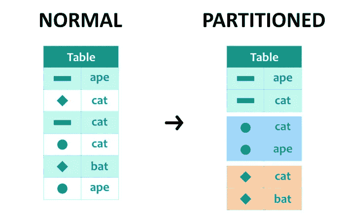

分区将一个大表分解成更小的块。图片由作者提供。

当我们对一个分区表运行查询时，BigQuery 将过滤掉存储中不相关的分区，这样我们将只扫描指定的分区，而不是全表扫描。

在与分区相同的并行中，我们还可以使用*集群*将数据细化为更小的块。

```
CREATE TABLE database.zoo_clustered
CLUSTER BY animal_name AS
  (SELECT *
   FROM database.zoo)
```


“animal_name”列上的聚类表。群集键指向块，但不指向特定的行。图片由作者提供。

聚集表根据我们选择的列将数据分类成块，然后通过聚集索引跟踪数据。在查询过程中，聚集索引指向包含数据的块，因此允许 BigQuery 跳过不相关的块。扫描时跳过不相关块的过程称为*块修剪*。

这个概念类似于一个图书图书馆——当书架根据流派组织起来时，我们可以很容易地找到我们想要的书。

虽然一个重要的区别是它不指向确切的行，而只指向块。有趣的是，BigQuery 不一定要为聚集列中的每个不同值创建一个块。换句话说，当我们搜索特定值时，BigQuery 不会为 1000 个唯一值创建 1000 个块，并节省 99%的字节扫描。根据经验，Google 推荐至少 1 GB 的集群表，因为该算法可以将高基数数据分组到更好的块中，这最终会使集群表更有效。

最终，分区和集群都有助于减少 BigQuery 需要扫描的字节数。由于需要扫描的字节更少，查询运行起来更便宜、更快。

```
CREATE TABLE database.zoo_partitioned_and_clustered
PARTITION BY zoo_name
CLUSTER BY animal_name AS
  (SELECT *
   FROM database.zoo)
```

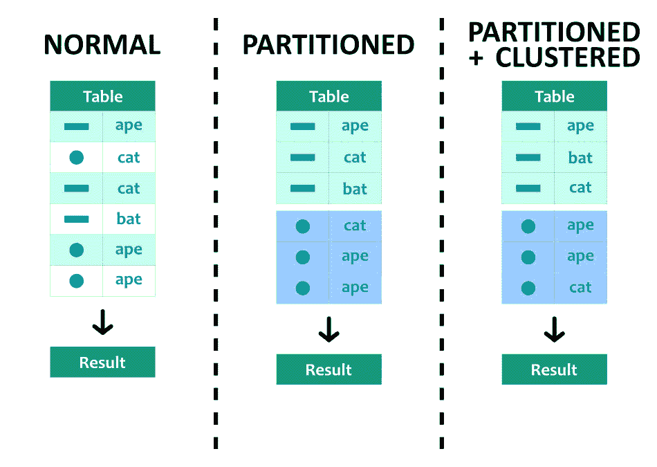

分区和集群可以一起使用，以获得更好的性能。图片由作者提供。

请注意，分区和集群不一定是互斥的。对于大型表，将两者结合使用是非常有意义的，因为它们的效果可以复合。考虑`bigquery-public-data.wikipedia.pageviews_2022`，一个分区和聚集的表。

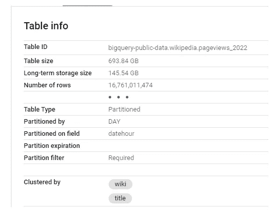

我们可以参考“Table Details”选项卡来验证表是分区的还是集群的。截图摘自 [BigQuery](https://console.cloud.google.com/bigquery) ，由作者编辑。

通过参考 big query UI 的详细信息页面，我们可以看到该表由`datehour`列划分，并由`wiki`和`title`列聚集。它看起来和感觉上就像一个普通的表，但是当我们过滤它的时候，真正的奇迹发生了。

```
# OptimizedSELECT
  title
FROM
  `bigquery-public-data.wikipedia.pageviews_2022`
WHERE
  DATE(datehour) = '2022-01-01'
  AND title = 'Kinzie_Street_railroad_bridge'-----------------------
Elapsed Time   : 1s
Slot Time      : 27s
Bytes Processed: 1.3 GB
Bytes Shuffled : 408 B
Bytes Spilled  : 0 B
-----------------------
```

当我应用一个`WHERE`语句来过滤它的分区`datehour`时，处理的字节从 483 GB 减少到只有 4 GB。如果我在`title`集群上添加另一个过滤器，它会进一步下降到 1.3 GB。我们只需支付 0.0065 美元，而不是 2.4 美元。如果这还不划算，我不知道什么才划算。

# #11:将 ORDER BY 推到查询的末尾(？)

> **推测的最佳实践:**仅在最外层查询或窗口子句(分析函数)中使用`ORDER BY`。[来源](https://cloud.google.com/bigquery/docs/best-practices-performance-compute#order_query_operations_to_maximize_performance)。

`ORDER BY`一直是一个资源密集型操作，因为它需要比较所有行，并按顺序组织它们。

之所以建议延迟使用`ORDER BY`直到最外层的查询，是因为表在查询开始时往往会更大，因为它们还没有经过从`WHERE`或`GROUP BY`子句的任何修剪。表越大，需要做的比较就越多，因此性能就越慢。

此外，如果我们使用`ORDER BY`纯粹是为了提高数据的可读性，那么就没有必要在早期对它们进行排序，因为数据的排序可能会在下游被扭曲。

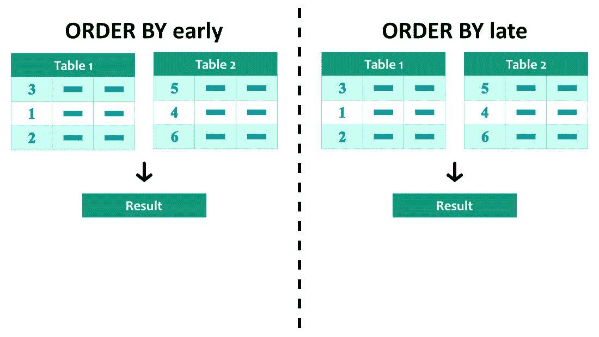

不必要地使用 ORDER BY 会增加计算负载。图片由作者提供。

例如，下面的查询有针对`cte_blocks`和`cte_contracts`的`ORDER BY`子句，但是它们没有实际用途，因为我们在这里没有计算任何顺序关系(前一行对下一行)。不仅如此，最外层查询中的`ORDER BY`无论如何都会覆盖之前的排序。

```
# "Supposedly" Not OptimizedWITH
  cte_blocks AS (
    SELECT
      *
    FROM
      `bigquery-public-data.crypto_ethereum.blocks`
    WHERE
      DATE(timestamp) BETWEEN '2021-03-01' AND '2021-03-31'
    ORDER BY
      1,2,3,4,5,6
  ),
  cte_contracts AS (
    SELECT
      *
    FROM
      `bigquery-public-data.crypto_ethereum.contracts`
    WHERE
      DATE(block_timestamp) BETWEEN '2021-03-01' AND '2021-03-31'
    ORDER BY
      1,2,4,5,6,7
  )SELECT
  *
FROM
  cte_blocks b
LEFT JOIN
  cte_contracts c ON c.block_number = b.number
ORDER BY
  size,
  block_hash-----------------------
Elapsed Time   : 14s
Slot Time      : 140s
Bytes Processed: 865 MB
Bytes Shuffled : 5.8 GB
Bytes Spilled  : 0 B
-----------------------
```

为了比较，我们从两个`cte_tables`中删除了无意义的`ORDER BY`子句，并再次运行查询。

```
# "Supposedly" OptimizedWITH
  cte_blocks AS (
    SELECT
      *
    FROM
      `bigquery-public-data.crypto_ethereum.blocks`
    WHERE
      DATE(timestamp) BETWEEN '2021-03-01'
      AND '2021-03-31'
  ),
  cte_contracts AS (
    SELECT
      *
    FROM
      `bigquery-public-data.crypto_ethereum.contracts`
    WHERE
      DATE(block_timestamp) BETWEEN '2021-03-01' AND '2021-03-31'
  )SELECT
  *
FROM
  cte_blocks b
LEFT JOIN
  cte_contracts c ON c.block_number = b.number
ORDER BY
  size,
  block_hash-----------------------
Elapsed Time   : 14s
Slot Time      : 145s
Bytes Processed: 865 MB
Bytes Shuffled : 5.8 GB
Bytes Spilled  : 0 B
-----------------------
```

根据我们到目前为止建立的逻辑，前一个查询应该运行得慢得多，因为它需要对多个列执行额外的`ORDER BY`子句，但是令我惊讶的是，这两个查询在性能上的差异可以忽略不计——140 秒对 145 秒。

这有点违反直觉，但是进一步深入执行细节会发现，无论我们如何编写查询，两个查询都只运行最外层查询中的`ORDER BY`。


查询计划告诉我们为查询执行的确切步骤。在这两种情况下，我只能找到两个 ORDER BY 操作符，并且它们都在最外层的查询中。截图摘自 [BigQuery](https://console.cloud.google.com/bigquery) ，由作者编辑。

事实证明，万能的 BigQuery 的 SQL 优化器再一次足够聪明，能够找出冗余子句，并自动将它们从计算中排除。

尽管在这里包含多余的`ORDER BY`子句是无害的，但是我们应该总是删除不必要的`ORDER BY`子句，并尽可能地在查询中延迟它们。因为尽管 BigQuery SQL Optimizer 令人印象深刻，但其他一些遗留数据库可能不具备同样的能力。

# #12:延迟资源密集型操作。

> **最佳实践:**将复杂操作，如正则表达式和数学函数推到查询的末尾。[来源](https://cloud.google.com/bigquery/docs/best-practices-performance-compute#order_query_operations_to_maximize_performance)。

扩展与延迟`ORDER BY`语句相同的理念，我们希望将复杂的函数尽可能地推到查询中，以避免计算我们最终将丢弃的数据。

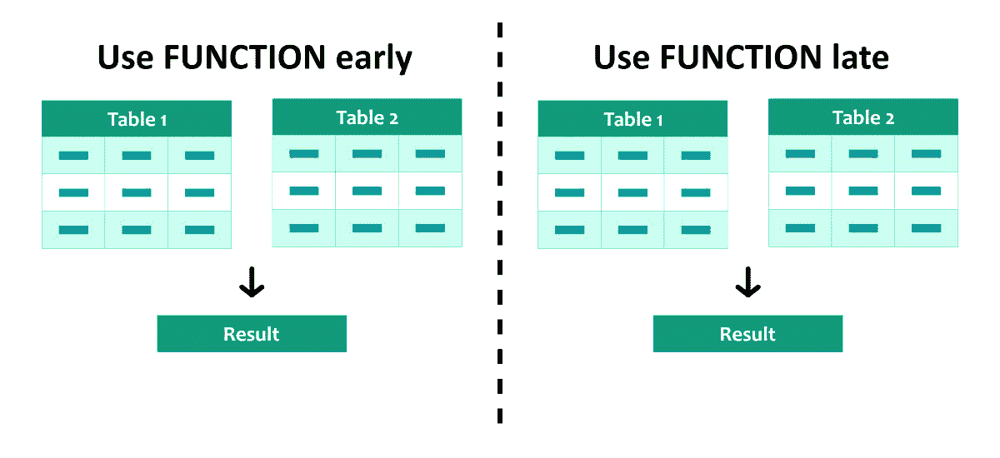

将资源密集型操作延迟到查询末尾可以提高性能。图片由作者提供。

这适用于任何函数，比如`LOWER()`、`TRIM()`、`CAST()`，但是我们将重点放在正则表达式和数学函数上，比如`REGEXP_SUBSTR()`和`SUM()`，因为它们往往会消耗更多的资源。

为了展示影响，我将在查询的早期运行`REGEXP_REPLACE()`,而不是在后期。

```
# Not OptimizedWITH
  cte_repo AS (
    SELECT
      REGEXP_REPLACE(repo_name, r"(.*)", "\\1") AS repo_name
    FROM
      `bigquery-public-data.github_repos.sample_repos`
    ),
  cte_commit AS (
    SELECT
      REGEXP_REPLACE(repo_name, r"(.*)", "\\1") AS repo_name
    FROM
      `bigquery-public-data.github_repos.sample_commits`
  )SELECT
  r.repo_name,
  c.repo_name
FROM
  cte_repo r
INNER JOIN
  cte_commit c ON r.repo_name = c.repo_name-----------------------
Elapsed Time   : 2s
Slot Time      : 8s
Bytes Processed: 20 MB
Bytes Shuffled : 68 MB
Bytes Spilled  : 0 B
-----------------------
```

随后，我们再次运行相同的查询，只是在将两个初始表连接在一起之后，我们只调用最终表中的`REGEXP_REPLACE()`。

```
# OptimizedWITH
  cte_repo AS (
    SELECT
      repo_name
    FROM
      `bigquery-public-data.github_repos.sample_repos`
    ),
  cte_commit AS (
    SELECT
      repo_name
    FROM
      `bigquery-public-data.github_repos.sample_commits`
  )SELECT
  REGEXP_REPLACE(r.repo_name, r"(.*)", "\\1") AS repo_name,
  REGEXP_REPLACE(c.repo_name, r"(.*)", "\\1") AS repo_name
FROM
  cte_repo r
INNER JOIN
  cte_commit c ON r.repo_name = c.repo_name-----------------------
Elapsed Time   : 2s
Slot Time      : 3s
Bytes Processed: 20 MB
Bytes Shuffled : 56 MB
Bytes Spilled  : 0 B
-----------------------
```

就这样，槽时间从 8s 提高到 3s，而字节混洗从 68 MB 下降到 56 MB。

# #13:使用搜索()。

谷歌最近发布了一个预览版的`[SEARCH()](https://cloud.google.com/blog/products/data-analytics/pinpoint-unique-elements-with-bigquery-search-features)`功能，该功能将文本数据标记化，使得找到隐藏在非结构化文本和半结构化`JSON`数据中的数据变得异常容易。


SEARCH()函数允许我们搜索相关的关键字，而不必了解底层的数据模式。图片由作者提供。

传统上，在处理嵌套结构时，我们需要提前理解表模式，然后在运行组合的`WHERE`和`REGEXP`子句来搜索特定的术语之前，用`UNNEST()`适当地展平任何嵌套数据。这些都是计算密集型运算符。

```
# Not OptimizedSELECT
  `hash`,
  size,
  outputs
FROM
  `bigquery-public-data.crypto_bitcoin.transactions`
CROSS JOIN
  UNNEST(outputs)
CROSS JOIN
  UNNEST(addresses) AS outputs_address
WHERE
  block_timestamp_month BETWEEN "2009-01-01" AND "2010-12-31"
  AND REGEXP_CONTAINS(outputs_address, '1LzBzVqEeuQyjD2mRWHes3dgWrT9titxvq')-----------------------
Elapsed Time   : 6s
Slot Time      : 24s
Bytes Processed: 282 MB
Bytes Shuffled : 903 B
Bytes Spilled  : 0 B
-----------------------
```

我们可以用一个`SEARCH()`函数来简化语法，而不是让它们过于复杂。

```
# OptimizedSELECT
  `hash`,
  size,
  outputs
FROM
  `bigquery-public-data.crypto_bitcoin.transactions`
WHERE
  block_timestamp_month BETWEEN "2009-01-01" AND "2010-12-31"
  AND SEARCH(outputs, ‘`1LzBzVqEeuQyjD2mRWHes3dgWrT9titxvq`’)-----------------------
Elapsed Time   : 6s
Slot Time      : 24s
Bytes Processed: 87 MB
Bytes Shuffled : 903 B
Bytes Spilled  : 0 B
-----------------------
```

我们甚至可以为该列创建一个搜索索引，以支持点查找文本搜索。

```
# To create the search index over existing BQ table
CREATE SEARCH INDEX my_logs_index ON my_table (my_columns);
```

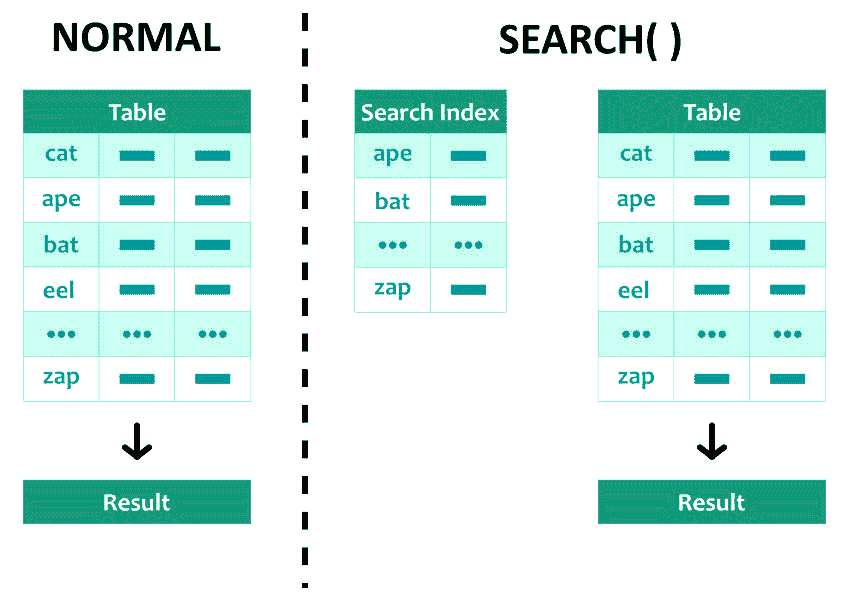

搜索索引指向所需记录的位置。图片由作者提供。

如您所见，`SEARCH()`是一种极其强大、简单且经济的点查找文本搜索方式。如果您的用例需要在非结构化数据中搜索非常具体的术语(例如:日志分析)，请使用`SEARCH()`进行优先排序。

# #14:利用缓存。

BigQuery 为我们的查询提供了一个免费的、完全托管的缓存特性。当我们执行查询时，BigQuery 会自动将查询结果缓存到一个临时表中，该表可以保存长达 24 小时。我们可以通过编辑器 UI 上的查询设置来切换该特性。

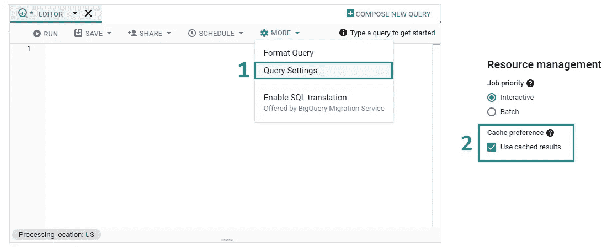

默认情况下，缓存功能处于启用状态，但可以关闭。截图摘自 [BigQuery](https://console.cloud.google.com/bigquery) ，由作者编辑。

当触发重复查询时，BigQuery 返回缓存的结果，而不是重新运行查询，为我们节省了额外的费用和计算时间。

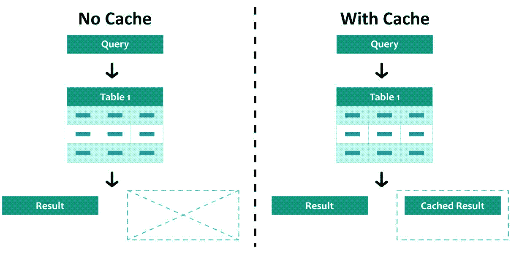

缓存结果作为临时表存储长达 24 小时，以便在需要时重用。图片由作者提供。

我们可以通过在运行查询后检查“作业信息”来验证缓存的结果是否被使用。处理的字节应该显示“0 B(结果缓存)”。

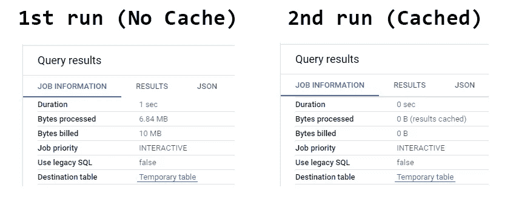

使用缓存的结果是免费的。截图摘自 [BigQuery](https://console.cloud.google.com/bigquery) ，由作者编辑。

在我们一有机会就疯狂地发出查询之前，重要的是要知道不是所有的查询都会被缓存。BigQuery 在这里概述了异常。值得注意的一些更重要的问题是

*   当查询使用非确定性函数时，例如`CURRENT_TIMESTAMP()`，它不会被缓存，因为它会根据查询的执行时间返回不同的值。
*   当查询引用的表接收到流插入时，因为对表的任何更改都会使缓存的结果无效。
*   如果使用通配符[查询多个表。](https://cloud.google.com/bigquery/docs/querying-wildcard-tables)

# 结束语

虽然这不是所有优化技巧和诀窍的详尽列表，但我希望这是一个良好的开端。如果我错过了任何重要的技术，请评论，因为我打算继续添加到这个列表中，这样我们都可以有一个简单的参考点。

祝你好运，一帆风顺。