# 用 Python 最大化聚类散点图

> 原文：<https://towardsdatascience.com/19-examples-of-merging-plots-to-maximize-your-clustering-scatter-plot-87e8f1bb5fd2>

## 混合搭配图，从散点图中获取更多信息


照片由[马扬·布兰](https://unsplash.com/@marjan_blan) 在 [Unsplash](https://unsplash.com/?utm_source=medium&utm_medium=referral) 上拍摄

我是超级英雄电影的超级粉丝。通常，许多超级英雄拥有非凡的能力、身体或力量。然而，有些超级英雄只是普通的家伙，比如[托尼·斯塔克](https://en.wikipedia.org/wiki/Iron_Man)(又名钢铁侠)。

让他成为超级英雄的是钢铁侠的盔甲。通过装备，他可以做更多的事情，如飞行或使用单梁。

和钢铁侠一样，在数据可视化中，给一个图表添加更多的组件，可以给用户提供更多的信息。从理论上讲，每种图表都有其用图形或数字表示数据的目的。组合图表的特征可能会增强结果。

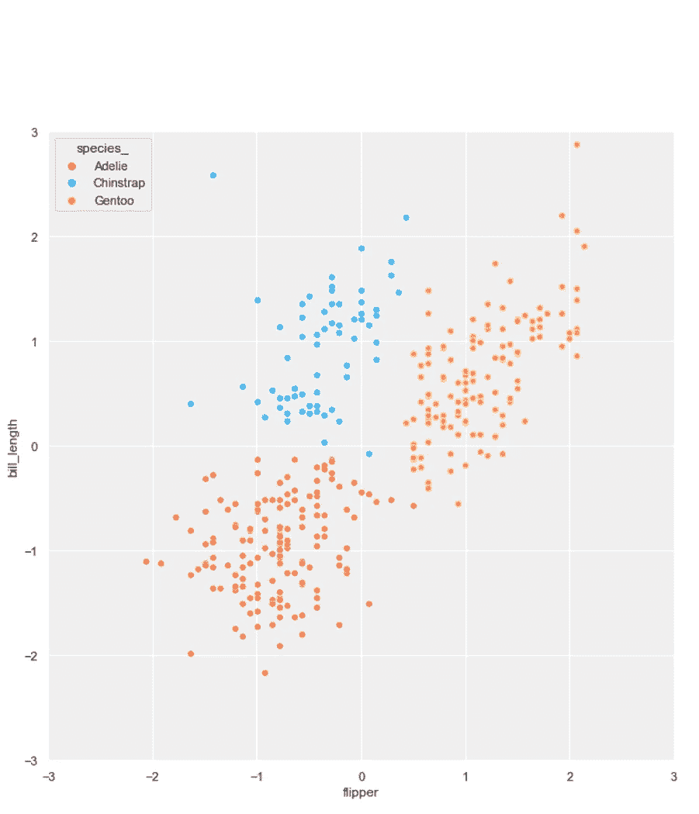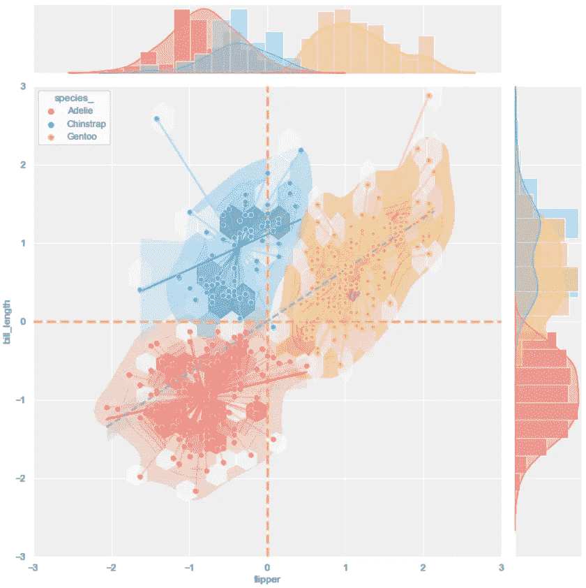

第一张图片是一个基本的散点图。第二幅图显示了将散点图与其他图合并以提取更多信息的结果。作者图片。

散点图是一个简单的图表，它使用[笛卡尔坐标](https://en.wikipedia.org/wiki/Cartesian_coordinate_system)来显示通常两个连续变量的值。该图表通常用于显示某些[聚类分析](https://en.wikipedia.org/wiki/Cluster_analysis)的结果，因为它可以展示数据点的位置并帮助区分每个聚类。

为了改进聚类散点图，本文将指导如何添加不同类型的图来提供更多信息。

# 检索数据

从导入库开始。

```
import numpy as np
import pandas as pd
import matplotlib.pyplot as plt
import seaborn as sns%matplotlib inline
```

例如，我将使用可以直接从 Seaborn 库下载的[企鹅的](https://github.com/mwaskom/seaborn-data)数据集。该数据集包含三种企鹅的数据，阿德利企鹅、下巴颏企鹅和巴布亚企鹅。

获取企鹅数据集

```
df_pg = sns.load_dataset('penguins', cache=True, data_home=None)
df_pg.head()
```

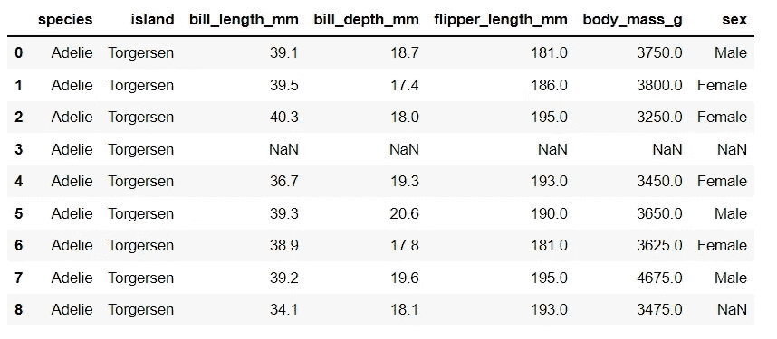

使用 describe()浏览数据集

```
df_pg.describe()
```


作为一个简单的例子，我将创建一个散点图使用脚蹼和法案的长度值。如果您想使用不同的变量对或其他数据集，请随意修改下面的代码。

在上面的探索步骤中，可以注意到每个变量都有不同的范围。在绘图之前，让我们用[标准缩放器](https://scikit-learn.org/stable/modules/generated/sklearn.preprocessing.StandardScaler.html)缩放数值。


下面的三种颜色将用于可视化每个集群。


```
color_dict = {'Adelie':'#F65E5D',
              'Chinstrap':'#3AB4F2',
              'Gentoo':'#FFBC46'}
```

# 使聚集

本文将使用 [k 均值聚类](https://en.wikipedia.org/wiki/K-means_clustering)。这种无监督算法应用矢量量化将具有最近平均值([质心](https://en.wikipedia.org/wiki/Centroid))的 *n* 个数据点划分为 *k* 个簇。

还有其他聚类方法，如 MeanShift、DBSCAN 等。如果你想尝试不同的算法，更多方法可以在这里[找到](https://scikit-learn.org/stable/modules/clustering.html)。

使用 [sklearn](https://scikit-learn.org/stable/modules/generated/sklearn.cluster.KMeans.html#sklearn.cluster.KMeans) 应用 K 均值聚类


根据聚类结果绘制散点图。


散点图显示对数据集应用 K 均值聚类的结果。图片由作者提供。

# 选择要合并的图的类型

在这一节中，我将解释散点图和其他可以合并的图，以及如何创建它们。总的来说，我们将处理五个地块:

*   散点图
*   KDE 图
*   赫克宾图
*   线形图
*   回归图

## **散点图**

为了使散点图与其他图完美匹配，我们将使用 [seaborn jointplot](https://seaborn.pydata.org/generated/seaborn.jointplot.html) ，其中可以设置“kind”参数以获得不同的数据可视化。通过这样做，我们可以控制输出格式。此外，还有一个选项显示[边缘轴](https://www.python-graph-gallery.com/82-marginal-plot-with-seaborn)上两个变量之间的关系。

让我们从创建散点图的三个版本开始，以便稍后轻松分层。前两个图没有边缘轴，一个有背景，另一个有透明背景。最后一个图是带有透明背景的边缘轴。

请考虑将结果导出到您的计算机上，以便以后导入。

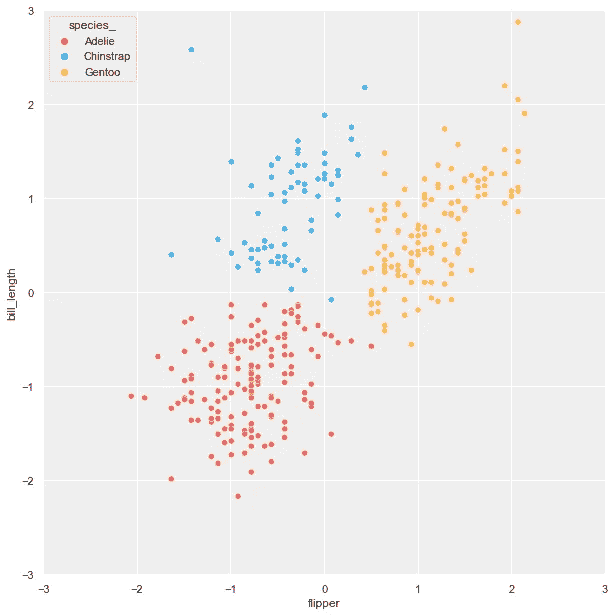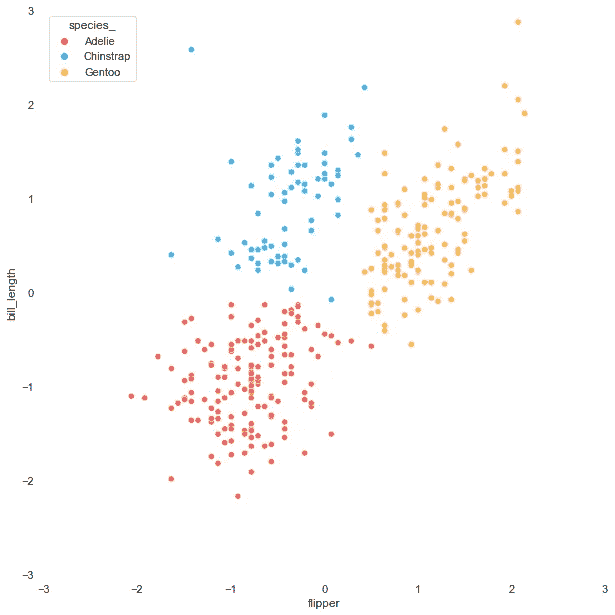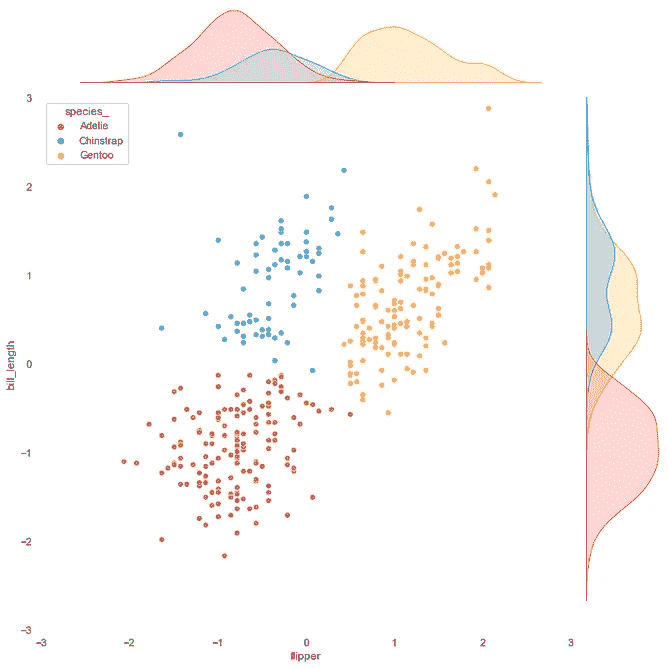

用作背景或覆盖图的散点图。作者图片。

## **KDE 剧情**

理论上，核密度估计(KDE)是一种使用[核函数](https://en.wikipedia.org/wiki/Kernel_(statistics)#Kernel_functions_in_common_use)来估计未知概率密度函数的方法。KDE 图通过显示一维或多维的连续概率密度曲线来可视化数据。

KDE 的优点是绘制的图不那么杂乱，更容易理解，尤其是在绘制多个分布图时。但是，如果基础分布是有界的或不平滑的，它会引入失真。

像散点图一样，我们将创建三个不同的 KDE 图，供以后用作背景或覆盖图。对于具有透明背景的版本，我们将使 KDE 图填充和不填充颜色。

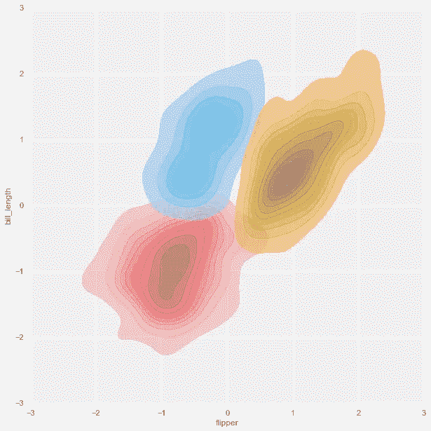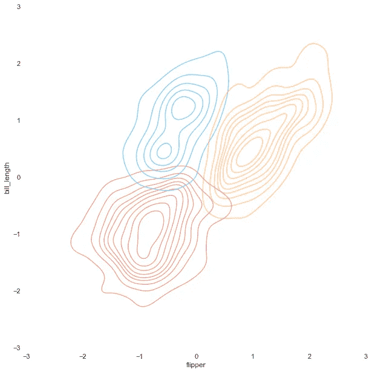

用作背景或覆盖图的核密度估计(KDE)图。作者图片。

## 赫克宾图

一个 [hexbin 图](https://seaborn.pydata.org/examples/hexbin_marginals.html)是一个有用的数据可视化，它应用几个六边形来划分区域，并使用颜色渐变来表示每个六边形的数据点数量。

首先，我们需要单独创建每个聚类的 hexbin 图，并用透明背景保存每个图。最后一步是合并它们。

```
Image.open('hex_tr.png')
Image.open('j_hex_tr.png')
```

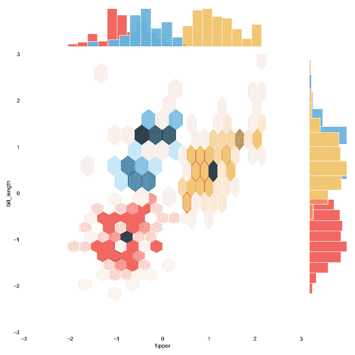

第一张图片:透明背景的 hexbin 图。第二个图像:具有透明背景和边缘轴的 hexbin 图。作者图片。

## 线形图

K-means 算法是一种基于[质心的聚类](https://en.wikipedia.org/wiki/Cluster_analysis#Centroid-based_clustering)，其中每个聚类都有自己的质心。显示质心的位置可以更深入地了解散点图。

我发现了这篇实用且有帮助的文章[使用 Python 的 Matplotlib](/visualizing-clusters-with-pythons-matplolib-35ae03d87489) 可视化集群，它演示并推荐了将数据点与每个集群质心连接起来的方法。此外，文章还建议显示平均线，这有助于解释结果。

让我们从每个数据点到它的质心画一些线，并创建参考线来显示每个轴上的平均值。在开始绘制线条之前，我们需要获得质心值。

```
x_avg = df_std['flipper'].mean()
y_avg = df_std['bill_length'].mean()centroids = [list(i) for i in list(kmeans.cluster_centers_)]
centroids#output:
#[[-0.8085020383937745, -0.9582361857580423],
# [-0.37008778973321976, 0.938075318440887],
# [1.1477907585857148, 0.6665893202302959]]
```

画出线条

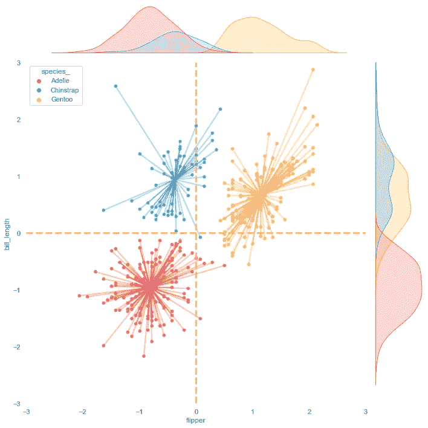

第一个图像:将数据点连接到质心和平均线的线图。第二个图像:具有边缘轴的第一个图像。作者图片。

## 回归图

本文的目的是最大化散点图信息。得到每个聚类的结果后，我们可以更进一步，绘制每组的[线性回归线](https://en.wikipedia.org/wiki/Simple_linear_regression)。

使用 seaborn [regplot](https://seaborn.pydata.org/generated/seaborn.regplot.html) 可以很容易地将线性回归拟合到每个聚类中。

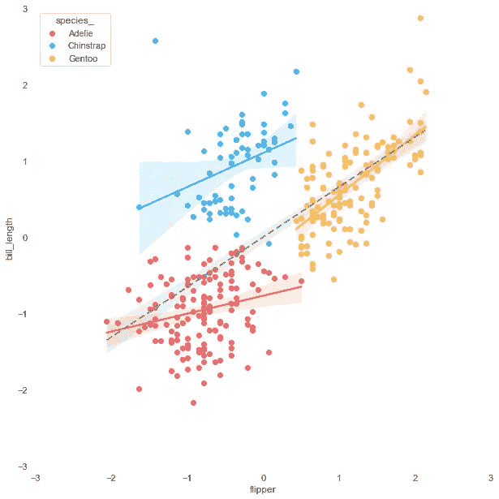

第一个图像是具有透明背景的回归图。第二个图像是具有边缘轴的第一个图像。作者图片。

# 合并图

有趣的部分来了！！为了方便合并步骤，我们将使用 Pillow 中的 [Image](https://pillow.readthedocs.io/en/stable/reference/Image.html) 定义一个函数，Pillow 是一个处理图像的有用库。

现在一切都准备好了，让我们把所有的情节结合起来。

## 合并两个图

**#1 散点图+ KDE 图**

```
background = 'kde.png'
layer_list = ['scatter_tr.png']merge_plot(background, layer_list)
```

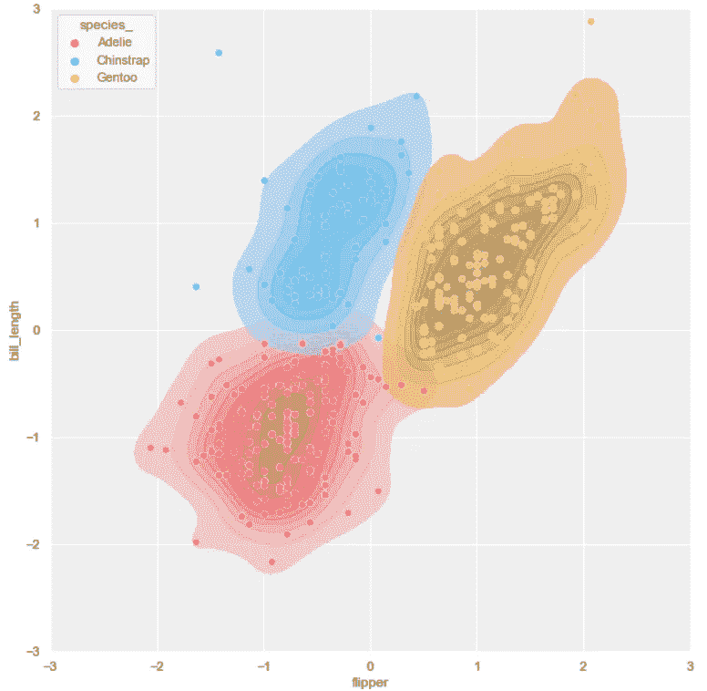

散点图+ KDE 图

**#2 散点图+赫克斯宾图**

```
background = 'scatter.png'
layer_list = ['hex_tr.png', 'scatter_tr.png']merge_plot(background, layer_list)
```


散点图+六边形图

**#3 散点图+回归图**

```
background = 'scatter.png'
layer_list = ['reg_tr.png']merge_plot(background, layer_list)
```

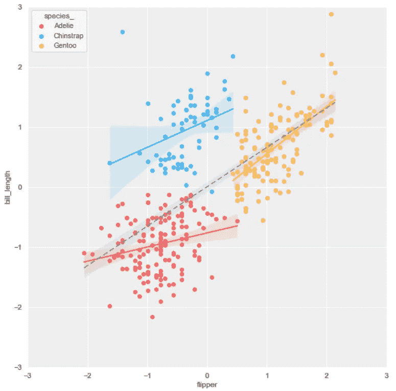

散点图+回归图

## 合并两个图(基于联合散点图)

**#4 联合散点图+ KDE 图**

```
background = ‘j_scatter.png’
layer_list = [‘kde_tr_fill.png’, ‘scatter_tr.png’]merge_plot(background, layer_list)
```

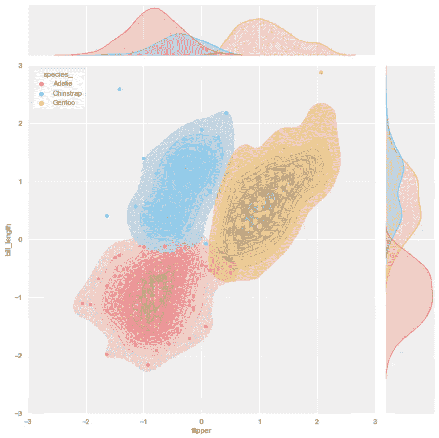

联合散点图+ KDE 图

**#5 联合散点图+ hexbin 图**

```
background = ‘j_scatter.png’
layer_list = [‘j_hex_tr.png’, ‘j_scatter_tr.png’]merge_plot(background, layer_list)
```


联合散点图+ hexbin 图

**#6 联合散点图+回归图**

```
background = ‘j_scatter.png’
layer_list = [‘reg_tr.png’]merge_plot(background, layer_list)
```


联合散点图+回归图

## 合并 3 幅图

**#7 联合散点图+ KDE 图+赫克斯宾图**

```
background = 'j_scatter.png'
layer_list = ['kde_tr.png','j_hex_tr.png', 'j_scatter_tr.png']merge_plot(background, layer_list)
```

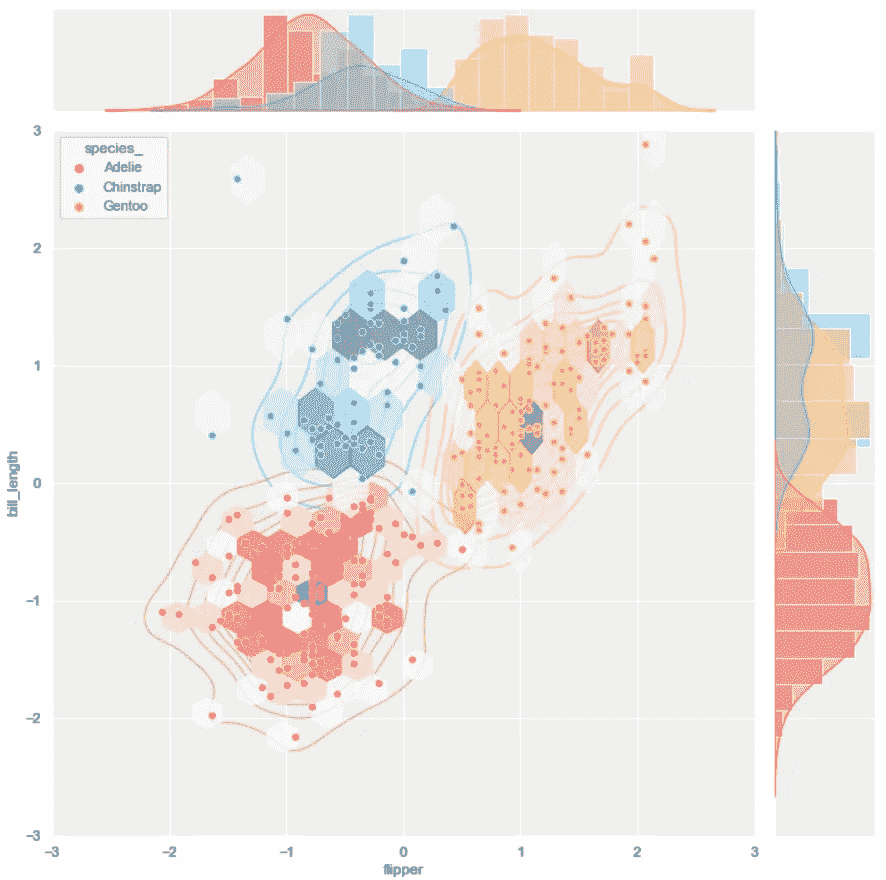

联合散点图+ KDE 图+赫克斯宾图

**#8 联合散点图+ KDE 图+回归图**

```
background = 'j_scatter.png'
layer_list = ['kde_tr_fill.png', 'reg_tr.png']merge_plot(background, layer_list)
```


联合散点图+ KDE 图+回归图

**#9 联合散点图+ hexbin 图+回归图**

```
background = 'j_scatter.png'
layer_list = ['j_hex_tr.png', 'reg_tr.png', 'j_scatter_tr.png']merge_plot(background, layer_list)
```

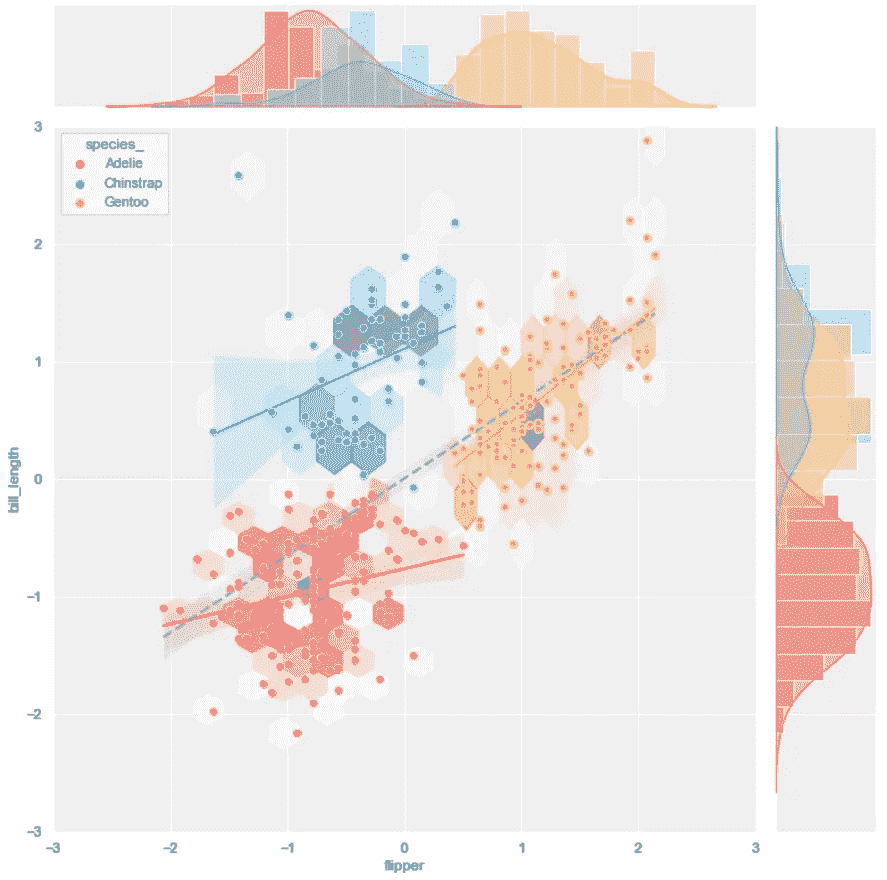

联合散点图+六边形图+回归图

**#10 联合散点图+赫克斯宾图+线图**

```
background = 'j_scatter.png'
layer_list = ['j_hex_tr.png', 'line_tr.png', 'j_scatter_tr.png']merge_plot(background, layer_list)
```

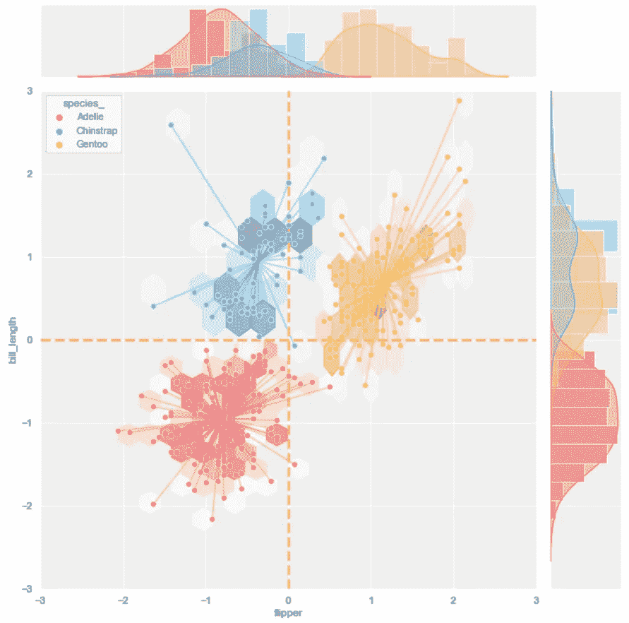

联合散点图+六边形图+线形图

## 合并 4 幅图

**#11 联合散点图+ KDE 图+赫克斯宾图+线图**

```
background = 'j_scatter.png'
layer_list = ['kde_tr.png', 'j_hex_tr.png',
              'line_tr.png', 'j_scatter_tr.png']
merge_plot(background, layer_list)
```

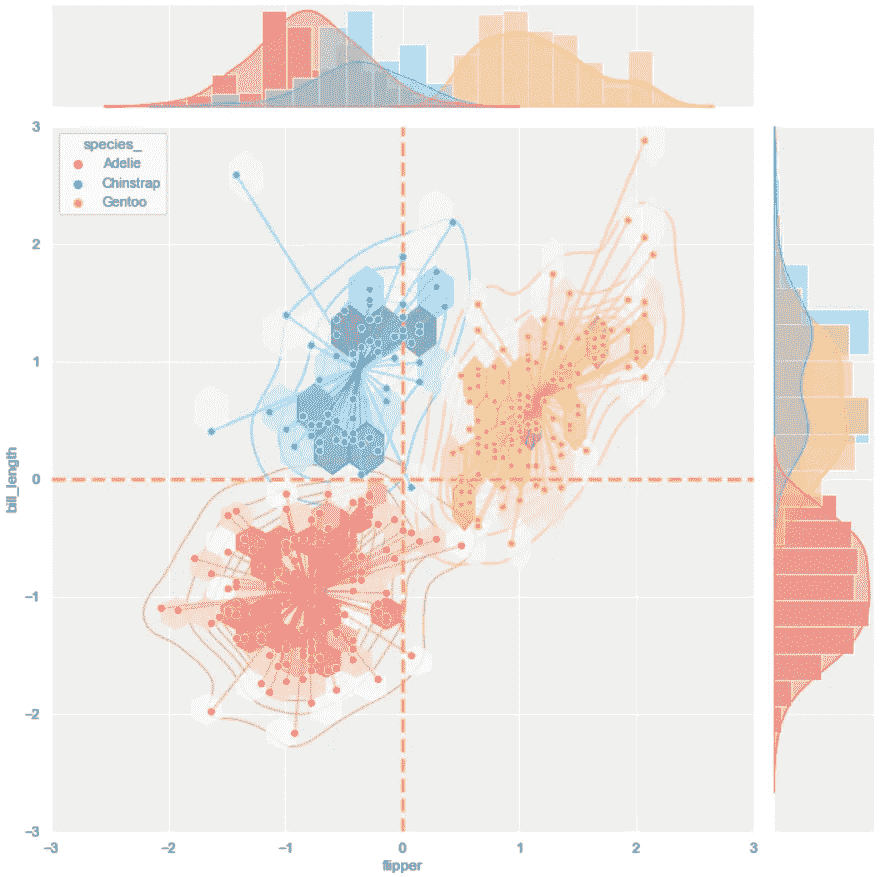

联合散点图+ KDE 图+赫克斯宾图+线图

**#12 联合散点图+ KDE 图+赫克斯宾图+回归图**

```
background = 'j_scatter.png'
layer_list = ['kde_tr.png', 'j_hex_tr.png',
              'reg_tr.png', 'j_scatter_tr.png']
merge_plot(background, layer_list)
```

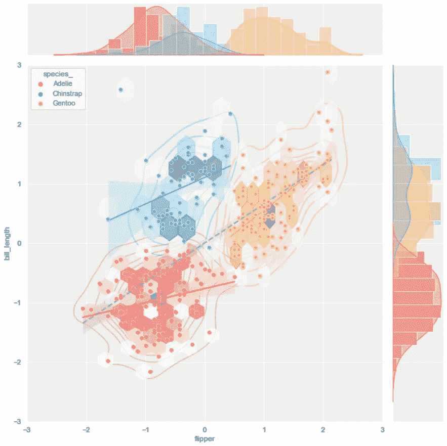

联合散点图+ KDE 图+赫克斯宾图+回归图

**#13 联合散点图+赫克斯宾图+回归图+线图**

```
background = 'j_scatter.png'
layer_list = ['j_hex_tr.png', 'reg_tr.png',
              'line_tr.png', 'j_scatter_tr.png']
merge_plot(background, layer_list)
```

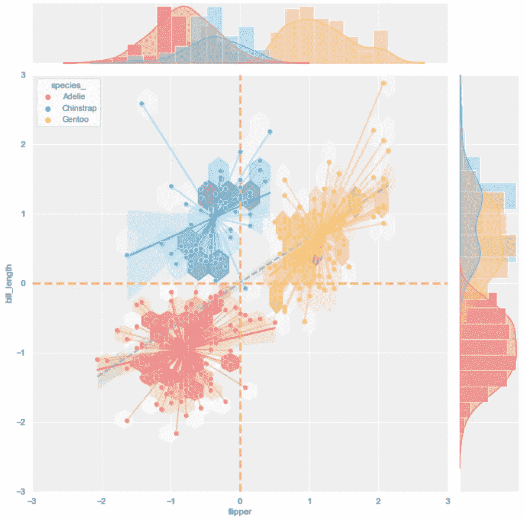

联合散点图+六边形图+回归图+线形图

## 合并 5 幅图

最后，是最后的最后组合的时候了！！

**#14 联合散点图+ KDE 图+赫克斯宾图+线形图+回归图**

```
background = 'j_scatter.png'
layer_list = ['kde_tr_fill.png', 'j_hex_tr.png', 'line_tr.png',
              'reg_tr.png', 'j_scatter_tr.png']
merge_plot(background, layer_list)
```

瞧啊。！


联合散点图+ KDE 图+赫克斯宾图+线图+回归图

**#15 联合散点图+ KDE 图+赫克斯宾图+线图(无填充颜色)+回归图**

如果前面的图太密集，让我们试试没有填充颜色的 KDE 图。

```
background = 'j_scatter.png'
layer_list = ['kde_tr.png', 'j_hex_tr.png', 'line_tr.png',
              'reg_tr.png', 'j_scatter_tr.png']
merge_plot(background, layer_list)
```

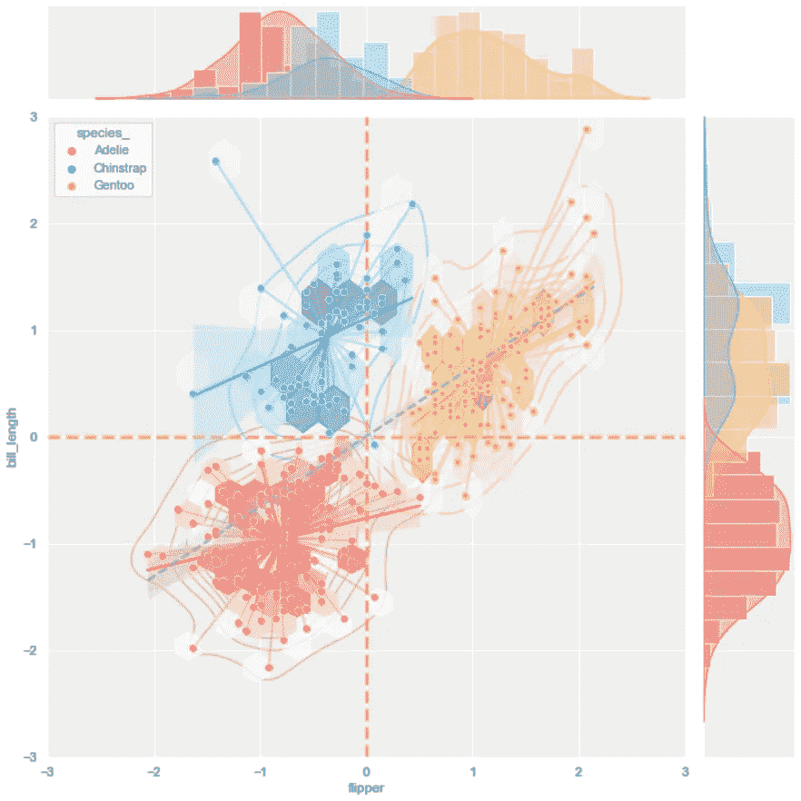

联合散点图+ KDE 图+赫克斯宾图+线图(无填充颜色)+回归图

在最后两个结果中可以看到，可以修改一些细节来改变输出。有多种方法可以合并这五个图并创建不同的结果。

# 讨论

本文旨在指导从散点图中提取更多信息的可能方法。通过将 KDE 图、赫克斯宾图、线形图和回归图这四个图合并成散点图，可以注意到更多的信息可以添加到结果中。

为了进一步改善结果，除了这里提到的图表之外，可能还有其他类型的图表可以合并到散点图中。此外，本文中解释的方法也可以应用于其他数据可视化。

最后，你可能希望我总结出哪一个是最好的或者应该避免的。我能告诉你的是，这很难决定，因为每个人会发现每种组合的用处不同。有些人可能喜欢简单的散点图，而其他人可能会发现多层图很有用。这取决于很多因素，所以我会让你决定。

如果有什么建议，欢迎随时留下评论。

感谢阅读

以下是您可能会感兴趣的关于数据可视化的其他文章:

*   8 用 Python 处理多个时序数据的可视化([链接](/8-visualizations-with-python-to-handle-multiple-time-series-data-19b5b2e66dd0))
*   9 用 Python 可视化显示比例或百分比，而不是饼状图([链接](https://medium.com/p/4e8d81617451/))
*   用 Python 实现的 9 个可视化比条形图更引人注目([链接](/9-visualizations-that-catch-more-attention-than-a-bar-chart-72d3aeb2e091)
*   用 Python 处理超长时间序列数据的 6 个可视化技巧([链接](/6-visualization-tricks-to-handle-ultra-long-time-series-data-57dad97e0fc2))

# 参考

*   维基媒体基金会。(2022 年 7 月 27 日)。 *K 均值聚类*。维基百科。检索于 2022 年 9 月 19 日，来自[https://en.wikipedia.org/wiki/K-means_clustering](https://en.wikipedia.org/wiki/K-means_clustering)
*   t .卡瓦略(2022 年 8 月 19 日)。*用 Python 的 matplotlib 可视化集群*。中等。检索于 2022 年 9 月 19 日，来自[https://towardsdatascience . com/visualizing-clusters-with-python-matplolib-35ae 03d 87489](/visualizing-clusters-with-pythons-matplolib-35ae03d87489)
*   *Seaborn.jointplot* 。seaborn . joint plot-seaborn 0 . 12 . 0 文档。检索于 2022 年 9 月 20 日，来自[https://seaborn.pydata.org/generated/seaborn.jointplot.html](https://seaborn.pydata.org/generated/seaborn.jointplot.html)