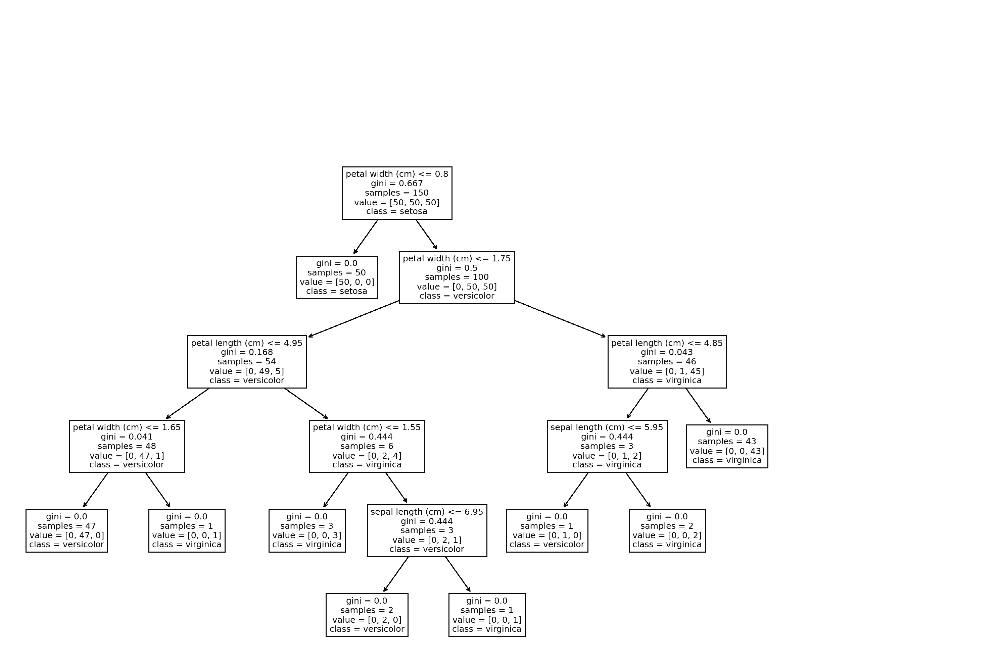
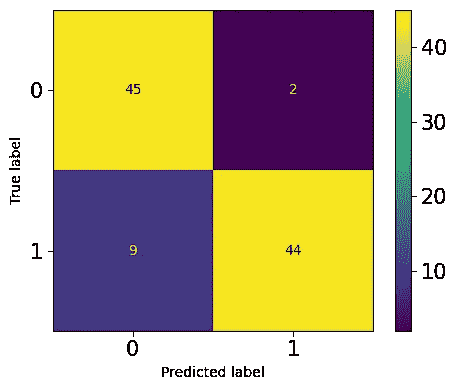
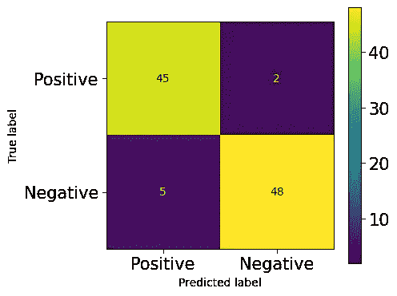
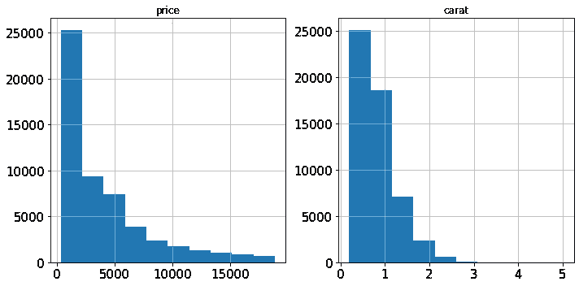
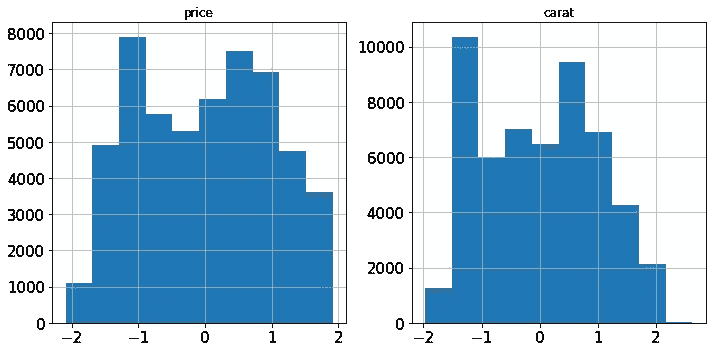

# 19 个隐藏的 Sklearn 特性你应该通过艰苦的方式来学习

> 原文：<https://towardsdatascience.com/19-hidden-sklearn-features-you-were-supposed-to-learn-the-hard-way-5293e6ff149>

## 但我会给你一条捷径

了解您从未见过的 19 种 Sklearn 功能，这些功能可以直接、优雅地替代您手动执行的常见操作。

乌祖诺夫·罗斯季斯拉夫在佩克斯拍摄的照片

## 介绍

通过看 Sklearn 的 [API 参考](https://scikit-learn.org/stable/modules/classes.html#api-reference)，我已经意识到最常用的模型和函数只是库所能做的很薄的一部分。尽管有些特性非常狭隘，只用于极少数极端情况，但我发现许多估算器、转换器和效用函数是对人们手工操作的更好的修正。

因此，我决定列出最重要的几个，并简要地解释它们，这样您就可以在一篇文章中极大地扩展您的 Sklearn 工具集。尽情享受吧！

  

获得由强大的 AI-Alpha 信号选择和总结的最佳和最新的 ML 和 AI 论文:

  

## 1️⃣.[协方差。椭圆包络线](https://scikit-learn.org/stable/modules/generated/sklearn.covariance.EllipticEnvelope.html#sklearn.covariance.EllipticEnvelope)

分布中有异常值是很常见的。许多算法处理异常值，而`EllipticalEnvelope`就是一个直接内置到 Sklearn 中的例子。该算法的优势在于它在检测正态分布(高斯)特征中的异常值方面表现出色:

为了测试估计量，我们创建了一个均值为 5、标准差为 2 的正态分布。在它被训练之后，我们将一些随机数传递给它的`predict`方法。对于`test`中的异常值，该方法返回-1，即 20，10，13。

## 2️⃣.[特征 _ 选择。RFECV](https://scikit-learn.org/stable/modules/generated/sklearn.feature_selection.RFECV.html)

选择最有助于预测的特征是克服过度拟合和降低模型复杂性的必要步骤。Sklearn 提供的最健壮的算法之一是递归特征消除(RFE)。它通过使用交叉验证自动找到最重要的特性，并丢弃其余的特性。

这个估计器的一个优点是它是一个包装器——它可以在任何返回特征重要性或系数分数的 Sklearn 算法周围使用。以下是一个关于合成数据集的示例:

假数据集有 15 个特征，其中 10 个是信息性的，其余的是冗余的。我们用`Ridge`回归作为估计量来拟合 5 倍 RFECV。训练结束后，可以用`transform`的方法丢弃多余的特征。调用`.shape`向我们展示了评估者设法丢弃了所有 5 个不必要的特性。

我已经写了一整篇关于这种算法的文章，涵盖了它如何与现实世界的数据集一起工作的基本细节:

  

## 3️⃣.[合奏。树外](https://scikit-learn.org/stable/modules/generated/sklearn.ensemble.ExtraTreesRegressor.html)

即使随机森林都很强大，过度适应的风险也很高。因此，Sklearn 提供了一种称为 ExtraTrees(分类器和回归器)的 RF 替代方法。

“额外”这个词并不意味着更多的树，而是更多的随机性。该算法使用另一种非常类似决策树的树。唯一的区别是，不是在构建每个树时计算分割阈值，而是为每个特征随机绘制这些阈值，并选择最佳阈值作为分割规则。这允许以偏置略微增加为代价来稍微降低方差:

如您所见，ExtraTreesRegressor 在合成数据集上的表现优于随机森林。

从官方[用户指南](https://scikit-learn.org/stable/modules/ensemble.html#extremely-randomized-trees)中阅读更多关于极度随机化树木的信息。

## 4️⃣.[估算。迭代输入器](https://scikit-learn.org/stable/modules/generated/sklearn.impute.IterativeImputer.html)和[计算器](https://scikit-learn.org/stable/modules/generated/sklearn.impute.KNNImputer.html)

如果您正在寻找比`SimpleImputer`更强大、更先进的插补技术，Sklearn 将再次满足您的需求。`impute`子包包括两个基于模型的插补算法- `KNNImputer`和`IterativeImputer`。

顾名思义，`KNNImputer`使用 k-最近邻算法来查找缺失值的最佳替换:

更健壮的算法是`IterativeImputer`。它通过将每个具有缺失值的要素建模为其他要素的函数来查找缺失值。这一过程以逐步循环的方式完成。在每一步，具有缺失值的单个特征被选择作为目标(`y`)，其余的被选择作为特征阵列(`X`)。然后，使用回归器预测`y`中的缺失值，并对每个特征继续该过程，直到`max_iter`时间(迭代输入器的一个参数)。

因此，对于单个缺失值，会生成多个预测。这样做的好处是将每个缺失值视为一个随机变量，并关联随之而来的固有不确定性:

> BayesianRidge 和 ExtraTree 被发现使用 IterativeImputer 执行得更好。

您可以在我的另一篇文章中了解更多关于这两种插补技术的信息:

  

## 5️⃣.[线性 _ 模型。休伯回归量](https://scikit-learn.org/stable/modules/generated/sklearn.linear_model.HuberRegressor.html)

离群值的存在会严重扰乱任何模型的预测。许多离群点检测算法丢弃离群点并将它们标记为缺失。虽然这有助于模型的学习功能，但它完全消除了异常值对分布的影响。

一个备选算法是`HuberRegressor`。它不是完全去除异常值，而是在拟合期间减少异常值的权重。它有`epsilon`超参数，控制应归类为异常值的样本数量。参数越小，对异常值的鲁棒性越强。它的 API 与任何其他线性回归相同。下面，您可以看到[与贝叶斯岭回归器在一个有大量异常值的数据集上的比较](https://scikit-learn.org/stable/auto_examples/linear_model/plot_huber_vs_ridge.html#sphx-glr-auto-examples-linear-model-plot-huber-vs-ridge-py):

**图片由 Sklearn 用户指南提供。** [**许可证— BSD-3**](https://github.com/scikit-learn/scikit-learn/blob/main/COPYING)

可以看出，具有ε1.35、1.5、1.75 的 HuberRegressor 设法捕获了不受异常值影响的最佳拟合线

您可以从[用户指南](https://scikit-learn.org/stable/modules/linear_model.html#huber-regression)中了解更多关于该算法的信息。

## 6️⃣. [tree.plot_tree](https://scikit-learn.org/stable/modules/generated/sklearn.tree.plot_tree.html)

Sklearn 允许您使用`plot_tree`函数绘制单个决策树的结构。对于刚开始学习基于树和集合模型的初学者来说，这个特性可能很方便:

**图片由 Sklearn 用户指南提供。** [**许可证— BSD-3**](https://github.com/scikit-learn/scikit-learn/blob/main/COPYING)

还有其他绘制树的方法，比如 Graphviz 格式。从[用户指南](https://scikit-learn.org/stable/modules/tree.html#decision-trees)中了解它们。

## 7️⃣.[线性 _ 模型。感知器](https://scikit-learn.org/stable/modules/generated/sklearn.linear_model.Perceptron.html)

这个列表中最酷的名字是第七名——感知器。尽管它有一个花哨的名字，但它是一个简单的线性二元分类器。该算法的定义特征是它适合于大规模学习，并且默认情况下:

1.  它不需要学习速度。
2.  不实现正规化。
3.  它只在出错时更新模型。

它相当于带有`loss='perceptron', eta0=1, learning_rate="constant", penalty=None`的 SGDClassifier，但速度稍快:

## 8️⃣.[特征 _ 选择。从模型中选择](https://scikit-learn.org/stable/modules/generated/sklearn.feature_selection.SelectFromModel.html)

Sklearn 中另一个基于模型的特征选择估计器是`SelectFromModel`。它不像 RFECV 那样健壮，但是对于大规模数据集来说是一个很好的选择，因为它具有较低的计算成本。它也是一个包装估计器，适用于任何具有`.feature_importances_`或`.coef_`属性的模型:

如你所见，该算法成功地删除了所有 40 个冗余特征。

## 9️⃣.[指标。混淆矩阵显示](https://scikit-learn.org/stable/modules/generated/sklearn.metrics.ConfusionMatrixDisplay.html)

混淆矩阵是分类问题的圣杯。大部分指标都来源于它，比如精度、召回率、F1、ROC AUC 等。Sklearn 允许您计算和绘制默认混淆矩阵:

作者图片

老实说，我不会说我喜欢默认的混淆矩阵。它的格式是固定的—行是真正的标签，列是预测。同样，第一行和第一列是负类，第二行和第二列是正类。有些人可能更喜欢不同格式的矩阵，可能是转置或翻转的。

例如，我喜欢将 positive 类作为第一行和第一列，以符合维基百科中给出的格式。这有助于我更好地隔离 4 个矩阵术语——TP、FP、TN、FN。幸运的是，您可以使用另一个函数`ConfusionMatrixDisplay`绘制自定义矩阵:

作者图片

在把混淆矩阵`cm`传给`ConfusionMatrixDisplay`之前，你可以把它做成任何你想要的格式。

您可以从这篇文章中了解关于分类和混淆矩阵的所有内容:

  

## 🔟。[广义线性模型](https://scikit-learn.org/stable/modules/linear_model.html#generalized-linear-regression)

如果有其他方法可以处理其他类型的分布，那么转换目标( *y* )使其呈正态分布是没有意义的。

例如，Sklearn 为泊松、特威迪或伽马分布的目标变量提供了 3 种广义线性模型。`PoissonRegressor`、`TweedieRegressor`和`GammaRegressor`可以为具有各自分布的目标生成稳健的结果，而不是期望正态分布。

除此之外，他们的 API 与其他任何 Sklearn 模型都是一样的。为了找出目标的分布是否与上述三者相匹配，您可以在具有完美分布的相同轴上绘制它们的 PDF(概率密度函数)。

例如，为了查看目标是否遵循泊松分布，使用 Seaborn 的`kdeplot`绘制其 PDF，并通过在相同轴上使用`np.random.poisson`从 Numpy 采样来绘制完美的泊松分布。

## 1️⃣1️⃣.[合奏。隔离森林](https://scikit-learn.org/stable/modules/generated/sklearn.ensemble.IsolationForest.html)

由于基于树的模型和集成模型通常产生更鲁棒的结果，因此它们在异常值检测中也被证明是有效的。在 Sklearn 中，使用一个由非常随机的树组成的森林(`tree.ExtraTreeRegressor`)来检测异常值。每棵树都试图通过选择单个特征并随机选择所选特征的最大值和最小值之间的分割值来隔离每个样本。

这种类型的随机划分在每棵树的根节点和终止节点之间产生明显更短的路径。

> 因此，当随机树的森林共同产生特定样本的较短路径长度时，它们极有可能是异常——sk learn 用户指南。

该算法正确地捕获了异常值(90)并将其标记为-1。

在[用户指南](https://scikit-learn.org/stable/modules/outlier_detection.html#isolation-forest)中阅读更多关于该算法的信息。

## 1️⃣2️⃣.[预处理。电力变压器](https://scikit-learn.org/stable/modules/generated/sklearn.preprocessing.PowerTransformer.html)

许多线性模型需要对数字要素进行一些变换，以使其呈正态分布。`StandardScaler`和`MinMaxScaler`对于大多数发行版来说都非常好用。但是，当数据中存在高偏斜度时，分布的核心指标，如平均值、中值、最小值和最大值，会受到影响。因此，简单的规范化和标准化对偏态分布不起作用。

相反，Sklearn 实现了`PowerTransformer`,它使用对数变换将任何倾斜的特征尽可能地变成正态分布。考虑钻石数据集中的这两个要素:

作者图片

两者都严重倾斜。让我们用对数变换来解决这个问题:

作者图片

偏斜没了！您可以在此阅读有关不同类型的要素变换的更多信息:

  

## 1️⃣3️⃣.[预处理。鲁棒定标器](https://scikit-learn.org/stable/modules/generated/sklearn.preprocessing.RobustScaler.html)

Sklearn 中的另一个数字变换器是`RobustScaler`。你可能从它的名字就能猜到它的作用——它能以一种对异常值鲁棒的方式变换特征。如果要素中存在异常值，则很难使其呈正态分布，因为它们会严重扭曲平均值和标准差。

`RobustScaler`没有使用均值/标准差，而是使用中位数和 IQR(四分位间距)来衡量数据，因为这两个指标不会因为异常值而有偏差。您也可以在[用户指南](https://scikit-learn.org/stable/modules/preprocessing.html#preprocessing-data)中了解相关信息。

## 1️⃣4️⃣.[compose . make _ column _ transformer](https://scikit-learn.org/stable/modules/generated/sklearn.compose.make_column_transformer.html)

在 Sklearn 中，有一个用`make_pipeline`函数创建管道实例的简写。该函数只接受转换器和估算器并完成它的工作，而不是命名每一步并使代码变得不必要的长:

对于更复杂的场景，使用`ColumnTransformer`，这也有同样的问题——每个预处理步骤都要命名，使得你的代码又长又不可读。幸运的是，Sklearn 提供了与`make_pipeline`类似的功能:

正如您所看到的，使用`make_column_transformer`要短得多，而且它负责单独命名每个转换器步骤。

## 1️⃣5️⃣.[compose . make _ column _ 选择器](https://scikit-learn.org/stable/modules/generated/sklearn.compose.make_column_selector.html)

如果您注意的话，我们使用了 pandas 数据帧的`select_dtypes`函数和`columns`属性来隔离数字和分类列。虽然这肯定有效，但是使用 Sklearn 有一个更加灵活和优雅的解决方案。

`make_column_selector`函数创建一个可以直接传递给`ColumnTransformer`实例的列选择器。它的工作方式和`select_dtypes`一样，而且更好。它有`dtype_include`和`dtype_exclude`参数来根据数据类型选择列。如果您需要一个定制的列过滤器，您可以将一个正则表达式传递给`pattern`，同时将其他参数设置为`None`。它是这样工作的:

不用传递列名列表，只传递一个带有相关参数的`make_column_selector`实例，就大功告成了！

## 1️⃣6️⃣.[预处理。普通编码器](https://scikit-learn.org/stable/modules/generated/sklearn.preprocessing.OrdinalEncoder.html)

初学者的一个常见错误是使用`LabelEncoder`对有序分类特征进行编码。如果你已经注意到了，`LabelEncoder`允许一次只转换一列，而不是像`OneHotEncoder`一样同时转换。你可能会觉得 Sklearn 搞错了！

实际上，`LabelEncoder`应仅用于对响应变量(`y`)进行编码，如其[文档](https://scikit-learn.org/stable/modules/generated/sklearn.preprocessing.LabelEncoder.html)中所规定。要对特性数组(`X`)进行编码，您应该使用`OrdinalEncoder`，它会像预期的那样工作。它将有序分类列转换为具有(0，n_categories - 1)类的要素。它在一行代码中对所有指定的列都这样做，这使得在管道中包含它成为可能。

## 1️⃣7️⃣. [metrics.get_scorer](https://scikit-learn.org/stable/modules/generated/sklearn.metrics.get_scorer.html)

Sklearn 内置了 50 多个指标，在`sklearn.metrics.SCORERS.keys`中可以看到它们的文字名称。在一个项目中，您可能需要使用几个指标，如果您单独使用它们的话，就需要导入它们。

直接从`sklearn.metrics`导入大量指标可能会污染您的名称空间，并变得不必要的长。作为一个解决方案，您可以使用`metrics.get_scorer`函数访问任何带有文本名称的指标，而无需导入它:

## 1️⃣8️⃣.[型号 _ 选择。HalvingGrid](https://scikit-learn.org/stable/modules/generated/sklearn.model_selection.HalvingGridSearchCV.html) 和 [HalvingRandomSearchCV](https://scikit-learn.org/stable/modules/generated/sklearn.model_selection.HalvingGridSearchCV.html)

在 Sklearn 的 0.24 版本中，我们介绍了两个实验性的超参数优化器:`HalvingGridSearchCV`和`HalvingRandomSearchCV`类。

不同于他们详尽的表亲 GridSearch 和 RandomizedSearch，新的类使用了一种叫做连续减半的技术。不是在所有数据上训练所有候选集，而是只给参数一个数据子集。通过在更小的数据子集上训练，表现最差的候选人被过滤掉。在每次迭代之后，训练样本以某个因子增加，并且可能的候选者的数量减少，从而导致更快的评估时间。

快了多少？在我做过的实验中，HalvingGridSearch 比常规 GridSearch 快 11 倍，HalvingRandomSearch 甚至比 HalvingGridSearch 快 10 倍。你可以从这里阅读我对连续减半的详细概述和我的实验:

  

## 1️⃣9️⃣. [sklearn.utils](https://scikit-learn.org/stable/modules/classes.html#module-sklearn.utils)

最后但同样重要的是，Sklearn 在`sklearn.utils`子包下有一大堆实用程序和助手函数。Sklearn 本身使用这个模块中的函数来构建我们都使用的所有转换器和估计器。

有用的有`class_weight.compute_class_weight`、`estimator_html_repr`、`shuffle`、`check_X_y`等。您可以在自己的工作流中使用它们，使您的代码更像 Sklearn，或者在创建适合 Sklearn API 的定制转换器和估算器时，它们可能会派上用场。

## 摘要

尽管像 CatBoost、XGBoost、LightGBM 这样的库正在慢慢地从 Sklearn 那里抢走领先的 ML 库的头把交椅，但它仍然是现代 ML 工程师技能堆栈中非常宝贵的一部分。

一致的 API、出色的代码设计和创建健壮的 ML 工作流的能力仍然使 Sklearn 在功能和灵活性方面无与伦比。尽管我们可以用这些基础知识完成很多工作，但这篇文章表明，Sklearn 提供的东西比看上去的要多得多！

感谢阅读！

     