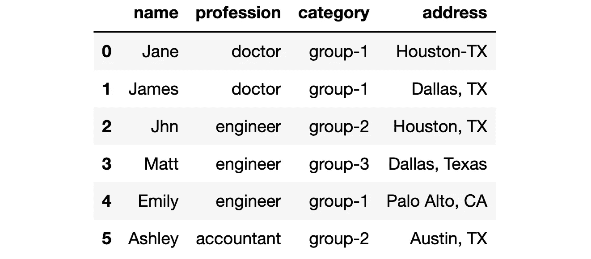

# Python 熊猫的 2 个不同的替换函数

> 原文：<https://towardsdatascience.com/2-different-replace-functions-of-python-pandas-c079408de031>

## 以及何时使用哪个


文森特·范·扎林格在 [Unsplash](https://unsplash.com/photos/4Mu2bXIsn5Y?utm_source=unsplash&utm_medium=referral&utm_content=creditCopyText) 上拍摄的照片

Pandas 是一个用于 Python 的高效数据分析和操作分析库。考虑到 Python 在数据科学中的主导地位以及大量的数据清理、操作和分析工作，Pandas 是数据科学领域中使用最广泛的工具之一。

我一直用熊猫来做我的工作和创作内容。从我第一次写熊猫代码到现在已经快 3 年了，我还在不断学习新的东西。

当然，拥有一个活跃的开源社区并不断改进是发现熊猫新技能的一个重要因素。

在这篇文章中，我们将讨论 Pandas 的一个具体部分:替换函数。我把它写成复数，因为熊猫有两个不同的替换函数。

1.  熊猫。数据框架.替换
2.  熊猫。Series.str.replace

我们将通过几个例子来了解这些函数是如何工作的，以及它们的用途。

让我们从创建一个示例数据帧开始。

```
import pandas as pd

df = pd.DataFrame(

    {
        "name": ["Jane", "James", "Jhn", "Matt", "Emily", "Ashley"],
        "profession": ["doc", "doctor", "eng", "engineer", "eng", "accountant"],
        "category": ["group-1", "group-1", "group-2", "group-3", "group-1", "group-2"],
        "address": ["Houston-TX", "Dallas, TX", "Houston, TX", "Dallas, Texas", "Palo Alto, CA", "Austin, TX"]
    }

)

df
```


df(作者图片)

# 数据框架.替换

此函数可用于替换一列或多列中的值。当然，我们需要指定要替换的值和新值。

例如，我们可以将专业栏中的“doc”替换为“doctor”。

```
df["profession"].replace(to_replace="doc", value="doctor")

# output
0        doctor
1        doctor
2           eng
3      engineer
4           eng
5    accountant
Name: profession, dtype: object
```

我们也可以直接将函数应用于数据帧。在这种情况下，使用 Python 字典指定列名。

```
df.replace(to_replace={"profession": {"doc": "doctor"}})
```


输出(图片由作者提供)

在前两个示例中，字符串“doc”被替换为“doctor”。“专业”列中的“工程”字符串应替换为“工程师”。

由于熊猫的灵活性，我们可以在一次操作中完成两种替换。每个替换在字典中被写成一个键值对。

```
df.replace(to_replace={"profession": {"doc": "doctor", "eng": "engineer"}})
```



输出(图片由作者提供)

“doc”和“eng”都被替换了。替换一列中的多个值还有另一种方法，即使用 Python 列表来指示要替换的值和新值。

```
df["profession"].replace(
    to_replace=["doc", "eng"], 
    value=["doctor", "engineer"]
)

# output
0        doctor
1        doctor
2      engineer
3      engineer
4      engineer
5    accountant
Name: profession, dtype: object
```

在前两个示例中，我们替换了同一列中的多个值。我们还可以使用嵌套字典替换不同列中的多个值。

以下代码片段替换了 name 和 profession 列中的多个值。

```
df.replace(

    {
        "profession": {"doc": "doctor", "eng": "engineer"},
        "name": {"Jhn": "John"}
    }

)
```


输出(图片由作者提供)

# Series.str.replace

通过 str 访问器提供的 replace 函数可用于替换字符串的一部分或子序列。

> Pandas 中的访问器提供了特定于特定数据类型的功能。str 访问器用于字符串操作。

“str.replace”函数可用于替换字符串中的字符。

```
df["address"]

# output
0       Houston-TX
1       Dallas, TX
2      Houston, TX
3    Dallas, Texas
4    Palo Alto, CA
5       Austin, TX
Name: address, dtype: object

df["address"].str.replace("-", ", ")

# output
0      Houston, TX
1       Dallas, TX
2      Houston, TX
3    Dallas, Texas
4    Palo Alto, CA
5       Austin, TX
Name: address, dtype: object
```

上面第 3 行中的单词“Texas”是一个字符串的子序列，因此我们可以使用“str.replace”将其替换为“TX”。

```
df["address"].str.replace("Texas", "TX")

# output
0       Houston-TX
1       Dallas, TX
2      Houston, TX
3       Dallas, TX
4    Palo Alto, CA
5       Austin, TX
Name: address, dtype: object
```

为了做多重替换，我们可以进行如下链式操作:

```
df["address"].str.replace("-", ", ").str.replace("Texas", "TX")

# output
0      Houston, TX
1       Dallas, TX
2      Houston, TX
3       Dallas, TX
4    Palo Alto, CA
5       Austin, TX
Name: address, dtype: object
```

> 与“DataFrame.replace”不同，“str.replace”不能应用于 DataFrame，因为 DataFrame 对象没有 str 属性。

“str.replace”可用于替换整个字符串，但要确保要替换的字符串不是另一个值中的子字符串。我们来做一个例子来演示这个案例。这是我们的数据框架:


df(作者图片)

让我们使用“str.replace”将职业列中的“doc”替换为“doctor”。

```
df["profession"].str.replace("doc", "doctor")

# output
0        doctor
1     doctortor
2           eng
3      engineer
4           eng
5    accountant
Name: profession, dtype: object
```

第 0 行中的替换是好的，但是我们在第 1 行中有一个问题。字符串“doctor”中的“doc”子序列也被替换为“doctor ”,因此我们得到了一个字符串“docdoctor ”,这肯定不是我们想要的。

# 两者都有效的情况


df(作者图片)

假设我们想用整数替换 category 列中的值。我们可以使用“DataFrame.replace”和“str.replace”来完成这项任务。

```
df["category"].str.replace("group-", "")

# output
0    1
1    1
2    2
3    3
4    1
5    2
Name: category, dtype: object

df["category"].replace(
    {"group-1": 1, "group-2": 2, "group-3": 3}
)

# output
0    1
1    1
2    2
3    3
4    1
5    2
Name: category, dtype: int64
```

除了数据类型之外，输出是相同的。当使用“str.replace”时，数据类型保持为字符串(或对象)。因此，我们需要一个额外的数据类型转换步骤来用整数表示类别。

# 结论

我们学习了熊猫的两种不同的替代功能以及它们之间的区别。有些情况下，其中一个是更好的选择，所以最好两个都知道。

值得注意的是，这两个函数都支持正则表达式(即 regex)，这使它们更加灵活和强大。如果您传递一个模式并希望它作为正则表达式来处理，只需将 regex 参数的值设置为 True。

*你可以成为* [*媒介会员*](https://sonery.medium.com/membership) *解锁我的全部写作权限，外加其余媒介。如果你已经是了，别忘了订阅*[](https://sonery.medium.com/subscribe)**如果你想在我发表新文章时收到电子邮件。**

*感谢您的阅读。如果您有任何反馈，请告诉我。*