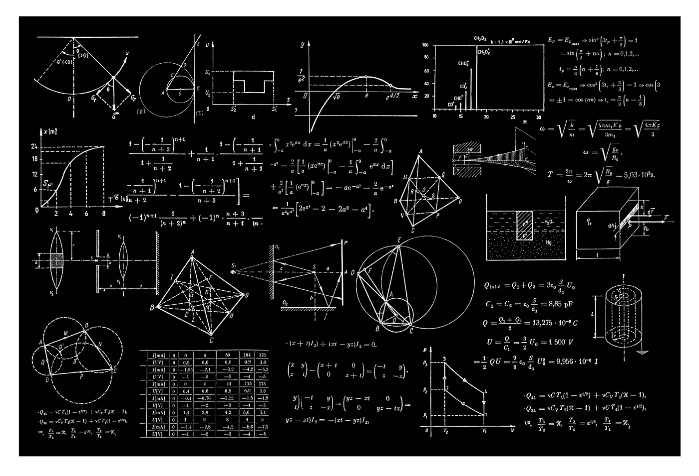
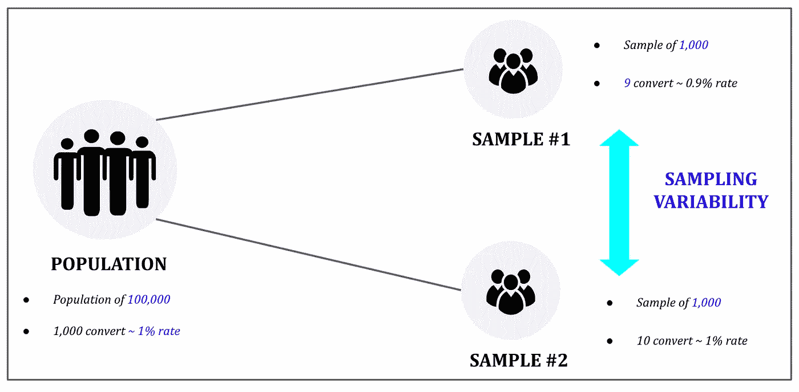
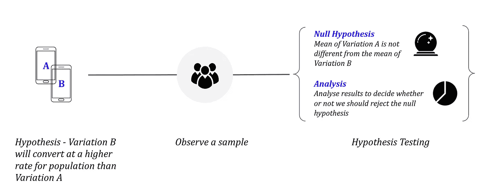
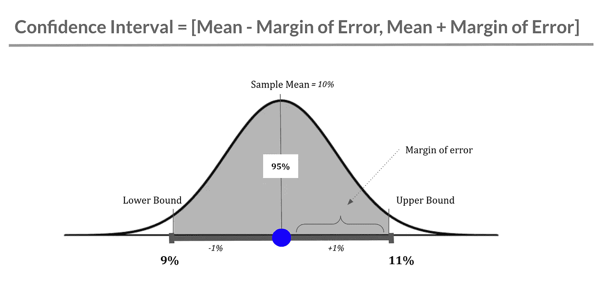
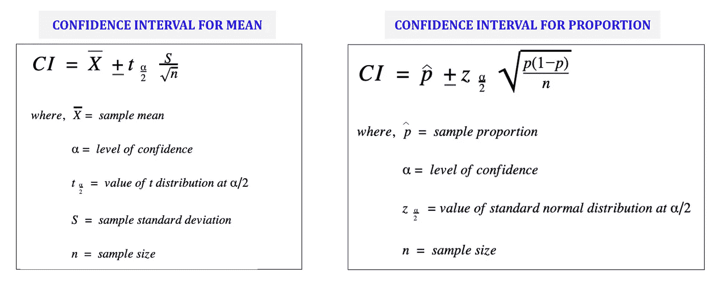
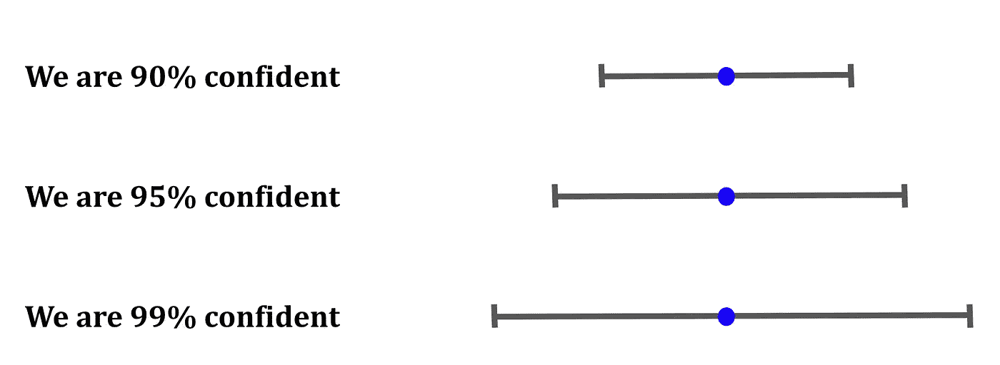
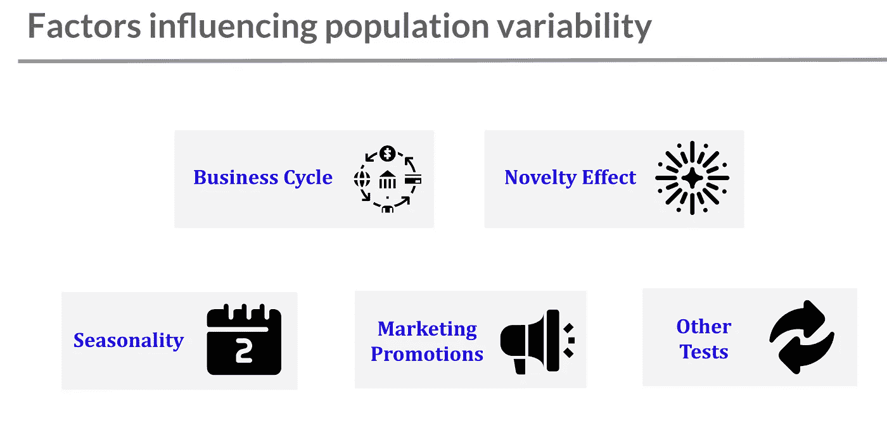

# 你必须知道的 25 个 A/B 测试概念:面试复习

> 原文：<https://towardsdatascience.com/25-a-b-testing-concepts-interview-cheat-sheet-c998a501f911>

## **王牌面试一体化小抄**

丹·克里斯蒂安·pădureț在 Unsplash 上拍摄的照片

面试中越来越多地问到 A/B 测试的问题，但准备这些问题的可靠资源仍然很少。假设你不久前完成了一门关于 A/B 测试的[课程](https://www.udemy.com/course/product-experimentation-ab-testing-in-r-with-real-examples/learn/practice/1238666?referralCode=C0EC84F644B6BCB10FD0#overview)，并且对你对 A/B 测试统计的理解很有信心。现在已经有一段时间了，你有一个即将到来的采访，看在上帝的份上，你似乎不记得统计能力意味着什么或者 SUTVA 代表什么。或者你在目前的职位上一直在尝试，并且已经自动化了大部分流程。不需要手动步骤，你已经变得生疏了，需要一个快速的备忘单来回忆背后的重要概念和直觉，这样你才能在即将到来的面试中胜出。

使用这篇文章作为面试前你需要知道的 A/B 测试中最重要的概念的快速资源。你会发现最重要的概念的总结以及建立你的直觉的例子。

## **目录(点击下方跳到具体主题)**

*   [最基本的东西](#a7ad)📚
    *总体、样本、样本均值、样本变异性*
*   [实验设计](#4746)🎭
    *无效假设、关键指标、总体评估标准(OEC)、护栏指标、随机化单元、干扰*
*   [A/B 检验统计&样本量计算](#281f) 🧮
    *置信水平、误差幅度、置信区间、一类误差、二类误差、p 值、统计显著性、统计功效、最小可检测效应、实际显著性、样本量&持续时间*
*   [对实验有效性的威胁](#aec6)🚧
    *新奇效应、首因效应、季节性、星期效应*

在我们开始之前，让我们建立一个 A/B 测试的例子，我们将利用它来复习概念。假设您正在一个网页上运行 A/B 测试，目标是提高点击率(CTRs)——您的原始网页，即控件使用文本“Save $25”提供了$25 的节省；通过此 A/B 测试，您将测试此网页的一个变体，它使用文本“节省 15%”以不同的方式呈现相同的报价(价值仍为 25 美元)。

作者图片

现在谈谈概念…

# 最基本的

1.  **人口**——你要得出结论的是整个群体。在统计学中，总体是对某个问题或实验感兴趣的一组相似的项目或事件。*在我们上面的例子中，真正的人群是将来会访问网页的每一个人。*
2.  **样本** —样本是总体中代表较大总体特征的一小部分。通过统计分析，您可以使用从样本中收集的数据来对总体进行估计或测试假设。*在 A/B 测试中，一个样本是随机选择的一组访问者，我们向他们展示我们的每一个页面变体——控制暴露于一个样本，处理暴露于另一个样本。*
3.  **样本平均值** —对于给定的指标，这是基于为样本收集的数据的平均值。*对于我们旨在优化点击率(点击率)的 A/B 测试示例，这只是每个样本中用户的平均点击率。*
4.  **样本可变性** —从总体中随机选择的两个样本可能互不相同。无论我们从样本中得出什么样的结论，由于样本的可变性，我们的估计很可能会有误差。随着样本量的增加，抽样可变性将会降低。*在 A/B 测试中，抽样可变性会影响我们所需的样本量，以便有机会得出具有统计意义的结果。*

作者图片

# 试验设计

**5。零假设**——推断统计学基于这样一个前提，即你不能证明某事是真的，但是你可以通过发现一个例外来证明某事是假的。你决定你试图为什么提供证据——也就是另一个假设，然后你建立相反的假设作为零假设，并找到证据来反驳它。*在我们的 A/B 测试示例中，零假设是原始页面上的总体 CTR 和页面变异没有不同。*

作者图片

6。关键指标 —您试图通过实验优化的一组指标。*一些常用的指标包括点击率(CTR)、注册率、参与率、平均每单收入、保留率等*。可以想象，关键指标将与业务、okr 和目标的优先级相关。许多组织检查多个关键指标，并有一个当他们看到特定组合时愿意接受的权衡的心理模型。*例如，如果剩下的用户增加他们的参与度和收入，他们可能很清楚他们愿意失去多少用户(客户流失增加)。*这就把我们带到了 OEC 的解释下面。

7 .**。总体评估标准(OEC)** —当有多个指标需要通过实验进行优化时，通过设计一个称为总体评估标准(OEC)的单一指标来制定折衷方案是很有帮助的，总体评估标准本质上是这些目标的加权组合。*一种方法是将每个指标标准化到一个预定义的范围，比如 0-1，并给每个指标分配一个权重。你的 OEC 就是一些标准化指标的加权值。在上面的例子中，需要评估客户流失和收入之间的权衡，LTV 可以用作 OEC。*

**8。护栏指标** —这些指标对公司很重要，不应受到实验的负面影响。*例如，我们的目标可能是让尽可能多的用户注册，但我们不希望每个用户的参与度大幅下降。或者，我们可能希望提高应用参与度，但同时确保应用卸载不会增加。*

**9。随机化单元** —这是一个单元，例如应用随机化过程将其映射到控制或处理的用户或页面。适当的随机化对于确保分配到不同变异的人群在统计上相似是很重要的。应选择随机化单位，以满足稳定的单位治疗值假设(SUTVA)。SUTVA 指出，实验单元不会相互干扰，即测试和控制单元的行为是相互独立的。用户级随机化是最常见的，因为它可以避免用户体验不一致，并允许长期测量，如用户保留率。

**10。干扰** —有时也称为溢出或泄漏，当对照组的行为受到给予测试组的治疗的影响时发生。这导致违反 SUTVA 假设，从而导致潜在的错误结论。推理可能有两种方式——

*   直接-如果两个单元是社交网络上的朋友，或者如果他们同时访问了相同的物理空间，则这两个单元可以直接连接。如果其中一个用于治疗，另一个用于控制，这将导致变异之间的干扰
*   间接—间接连接是由于某些共享资源而存在的连接。例如，如果 Airbnb 市场改善了治疗用户的转化流，导致更多预订，自然会导致控制用户的库存减少。类似地，在 Lyft/优步/Doordash 等市场中，控制和治疗用户可能共享同一群司机/司机，这也将面临干扰

# 样本量计算

11.**置信水平** —置信水平是指当您多次抽取随机样本时，置信区间将包含真实总体参数的百分比或概率或确定性。在在线 A/B 测试的技术世界中，95%的置信水平是最常被选择的，但是你可以根据情况选择不同的水平。*95%的置信水平意味着样本均值周围的置信区间有望在 95%的时间内包含真实均值。*

12.**误差幅度**——正如我们之前提到的，由于抽样的可变性，你基于样本得出的关于人口的结论可能是不准确的。误差幅度告诉你你的结果与真实的总体值相差多少个百分点。*例如，95%的置信区间和 4%的误差意味着在 95%的时间里，您的统计数据将在真实总体值的 4 个百分点以内。将误差幅度加到平均值上并从中减去，以确定置信区间(下面讨论)。*

13.**置信区间** —在统计推断中，我们旨在使用观察到的样本数据来估计总体参数。置信区间给出了可能包含未知总体参数的估计值范围，该估计范围是根据给定的一组样本数据计算的。*置信区间的宽度取决于三个因素——感兴趣人群的变化、样本的大小和我们寻求的置信水平。*

作者图片

14.**第一类错误** —当我们错误地拒绝零假设时，就会出现第一类错误。*在我们的 A/B 测试示例中，如果我们得出的结论是治疗的总体均值不同于对照组的总体均值，而实际上它们是相同的，则会出现 I 型错误。*通过获得具有统计意义的结果来避免 I 型错误。

15.**第二类错误** —当零假设为假，但我们错误地未能拒绝它时，就会发生第二类错误。*在我们的 A/B 测试示例中，如果我们得出结论，变异 B 的总体均值与变异 A 的均值没有不同，而实际上两者是不同的，那么就会出现第二类错误。*通过运行具有高统计功效的测试来避免这些错误。

作者图片

16. **P 值** — p 值是指如果测试的零假设为真，获得至少与我们看到的结果一样极端的结果的概率。p 值基本上告诉你你的证据是否让你的零假设看起来很可笑。

17.**统计显著性** —当 p 值小于显著性水平时，达到统计显著性。显著性水平(𝛂)是您希望用于犯 1 型错误的概率的阈值，即得出控制和处理的总体均值不同而实际上它们相同的结论。换句话说，统计显著性是统计检验的 p 值小到足以拒绝零假设的另一种说法。科学标准是使用 p 值 0.05，即𝛂 = 5%。

18.**统计功效** —统计功效，我们知道它是测试正确拒绝零假设的概率，即检测到最小效应的时间百分比，如果存在的话。

19.**最小可检测效应(MDE)** —您感兴趣检测的转化率的最小变化。在优化 CTR 的示例中，假设控件的 CTR 为 20%。您希望检测到的最小变化是相对于对照的 5%绝对升力，即治疗的 CTR 是否为 25%或更高。在这种情况下，5%是 MDE。

20.**实际显著—** 假设检验有可能产生具有统计显著性的结果，尽管其影响范围很小。这通常有两个原因——1)低抽样方差和 2)大样本量。在这两种情况下，我们可能能够检测出测试和控制之间具有统计学意义的甚至很小的差异。然而，这些在现实世界中可能并不重要。*让我们以 A/B 测试为例，该测试向用户展示了一个新模块，并且能够检测到 CTR 存在 0.05%的差异，但是，对于如此小的升力，构建该模块的成本是否合理。在这种情况下，可行的实际有效升力是多少？*

21.**样本量** —在给定基线转换、最小可检测差异(MDE)、显著性水平&的情况下，达到统计显著性所需的单位数。“持续时间”指的是你需要多长时间来运行测试，以达到每个变量足够的样本量。

# 对实验有效性的威胁

作者图片

22.**新奇效应**——“有时会有‘新奇效应’在起作用。你对网站所做的任何改变都会引起你现有用户群的更多关注。把你网站上那个大的行动号召按钮从绿色改成橙色会让回头客更有可能看到它，哪怕只是因为他们之前已经把它关掉了。这种类型的影响不太可能长期持续——但它可能会人为地影响您的测试结果。

23.首因效应(Primacy effect)——当产品发生变化时，人们会做出不同的反应。一些用户可能习惯了产品的工作方式，不愿意改变。这就是所谓的首因效应。首因效应只不过是倾向于记住我们遇到的第一条信息，而不是后来呈现的信息。这可以被认为是一种与新奇效应*相反的现象。*

*24.**季节性** —企业可能在每月 1 日和 15 日有不同的用户行为。对于一些电子商务网站来说，它们的流量和销售额全年都不稳定，例如，它们往往在黑色星期五和网络星期一达到峰值。这些因素导致的可变性可能会影响您的测试结果。*

*25.**星期几效应** —与季节性相似，指标可能基于星期几具有周期性。比如说，周四的转化率比周末高得多。在这种情况下，为整周的增量运行测试是很重要的，因此您包括了一周中的每一天。*

# *结论*

*A/B 测试是最重要和应用最广泛的数据科学概念之一，在增长优化中有许多应用——无论是产品实验*(优化入职流程、增加 CTR、服务器端优化等。)*或用于营销收购*(创意测试、增量测试、地理分割测试)*等等*。*有这么多潜在的应用，很可能会在面试中对你的 A/B 测试知识进行评估——特别是对于产品数据科学/分析或营销数据科学/分析职位。*

*如果您想继续学习 A/B 测试概念和应用，请查看[关于 A/B 测试的完整课程和面试指南](https://www.udemy.com/course/product-experimentation-ab-testing-in-r-with-real-examples/?referralCode=C0EC84F644B6BCB10FD0)。*

# *感谢阅读！*

**矛盾的是，应对数据科学面试与其说是科学，不如说是艺术！更多来自我关于数据科学访谈或数据科学职业成长的内容，* [*订阅并关注*](https://preeti-semwal.medium.com/subscribe) *！**

**关注* [*领英！*](https://www.linkedin.com/in/preeti-semwal/)*