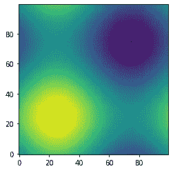
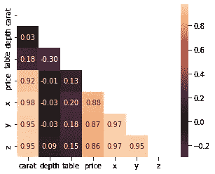
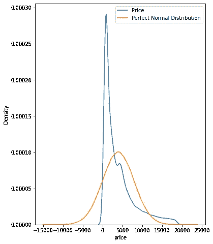

# 埋藏在文件中等待被发现的 25 件宝贝

> 原文：<https://towardsdatascience.com/25-numpy-treasures-buried-in-the-docs-waiting-to-be-found-60d8e17931cd>

## 在 NumPy 致富


照片由[陈信宏·K·苏雷什](https://unsplash.com/@ashin_k_suresh?utm_source=unsplash&utm_medium=referral&utm_content=creditCopyText)在 [Unsplash](https://unsplash.com/s/photos/treasures?utm_source=unsplash&utm_medium=referral&utm_content=creditCopyText) 上拍摄

# 动机

每个数据科学家都钦佩某个人。对一些人来说，可能是那些创造了杀手级数据可视化的人；对其他人来说，就是任何回答他们 StackOverflow 问题的人。对我来说，是那些像忍者一样使用 NumPy 的人。

我不知道。我一直认为，在罕见的极端情况下，能够使用深埋在文档中的被遗忘很久的函数，说明了一个程序员的技能。为一个特定的任务重新发明轮子是具有挑战性的，但这并不总是你想要的。

这个月，是时候扭转乾坤，成为一名忍者了。一路上我都在说“为什么我不把别人也做了呢？”。因此，我在这里列出了一些最酷但罕见的 NumPy 函数，当使用它们时，肯定会让任何阅读您的代码的人大吃一惊。

[](https://ibexorigin.medium.com/membership) [## 通过我的推荐链接加入 Medium-BEXGBoost

### 获得独家访问我的所有⚡premium⚡内容和所有媒体没有限制。支持我的工作，给我买一个…

ibexorigin.medium.com](https://ibexorigin.medium.com/membership) 

获得由强大的 AI-Alpha 信号选择和总结的最佳和最新的 ML 和 AI 论文:

[](https://alphasignal.ai/?referrer=Bex) [## 阿尔法信号|机器学习的极品。艾总结的。

### 留在循环中，不用花无数时间浏览下一个突破；我们的算法识别…

alphasignal.ai](https://alphasignal.ai/?referrer=Bex) 

# 1️⃣.np.full_like

我打赌你用过像`ones_like`或`zeros_like`这样的标准 NumPy 函数。嗯，`full_like`和这两个完全一样，除了你可以创建一个和另一个形状一样的矩阵，填充一些自定义值。

## 💻演示

这里，我们正在创建一个`pi`的矩阵，形状为`array`。

## 📚文档:[链接](https://numpy.org/doc/stable/reference/generated/numpy.full_like.html)

# 2️⃣.日志空间

我相信你经常使用`linspace`。它可以在一个间隔内创建自定义数量的线性间隔数据点。它的表亲`logspace`更进一步。它可以在对数标度上生成均匀分布的自定义点数。您可以选择任何数字作为基数，只要它不是零:

## 💻演示

## 📚文档:[链接](https://numpy.org/doc/stable/reference/generated/numpy.logspace.html)

# 3️⃣.网络网格

这是你只能在文档中看到的功能之一。我以为它暂时不会公开使用，因为我很难理解它。像往常一样，斯达克弗洛来拯救我们了。根据这个[线程](https://stackoverflow.com/questions/36013063/what-is-the-purpose-of-meshgrid-in-python-numpy)，您可以使用`meshgrid`从给定的 X 和 Y 数组创建每个可能的坐标对。这里有一个简单的例子:

将有 16 个唯一的坐标对，结果数组中每个索引到索引元素对一个。


当然，`meshgrid`通常用于更复杂的任务，如果使用循环的话，将会花费很长时间。绘制 3D 正弦函数的等值线图就是一个例子:

## 💻演示



## 📚文档:[链接](https://numpy.org/doc/stable/reference/generated/numpy.meshgrid.html)

# 4️⃣.triu/tril

类似于`ones_like`或`zeros_like`，这两个函数返回高于或低于某个矩阵对角线的零。例如，我们可以使用`triu`函数在主对角线上方创建一个具有真值的布尔掩码，并在绘制关联热图时使用该掩码。

## 💻演示



如你所见，用`triu`创建的蒙版可用于相关矩阵，以去掉不必要的上三角和对角线。这使得热图更加紧凑，可读性更好，没有杂乱无章。

## 📚文档:[链接](https://numpy.org/doc/stable/reference/generated/numpy.triu.html) — `np.triu`

# 5️⃣.拉威尔/拉平

NumPy 是关于高维矩阵和 n 数组的。有时候，你只是想把这些阵列粉碎成 1D。这是您可以使用`ravel`或`flatten`的地方:

## 💻演示

他们看起来一样吗？不完全是。`flatten`总是返回一个 1D 副本，而`ravel`试图生成原始数组的 1D 视图。所以，要小心，因为修改从`ravel`返回的数组可能会改变原始数组。要了解更多关于它们区别的信息，请查看[这个](https://stackoverflow.com/questions/28930465/what-is-the-difference-between-flatten-and-ravel-functions-in-numpy) StackOverflow 线程。

## 📚文档:[链接](https://numpy.org/doc/stable/reference/generated/numpy.ravel.html)

# 6️⃣.np.vstack / np.hstack

在 Kaggle 上，这两个函数是经常使用的。通常，人们对来自不同模型的测试集有多种预测，他们希望以某种方式集成这些预测。为了便于使用，必须将它们组合成一个矩阵。

## 💻演示

记住，在将每个阵列与这些阵列堆叠在一起之前，要对它们进行整形，因为默认情况下它们需要 2D 阵列。这就是我们使用`reshape`函数的原因。这里，`reshape(-1, 1)`表示将数组转换成一个尽可能多行的单列。

类似地，`reshape(1, -1)`将数组转换为尽可能多列的单行向量。

## 📚文档:[链接](https://numpy.org/doc/stable/reference/generated/numpy.hstack.html)

# 7️⃣.np.r_ / np.c_

如果您像我一样懒惰，不想在所有的数组上调用`reshape`，有一个更好的解决方案。`np.r_`和`np.c_`运算符(不是函数！)允许将数组分别堆叠为行和列。

下面，我们用 100 个概率模拟一个预测数组。为了将它们堆叠起来，我们用括号符号调用`np.r_`(就像`pandas.DataFrame.loc`)。

## 💻演示

类似地，`np.c_`将数组堆叠在一起，创建一个矩阵。然而，它们的功能并不局限于简单的水平和垂直堆栈。他们比那更强大。要了解更多信息，我建议您阅读文档。

## 📚文档:[链接](https://numpy.org/doc/stable/reference/generated/numpy.r_.html) — `np.r_`

## 📚文档:[链接](https://numpy.org/doc/stable/reference/generated/numpy.c_.html) — `np.c_`

# 8️⃣.np .信息

NumPy 是如此的*广阔而深邃。你很可能没有时间和耐心去学习它的 API 的每一个函数和类。面对未知函数怎么办？好吧，不要跑去找文档，因为你有更好的选择。*

`info`函数可以打印 NumPy API 中任意名称的 docstring。这里是用在`info`上的`info`:

## 💻演示

## 📚文档:[链接](https://numpy.org/doc/stable/reference/generated/numpy.info.html)

# 9️⃣.np .哪里

顾名思义，这个函数返回一个数组的所有索引`where`某些条件为真:

## 💻演示

当在稀疏数组中搜索非零元素时，它特别有用，甚至可以在 Pandas 数据帧上使用，以便根据条件进行更快的索引检索。

## 📚文档:[链接](https://numpy.org/doc/stable/reference/generated/numpy.where.html)

# 1️⃣0️⃣.所有/任何

当与`assert`语句一起使用时，这两个函数在数据清理过程中会很方便。

`np.all`仅当数组中的所有元素都符合特定条件时才返回 True:

## 💻演示

因为我们创建了两个填充了随机数的数组，所以不可能每个元素都相等。但是，如果这些数字是整数，则更有可能至少有两个数字彼此相等:

因此，如果数组中至少有一个元素满足特定条件，`any`将返回 True。

## 📚文档:[链接](https://numpy.org/doc/stable/reference/generated/numpy.all.html) — `np.all`

## 📚文档:[链接](https://numpy.org/doc/stable/reference/generated/numpy.any.html)——`np.any`

# 1️⃣1️⃣.np.allclose

如果您想检查两个长度相等的数组是否是彼此的副本，一个简单的`==`操作符是不够的。有时候，你可能想比较浮点数组，但是它们的长小数位数很难比较。在这种情况下，您可以使用`allclose`,如果一个数组的所有元素在一定的容差范围内相互靠近，它将返回 True。

## 💻演示

请注意，只有当差值(`<`)小于`rtol`，而不是`<=`时，该函数才返回 True！

## 📚文档:[链接](https://numpy.org/doc/stable/reference/generated/numpy.allclose.html)

# 1️⃣2️⃣.np.argsort

虽然`np.sort`返回一个数组的排序副本，但这并不总是您想要的。有时，您需要对数组进行排序的索引，以便针对不同的目的多次使用相同的索引。这就是`argsort`派上用场的地方:

## 💻演示

它来自于以`arg`开头的一系列函数，这些函数总是从某个函数的结果返回一个或多个索引。例如，`argmax`查找数组中的最大值并返回其索引。

## 📚文档:[链接](https://numpy.org/doc/stable/reference/generated/numpy.argsort.html)

# 1️⃣3️⃣.np.isneginf / np.isposinf

这两个布尔函数检查数组中的元素是负无穷大还是正无穷大。不幸的是，计算机或 NumPy 不理解无穷大的概念(好吧，谁理解呢？).它们只能将无穷大表示为某个非常大或非常小的数字，它们可以放入一个比特位中(我希望我说得没错)。

这就是为什么当你打印出`np.inf`的类型时，它会返回`float`:

这意味着无穷大的值可以很容易地溜进一个数组，破坏你在浮点数上使用的操作。你需要一个特殊的功能来找到这些鬼鬼祟祟的小…

## 💻演示

## 📚文档:[链接](https://numpy.org/doc/stable/reference/generated/numpy.isneginf.html)

# 1️⃣4️⃣.np.polyfit

如果你想执行一个传统的线性回归，你不一定需要 Sklearn。NumPy 为您提供:

## 💻演示

`polyfit`可以获取两个向量，对它们应用线性回归，并返回一个斜率和一个截距。你只需要用`deg`指定次数，因为这个函数可以用来逼近任意次多项式的根。

用 Sklearn 再次检查发现用`polyfit`找到的斜率和截距与 Sklearn 的`LinearRegression`模型相同:

## 📚文档:[链接](https://numpy.org/doc/stable/reference/generated/numpy.polyfit.html)

# 1️⃣5️⃣.概率分布

NumPy 的`random`模块有很多伪随机数发生器可供选择。除了我最喜欢的`[sample](https://numpy.org/doc/stable/reference/random/generated/numpy.random.sample.html)` 和`[choice](https://numpy.org/doc/stable/reference/random/generated/numpy.random.choice.html)`之外，还有模拟伪完美概率分布的函数。

例如，`binomial`、`gamma`、`normal`和`tweedie`函数从各自的分布中提取自定义数量的数据点。

当您需要估算数据中要素的分布时，您可能会发现它们非常有用。例如，下面，我们检查钻石价格是否遵循正态分布。

## 💻演示



这可以通过在完美的正态分布上绘制钻石价格的 KDE 来实现，以使差异可见。

## 📚文档:[链接](https://numpy.org/doc/1.16/reference/routines.random.html)

# 1️⃣6️⃣.np.rint

如果您想将数组中的每个元素四舍五入到最接近的整数，那么`rint`是一个很棒的小函数。当您想要在二进制分类中将类概率转换为类标签时，可以开始使用它。你不必调用你的模型的`predict`方法，浪费你的时间:

## 💻演示

## 📚文档:[链接](https://numpy.org/doc/stable/reference/generated/numpy.rint.html)

# 1️⃣7️⃣.nan mean/nan *

您知道吗，如果至少有一个元素是`NaN`，纯 NumPy 数组上的算术运算就会失败。

## 💻演示

要在不修改原始数组的情况下解决这个问题，您可以使用一系列的`nan`函数:

以上是忽略缺失值的算术平均值函数的示例。许多其他人也以同样的方式工作:

但是如果你只处理 Pandas 数据帧或系列，你最好忘记这些，因为它们默认忽略 nan。

```
>>> pd.Series(a).mean()22.0
```

## 📚文档:[链接](https://numpy.org/doc/stable/reference/generated/numpy.nanmean.html)——`np.nanmean`

# 1️⃣8️⃣.np .剪辑

当您想要对数组的值施加严格的限制时,`clip`非常有用。下面，我们将剪切任何超出 10 和 70 这两个硬限制的值:

## 💻演示

## 📚文档:[链接](https://numpy.org/doc/stable/reference/generated/numpy.clip.html)

# 1️⃣9️⃣.计数非零

使用稀疏数组是很常见的。通常，它们是对具有高基数的分类要素或仅仅许多二进制列进行一次性编码的结果。

您可以使用`count_nonzero`检查任何数组中非零元素的数量:

## 💻演示

在 100k 个随机整数中，有~1000 个是零。

## 📚文档:[链接](https://numpy.org/doc/stable/reference/generated/numpy.count_nonzero.html)

# 2️⃣0️⃣.np.array _ 斯普利特

列表中的最后一个函数是`array_split`。我想你可以从名字中猜出它的作用——它可以用来将 N 个数组或数据帧分成 N 个桶。此外，当您想要将数组分割成大小不等的块时(如`vsplit`),它不会引发错误:

## 💻演示

## 📚文档:[链接](https://numpy.org/doc/stable/reference/generated/numpy.array_split.html)

# 摘要

好吧，我在介绍中撒了点谎。我并不真正钦佩那些很好地使用 NumPy 的人。其实我很佩服任何比我更会用某个库或者工具的人。所以，我写的每一篇文章都是我试图推动自己，看看使用更有经验的人如此精心利用的东西是什么感觉。

[](https://ibexorigin.medium.com/membership) [## 通过我的推荐链接加入 Medium。

### 获得独家访问我的所有⚡premium⚡内容和所有媒体没有限制。你可以给我买一个 coffee☕，用你的…

ibexorigin.medium.com](https://ibexorigin.medium.com/membership) [](https://ibexorigin.medium.com/subscribe) [## 每当 Bex T .发布时收到电子邮件。

### 每当 Bex T .发布时收到电子邮件。注册后，如果您还没有中型帐户，您将创建一个…

ibexorigin.medium.com](https://ibexorigin.medium.com/subscribe) 

## 在你离开之前——我的读者喜欢这些。你为什么不去看看？

[](https://ibexorigin.medium.com/28-subtle-weekly-machine-learning-tricks-and-gem-resources-5-177f95be31c4) [## 28 个微妙的每周机器学习技巧和宝石资源，第 5 位

### 8 月 8 日至 14 日发行

ibexorigin.medium.com](https://ibexorigin.medium.com/28-subtle-weekly-machine-learning-tricks-and-gem-resources-5-177f95be31c4) [](/20-python-gems-buried-in-the-installation-waiting-to-be-found-96034cad4d15) [## 20 个 Python Gem 库埋藏在装置中等待被发现

### 前所未有地了解 Python 的标准库

towardsdatascience.com](/20-python-gems-buried-in-the-installation-waiting-to-be-found-96034cad4d15) [](/comprehensive-tutorial-on-using-confusion-matrix-in-classification-92be4d70ea18) [## 关于在分类中使用混淆矩阵的综合教程

### 学习使用混淆矩阵，根据问题的重要性来控制模型输出

towardsdatascience.com](/comprehensive-tutorial-on-using-confusion-matrix-in-classification-92be4d70ea18) [](/one-stop-tutorial-on-all-cross-validation-techniques-you-can-should-use-7e1645fb703c) [## 你可以(应该)使用的所有交叉验证技术的一站式教程

### 作为一名数据科学家，你需要知道的所有简历程序，解释如下

towardsdatascience.com](/one-stop-tutorial-on-all-cross-validation-techniques-you-can-should-use-7e1645fb703c)