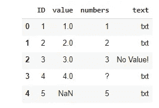
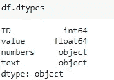
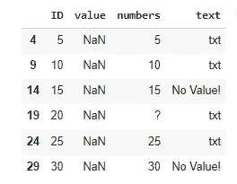
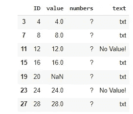
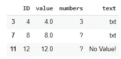
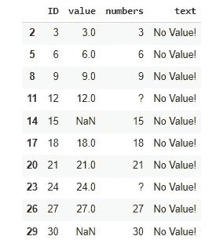

# 寻找缺失值的 3 种方法

> 原文：<https://towardsdatascience.com/3-approaches-to-find-missing-values-ff656eba6902>

## 学习处理不同类型缺失值的好方法


[Ehimetalor Akhere Unuabona](https://unsplash.com/@theeastlondonphotographer?utm_source=unsplash&utm_medium=referral&utm_content=creditCopyText) 在 [Unsplash](https://unsplash.com/s/photos/missing?utm_source=unsplash&utm_medium=referral&utm_content=creditCopyText) 拍摄的照片

## 引言

我将以一个“启示”开始这篇文章:*现实世界中的数据集并不总是像 NaN 一样缺少值。*

是的。他们可以是任何东西。在你浪费大量时间试图弄清楚该做什么之前，请继续阅读这篇短文，以获得处理这些类型数据的 3 种好方法。

首先我要给大家介绍一个缺失数据或者空值。

> 当列中的值未知或缺少时，使用数据集中的空值**。(改编自 docs.microsoft.com)**

上面的定义意味着无论何时你看到或南？、—，等等，不代表来自该变量或列的数据的一个观察值的所有内容，即缺失值或空值。

## 你将如何找到他们

很多时候，是的，null 值会以 Python 中著名的 *NaN* 或者 RStudio 中简单的 *NA* 的形式出现。在这些情况下，该值不会改变变量的数据类型。

其他时候，由于多种原因，数据可能会出现在由数据集创建者确定的特定文本符号下。例如，可以使用“无值”作为缺失值的代理。也可以是#或-，！或者别的什么。在这些情况下，变量的类型将被更改为字符串。

因此，如果您正在处理另一种数据类型，比如数字，就更容易注意到该列中有一个错误的值。如果你正在处理文本，它会稍微复杂一点，但是我们会看到该怎么做。

让我们看看如何处理每一种情况。

## 常见缺失值 NaN

首先，我将创建一个玩具数据集并导入一些库。

```
# imports
import pandas as pd
import numpy as np# Create a dataframe
df = pd.DataFrame({'ID': range(1,31),
'value':[n if n % 5 != 0 else np.nan for n in range(1,31)],
'numbers': [n if n % 4 != 0 else '?' for n in range(1,31)],
'text': ['txt' if n % 3 != 0 else 'No Value!' for n in range(1,31)],
})df.head()
```



数据帧已创建。图片由作者提供。

检查数据类型，注意列*的值*，其中有 NaN，它保持其类型为 float。但是看列*的数字*，它已经被强制转换成字符串。

```
df.dtypes
```



如果缺少的值是字符串，数据类型可能会改变。图片由作者提供。

您可以使用方法`isna() or isnull()`来查找缺失值，但是它们都不会找到列*编号*或*文本、*的缺失值，因为这些是 Pandas 识别(或强制)为文本的列中的文本缺失值。

```
# Finding the total of null values
df.isna().sum()# Or you can also use
df.isnull().sum()
```


看到没有将指向“？”或者“没有价值！”作为缺失值。图片由作者提供。

对于已知的缺失数据，只需对数据集进行切片就可以找到它们。

```
# Pandas has good methods for that
df[ df.value.isna() ]
```



“值”列中缺少的 6 个值。图片由作者提供。

从这里，你可以使用许多可用的技术来处理缺失数据:删除，插补，插值等。我在下面的文章中浏览了几个选项。

[](/exploratory-data-analysis-with-python-part-1-b6248b28dc85) [## 使用 Python 进行探索性数据分析—第 1 部分

### 让您开始使用 Python 和 Pandas 分析数据的模板。

towardsdatascience.com](/exploratory-data-analysis-with-python-part-1-b6248b28dc85) 

## 带有文本缺失数据的数值数据

现在对于其他列，最好的方法之一是，首先检查数据类型，就像我们在`df.dtypes`之前所做的那样。

如果我们知道在某一列中我们应该有哪种类型——就像我们知道列*数字*应该有整数——但是我们得到了与预期不同的东西，那么我们知道我们可能有一个丢失的数据点或者我们应该在该列中仔细检查的东西。

所以，既然我知道我的列*数字*必须是整数，我将继续寻找非数字数据，比如不同于数字(0–9)的数据。

```
# Find the non-numeric with isdigit to assess if the data is number.
# You can also use .isnumeric()
df[ df.numbers.astype(str).str.isnumeric() == False ]
```



我们已经找到了丢失的数字:'？'—图片由作者提供。

当然，也有数字以文本形式出现的情况，只是因为 Python 无法识别正确的类型或它带有额外的空格(例如，“3”)，但在这种情况下，它要么不会作为缺失值出现，要么不会出现在您的列表中，但您知道它是正确的，您可以继续进行清理/格式化/转换以反映正确的数据类型。



带有额外空格的数字 3 被识别为“非数字”。图片由作者提供。

## 缺少值的文本数据

在不知道 NAs 在哪里的情况下，如何处理文本数据？

很多时候， **NaN** 值可以作为文本条目“NA”、“？, "—", "!"、【NULL】*等*，但它们可以是许多其他的东西。因此，我们的想法是使用正则表达式来尝试找到它们。一旦你找到了模式，识别其他的就变得容易了。

假设我们不知道列*文本*的 NA 值是“无值！”。我们将使用正则表达式检查许多模式。

在下面的代码中，我将应用一个 lambda 函数，在列文本的每一行中查找以下文本值:“NA”或“*”或“？”或者“！”或“#”或“-”并检查它找到的列表的长度。如果列表不为零，这意味着我找到了一些东西，所以在那一行中至少有一个模式。您可以在正则表达式中包含任何其他值。

```
# Import Regular Expressions lib
import re# Using regex to find the NA values
df[ df.text.apply(lambda x: len(re.findall('NA|[*|?|!|#|-]', x)) !=0 )]
```



找到结果。所有的空值。图片由作者提供。

## 在你走之前

在开始探索性分析之前，了解您的数据始终是必须的。如果可以的话，查看数据集文档，如数据字典或研究总结。这些文档将为您带来丢失的数据案例以及它们是如何被识别的。

对于您公司的业务数据，请尝试与该数据库的所有者交谈，以帮助您赢得时间并更快地找到 NAs。

如果你缺乏这两种选择，那么就选择上面显示的三种方法。

丢失数据处理起来并不复杂，但是如果没有正确清理，它肯定会损害您的工作。

更多内容，别忘了关注我。

[](https://gustavorsantos.medium.com/) [## 古斯塔沃·桑托斯-中等

### 阅读古斯塔夫·桑托斯在媒介上的作品。数据科学家。我从数据中提取见解，以帮助个人和公司…

gustavorsantos.medium.com](https://gustavorsantos.medium.com/) 

如果你喜欢的话，可以订阅 Medium。你可以在这里使用我的推荐代码。

[熊猫文献。](https://pandas.pydata.org/docs/reference/api/pandas.Series.str.isdigit.html)