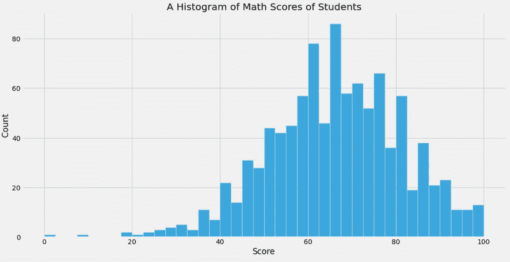
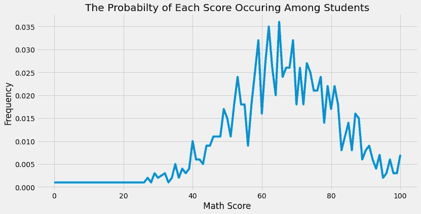
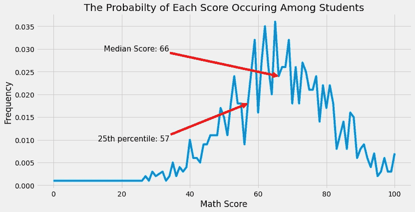
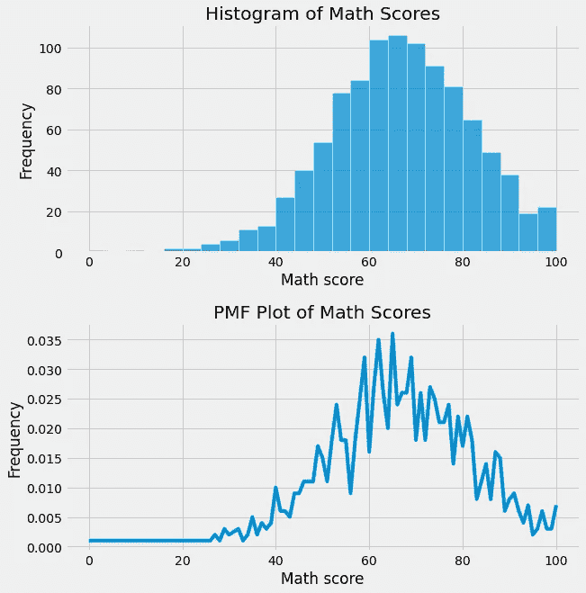
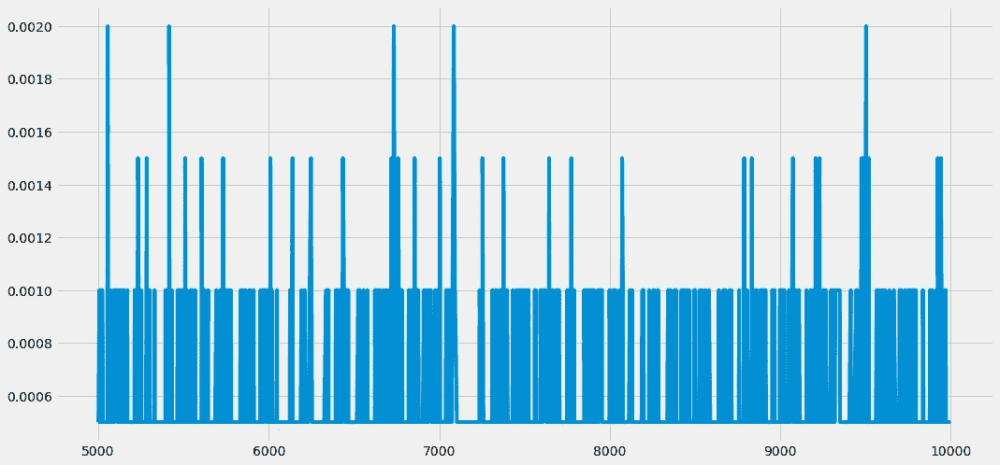
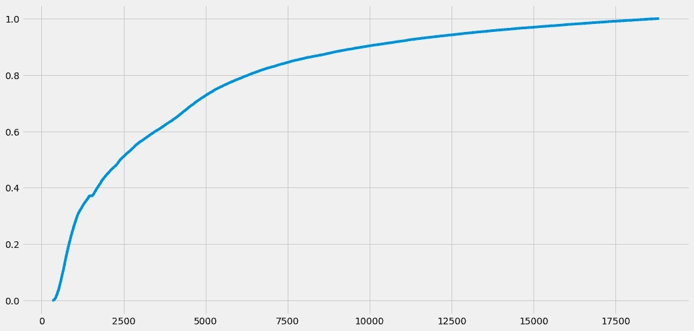
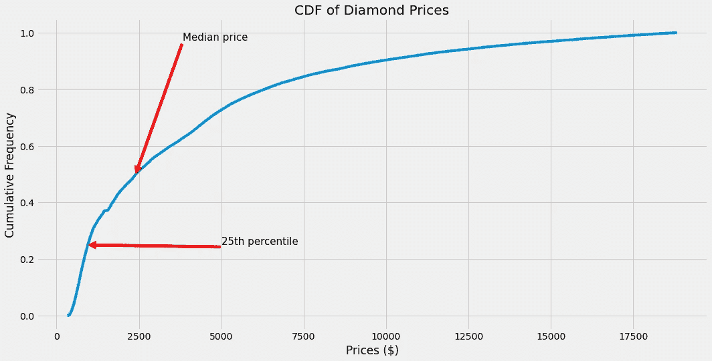
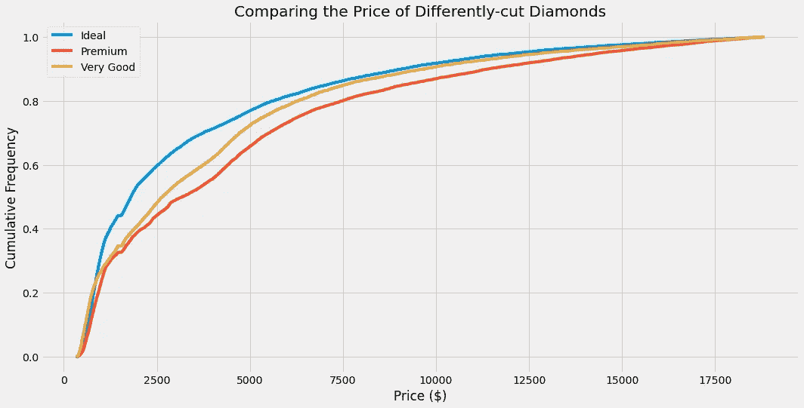
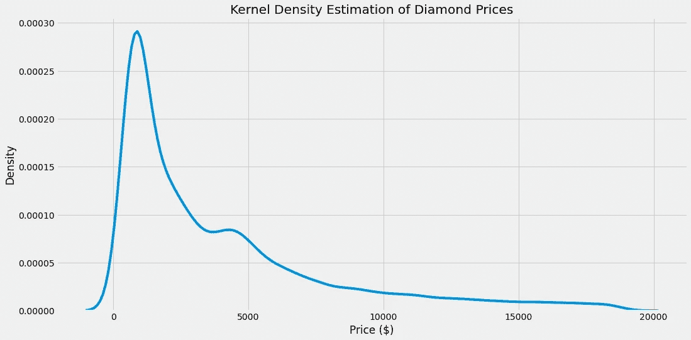
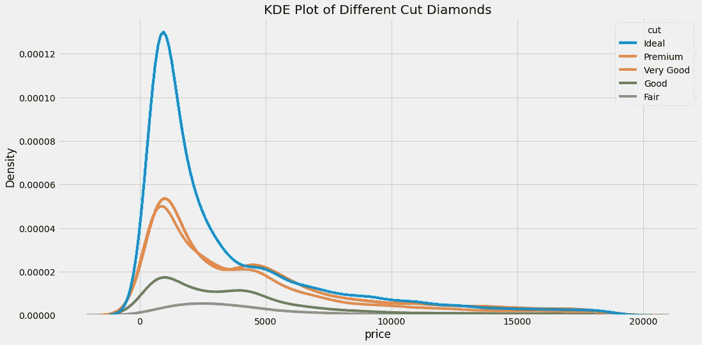

# 直方图的 3 个最佳(通常更好)替代方案

> 原文：<https://towardsdatascience.com/3-best-often-better-alternatives-to-histograms-61ddaec05305>

## 避免直方图最危险的陷阱


斯科特·韦伯的照片

## 宁滨偏差，直方图的最大缺陷

直方图可能是您开始数据科学家之旅时使用的第一个图表。它们是直观且容易理解分布形状的图表。

然而，当你在旅途中前进时，你会发现直方图并不那么美好。直方图将值分组到称为仓的间隔中，直方图中每个仓的高度表示该仓中的点数。考虑这个例子:


作者图片

从这个直方图中，我们可以立即看到大多数分数在 60 到 80 之间。让我们看看如果我们将容器数量从 10 个更改为 20 个会发生什么:


作者图片

然而，前一种趋势是显而易见的。让我们继续改变，这次从 20 岁到 40 岁:



作者图片

现在，我们可以看到分布并不像看起来那么平滑。您可以注意到 40、62、68 和 80 附近有 40 个频段的小峰值。所以，箱子的数量实际上可能掩盖了对我们分布的本质认识。

然而，过多地改变箱的数量可能只会引入随机噪声，并使其看起来像一个重要的发现。这就给我们带来了**宁滨偏差，**这也是直方图的最大缺陷。

> 宁滨偏差是直方图的一个缺陷，当您改变要绘制的条柱数量时，您将获得相同数据的不同表示。

在后面的章节中，我们将看到三种直方图选择，它们避免了宁滨偏差，并给出了比较分布的更好结果。

[](https://ibexorigin.medium.com/membership)  

获得由强大的 AI-Alpha 信号选择和总结的最佳和最新的 ML 和 AI 论文:

[](https://alphasignal.ai/?referrer=Bex)  

## 离散和连续数据复习

在我们讨论替代方案之前，我想为那些不熟悉的人提供一些关于数据类型的信息。

有两种类型的数值数据:

*   **离散数据**——通过计数记录的任何数据，如年龄、考试分数，有时还有时间的个别组成部分，如年份、工作日或月份数字等。
*   **连续数据** —测量记录的任何数据，如身高、体重、距离等。时间本身也被认为是连续的数据。连续数据的一个定义方面是，您可以用不同的度量单位来表示相同的数据。例如，可以用英里、公里、米、厘米和毫米来度量距离，列表 ***延续*** 。无论多小，你都可以找到一个更小的连续数据的度量单位。

> 关于货币和价格，统计学家们争论货币是连续的还是离散的，所以我就不多说了。但是，需要注意的是，银行业和税务系统将货币视为连续数据。

## 概率质量函数— PMF 图

直方图的第一种替代方法是绘制概率质量函数的结果。

概率质量函数是一个采用**离散**值的分布(任何序列)并返回每个唯一值的频率的函数。考虑这个小分布:

```
x = [4, 6, 5, 6, 4, 3, 2]
```

为了计算这个分布的 PMF，我们将使用来自`empiricaldist`库的`Pmf`函数(由 Allen B. Downey 编写，他是著名书籍的作者，如 *ThinkStats* 、 *ThinkPython、*和 *ThinkBayes* :


作者图片

为了创建分布，我们将使用`Pmf`函数的`from_seq`方法，该方法将一个序列作为参数。

结果是一个`Pmf`对象(`pandas`系列)，其中包含传递的分布的唯一值。它们以有序索引的形式给出，其频率(计数)在`probs`下。

现在，如果我们将`normalize`设置为`True`，`probs`将包含每个值的小数频率，总计为 1:


作者图片

要获得任何值的频率，我们可以使用括号运算符:

这是一个简单的例子，给你一个概率密度函数的概念。接下来，我将从这个[源](https://www.kaggle.com/datasets/spscientist/students-performance-in-exams)加载一个从 Kaggle 下载的样本学生分数数据集:

```
marks = pd.read_csv('data/student_performance.csv')
>>> marks.head()
```


作者图片

首先，我们将为数学成绩创建一个 PMF 分布:

就像之前一样，`math_pmf`隔离出数学成绩的唯一值，并将其归一化。`Pmf`对象有一个默认的`plot`方法，绘制一个线图(要绘制一个条形图，可以使用`.bar`函数):



作者图片

线上的每个数据点对应于分布中的唯一分数及其百分比频率。

为了更容易理解，我将对中位数和第 25 个百分位数进行注释:



作者图片

> 大约 25%的学生得分为 66，大约 17%的学生得分为 57。

从图中，我们可以看到大多数学生的得分在 55-70 之间。该图的优点是我们可以看到数据中的一些峰值，例如峰值在 40°处，另一个峰值在大约 55°处。如果我们使用直方图，这可能会变得模糊不清，看起来也不会很好:



作者图片

最后，还有另一种方式来解释 PMF 的结果。之前，我们看到大约 25%的学生得到了 66 分的中值。这也意味着如果我们从分布中随机选择一个学生的分数，我们有 25%的机会得到 66 分。这种看待事物的方式会对我们以后有所帮助。

请记住，PMF 函数最适用于离散值。我们将在后面的章节中看到它对于连续数据的等效。

## 累积分布函数图

快速提问——有人意识到 PMF 阴谋的最大缺点了吗？如果没有，这里是:它不能与有太多唯一值的分布一起工作。例如，我将创建 2000 个随机整数来模拟一个离散分布，并用 PMF 来绘制它:



作者图片

如果我们使用 PMF 图，噪音太大，我们无法获得任何有意义的见解。使用直方图太危险了，因为很难选择最好地描述分布的宁滨。

对于这种分布，有一个鲜为人知但非常有用的函数:累积分布函数。与 PMF 不同，它们可以采用任何值(离散、连续、混合)并显示分布趋势。

为了更好地理解，让我们从一个微不足道的例子开始:

```
# Simple dist
dist = [1, 2, 3, 4, 5, 6, 7]
```

我创建了一个由 7 个连续整数组成的伪序列。为了创建 CDF，我们将使用`empiricaldist`库的`Cdf`功能:


作者图片

`Cdf`也有类似的`from_seq`方法。它还接受唯一值，并按照索引对它们进行排序。不同的是概率。

假设你从一个分布中选择一个随机值 *x* 。在这种情况下，**累积分布函数**将告诉您获得小于或等于该值的概率:


谷歌搜索结果

对于我们从 1 到 7 的小分布值，假设我选择了 5。有五个值小于或等于 5，因此`CDF(5)`大约等于 72%。类似地，`CDF(1)`等于 14%，分布中的最大值将总是有 100%的概率，因为所有值都小于或等于最大值。

另一种说法是，首先，计算每个唯一值的分数频率并排序。然后，来自分布的随机值的 CDF 将等于小于或等于 *x* 的所有唯一值的单独频率之和。

接下来，我将从`seaborn`加载内置的`diamonds`数据集，我们将看到钻石价格的`CDF`图:

链接到数据集回购:[https://www.kaggle.com/datasets/shivam2503/diamonds](https://www.kaggle.com/datasets/shivam2503/diamonds)



作者图片

绘制累积频率可以让我们消除随机性，不受噪音干扰。就像之前一样，让我们注释一下中间价格和第 25 个百分位数:



作者图片

> 本质上，CDF 只是百分位数的另一种框架。从结果中查找任何值，比如 17，CDF 会告诉它的百分位数，或者在分布中小于或等于 17 的值的百分比。

当我们在同一个图上绘制不同的分布时，可以看到 CDFs 的一个明显的优点。

让我们画出 3 种不同类型的钻石切割的价格。我将创建*理想*、*高级、*和*非常好*切割钻石的 CDF:



作者图片

如果你正确解读这个情节，你会发现一个重要的发现。出乎意料的是，比*特级*或*非常好*钻石更理想的价格非常低的钻石还有很多。

让我们重点关注价格在 0 到 2500 之间的钻石。在这个区间里哪条线最高？是理想钻石的蓝线。事实上，60%或更少的理想钻石价格在 0-2500 英镑之间。相比之下，*非常好的*钻石的其他线的高度几乎是 50%,*高级*钻石的大约 45%。

因此，当用 CDF 图比较分布时，一些区间之间的线的高度(陡度)说明了该区间中的点数。线越高，值越多。

如果区间包含陡度角更接近水平线的线，则表明该区间中的点更少，但它们的值更大。例如，在我们的图中，所有三条线在 12500 美元之后几乎都变成了水平线，这告诉我们很少有钻石的价格超过了这个数额。

通常最好使用 CDF 来比较不同组的分布。与其他图相比，它们给出了更好的分布视图。

## 核密度估计(KDE)图，解释

另一个观察分布形状的好图是 KDE 图(核密度估计)。KDE 图使用概率密度函数，这是概率质量函数的替代方法，但适用于任何类型的分布。

如果在离散分布中有太多独特的数据点，PMF 只是将随机噪声引入我们的图中，而不是给出任何见解。然而，它们比直方图好得多，因为它们不会陷入宁滨偏差带来的陷阱，例如模糊或过度表示数据。

当我们处理连续数据的分布时，几乎每个数据点都是唯一的，因为每个值都可以有小数点。有了这种类型的数据，我们就不能问这样的问题了，比如“精确 2 英寸降雨量的确切概率是多少？”。问这个问题就意味着问精确 2 英寸降雨的概率，而不是多一个水分子或少一个水分子，不是 2.01，也不是 1.9999。答案当然是 0，因为 2 可以有无限多的小数。

然而，我们可以很快回答这样一个问题:下雨 ***大约*** 2 英寸的概率是多少？概率密度函数帮助我们回答这类问题。

在统计学中，pdf 的结果是用一种叫做核密度估计(KDE)的方法来估计的。在不涉及统计细节的情况下，我们将在本节学习如何绘制 KDE 图。

首先，您可以使用的`kdeplot`功能创建 KDE 图。我们将再次使用`diamonds`数据集:



作者图片

> 如果你不熟悉统计学，请忽略 KDE 图的 y 轴。解释它远远超出了本文的范围。

与 CDF 不同，在 CDF 中你会得到一条平滑的线，KDE 图最适合于快速确定分布的中心趋势、双峰和偏斜。

`kdeplot`有一个有用的参数`hue`，它让我们指定第二个变量来对结果进行分组:



作者图片

`KDE`图非常适合于比较不同的分布并同时辨别分布的个体质量。例如，上面的图显示了哪个分布有更多的值，它们在哪里聚集，它们的偏斜度和模态。

> 参见 Seaborn 文档的[页面，了解更多关于 KDE 地块和 pdf 的信息。](https://seaborn.pydata.org/tutorial/distributions.html#tutorial-kde)

## 结论

在本文中，您了解了三种最常见的直方图替代方法。它们可以根据数据类型显示关于分布的不同见解，但主要是帮助您避免宁滨偏差。

然而，这并不意味着你必须完全抛弃直方图。通过计算数据点数量的平方根，可以粗略估计出适合您的分布的容器数量。

感谢您的阅读！

[](https://ibexorigin.medium.com/membership)  [](https://ibexorigin.medium.com/subscribe)  

## 您可能也会感兴趣…

[](/open-source-ml-project-with-dagshub-improve-pet-adoption-with-machine-learning-1-e9403f8f7711)  [](/complete-guide-to-experiment-tracking-with-mlflow-and-dagshub-a0439479e0b9)  [](https://ibexorigin.medium.com/6-sklearn-mistakes-that-silently-tell-you-are-rookie-f1fe44779a4d)  

[https://towards data science . com/19-hidden-sk learn-features-you-should-to-learn-the-d-way-5293 e6ff 149](/19-hidden-sklearn-features-you-were-supposed-to-learn-the-hard-way-5293e6ff149)