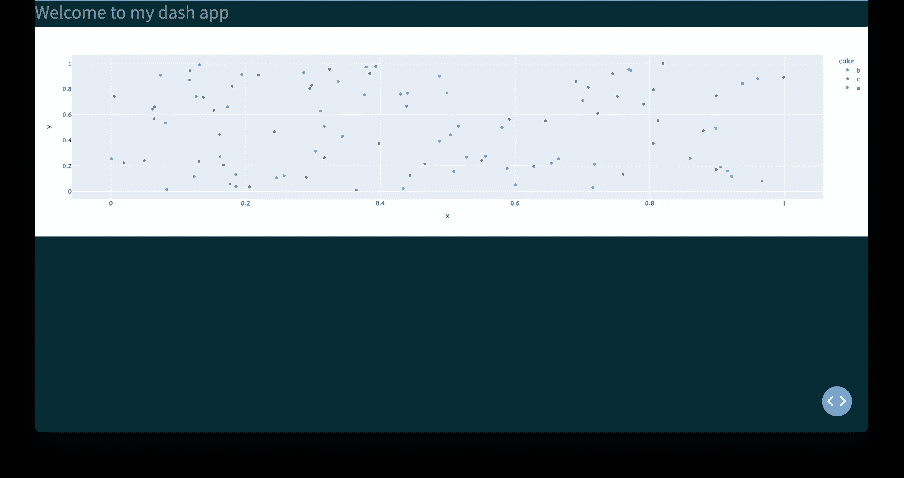
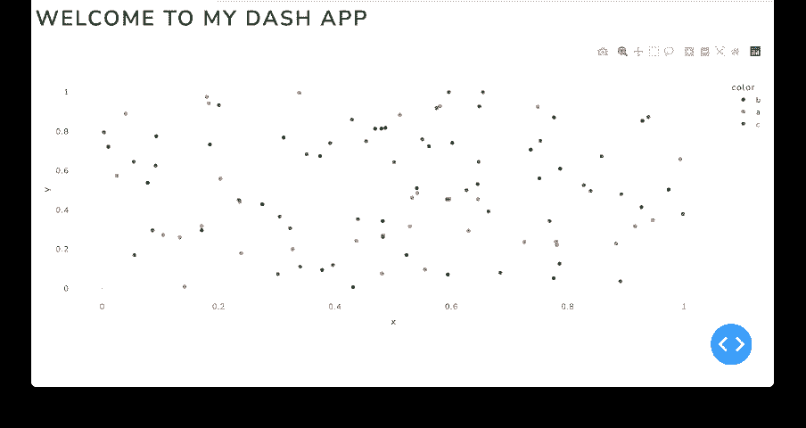
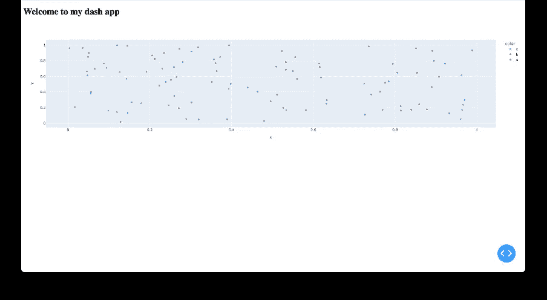
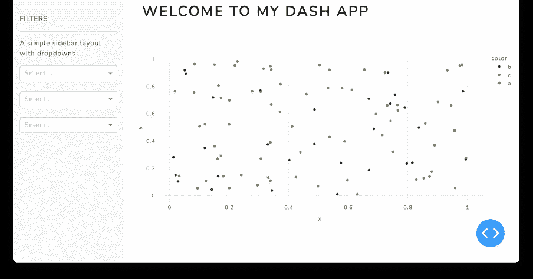

# 让你的 Dash 应用看起来更好的 3 个简单方法

> 原文：<https://towardsdatascience.com/3-easy-ways-to-make-your-dash-application-look-better-3e4cfefaf772>


Luke Chesser 在 UnSplash 上的照片

Dash 是一个低代码框架，它允许你构建通过网络浏览器呈现的数据可视化。没有许可费用，它提供了一种灵活和免费的方式来构建应用程序。如果你想了解更多关于如何构建 dash 应用程序的知识，我建议你从[文档](https://dash.plotly.com/installation)中的教程和 [Charming Data](https://www.youtube.com/c/CharmingData/playlists) 的 Youtube 视频开始。

Dash 中的默认设置可以产生一些“功能性”的东西——它完成了工作——但并不总是看起来很棒。在这篇文章中，我将介绍三种简单的方法来改善你的观想的观感。

为了看看它们在实践中是如何工作的，我构建了一个非常快速的虚拟应用程序，没有使用任何样式——它并不是很棒。


作者图片

# 1.使用主题

改善整体外观和感觉的最快方法是使用主题。Dash bootstrap 主题通过标准化标题、按钮、标签、表格、警告等内容的格式，提供了一种快速改进格式的方法。有一系列的风格，Dash 提供了一个“[主题浏览器](https://dash-bootstrap-components.opensource.faculty.ai/docs/themes/explorer/)”。

主题列表是[鹂](https://bootswatch.com/cerulean/)、[科斯莫](https://bootswatch.com/cosmo/)、[电子人](https://bootswatch.com/cyborg/)、[暗黑](https://bootswatch.com/darkly/)、[平淡](https://bootswatch.com/flatly/)、[期刊](https://bootswatch.com/journal/)、 [LITERA](https://bootswatch.com/litera/) 、[流明](https://bootswatch.com/lumen/)、[力士](https://bootswatch.com/lux/)、[本草](https://bootswatch.com/materia/)、[明蒂](https://bootswatch.com/minty/)、[变身](https://bootswatch.com/morph/)、 <https://bootswatch.com/pulse/> [SPACELAB](https://bootswatch.com/spacelab/) ，[超级英雄](https://bootswatch.com/superhero/)，[联队](https://bootswatch.com/united/)，[蒸汽](https://bootswatch.com/vapor/)，[雪人](https://bootswatch.com/yeti/)，[西风](https://bootswatch.com/zephyr/)。

要使用主题，您需要导入 dash 引导组件:

```
import dash_bootstrap_components as dbc
```

然后，要指定主题，您需要在启动应用程序时向“external_stylesheets”添加一个参数。

```
app = dash.Dash(external_stylesheets=[dbc.themes.LUX])
```

下图是 CYBORG——它使字体更加现代。


作者图片

然而，当你使用深色背景的主题时，一个问题就变得很明显了。样式对情节没有任何影响——一个奇怪的白盒出现在黑暗的背景下。我们可以用图形模板来解决这个问题。



作者图片

# 2.使用图形模板

图形模板设计图形的样式。它通过改变颜色和字体来匹配情节的风格和主题的风格。

要使用体形模板，您需要从 dash 引导模板中导入它:

```
**from** dash_bootstrap_templates **import** load_figure_template
```

一旦加载了体形模板，就可以按以下方式使用它:

```
load_figure_template(‘LUX’)
```

您可以立即看到原始图形的背景图已经消失，颜色更新为主题。


作者图片

# 3.使用布局并添加填充

但是我们还可以做更多的事情，因为文本和图例就在页面的边缘。为了解决这个问题，我们可以使用 bootstrap layout 告诉应用程序在哪里放置项目，然后给每个元素添加一些边距。

布局由网格系统控制。有 12 列，列宽由该列应该跨越 12 列中的多少列来控制。

列包含在行中，也就是说，应用程序应该由一系列行组成，这些行可以有不同数量(和宽度)的列。如果不指定行内的列宽，默认情况下，它们将被平均分割。代码的概要如下:

在我们的应用程序中，我们应该有 2 行——一行用于标题，一行用于图表。

因为每行只有一列，所以没有必要放置 dbc。Col()到[]中，但如果有多列，则必须这样做。

现在我们有了布局中的每个元素，我们可以添加样式。样式调用需要一个字典，在那里你可以指定上边距、下边距、左边距和右边距

```
style = {‘margin-left’:’7px’, ‘margin-top’:’7px’}
```

在我们的应用程序中，我们已经为标题做了这些，并将图的边距增加到“15px ”,这样它就比标题缩进得更多。



作者图片

使用布局结构的真正好处是，您可以快速、轻松地添加其他元素并更改布局(重要的是对齐)。例如，许多仪表板使用侧栏，您可以在其中选择不同过滤器。要创建侧栏，需要在行内创建列。你想在侧边栏中显示的内容包含在“侧边栏”中。


作者图片

在这里，我将包含图表的列的宽度设置为 9，这意味着侧边栏占据了 3/12。如果侧边栏变宽了，你可以很快地改变它。


作者图片

没那么好，我改回 3/12。

# 结论

通过查看之前和之后的图像，我们可以看到，通过 15 分钟的工作，我们可以非常快速地改善 Dash 应用程序的外观。你可以在我的 [github](https://github.com/charlotteamy/Dash-visualisation/blob/main/Dash_blog.py) 上找到生成这个应用的代码。

## 以前



作者图片

## 在...之后



作者图片

感谢您的阅读——请务必让我知道您的任何反馈。

参考资料:

Dash 文档:【https://dash.plotly.com/introduction 

Dash bootstrap 文档:[https://dash-bootstrap-components . open source . faculty . ai](https://dash-bootstrap-components.opensource.faculty.ai)

_________

我喜欢为商业用户写关于数据科学的文章，我热衷于使用数据来提供切实的商业利益。

您可以通过 LinkedIn 与我联系，并通过 Medium 关注我，了解我的最新文章。