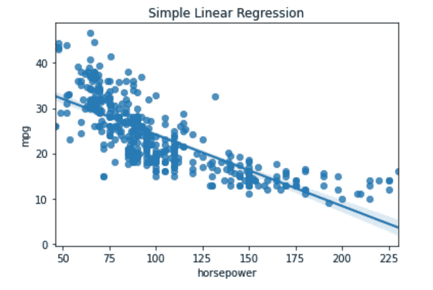
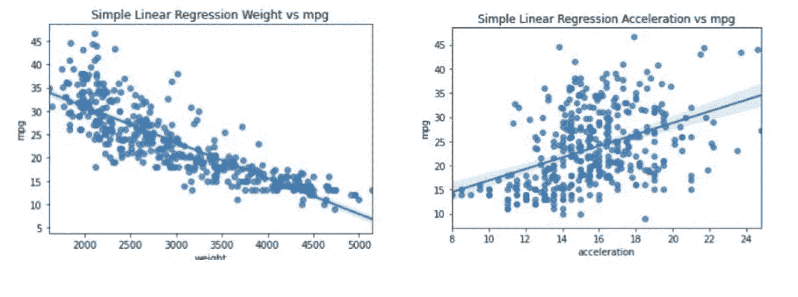
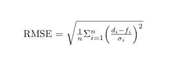
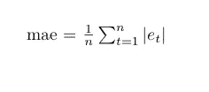

# 回归的 3 个评估指标

> 原文：<https://towardsdatascience.com/3-evaluation-metrics-for-regression-80cb34cee0e8>

# 回归的 3 个评估指标

## …用简单的英语解释

由 [Unsplash](https://unsplash.com/s/photos/car?utm_source=unsplash&utm_medium=referral&utm_content=creditCopyText) 上的 [CHUTTERSNAP](https://unsplash.com/@chuttersnap?utm_source=unsplash&utm_medium=referral&utm_content=creditCopyText) 拍摄

基于回归的机器学习模型用于预测连续属性的值。与所有监督机器学习问题一样，该模型使用一组特征(X)来训练，以学习到目标变量(y)的映射。在回归的情况下，目标是一个连续变量，如房价。

大概最简单的回归算法就是线性回归了。简单的线性回归只有一个要素和一个目标，用下面的等式表示。

线性回归。图片作者。

举一个简单的例子，假设我们想只根据一辆汽车的马力来预测它的每加仑英里数。在这种情况下，以下内容适用:

***【易】***代表目标变量，或 MPG。

*代表特性，在这里是马力。*

****β1*** 是马力要乘以的系数或数值。*

***β0是直线与 y 轴相交的点，如下图所示。***

****εi*** 是模型中的误差，度量估计关系中的方差。*

*我们可以使用 [Seaborn](https://seaborn.pydata.org) Python 库为这类问题绘制一个简单的线性回归。*

**

*简单线性回归。图片作者。*

*上图中的线代表预测值。我们可以看到，并不是所有的数据点都完全符合这条线，这代表了模型中的误差。线性回归的目标是通过确定 ***β0*** 和 ***β1*** 的最佳值来最小化该误差的大小。*

*与任何机器学习问题一样，有几个指标可用于确定模型的整体性能。换句话说，这个模型在最小化整体误差方面有多好？在本文的剩余部分，我将分享三个可用于评估基于回归的模型性能的指标。*

# *1.r 平方(R2)*

*r 平方，也称为决定系数，是观察值与拟合回归线接近程度的度量。因变量将包含一定量的变化，r 平方衡量模型解释了这种变化的程度。*

*如果我们再次看上面的图表，我们可以看到，我们有一条直线代表学习模型。这就是所谓的回归线。然而，许多真实的数据点并没有落在线上。直线和每个观察数据点之间的距离称为残差。*

**

*残留。图片作者。*

*r 平方度量是通过推导每个数据点的残差并将结果平方来计算的。得到的数字相加在一起，这就成了模型中无法解释的方差的度量。它的公式通常表示如下。*

**

*r 平方。作者图片*

*r 平方值的范围从 0 到 1，其中 1 分表示模型能够解释因变量的所有方差。下图比较了两个不同自变量的回归线。我们可以看到，观察到的重量值更紧密地聚集在回归线周围。*

*如果我们比较 r 平方值，我们也可以看到一个实质性的差异。对于重量与 MPG，r 平方值为 0.69。换句话说，该模型能够解释因变量中 69%的方差。加速度的 r 平方值低得多，为 0.18，这个模型只能解释 18%的方差。*

**

*比较不同的独立变量。图片作者。*

*r 平方很少单独用于估计模型的性能，因为它不能给出任何偏差的度量。因此，对于具有高偏差的模型，可能具有高的 r 平方值。这就是为什么我们还需要考虑其他的绩效衡量标准。*

# *2.均方根误差(RMSE)*

*上述残差也可以被认为是一种测量回归模型中误差的方法。RMSE 本质上是对这些残差分布程度的一种度量，是量化回归模型总体误差的一种标准方法。*

*通过首先计算均方误差(MAE)来计算 RMSE。要做到这一点，你需要获得代表因变量的每个数据点的残差，并对该值求平方。然后将所得值相加，并除以总点数减 2。那么 RMSE 就是这个数的平方根。*

**

*RMSE。图片作者。*

*RMSE 越小，模型越接近数据。这通常被认为是解释模型的最佳方式之一，因为它与因变量具有相同的单位。*

*RMSE 的一个潜在缺点是，由于计算指标的方法，优化 RMSE 将比其他指标更多地惩罚较大的错误。因此，当模型特别不希望出现较大误差时，这是最有用的。*

*RMSE 没有标准的“好”分数，因此，与基准分数(如使用简单模型生成基线)相比，它是最有用的。*

# *3.平均绝对误差*

*MAE 是预测值与观察值之间距离的另一种度量。它与 RMSE 相似，其单位与因变量的单位相匹配。然而，在 MAE 分数中观察到的变化是线性的，因为 MAE 的值将随着误差的增加而增加。因此，MAE 不会因为较小的错误而惩罚较大的错误。*

*MAE 度量总是正数，数字越小，模型越适合。与 RMSE 一样，没有标准的“好”分数，因此与基线模型进行比较非常重要。*

*MAE 的计算方法是，首先对残差的绝对值求和，然后将结果除以观察总数。*

**

*平均绝对误差。图片作者。*

*与其他机器学习问题一样，对于评估回归模型的性能，没有单一的最佳度量。您选择的度量标准将取决于用于定型模型的数据以及模型的使用方式。考虑偏差风险、误差大小以及在实际使用模型时可能产生的影响。在大多数情况下，通常使用几个指标来评估整体性能，通常与基准进行比较是最有用的。*

*在本文中，我简单介绍了评估回归最常用的三个度量标准。然而，还有更多的，sckit-learn 文档包含了一个很好的列表，其中列出了可以使用的其他指标[这里是](https://scikit-learn.org/stable/modules/model_evaluation.html)。*

*感谢阅读！*