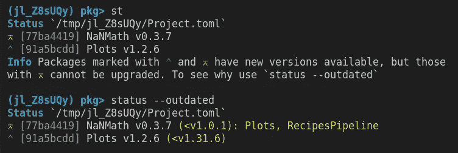

# Julia 1.8 新增了 3 个你不想错过的功能

> 原文：<https://towardsdatascience.com/3-features-just-added-in-julia-1-8-you-wont-want-to-miss-543d523dfb5d>

## 苹果硅支持，键入全局，等等

作者图片

Julia 1.8 是 GitHub 发布的热门版本，包含了大量有用的新特性。如果你想全面了解所有的新变化，可以看看核心开发团队的[发布博客。](https://julialang.org/blog/2022/08/julia-1.8-highlights/)

在这篇文章中，我将重点介绍上面链接中提到的 3 个让我对这个版本最感兴趣的特性！

# 改进了对苹果芯片的支持🍎💻

随着越来越多的开发人员开始过渡到使用 Apple Silicon，开源工具在这个架构上开箱即用的需求变得越来越重要。Julia 1.8 解决了许多与以下相关的问题:

> Julia 如何在内部使用 LLVM 来生成和链接该平台的代码，并最终在 Julia 1.8 中通过转移到一个[更现代的链接器](https://github.com/JuliaLang/julia/pull/43664)得到解决，该链接器对 macOS 上的 ARM CPUs 有更好的支持。

虽然 Julia 1.8 修复了这些问题和常见的分段错误，但这些问题无法移植到 Julia 1.7，因此该版本将始终存在 Apple Silicon 的问题。如果您正在使用 Julia 1.7，并且遇到了上述任何问题，建议更新到 1.8，因为该版本将 Apple Silicon 更改为[第 2 层支持【Julia 1.9 可能会为 Apple Silicon 带来第 1 层支持)。](https://julialang.org/downloads/#supported_platforms)

看到如此多的努力被投入到为苹果硅 Mac 用户获得稳定性是令人敬畏的。作为这些用户中的一员，我在产品化期间遇到了一些棘手的问题，但在大多数情况下，这些问题出现的频率似乎在迅速降低。此外，如果你错过了，Metal.jl 的技术预览，这是在 Julia 中编程苹果 M1 GPU 的包，于 2022 年 6 月底公布，请在 [Julia GPU 博客](https://juliagpu.org/post/2022-06-24-metal/)上了解更多信息。

M1 Mac Julia 用户的未来是光明的！

*编辑:我和我的合著者很高兴地告诉大家，我们的新书《朱莉娅速成教程》已经开始预售了:*

 [## 朱莉娅速成班(电子书预购)

### Julia 速成课程是使用 Julia 编程语言的实践指南，是为初学者编写的。我们接受…

logankilpatrick.gumroad.com](https://logankilpatrick.gumroad.com/l/juliacrashcourse) 

# 键入全局⌨️🌎

在以前版本的 Julia 中，不可能指定非常数全局变量的类型。在 Julia 1.7 和之前的版本中，如果您尝试这样做，该语言会给出如下错误:

作者捕获的图像

在这个例子中，我们试图将`a`的类型设置为`Int`，但是当我们这样做时，Julia 给出了一个错误。

在 Julia 1.8 中，您可以看到行为已被更新以支持此功能:

作者捕获的图像

1.8 的博文还指出:

> 类型注释全局变量消除了使用非常数全局变量的大部分(但不是全部)开销。

这听起来很好，因为以前热衷于全局变量的一个核心原因是它引入了大量的计算开销。这个改变应该为新的和有经验的 Julia 用户移除一个小的锋利的边缘！

# 具有可升级包装指示器的包装状态更新📦

任何读过我之前的文章(比如[这篇](https://blog.devgenius.io/the-most-underrated-feature-of-the-julia-programming-language-the-package-manager-652065f45a3a))的人都知道 Julia 中的包管理器是我最喜欢的特性之一。这确实使在 Julia 中做事成为一种真正的乐趣，因为我可以确信在我的本地计算机上运行时不会有任何奇怪的问题。

在 Julia 1.8 中，与包版本相关的另一个令人敬畏的生活质量改进是可用的。在以前的 Julia 版本中，当你在包管理器中运行`status`命令时，你会得到你的活动环境中所有包的打印结果。虽然这很有帮助，但如果您想知道应该使用哪个版本的软件包或最新的可用版本，它并不总能提供您所需要的全部信息。

现在在 Julia 1.8 中，包管理器给出了一个可视化的指示，如果有一个新版本的已安装包可用，如果有其他包的版本约束，包版本是否可以成功更新。让我们来看看公告帖子中的这个例子:

图片来自公告帖子

在这里，我们可以看到当我们运行`st`命令(`status`的简写)时，我们得到不同类型的向上箭头，表示两种不同的行为。这个新特性将会使你更容易判断一个包是否有新的可用版本，以及你是否有理由不能更新这个包。

如果你想了解更多的背景知识，我建议你阅读完整的博客文章。

# Julia 1.8 中其他很酷的东西👀

朱莉娅 1.8 是挤满了吨伟大的功能。我想在这篇文章中强调三个让我特别兴奋的地方。话虽如此，我还是有责任提及一些重要的 JuliaCon 2022 会议，这些会议强调了 1.8 版本中的一些工作。首先，Tim Holy 和 Valentin Churavy 做了一个关于“包预编译方面的改进”的演讲，这是 Julia 1.8 的一部分(实际上我已经在我的另一篇文章“[Julia con 2022](/5-important-talks-you-might-have-missed-at-juliacon-2022-7d9601b5dfa5)”中强调了这个视频:

另一个值得一看的视频来自 Nathan Daly 和 Pete Vilter，主题是使用 Julia 1.8 的分配分析器寻找分配，这是 Julia 1.8 中引入的一个新功能:

1.8 中发生了这么多令人惊奇的事情，我只能开始想象 Julia 1.9 中会有什么有用的新特性(希望有更多的包管理器的东西)！请继续关注，请告诉我这个版本中你最感兴趣的特性。