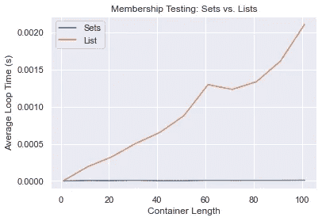

# 使用集合而不是列表的 3 个理由

> 原文：<https://towardsdatascience.com/3-reasons-to-use-sets-over-lists-82b36980c9fd>

## 了解每个容器适用的时间和位置

Heather McKean 在 [Unsplash](https://unsplash.com?utm_source=medium&utm_medium=referral) 上拍摄的照片

初学者常常选择熟悉的而不是最佳的。

大多数 Python 课程从列表开始向学生介绍容器数据类型。自然，初学者会对它们感到很舒服。开始时，你专注于快速移动和处理下一个主题，以便在动力持续的时候尽可能多地学习。结果，你养成了*有效*的习惯，但并不总是最佳实践。由于列表的多功能性，这一点尤其正确。

大多数人在一套足够用的时候会使用列表。当需要列表时，很少看到使用集合。在这些情况下，缺少的信息通常会产生错误。然而，由于列表比集合包含更多的信息，使用列表代替集合通常不会产生错误，这使得很难确定何时应该使用集合*。*

这里有 3 条线索可以帮助你发现什么时候集合比列表更有意义。

# 1.顺序不重要

与列表不同，集合不存储有序数据。列表有索引和可访问的数据，这意味着每个元素都是可检索的。无法访问集合中的单个项目，因为它们没有索引。

然而，并不是所有的数据都需要索引。比如会员测试。测试一个项目是否属于一个组并不需要对该组进行索引，因为它只返回一个`True`或`False`语句。

# 2.重复是不相关的

根据定义，集合不能包含重复项。这使得集合成为储存独特物品的理想容器。

事实上，这个属性使得 set 数据类型成为从容器中删除重复项的流行方法。例如，下面的代码创建了一个集合，`countries`，查找所有获得男子 100 米短跑奖牌的国家。即使有些国家多次出现在数据集中，`countries`也会删除那些重复的值，只返回唯一的项目。

作者图片

要进一步细化集合，请使用集合理解。与列表理解类似，集合理解通过将 for 循环减少到一行代码来创建集合。集合理解允许附加标准。例如，下面的集合理解，`startswith`，找到所有获奖的国家，并以`‘B’`开始。

# 3.处理速度很重要

因为集合不存储索引数据或副本，所以它们比列表使用更少的内存，计算开销也更小。因此，搜索集合花费的时间更少。

为了测试这一点，下面的代码执行两个成员测试。在一种情况下，容器是一个列表，在另一种情况下，它是一个集合。两个容器长度相同，并且两种情况下都将输出存储在一个集合中。

将列表案例的输出存储在一个列表中会花费更多的时间，并且会在实验中引入另一个变量，即输出类型。 ***用于创建集合理解的容器类型是这两种情况的唯一区别。***

下面的图表说明了随着容器大小的增加，成员测试中集合和列表之间的时间差。

作者图片

# 结论

如您所见，在许多情况下，集合比列表更有优势。希望这篇文章能帮助您确定何时使用集合，以避免过度依赖列表。

感谢您阅读我的文章。如果你喜欢我的内容，*请考虑关注我*。此外，欢迎所有反馈。我总是渴望学习新的或更好的做事方法。请随时留下您的评论或联系我 katyhagerty19@gmail.com。

 [## 加入我的介绍链接媒体-凯蒂哈格蒂

### 作为一个媒体会员，你的会员费的一部分会给你阅读的作家，你可以完全接触到每一个故事…

medium.com](https://medium.com/@katyhagerty19/membership)