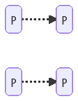
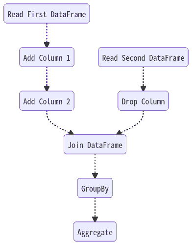
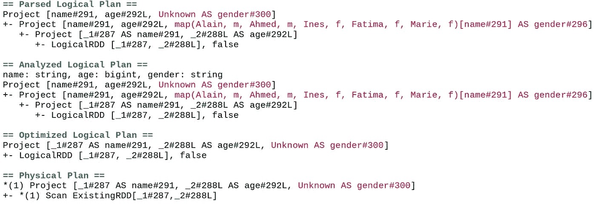

# Spark 懒评有用的 3 个理由

> 原文：<https://towardsdatascience.com/3-reasons-why-sparks-lazy-evaluation-is-useful-ed06e27360c4>

## Spark 的懒评以及你为什么要在意

作者:[阿玛尔·哈斯尼](https://medium.com/u/d38873cbc5aa?source=post_page-----40d1ab7243c2--------------------------------) & [迪亚·赫米拉](https://medium.com/u/7f47bdb8b8c0?source=post_page-----40d1ab7243c2--------------------------------)


照片由[卡斯滕·怀恩吉尔特](https://unsplash.com/@karsten116?utm_source=unsplash&utm_medium=referral&utm_content=creditCopyText)在 [Unsplash](https://unsplash.com/s/photos/dog-sleeping?utm_source=unsplash&utm_medium=referral&utm_content=creditCopyText) 上拍摄

有多少次你在笔记本上运行 PySpark 代码，期望看到一个漂亮的格式化表格，却得到一些“随机”字符串？很快你意识到你忘了展示/显示你的数据框，于是你就把它修好了。但是实际发生了什么呢？

你可能已经知道答案:**懒评**。但是到底什么是懒惰评估，更重要的是为什么 Spark 会有这种行为？

```
**Table of Contents:**
· [What is Lazy Evaluation?](#ad8a)
· [What is the difference between TRANSFORMATIONS and ACTIONS?](#cc3a)
  ∘ [Transformations](#c810)
  ∘ [Actions](#bda5)
· [Spark’s Catalyst Optimizer](#1adb)
· [What are the advantages of using Lazy Evaluation?](#bfa6)
```

# 什么是懒评？

首先，*懒惰评估*不是 Spark 发明的概念，已经存在一段时间了，只是众多评估策略中的一种。在我们的上下文中，了解以下两点是有用的:

*   *惰性求值*是一种求值策略，将表达式的求值延迟到需要它的值的时候。
*   *急切求值*是你最熟悉的求值策略，在大多数编程语言中都有使用。与惰性求值相反，表达式的求值一遇到就执行。

让我们回到火花。在 Spark 中，*惰性评估*意味着您可以应用任意多的**转换**，但是 Spark 不会启动进程的执行，直到一个**动作**被调用。

> 💡因此，转变是懒惰的，而行动是热切的。

# 转换和动作之间的区别是什么？

## 转换

转换是你用来以你想要的方式修改数据帧的指令，并且是延迟执行的。有两种类型的转换:

*   **窄**转换:单个分区需要计算的数据存在于同一个分区中。
    *例子:* `select`， `filter`



作者图片

*   **宽**转换:需要为单个分区计算的数据可能存在于多个分区中。
    *举例:* `groupBy`， `repartition`


作者图片

## 行动

动作是要求立即计算一个值的语句，是急切的语句。
*例子:* `show` `count` `collect` `save`

💡通常，一个转换将获取一个 RDD 并返回另一个 RDD。操作将采用 RDD，但将返回不同性质的内容:

```
.---------------- ---------.
| Transformation | Actions |
| -------------- | ------- |
| select         | show    |
| distinct       | count   |
| groupBy        | collect |
| sum            | save    |
| orderBy        |         |
| where          |         |
| limit          |         |
.---------------- ---------.
```

# 火花的催化剂优化器

在说实际优势之前，我们先快速说一下 Spark 的**触媒优化器**。

当执行不同的转换时，Spark 会将它们存储在一个有向无环图(或 DAG)中。你实际上可以在 **SparkUI** 中查看 DAG。下面是一个简单的例子，大概是这样的:



作者图片

一旦 DAG 被构建，Spark 的 catalyst 优化器将执行一组基于规则和基于成本的优化，以确定执行的[逻辑和物理计划](https://www.clairvoyant.ai/blog/apache-spark-logical-and-physical-plans)。


作者图片

显然，这是一个非常简化的版本，但对于我们的目的来说已经足够了。如果你想了解更多细节，你可以看看 Databricks 博客上的这篇[帖子](https://www.databricks.com/blog/2015/04/13/deep-dive-into-spark-sqls-catalyst-optimizer.html)。

# 用懒人评价有什么好处？

在使用惰性评估的优势中，我们发现了以下三点:

## 1.提高效率

Spark 的 Catalyst optimizer 将操作组合在一起，减少数据传递次数，提高性能。

catalyst 优化器的另一个优点是，通常不会用于最终结果的值将不会被计算。

举个例子吧。让我们首先定义一些数据帧:

现在，如果我们添加一个“性别”列，然后立即覆盖它:

Spark 会自动将这些操作组合在一起，因此会忽略第一个定义，因为它在最终结果中实际上并不使用。快速浏览一下逻辑与物理计划会使其更加清晰:



作者截图

所有这些也将优化驱动程序和集群通信，并加快程序。

📔查看这篇[博客文章](https://www.projectpro.io/recipes/explain-spark-lazy-evaluation-detail)获得更多详细的例子。

## 2.更好的可读性

因为您知道 Spark 将操作组合在一起并在幕后优化代码，所以您可以使用更小的操作来组织您的程序，这将提高代码的可读性和可维护性。

## 3.内存管理

如果 Spark 的转换迫在眉睫，您必须将所有中间数据帧/rdd 存储在某个地方，或者至少管理内存将成为您的另一个关注点。

使用惰性评估，Spark 将只在实际需要的时候存储中间结果。

显然，如果需要，您可以通过缓存或导出结果来手动规避这种行为。但是很多时候，中介结果是“中介”的，不需要存储。

# 最后的想法

不可否认的是，懒评估在优化和效率方面增加了很多价值。然而，它也伴随着一些挫折。

其中一个原因是，惰性求值很难与来自命令式编程的特性一起使用，命令式编程假定执行顺序是固定的。一个例子是异常处理:如果在运行时发生错误，Spark 只会在使用一个动作时显示它。由于操作的顺序是不确定的(由于潜在的优化)，这使得很难知道是哪个确切的转换导致了它。

如果您是 PySpark 的新手，正在从 Pandas 过渡过来，或者只是想要一个不错的备忘单，您可能想看看这篇文章:

[](/equivalents-between-pandas-and-pyspark-c8b5ba57dc1d)  

谢谢你坚持到现在。注意安全，下一个故事再见😊！

# 更多文章阅读

[](/8-tips-to-write-cleaner-code-376f7232652c)  [](/how-to-easily-merge-multiple-jupyter-notebooks-into-one-e464a22d2dc4) 