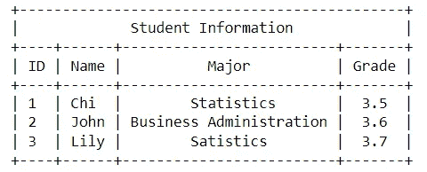
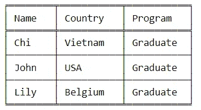
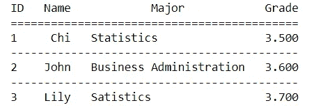

# 用 Python 快速生成基于文本的表格的 3 种简单方法

> 原文：<https://towardsdatascience.com/3-simple-ways-to-quick-generate-text-based-tables-in-python-6db88ac0eed5>

## 创建基于文本的表格的简单而有用的库


安尼尔·泽维尔在 [Unsplash](https://unsplash.com?utm_source=medium&utm_medium=referral) 上的照片

# 介绍

最近，我经常在早上花些时间阅读新的 Python 包。令人惊讶的是，有这么多简单而有用的库，我希望我能早点知道它们。

我试图将它们总结成不同的主题，在今天的这篇文章中，我想与您讨论其中的一个主题:“如何在 Python 中快速创建表？”。

现在，让我们看看这里有什么。

# 漂亮的桌子

PrettyTable 是一个 Python 包，允许您创建基本的 ASCII 表。不同的表格模式，如文本对齐或数据顺序，可以通过简单的代码轻松定制。更多细节，我们来看下面几个例子。

但是首先，通过以下方式安装该软件包:

```
!pip install prettytable 
from prettytable import PrettyTable as pt
```

## 创建表格

我们可以应用`add_row`或`add_column`方法来生成想要的表格。表格输出如下:


图 1:用 PrettyTable 创建一个表格——作者的图片

*   **Add_row():** 行被逐渐添加到表中。

```
tb = pt()#Add headers
tb.field_names = ["ID","Name", "Major","Grade"]#Add rows
tb.add_row([1,"Chi", "Statistics",3.5])
tb.add_row([2,"John","Business Administration"],3.6)
tb.add_row([3,"Lily","Satistics"],3.7)print(tb)
```

*   **Add_column():** 列逐渐添加到表中。

```
tb1 = pt()#Add headers
column_names = ["ID","Name", "Major"]#Add columns
tb1.add_column(column_names[0],[1,2,3])
tb1.add_column(column_names[1],["Chi","John","Lily"])
tb1.add_column(column_names[2],["Statistics","Business Administration","Statistics"])
tb1.add_column(column_names[3],[3.5,3.6,3.7])print(tb1)
```

## 命名表格

我们可以用`get_string(title = “table name")`来给表格命名



图 2:向表格添加标题——作者图片

## **调整表格数据**

使用`align`属性，我们可以控制数据向右、居中或向左对齐。例如，我想将**主**列的数据值更改到左边，将`align`设置为`l`类似地，如果您想要右边的数据，将其设置为`r`和`c`进行居中。

```
tb.align["Major"] = "l"
```

## **删除行**

从表中删除不需要的行很容易。你所要做的就是应用`del_row`因为我不再需要最后一行，下面是我如何从我的表中删除它:

```
tb.del_row(2)
```

## 分类数据

`sortby`和`reversesort`有助于按特定顺序排列数据值。当`sortby`识别哪个列被排序时，`reversesort`指定排序的顺序。

从最高年级到最低年级对学生进行排序。


图 3:按作者排序数据—图片

```
tb.sortby = "Grade"
tb.reversesort = True
```

## 生成 HTML 输出

在`get_html_string`的支持下，我们可以很容易地在控制台中生成 HTML 输出。

```
print(tb.get_html_string())
```

# 有平面的

**制表**是我想推荐的另一个库。基本上，它与 **PrettyTable** 非常相似，但我认为它比 **PrettyTable** 在定制网格方面更加灵活。我们将通过一些例子来看看如何使用**制表**属性定制这些元素。

我们可以通过以下方式安装此软件包:

```
!pip install tabulate
```

## **生成没有网格线的表格**


图 4:无网格线—作者图片

```
df =   [["Chi", "Vietnam","Graduate"], 
        ["John","USA","Graduate"], 
        ["Lily","Belgium","Graduate"]]

#define header names
col_names = ["Name", "Country", "Program"]

#display table
print(tabulate(df, headers=col_names))
```

## 用**网格线**生成表格

```
print(tabulate(df, headers=col_names, tablefmt="fancy_grid"))
```



图 5:带网格线的表格——作者图片

除了`fancy_grid`，还有一些其他的表格格式可以尝试，比如`jira`、`textile`、`html`。

## 向表中添加索引

**添加索引:**应用属性`showindex = "always”`显示索引


图 6:带索引的表格——按作者分类的图片

# 文本表格

个人认为这是三个库中可调性最强的一个库。它可以控制列宽，调整数据水平和垂直对齐，并灵活地改变表格的网格线。

## **生成表格**

例如，下面的代码展示了我如何使用 **Texttable 库创建一个表格。**与 **PrettyTable** 类似，to 可以通过生成一个包含行内容的列表，并应用 **TextTable** 对象的`add_row()`函数将行添加到表中，从而将行插入到表中。

```
#Installing
pip instal texttable
import texttable as tt
tb = tt.TextTable()#Adding header and rows to the table
tb.header(["ID","Name", "Major","Grade"])
tb.add_row([1,"Chi", "Statistics","3.5"])
tb.add_row([2,"John","Business Administration","3.6"])
tb.add_row([3,"Lily","Satistics","3.7"])
print(tb.draw())
```


图 7:带文本的表格—作者图片

## 更改列的宽度

使用`set_cols_width`可以调整表格中的列宽。列表中的总数对应于表格中的列数。

```
tb.set_cols_width([11,12,15,14])
```

## 设置数据对齐

方法`set_cols_align`和`set_cols_valign`可用于在表格单元格内水平和垂直对齐数据。

使用`set_cols_align()`，输入可以设置为`set_cols_align(['c','l','r'])`，对应居中、左对齐或右对齐。

使用`set_cols_valign()`，我们可以指定`t`用于顶部对齐，`m`用于中间对齐，`b`用于底部对齐。

注意，放入对齐函数的列表应该与一行中的值的数量一样长。

## 控制线

使用`set_deco`功能改变行和列之间以及标题和第一行之间的线条的绘制。在`set_deco`中，有四个控制元素:

*   `texttable.BORDER`表格的边框
*   `texttable.HEADER`标题下的行
*   `texttable.HLINES`行间的线条
*   `texttable.VLINES`各列之间的线条

通过在`set_deco()`中组合这四个元素，您可以决定表可以使用哪个特性。例如，在下面的代码中，我选择保留标题下的行和行之间的行。同时，我没有提到`texttable.BORDER`和`texttable.VLINES`意味着我关闭了列之间和表格周围的线条。

```
tb.set_deco(tb.HEADER | tb.HLINES)
```



图 8:控制线条——作者的图像

# 结论

以上是我对生成基于文本的表格的一些建议。我希望他们能在某些方面帮助你。

天气真好。

# 参考

  <https://www.statology.org/create-table-in-python/>  <https://www.geeksforgeeks.org/creating-tables-with-prettytable-library-python/> 