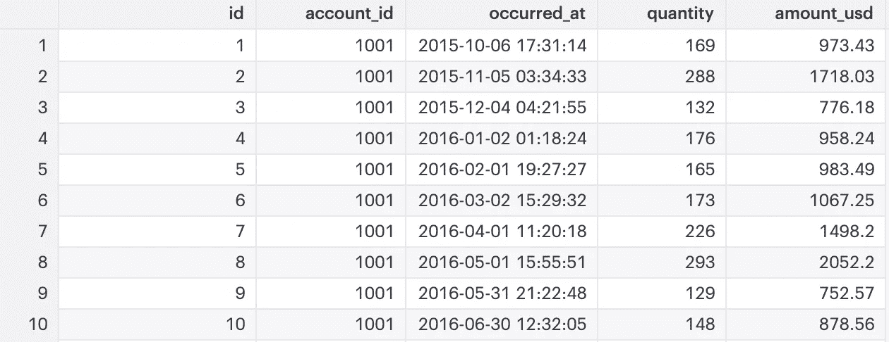
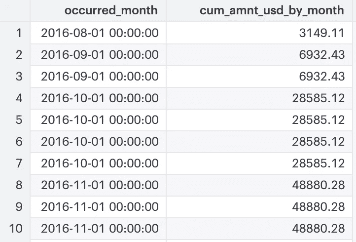
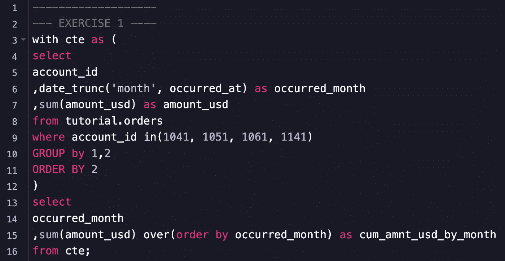
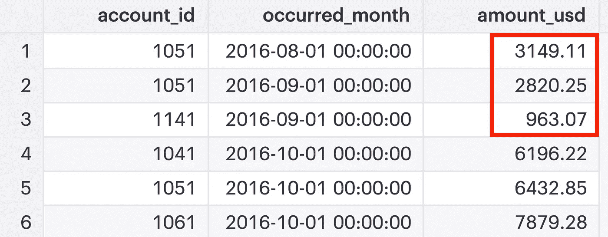
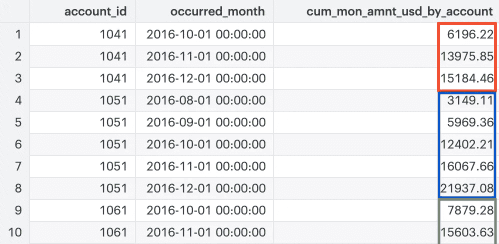
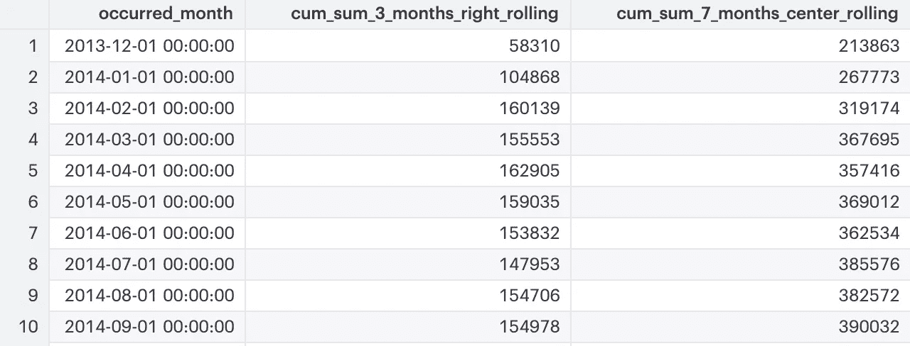
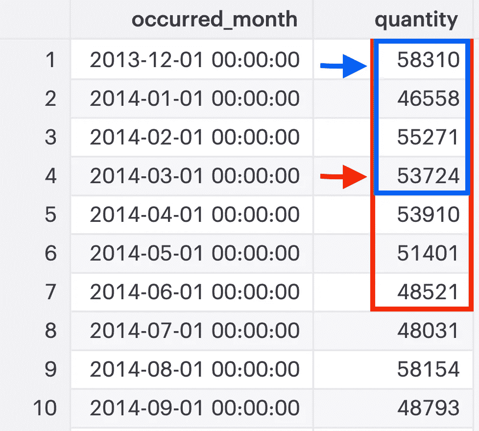

# 3 个关于计算累计总数的 SQL 面试问题

> 原文：<https://towardsdatascience.com/3-sql-coding-questions-on-computing-running-totals-bf657cca8d89>

## 采访倒计时 P2:在这篇文章中，我提出了关于用窗口函数计算运行总数的三个常见编码问题的解决方案。


比安卡·加斯帕罗托摄于[佩克斯](https://www.pexels.com/photo/person-showing-white-mug-in-focus-photography-1752806/?utm_content=attributionCopyText&utm_medium=referral&utm_source=pexels)

## ***推荐给我的读者***

*你是在* ***学习 SQL*** *还是在为下一次* ***技术面试*** *而你喜欢这篇文章的提问风格？*

*那么，你应该看看由*******StrataScratch****提供的**[***SQL 编码挑战***](https://platform.stratascratch.com/coding?via=antonello)******[【T4](https://platform.stratascratch.com/coding?via=antonello)****

***在他们的平台上，你可以找到 FAANG 和其他主要科技公司提出的最新和最现实的面试问题，并决定你是否希望使用 SQL 或 Python 来解决这些问题。***

# ***介绍***

***窗口函数是可应用于数据集的分析函数，无需改变其粒度。***

***它们对记录窗口进行操作，为每一行返回一个值，而不是像`GROUP BY`那样折叠结果。***

***现在，让我直截了当地问你一个问题: ***你真的想得到那份有趣又高薪的数据工作吗*？*****

**好吧，如果你是，在你的下一次 SQL 技术面试中，准备好回答关于窗口函数的问题。他们经常会被问到。**

> **“在你的下一次 SQL 技术面试中，准备好回答关于窗口功能的问题。更多的时候，他们会被问到。”**

**作为一名候选人，我不记得有哪一次 SQL 编码没有要求我编写某种涉及窗口函数的查询。**

**另一方面，作为一名技术面试者，我仍然会遇到申请数据领域中级职位的候选人，他们以前甚至从未听说过窗口函数！**

**对我来说，这是一个危险信号:如果您每天都要处理报表或 KPI，那么在某些时候，您一定需要按日期对维度进行排序，或者计算特定时间间隔内的累计总和。不要声称你总是用连接来做，我不会买它…**

**在之前的帖子中，我已经提到了一些关于排名的面试编码问题:**

**[](/6-sql-window-functions-coding-problems-on-ranking-interview-countdown-p1-9be0ccf66453) [## 排名上的 6 个 SQL 窗口函数编码问题——采访倒计时 P1

### SQL 面试即将来临，您正在寻找一些具有挑战性的练习来测试您的准备情况？你是…

towardsdatascience.com](/6-sql-window-functions-coding-problems-on-ranking-interview-countdown-p1-9be0ccf66453) 

在本文中，我将与您分享一些关于用窗口函数计算运行总数**的常见编码挑战。**

# SQL 运行总计语法

要计算累计，应使用以下语法:

```
**SUM(col) OVER ( partition_clause
                order_clause
                frame_clause )**
```

长话短说，当一个`OVER()`子句出现时，你在一个窗口函数前面。事实上，该子句用于定义将要执行`SUM()`操作的行组(*又称分区*)。

`OVER()`中的子句是可选的，因此当缺少这些子句时，将对整个结果集应用累加和，而不考虑特定的行组或顺序。

相反，指定一个`partition_clause`允许定义将应用累计的分区:

```
**SUM(col) OVER ( PARTITION BY col1, col2...)**
```

而`order_clause`也允许定义累计应用于分区的顺序:

```
**SUM(col) OVER ( PARTITION BY col1, col2... ORDER BY col1 ASC|DESC)**
```

最后，`frame_clause`可以用来选择每个分区中的行子集，以应用运行总和。它本身由一个`frame_start`和一个`frame_end`组成，在一个分区内为用户提供了极大的灵活性:

```
**SUM(col) OVER ( PARTITION BY col1, col2... ORDER BY col1 ASC|DESC RANGE|ROWS BETWEEN frame_start AND frame_end)**
```

其中`frame_start`取下列值之一:

```
**N PRECEDING** -> (for instance 2 PRECEDING)
**UNBOUNDED PRECEDING** 
**CURRENT ROW**
```

并且`frame_end`取以下值之一:

```
**CURRENT ROW** 
**UNBOUNDED FOLLOWING** 
**N FOLLOWING** -> (for instance 7 FOLLOWING)
```

你能看到无穷无尽的组合，以及如果有效使用的话`frame_clause`将会给你带来的力量吗？

我认为，许多分析师仍然在计算窗口函数，而没有完全意识到框架如何支持他们的事业。

# 数据集+编码挑战

对于下面介绍的三个编码挑战，您将使用来自[模式的公共仓库](https://mode.com/sql-tutorial/)的`orders`表，您可以通过他们的 [SQL 编辑器](https://mode.com/online-sql-editor/)直接查询该表，以及许多其他数据集。

`orders`表的前 10 行显示如下:



在您开始编码之前，请看一下这些规范:

*   该表的主键是`id`字段。
*   有多个`accounts_ids`，每个都可以关联一个或多个订单 id(`id`)。
*   表格的粒度由`timestamp`决定，记录在`occurred_at`字段中。

## 问题 1 |难度:简单

**面试官:** *“我想让你先写一个查询，生成一个按月分组的新数据集，而不是时间戳。该数据集应包括三个字段:* `account_id`、`occurred_month`和`total_amount_usd` *，并且应仅针对以下账户进行计算:*、`1041`、`1051`、`1061`、`10141`。

*然后，使用新的数据集，请计算一个按* `*occurred_month*` *排序的* ***运行总数*** *，不折叠结果集*中的行。*只显示两列* `occurred_month` *和* `cum_amnt_usd_by_month`。

**预期输出:**



在输出中只显示 15 行中的 10 行。

**面试官提示:** *“查询分两步。我建议首先创建一个新的数据集作为 CTE 的一部分，然后在其上计算累计”。*

**解决方案:**在这个案例中，面试官正在测试一些技能。他们希望了解您是否可以使用`CTEs`，是否可以使用`GROUP BY`改变数据集的粒度，以及最终是否能够得到一个简单的运行总数:



因为没有指定分区，所以运行总计应用于整个数据集，并按(升序)`occurred_month`排序。

例如，对于 2016 年 9 月，运行总计等于`6932.43`，因为它是在`CTE`中计算的 8 月和 9 月部分合计的累积和:



## 问题 2 |难度:简单

**面试官:** *“现在，使用与前面查询相同的 cte，请计算一个* ***运行总计*** *按* `*account_id*` *，按* `*occurred_month*` *排序。结果集应改为按* `*account_id*`排序，并包括三列，即:`account_id`、`occurred_month`和`cum_mon_amnt_usd_by_account`。

**预期产出:**



**解决方案:**面试官只是要求你在`OVER()`子句中引入一个由`account_id`划分的部分，并保持与上一个练习中相同的顺序。然而，这一次，将为每个`account_id`运行单独的运行总计。

在这种情况下，还将测试您区分窗口中的排序结果和主查询中的排序结果的能力:


## 问题# 3 |难度:中等

**面试官:** *“最后让我们来关注一下* `*quantity*` *领域。像你以前做的那样，先创建一个* `*CTE*` *来返回* `*quantity*` *并按* `*occurred_month*` *排序。*

*然后，使用* `*CTE*` *的输出，计算一个* ***3 个月的滚动运行总数*** *使用一个包含当前月份的窗口。将字段命名为* `*cum_sum_3_months_right_rolling*` *。*

*也计算一个* ***7 个月的累计运行总数*** *使用一个当前月份始终是中间月份的窗口。将字段命名为* `*cum_sum_7_months_center_rolling*` *。”*

**预期产出:**



在输出中显示 38 行中的 10 行。

**面试官的提示:** *“要解决这个问题，你需要使用一个* `*frame_clause*` *。在计算滚动累积和时，考虑* `*current_row*` *相对于您试图创建的帧的位置。*

**解决方案:**要创建一个滚动的运行总数你需要使用`ROWS BETWEEN`语法。

在第一种情况下，您将包括`2 PRECEDING`行，而`CURRENT_ROW`将位于框架的右边缘。在第二种情况下，您将包括`3 PRECEDING`行和`3 FOLLOWING`行，并且`CURRENT_ROW`将位于框架的中间:


当没有足够的行来匹配帧所要求的数量时(在`CURRENT ROW`之前或之后)，将只使用可用的行来计算滚动和。

为了理解这个概念，让我们看看`CTE`输出的幕后发生了什么:



例如，当试图计算`cum_sum_7_months_center_rolling`字段时，`CURRENT ROW`需要位于间隔的中心，这意味着当指针位于行`1` ( *蓝色框*)时，在中心 之后将只有行 ***，而在中心*** 之前没有行 ***，因此滚动求和将只在 4 行上执行( *213，863 【T63****

但是，当指针在第`4` ( *红框*)行时，在 之前将有 3 条记录 ***，在***`CURRENT ROW`之后将有 3 条记录 ***，这样在计算滚动和( *367，695* )时 **7 天框**将完全匹配。***

# **结论**

如果您的 SQL 技术面试倒计时已经开始，请确保准备好回答有关分析功能的问题。

为了支持您的旅程，在本文中，我讨论了如何使用窗口函数在 SQL 中计算累计值。

此外，您的知识已经过测试，解决了 SQL 编码中常见的 3 个编码难题。

祝你面试顺利，学习顺利！** 

# ***来源***

*[](https://mode.com/sql-tutorial/sql-window-functions/) [## SQL 窗口函数|高级 SQL 模式

### 从这里开始？本课是使用 SQL 进行数据分析的完整教程的一部分。看看开头…

mode.com](https://mode.com/sql-tutorial/sql-window-functions/) [](https://www.sqltutorial.org/sql-window-functions/) [## SQL 窗口函数

### 摘要:在本教程中，您将了解以简单方式解决复杂查询挑战的 SQL 窗口函数…

www.sqltutorial.org](https://www.sqltutorial.org/sql-window-functions/) 

这篇文章包括附属链接，如果你购买的话，我可以在不增加你额外费用的情况下赚取一小笔佣金。*