# 任何 DAX 查询故障排除的 3 个步骤

> 原文：<https://towardsdatascience.com/3-steps-to-troubleshoot-any-dax-query-d02a4829cc25>

## 排除 DAX 性能故障是最具挑战性的任务之一，但也是最有意义的任务！了解如何利用 DAX Studio 外部工具来快速了解 DAX 查询缓慢的原因。

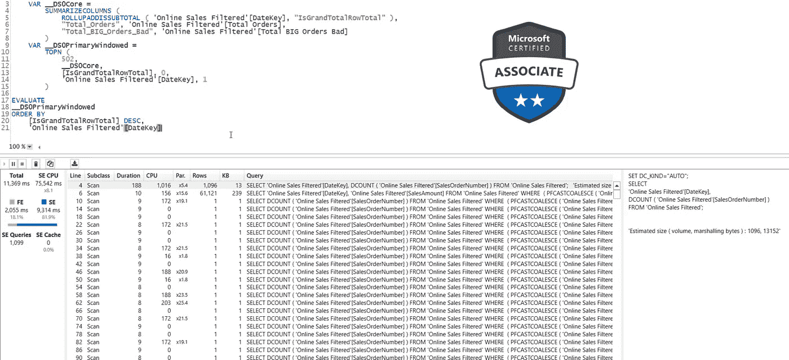

作者图片

**免责声明**:这是**而不是**一篇关于 DAX 的深度文章！本文的主要目的是帮助您熟悉各种 ***工具*** 来解决 DAX 查询的性能问题。如果你想学习和理解 DAX 语言，这里是我的资源列表，可以帮助你步入正轨:

*   [Jeffrey Wang 关于 DAX 表交叉过滤的著名文章](http://mdxdax.blogspot.com/2011/03/logic-behind-magic-of-dax-cross-table.html)
*   [sqlbi.com](https://sqlbi.com/)
*   DAX 权威指南(第二版)——面向中高级用户的书籍
*   [布莱安·葛兰特 DAX 的元素](https://www.youtube.com/watch?v=4j6EyelxJ3k&list=PLmRUwkEzqZzMnpBMwOzil0NiBtF3fHa3k)

在[之前的一篇文章](https://medium.com/p/d67dfce84955)中，我们介绍了 Power BI 中的一个内置特性——性能分析器，它可以帮助您了解报告页面性能背后的不同指标，并快速识别潜在的瓶颈。然而，Performance Analyzer 不仅仅如此，它还为您提供了获取生成的 DAX 查询以填充某个视图，然后利用其他工具对该查询进行故障排除的可能性。

对性能不佳的电源 BI 报告进行故障排除时，最常见的工作流程如下:

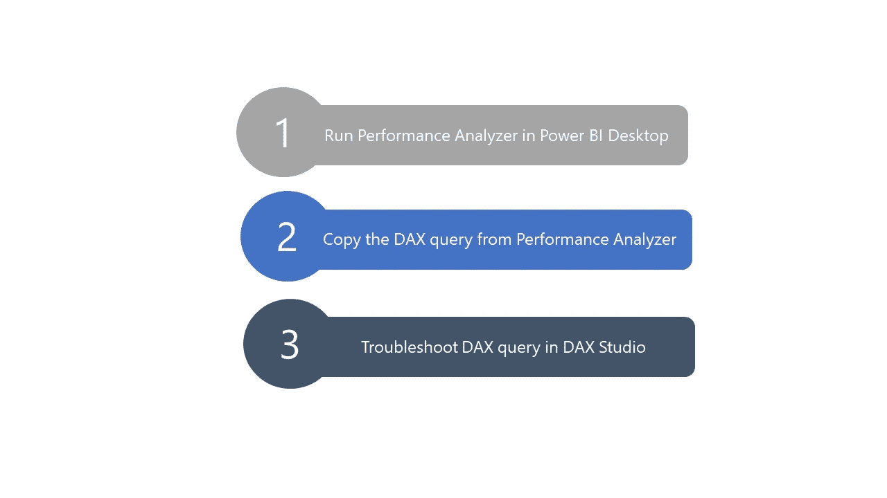

作者插图

前两步非常简单明了。然而，第三步不仅需要知道 DAX 语法，还需要对 Power BI 内部和引擎工作方式有一个扎实的理解。您可以在本文的[中找到关于底层架构的两个关键组件——公式引擎和存储引擎——的更多详细信息，我强烈建议您在继续之前阅读它，因为它将帮助您更好地理解这里描述的步骤和过程。](https://data-mozart.com/vertipaq-brain-muscles-behind-power-bi/)

# 了解要排除哪些故障…

现在，当您处理糟糕的报告性能时，第一个问题是—我应该排除什么故障？！这是一个公平的问题。此外，Performance Analyzer 可以帮助您确定主要问题，然后应该对其进行更深入的调查。

为了举例说明，我将向您展示一个简单的报告页面，上面有 3 个可视元素——两个简单的卡片视图和一个表格视图。基本指标是订单总数，同时我也想知道我的客户下了多少大订单。什么是大订单？销售额超过 500 美元的所有订单。

下面是我用来计算销售额大于 500 的订单总数的度量定义:

```
Total BIG Orders Bad =
CALCULATE (
    DISTINCTCOUNT ( 'Online Sales Filtered'[SalesOrderNumber] ),
    FILTER ( 'Online Sales Filtered', 'Online Sales Filtered'[SalesAmount] > 500 )
)
```

你很快就会意识到为什么我把“坏”加到度量名中…


作者图片

这是我的报告页面的外观。那么，让我们打开性能分析器，看看这个报告是如何执行的:

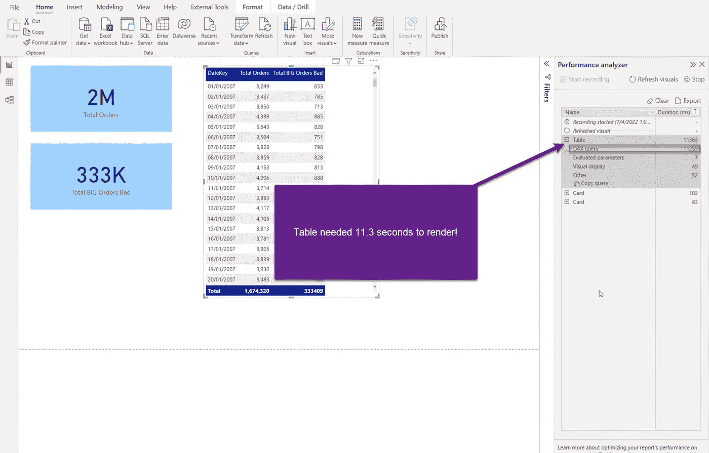

作者图片

如你所见，卡片视觉效果非常快。但是，表格可视化需要 11 秒以上的时间来渲染。而且，与上一篇文章不同，当大量的页面视觉效果是报告性能缓慢的主要原因时(记住性能分析器中的 ***Other*** 值)，这一次 Other 根本不是问题。几乎所有 11.3 秒的总时间都花在 DAX 查询上——这意味着您的“敌人”是 ***可能是***DAX 查询。

我有意使用 word possible，因为可能发生的情况是，您的[数据集太大了](https://data-mozart.com/mastering-dp-500-exam-design-and-build-a-large-format-dataset/)，所以即使您的 DAX 代码是最佳的，引擎也只是需要更多的时间来扫描数据和检索结果。然而，在本例中，我的表“只有”1260 万行，这对于 VertiPaq 数据库来说并没有什么特别的。

因此，我们在故障排除工作流程中迈出了非常重要的第一步— ***我们确定了最有问题的查询。*** 因此，此时我们将忘记卡片的视觉效果，将注意力转移到理解为什么这张桌子的视觉效果如此之慢…

# 步骤 2 捕获查询计划并使用 DAX Studio 进行分析

一旦您确定了有问题的元素，您就可以轻松地获取生成的查询来填充该特定的可视化内容:

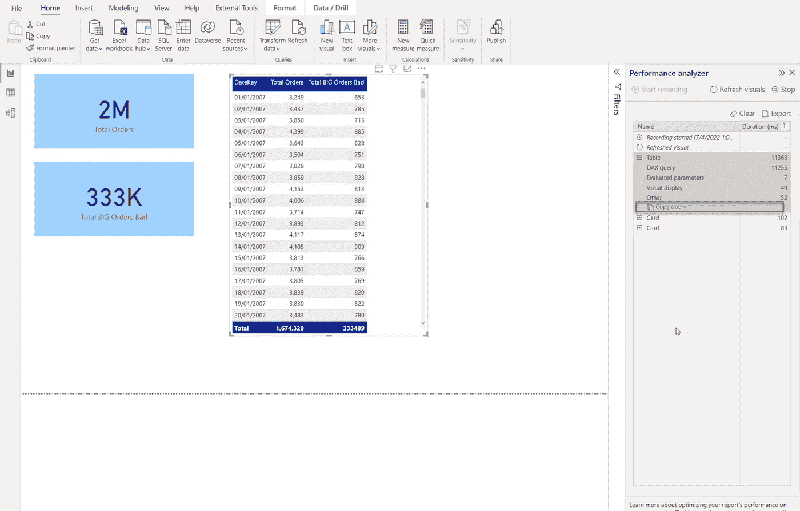

作者图片

我现在将转移到 DAX Studio，一个由 Darren Gosbell 开发的[奇妙的免费工具](https://data-mozart.com/mastering-dp-500-exam-external-tools-in-power-bi/)。这个工具是 Power BI 开发工具箱中的必备工具，在本文中，我不会浪费太多时间来描述 DAX Studio 的所有惊人特性和功能。

这里的目标是向您展示如何利用 DAX Studio 对 DAX 性能进行故障排除:

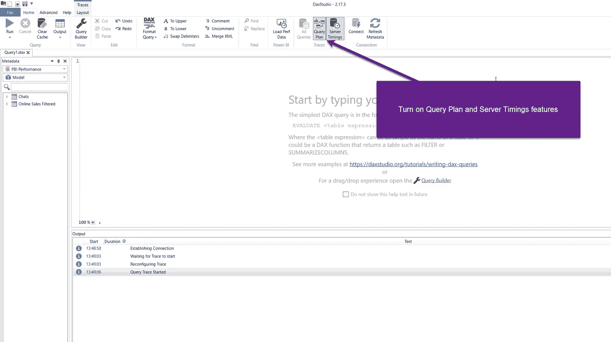

作者图片

为了能够对查询进行故障排除，您需要更多关于它的详细信息。因此，我将打开查询计划和服务器计时特性，开始跟踪我的查询。下一步是将从性能分析器捕获的查询粘贴到 DAX Studio 的主窗口中:

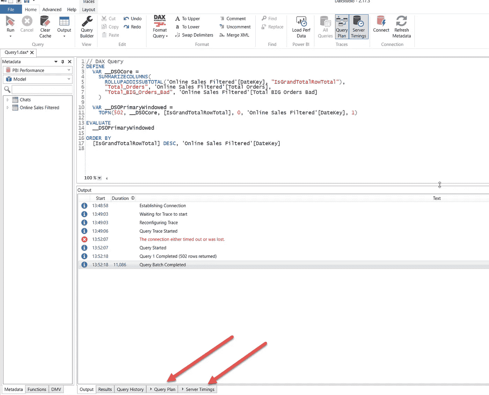

作者图片

让我们先来看看“服务器计时”选项卡:

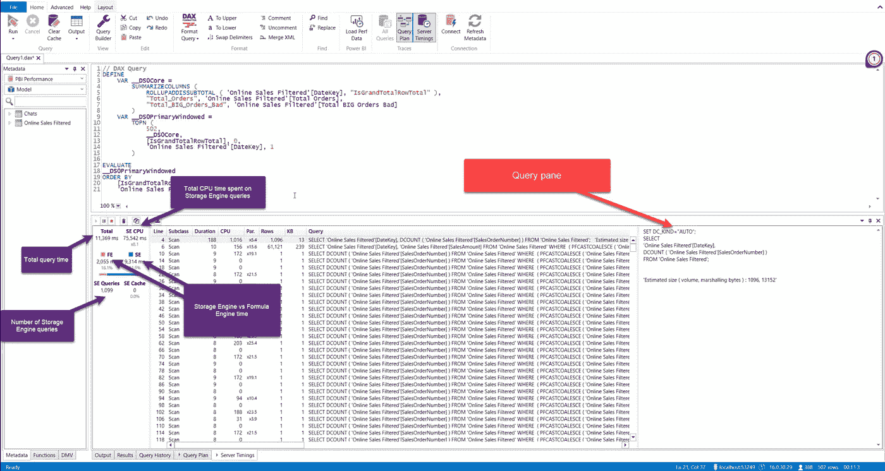

作者图片

让我停下来解释一下“服务器计时”选项卡的主要属性:

*   ***总计*** —以毫秒为单位显示总的查询持续时间。换句话说，您会看到我的查询用了 11.3 秒来执行
*   ***SE CPU*** —存储引擎查询所花费的 CPU 时间。由于存储引擎以多线程方式工作，因此在运行查询时能够实现一定程度的并行性。在我们的例子中，查询总共花费了 75 秒的 CPU 时间
*   ***SE 和 FE*** —存储引擎和公式引擎之间的时间分割。显示为数值和百分比
*   ***SE 查询*** —存储引擎查询数

让我们在这里快速回顾一下我们的具体计算。正如您可能注意到的，在 Server Timings 选项卡的中心区域有一大堆查询。它们的速度都很快——不到 10 毫秒。但是，问题是它们有很多…准确地说，有 1099 个查询。当您用 ca 乘以 1099 个查询时。每个 10 毫秒，你总共得到我们的 11 秒。

在这种情况下，主要问题是我在用于计算大订单总数的 DAX 公式中不恰当地使用了 FILTER()函数。FILTER 函数接受两种类型的对象作为第一个参数—表或列。如果您将整个表作为一个参数传递(尤其是当表很大时)，这意味着存储引擎将不得不扫描和具体化大量数据，就像我的情况一样，我为每个日期运行一个单独的查询。

现在，因为我的计算中唯一的条件是基于单个列值，即销售额值，而不是将整个表作为参数传递，所以我可以重写我的计算，只基于某一列应用筛选:

```
Total BIG Orders Good =
CALCULATE (
    DISTINCTCOUNT ( 'Online Sales Filtered'[SalesOrderNumber] ),
    FILTER (
        ALL ( 'Online Sales Filtered'[SalesAmount] ),
        'Online Sales Filtered'[SalesAmount] > 500
    )
)
```

这两个公式之间的差别是微妙而重要的:在这两种情况下，计算逻辑是相同的，但是过滤函数的不同用法可能会对查询性能产生巨大的影响。与第一个定义不同，这次我将使用一个与 ALL 函数结合使用的筛选函数——ALL 函数将首先从 sales amount 列中删除所有活动的筛选，完成后，我将应用我需要的筛选——只保留 Sales Amount 大于 500 的那些行。但是，这一次，我没有将范围放在整个表中，而是在单个列级别上操作。

我在 Power BI 报告中创建了两个单独的表，分别测量两种计算的性能:

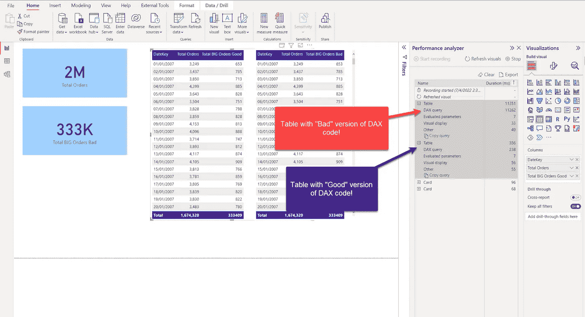

作者图片

正如你可能注意到的，“坏的”表仍然需要超过 11 秒的时间来渲染，而“好的”表只需要 1/3 秒多一点。这是一个巨大的差异！此外，我们可以确认两个表中的结果完全相同。

我现在将复制更快的查询，并检查它在 DAX Studio 中的外观:

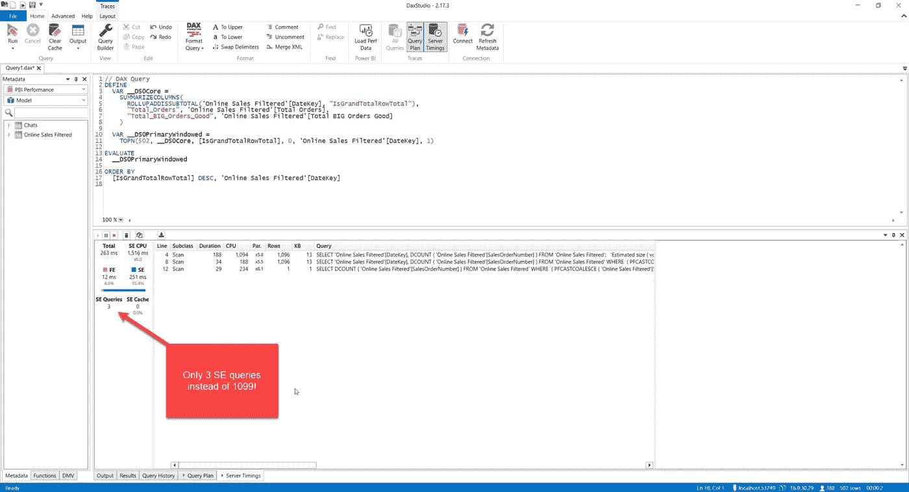

作者图片

这一次，不是 1099 个 SE 查询，而是只有 3 个(其中 2 个在计算总数)。此外，SE CPU 时间不再是 75 秒，现在只有 1.5 秒。最后，总的查询执行时间从 11.3 秒减少到 263 毫秒…

除了“服务器计时”选项卡之外，您可能还想检查“查询计划”选项卡。在这里，您可以检查实际的物理和逻辑查询计划。理解查询计划超出了本文的范围，因为即使对于经验丰富的 Power BI 专业人员来说，这也是一个复杂且具有挑战性的过程。但是，当试图理解公式引擎在将 DAX 代码转换为应由存储引擎执行的一系列物理操作时所执行的各种步骤时，它会非常有帮助。请记住，物理查询计划不一定要遵循逻辑计划中定义的步骤顺序。

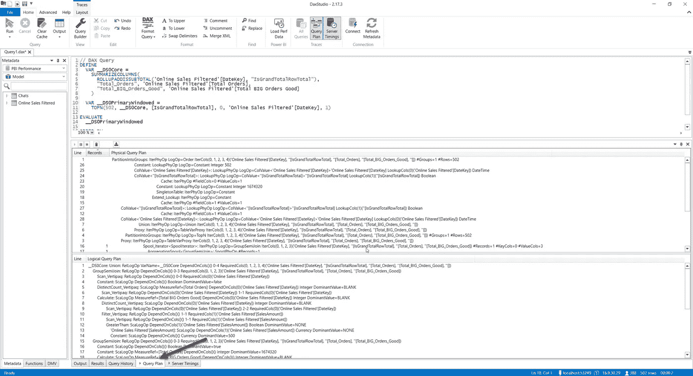

作者图片

现在，引入这个例子并不一定是为了演示如何优化 DAX 公式(尽管如此，如果您在这方面也有所了解，这当然不会有什么坏处)——我想向您展示如何利用 DAX Studio 及其令人惊叹的内置功能，如服务器计时和查询计划，来了解您的视觉效果的数据检索过程的细节。

# 结论

在使用 Power BI 时，对 DAX 查询进行故障排除是最具挑战性的任务之一。然而，与此同时，这也是您可以实现最显著的性能改进的地方。

这是 DAX 优化工作流程的高级概述:

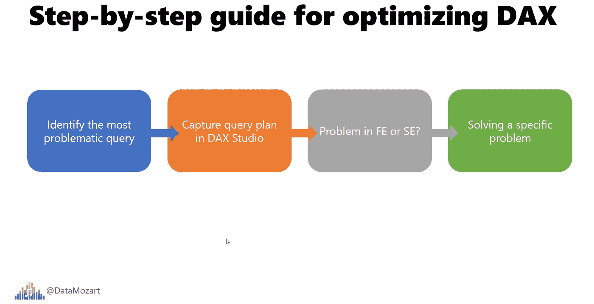

作者图片

DAX Studio 在此工作流中起着关键作用，因为它使您能够对可能有问题的 DAX 查询进行故障排除，并更深入地了解呈现报表视觉效果时幕后发生的情况。

感谢阅读！

成为会员，阅读 Medium 上的每一个故事！