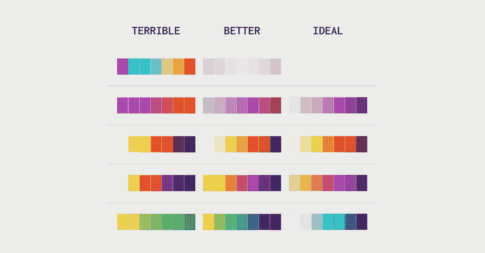
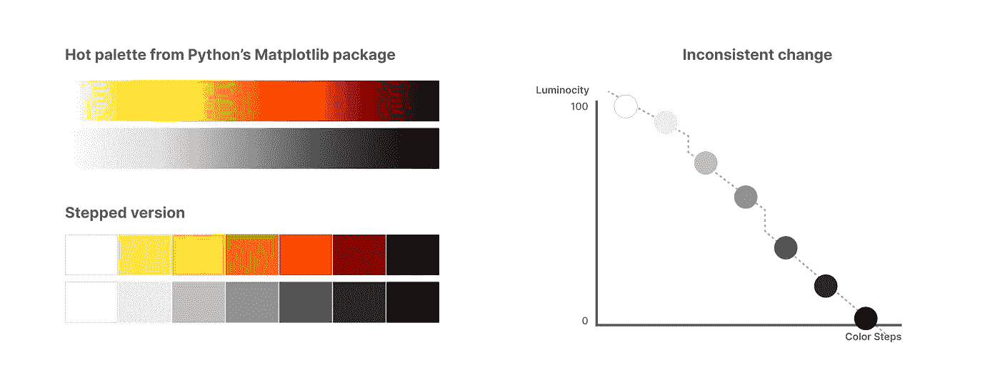
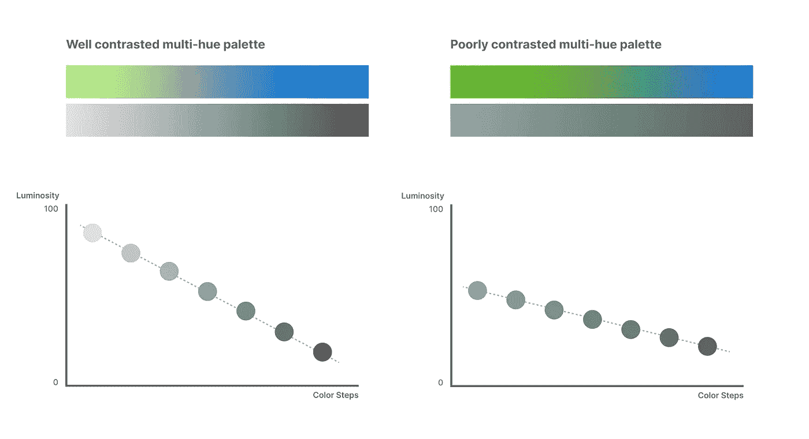
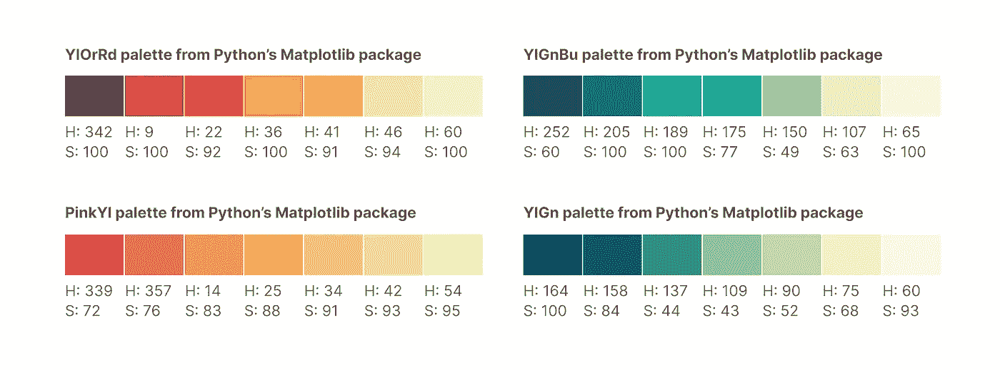
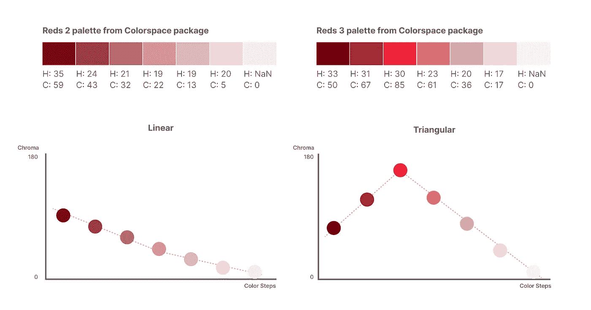

# 掌握连续调色板的 3 个技巧

> 原文：<https://towardsdatascience.com/3-tips-to-master-your-sequential-palette-a56a46bd7853>

## 有意义地使用颜色

作者配图

数据可视化中使用了三种调色板:分类调色板、顺序调色板和发散调色板。每一种都有其适当的用途，并带有不同的数据类型。所以如果你不确定区别在哪里，我建议退一步，先看看这篇[文章](https://gawarska-tywonek.medium.com/use-color-meaningfully-choose-the-proper-pallet-2cfbb71a30f4)。

连续调色板遵循与感知色彩明度(也称为亮度或发光度)相关的顺序。因此，这个调色板适用于从低值到高值的数据。它有一个序数(如李克特量表)，间隔(如温度)，或比例(如利润值)。通常，调色板从代表较低值的浅色到代表较高值的深色。

亮度是颜色的所有三个感知维度的结果:色调、饱和度(或色度)和明度(或亮度)[1]。由于这种复杂的相关性，颜色亮度的线性变化可以通过三种不同的方式实现。根据我们改变的感知维度，我们区分三种类型的连续调色板:

*   **灰度** —如果只是亮度发生了变化
*   **单一色调** —明度和色彩丰富度都变了
*   **多色调** —色调、色彩丰富度和亮度已经改变

# 1)保持亮度的线性变化

连续调色板中的颜色遵循直观表示值变化的顺序。因此，颜色的变化，更准确地说是亮度的变化，必须适应数值的变化。当我们创建一个音阶时，我们应该保持相等的间隔。唯一的例外是对数标度。不是以相等的增量(线性)增加，而是以对数为底的因子(指数)增加每个间隔。

对数标度值得单独撰写一篇文章，所以我们现在只关注线性标度。对于这些标度，亮度的变化必须是线性的，并且每一步的亮度差应该相等。这极大地影响了评估两点之间差异的准确性。

我们可以在许多程序或软件包中找到默认调色板，它们可能被错误地归类为顺序调色板。为了避免误用调色板，请检查亮度是如何变化的。如果亮度改变方向，保持不变，或变化不一致，寻找另一个调色板。

## 亮度变化方向不一致

彩虹调色板是亮度矢量变化不一致的调色板的完美例子。拥有许多不同的色调会导致亮度值和方向的突然跳跃。就像下面的例子，最轻的点在中间的某个地方。

在彩虹调色板中，光度(下面的灰色版本)在两个方向上都发生了变化——这是作者的一个图表。

## 亮度没有变化

当渐变具有恒定的亮度时，它只是对连续调色板的模仿。亮度没有变化给了每一步相同的感知权重，使得评估变化的价值或方向变得更加困难。因为颜色的亮度取决于色调、饱和度和亮度，所以我们必须仔细选择开始和结束颜色。一个好的开始是避免将感知亮度相同或非常相似的颜色配对。显示 12 种原色亮度的图表可能会很方便。

调色板基于两种亮度相同的颜色——作者的图表。

## 亮度变化不一致

乍一看，亮度变化不一致的连续调色板，尤其是连续调色板，可能看起来很好。但如果你转向阶梯式版本，它的古怪就变得更加明显了。亮度的跳跃在视觉上增强了一些步骤之间的差异，并减小了其他步骤之间的差异。如果我们不检查图例，我们可能会无意识地认为在第二种和第三种颜色之间有一些额外的步骤。

亮度跳跃的调色板——作者的图表。

## 光度的线性变化

具有线性亮度变化的连续调色板在连续和离散变体中都得到很好的平衡。因此，任何两种颜色之间的关系都不会混淆。如果你想确保你的调色板遵循线性模式，你可以使用 [Chroma.js 调色板助手](https://gka.github.io/palettes)。这个免费的在线工具将帮助你纠正亮度。我建议从解释如何利用其全部潜力的[文章](https://www.vis4.net/blog/2013/09/mastering-multi-hued-color-scales/)开始。

亮度线性变化的均衡有序调色板—作者的图表

# 2)添加色调变化

如果发光变化一定是线性的，是不是意味着我们要避免使用两种以上的颜色？

答案可能会让你吃惊，但是在一个连续的调色板中使用两种以上的颜色并没有错。此外，添加色调变化可以为我们的调色板带来额外的改善。它提供了更好的颜色对比，从而使颜色更容易区分。它降低了极端值的重要性，增加了序列中所有值的重要性[4]。

在基于两种颜色的多色调连续调色板中，我们应该为较亮的一端选择较高的亮度，为较暗的一端选择较低的亮度。以黄色(亮度最高的颜色)开始调色板，以蓝色、绿色或红色结束调色板是一个很好的选择，因为亮度会有明显的差异。但是正如你在下面的例子中看到的，调色板以深绿色开始，以浅蓝色结束是行不通的。

基于两种色调的多色调调色板——对比度好的从较亮的颜色开始，对比度差的从较暗的颜色开始。作者配图

如果我们想要包含两种以上的色调，这个过程会变得更加复杂，因为颜色的所有三个维度(色调、饱和度/色度、明度/亮度)都在同时变化[1]。使用一系列色调的规则是根据它们的亮度进行排序，并在整个调色板中保持高饱和度/色度。

在下面的例子中是两对互补的调色板。顶行由三种色调的版本组成。中间的色阶更加饱和，使其更加突出。底部的调色板仅由两种色调组成，不强调中间值，而强调极端值。

两对相似的多色调——上面的是基于三种色调，下面的是基于两种色调——作者的图表。

# 3)使用单一色调的色度轨迹

我们已经讨论了连续调色板中的亮度应该线性变化，但是色调呢？这可能是违反直觉的，但是在中间有最丰富多彩的步骤对于单一色调调色板来说是一个很好的解决方案。要做到这一点，我们必须从使用色度而不是饱和度开始。这意味着从 **HSL** (色相-饱和度-明度)或 **HSB** (色相-饱和度-明度)色彩模型切换到 **HCL** (色相-色度-明度)。

HCL 模型最显著的优点是它最接近人类感知颜色的方式。这就是为什么在数据可视化软件中广受欢迎，并被整合到 R、Python 或 JavaScript 包中。

根据心理物理学理论，人类用三维来描述颜色[5]:

*   **色调**(通常与颜色本身联系在一起)
*   **色度**(颜色相对于灰色的强度)
*   **亮度**(亮度，灰度)

将最丰富的颜色放在调色板的中间可以使色阶更容易区分[4]。下面是用 HCL 模型创建的调色板的两个例子。左边的遵循色度的线性变化，这使它看起来很平，而右边的融入了三角形色度轨迹。类似于前面的例子，当调色板的中间部分被去饱和时，它强调了极端。增加中间颜色的丰富性使它们变得同等重要。

受色彩空间工具箱启发的示例[4]。左边是色度线性变化的顺序调色板，右边是色度三角形变化的调色板(最丰富的颜色在中间)——作者的图表。

不想错过我的任何帖子？ [***直接把它们***](https://gawarska-tywonek.medium.com/subscribe)**发到你的收件箱里！**

*如果你还不是中等家庭的一员，考虑注册成为会员。它每月只需 5 美元，支持数千名作家。 [***注册我的会员链接***](https://gawarska-tywonek.medium.com/membership) *，除了可以访问所有发表的内容，你将得到我永远的感激。**

## *链接*

*[1] M .哈罗威，c .布鲁尔， [ColorBrewer.org:选择地图配色方案的在线工具](https://www.cs.rpi.edu/~cutler/classes/visualization/S18/papers/colorbrewer.pdf) (2003 年)，制图杂志*

*[2] C. Shanley，[混合亮度相等的颜色—第 1 部分](https://medium.com/sketch-app-sources/mixing-colours-of-equal-luminance-part-1-41f69518d647) (2020)，中等*

*[3] G. Aisch，[利用 Chroma 掌握多色调色阶. js](https://www.vis4.net/blog/2013/09/mastering-multi-hued-color-scales/) (2013)，作者博客*

*[4] A. Zeileis，J.C. Fisher，K. Hornik，R. Ihaka，C.D. McWhite，p .穆雷尔，R. Stauffer，C.O. Wilke，[色彩空间:操纵和评估颜色和调色板的工具箱](https://arxiv.org/pdf/1903.06490.pdf) (2019)，arXiv.org 电子印刷档案馆*

*[5] A. Zeileis，K. Hornik，p .穆雷尔，[逃离 RGBland:为统计图形选择颜色](https://epub.wu.ac.at/1692/1/document.pdf) (2007)，研究报告系列/统计和数学系*