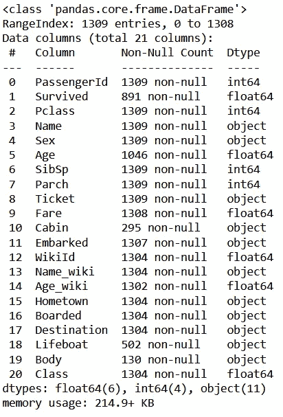
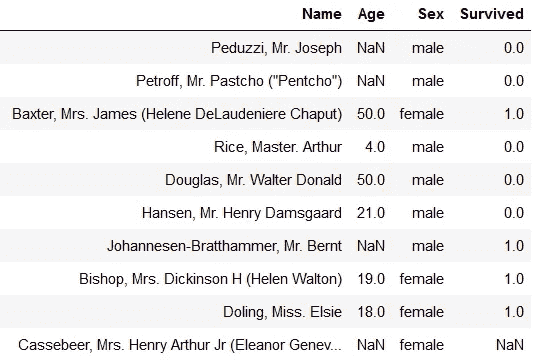
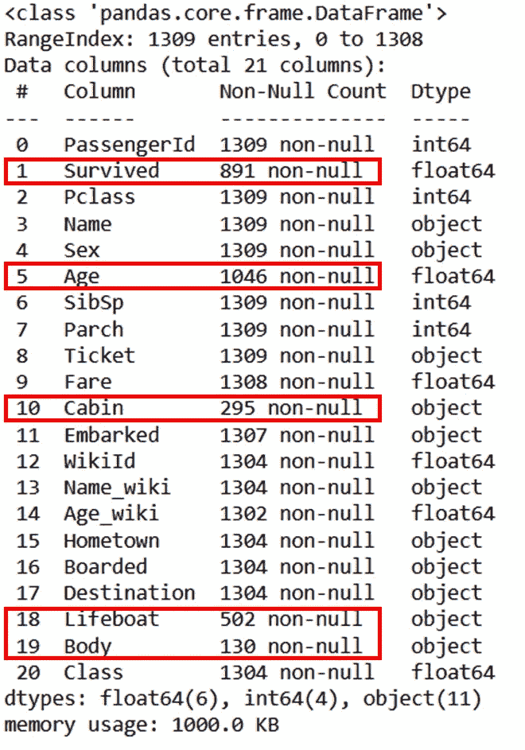
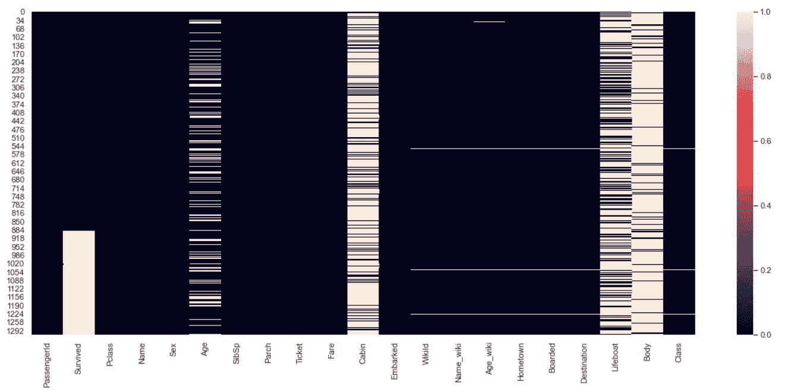
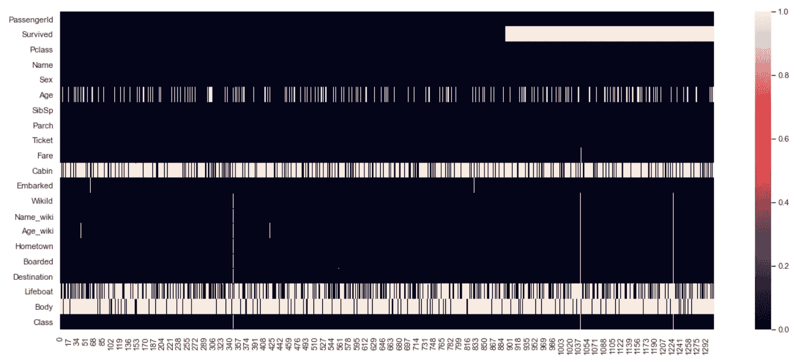
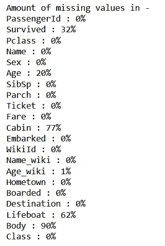
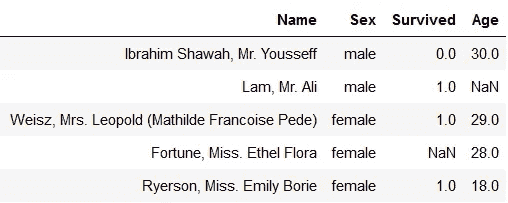

# Python 中你必须知道的 3 种数据清理类型

> 原文：<https://towardsdatascience.com/3-types-of-data-cleaning-you-must-know-in-python-1ab6986a8b1d>

## 计算机编程语言

## 数据清洗是数据分析中枯燥却又至关重要的一步


[pix abay 拍摄的照片](https://www.pexels.com/photo/shallow-focus-photo-of-man-holding-floor-brush-ceramic-figurine-434163/)

数据清理是最耗时的任务之一！

我必须承认，真实世界的数据总是混乱的，很少是干净的。它包含不正确或缩写的列名、缺失的数据、不正确的数据类型、单个列中的信息过多等等。

在处理数据之前解决这些问题非常重要。最终，干净的数据总是能提高生产力，让你创造最好的，准确的洞察力。

因此，我列出了在使用 Python 处理数据时必须知道的 3 种类型的数据清理。

为了举例，我使用的是由 [Pavlo Fesenko](https://www.kaggle.com/datasets/pavlofesenko/titanic-extended) 创建的 Titanic 数据集的扩展版本，该数据集可以根据 [CC 许可](https://creativecommons.org/licenses/by-sa/3.0/)免费获得。


[泰坦尼克号数据集](https://www.kaggle.com/datasets/pavlofesenko/titanic-extended) |作者图片

它是一个简单的数据集，有 1309 行和 21 列。我在下面展示了大量关于如何从这些数据中获得最佳收益的例子。

我们开始吧..🚀

首先，导入 pandas 并在 pandas DataFrame 中读取这个 csv 文件。使用`.info()`方法获得关于数据集大小、列及其各自数据类型的完整概述是一个很好的实践。

```
df = pd.read_csv("Complete_Titanic_Extended_Dataset.csv")
df.info()
```



df.info()获得数据集|按作者分类的图像的概述

让我们从最简单的清洁步骤开始，这可能会节省一些内存和时间，以及你继续进行处理。

# 移除未使用和不相关的列

您可以注意到，该数据集包含 21 列，您很少会将它们全部用于数据分析任务。因此，请仅选择所需的列。

举个例子，假设你不需要列`PassengerId`、`SibSp`、`Parch`、`WikiId`、`Name_wiki`和`Age_wiki`。

您需要做的就是创建这些列名的列表，并在如下所示的`**df.drop()**`函数中使用它。

```
**columns_to_drop = ['PassengerId', 'SibSp', 
                   'Parch', 'WikiId', 
                   'Name_wiki', 'Age_wiki']****df.drop(columns_to_drop, inplace=True, axis=1)**
df.head()
```


仅保留相关列|作者图片

当您使用`.info()`方法中的参数`**memory_usage = "deep"**`检查内存消耗时，您会注意到这个新创建的数据集只消耗了 834 KB，而原始数据帧消耗了 1000 KB。

这些数字在这里可能看起来很小，但在处理大数据集时会非常大。

> 所以删除不相关的列节省了 17%的内存！！

使用方法`.drop()`删除列的一个小缺点是，当您使用`inplace = True`时，它会改变原始数据帧。如果您仍然对原始数据帧感兴趣，您可以将`df.drop()`输出(不替换)赋给另一个变量，如下所示。

```
df1 = df.drop(columns_to_drop, axis=1)
```

或者，当您希望删除大量的列而只保留 4–5 列时，可能会出现这种情况。在这种情况下，不要使用`df.drop()`,而应该使用具有选定列数的`df.copy()`。

例如，如果您想只使用数据集中的姓名、性别、年龄和幸存列，您可以使用如下所示的`df.copy()`对原始数据集进行子集化。

```
**df1 = df[["Name","Age","Sex","Survived"]].copy()**
```



使用列列表的子集数据集|按作者分类的图像

根据您的任务的实际需求，您可以使用上述任何一种方法来只选择相关的列。

在上图中，您可能会注意到，Age 和 Survived 列中的一些值丢失了。在继续之前需要解决这个问题。

# 处理缺失值或 nan

在几乎所有的数据集中，你需要处理丢失的值，这是数据清理的棘手部分之一。如果你想利用这些数据进行机器学习，你应该知道，大多数模型不接受缺失数据。

> 但是如何找到缺失的数据呢？？

有多种方法可以找出数据集中的哪一节、哪一列缺少值。下面是四种常用于查找缺失数据的技术。

## 的方法。信息()

这是了解任何列中是否有缺失值的简单方法之一。当您使用`df.info()`时，您可以看到如下数据框`df` 的快速概览。



df.info()获取作者的 DataFrame | Image 概览

上面红框中显示的列名是多个值缺失的地方。理想情况下，该数据集中的每一列都应该包含 1309 个值，但是该输出显示大多数列包含小于 1309 的值。

您还可以可视化这些缺失的值。

## 缺失数据的热图

这是可视化缺失数据的常用方法之一。您可以通过将数据编码为布尔值(即`1`或`0`)来创建数据的热图，并且您可以使用熊猫函数`.isna()`来创建热图。

> 熊猫里的`.isna()`是什么？？

方法`isna()`返回一个 DataFrame 对象，对于`NaN`，所有的值都被替换为布尔值 True，否则为 False。

你所需要做的就是输入一行代码，如下所示。

```
import seaborn as sns
**sns.heatmap(df.isna())**
```



缺失值热图|作者图片

上图中的 X 轴显示所有的列名，而 Y 轴代表索引号或行号。右侧的图例告诉您用于表示缺失数据的布尔值。

这有助于您了解数据在特定列的哪个部分或哪个索引号之间丢失。

好吧，如果列名不容易阅读，你可以创建它的转置版本，如下所示。

```
**sns.heatmap(df.isna().transpose())**
```



缺失值热图|作者图片

当要素或列的数量较少时，此类热图非常有用。如果有大量的功能，您可以始终对其进行子集化。

但是，请记住，如果数据集很大，可视化需要时间来创建。

尽管热图可以让您了解丢失数据的位置，但它不会告诉您丢失数据的数量。你可以用下一种方法得到它。

## 缺失数据占总数据的百分比

没有直接的方法可以得到它，但是你能使用的就是`.isna()`方法和下面的一段代码。

```
import numpy as np
print("Amount of missing values in - ")
for column in df.columns:
    percentage_missing = **np.mean(df[column].isna())**
    print(f'{column} : {round(percentage_missing*100)}%')
```



熊猫数据框|作者图片中缺失值的百分比

通过这种方式，您可以看到各个列中缺少多少百分比值。这在处理这些缺失值时会很有用。

> 我找到了丢失的数据，但是接下来呢？？

没有处理缺失数据的标准方法。唯一的方法是查看单个列、其中缺失值的数量以及该列在未来的重要性。

根据以上观察，您可以使用以下 3 种方法中的任何一种来处理缺失数据。

1.  **删除记录** —当特定列缺少值或`**NaN**`时，删除索引处的整个记录。请注意，如果提到的列有大量缺失值，这种技术可以大大减少数据集中的记录数量。
2.  **删除专栏或功能** —这需要对特定的专栏进行深入研究，以了解其在未来的重要性。只有当您确信该特征不提供任何有用的信息时，才能这样做，例如，该数据集中的`PassengerId`特征。
3.  **估算缺失数据**—在这种技术中，您可以用同一列的平均值、中值或众数替换缺失值或`NaN`。

所有这些处理缺失数据的方法都是一个很好的讨论主题，我将在下一篇文章中介绍。

除了缺失数据之外，数据的另一个常见问题是数据类型不正确，需要解决这个问题才能获得高质量的数据。

# 更正数据类型

在使用不同的 Python 库时，您会注意到需要特定的数据类型来完成特定的转换。因此，每一列的数据类型都应该是正确的，适合于将来的使用。

当您在 pandas 中使用`read_csv`或任何其他`read_`函数将数据放入 DataFrame 时，pandas 将通过观察存储在其中的值来猜测每一列的数据类型。

除了少数几列，这个猜测几乎对所有的列都是正确的。并且您需要手动更正这些列的数据类型。

例如，在 Titanic dataset 中，您可以使用下面的`**.info()**`来查看列数据类型。


熊猫数据框|作者图片中的数据类型不正确

在上面的输出中，列 Age 和 Survived 的数据类型为`float64`，但是 Age 应该始终是一个整数，而 Survived 应该只有两种类型的值——Yes 或 No。

为了更好地理解它，让我们看看这些列中随机的 5 个值。

```
df[["Name","Sex","Survived","Age"]].sample(5)
```



示例 5 行|作者图片

除了缺少的值之外，幸存的列有两个值— `0.0` & `1.0` —理想情况下，这两个值应该分别是`0`和`1`的布尔值`No` & `Yes`。另外,“年龄”列包含十进制格式的值。

在继续之前，您可以使用正确的列类型来解决此问题。根据您的 pandas 版本，您可能需要在更正数据类型之前处理丢失的值。

除了上面的数据清理步骤，根据您的使用情况，您可能还需要下面的一些数据清理方法。

1.  **替换列中的值** —有时数据集中的列包含 True-False、Yes-No 等值，这些值可以很容易地替换为`1` & `0`以使数据集可用于机器学习应用程序。
2.  **去除异常值** —异常值是与其他观察值显著不同的数据点。然而，丢弃离群值并不总是一个好主意。需要仔细评估这些显著不同的数据点。
3.  **删除重复项** —当记录中所有列的所有值都相同时，可以认为数据是重复的。熊猫数据框方法`**.drop_duplicates()**`对于删除重复非常方便。

仅此而已！

我希望这篇文章对你有用，让你耳目一新。数据清理是最耗时的任务之一，通常需要创造性的方法来处理不同类型的数据问题。

如果你喜欢阅读这样令人惊叹的文章，请订阅 [**我的邮件列表**](https://medium.com/subscribe/@17.rsuraj) ！

作为一个免费用户，你只能阅读 3 个故事，但作为一个媒体成员，你可以访问媒体上的所有内容。所以， [**加入 Medium**](https://medium.com/@17.rsuraj/membership) 使用我下面的推荐链接，它也将支持我作为一个作家，因为 Medium 与我分享你的一小部分费用。✅

[](https://medium.com/@17.rsuraj/membership)  

**感谢您的阅读！**