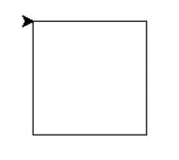

# 让你成为下一级 Python 程序员的 3 个不被重视的技能

> 原文：<https://towardsdatascience.com/3-underappreciated-skills-to-make-you-a-next-level-python-programmer-a20de69b29f2>

## 向图形、可视化和时髦的数据结构问好。


[威胁者杨](https://unsplash.com/@81minator?utm_source=medium&utm_medium=referral)在 [Unsplash](https://unsplash.com?utm_source=medium&utm_medium=referral) 上拍照

您称自己为 Python 程序员，但是您可能没有意识到编程语言有趣的、公开的秘密。

帮你自己一个忙，从那里开始。打开你最喜欢的终端，启动 Python 解释器，进入如下:`import this`。

按下回车键后，你会看到下面这首动人的诗。

> “Python 的禅”，作者蒂姆·彼得斯
> 
> 漂亮总比难看好。
> 显性比隐性好。简单比复杂好。
> 复杂总比复杂好。
> 扁平比嵌套好。
> 稀不如密。
> 可读性很重要。特例不足以特殊到违反规则。
> 虽然实用性胜过纯粹性。错误永远不会悄无声息地过去。
> 除非明确消音。
> 面对暧昧，拒绝猜测的诱惑。应该有一种——最好只有一种——显而易见的方法来做这件事。虽然这种方式一开始可能并不明显，除非你是荷兰人。
> 现在总比没有好。
> 虽然永远也不会比现在*好。如果实现很难解释，这是个坏主意。
> 如果实现起来容易解释，这也许是个好主意。名称空间是一个非常棒的想法——让我们多做一些吧！"

我将把对这一文学瑰宝的深入分析留到另一篇文章中，只强调一个要点: **Python 被设计成一种简单、简洁、优雅的语言**。

尽管 Python 越来越受欢迎，但该语言的大多数新信徒倾向于展示相同的标准技能集:循环、定义函数、构建对象——您知道，通常的编程基础数组(双关语)。有些人甚至可能到处使用列表理解。

虽然这些技能不可否认地重要，但是把自己限制在这些技能上是一个明显的错误。为什么？它没有利用一个至关重要的事实:Python 的简单性允许程序员用相当简单的代码完成不可思议的任务，构建最终的工具和程序，这在其他语言中需要更多的麻烦。

为了实现这个目标，这里有三种 Python 技能可以考虑学习。

## Python 的图形海龟库

Python 的 Turtle 库可能是整个语言中最被低估、使用最少的图形模块之一。人们痴迷于更高级的工具，如 PyGame 和 Tkinter，它们的学习曲线要陡峭得多。相比之下，Turtle 非常简单，以至于许多入门编程类都用它来向从未编写过代码的人介绍 Python。

本质上，Turtle 非常简单。你只需要有你的鼠标(“乌龟”)，你给它提供基本的命令，告诉它向你想要的方向移动，画出一个特定的形状。随着绘图的深入，您可以强调边框并用颜色填充形状，就像在 Adobe Illustrator 等高级软件系统中一样。

这就是 Turtle 的全部，归根结底:使用代码来绘制和绘画。

为了说明它的简单性，下面是一段画了一个正方形的代码:

```
import turtle as t
t.forward(100)
t.right(90)
t.forward(100)
t.right(90)
t.forward(100)
t.right(90)
t.forward(100)
t.right(90)
t.done()
```

或者，更简洁地说:

```
import turtle as t
for _ in range(4):
    t.forward(100)
    t.right(90)
t.done()
```



作者图片

下面是代码的快速分解:

*   `forward`命令告诉乌龟对象向前移动 100 个像素。
*   `right`命令告诉乌龟对象向右旋转 90 度
*   `done`命令让 Python 知道我们已经完成了绘图，这使得包含绘图的弹出窗口不会自动关闭。

即使有了这个简单的例子，我们也已经可以开始看到 Turtle 的基本构件是如何扩展的，以制作更深入的程序。例如，一个正方形离各种各样的“棋盘”并不远，对于编写像 Connect-4 或 2048 这样的著名游戏很有用。只要稍微算一下，画几条线，就上路了。

因此，Turtle 的一个很大的优势是，它允许你仅用入门知识就能编写出有趣、漂亮的游戏和图形。换句话说，你不需要成为一个 JavaScript 专家，就能让人们对你的发明刮目相看。在我上过的第一堂编程课上，学生们在第一次看到 Python 几周后，就开始用 Turtle 制作复杂的、可玩的游戏。

如果你愿意付出一点努力，你也可以。

## Altair 中的可视化

随着世界变得越来越以数据为中心，处理和分析数据的技术正走向所需技能的前沿。任何人(尤其是计算机程序员)都可以有效地利用数据科学的核心目标:**展示来自数据的有意义的洞察力**。

最不复杂但最有效的方法之一是通过可视化。在 Python 编程语言中，两个最常见的可视化模块是 **Matplotlib** 和 **Seaborn** 。

这样做有很好的理由:这两个模块在语法上很简单，因此很容易学习。这使得它们成为用于基本探索性数据分析的快速可视化任务的理想工具。例如，在 Seaborn 中生成折线图很简单:

```
import matplotlib.pyplot as plt
import seaborn as snssns.lineplot([1, 2, 3, 4], [1, 2, 3, 4])
plt.xlabel('X-Axis')
plt.ylabel('Y-Axis')
plt.title('An Exciting Line Chart')
```


作者图片

然而，它们的简单是有代价的。数据可视化的主要[原则之一是**表现力**，粗略地衡量为数据中有多少相关信息被编码到可视化中。因为你可以用 Matplotlib 和 Seaborn 制作的大部分情节都是预先确定的，所以你的表现力相当有限。](https://medium.com/digital-diplomacy/distilling-the-essential-principles-of-data-visualization-part-1-5df4302e401a)

进入牛郎星。Altair 构建在著名的 JavaScript 可视化库 Vega-Lite 之上，提供了用 Python 代码 [1]生成[各种漂亮的可视化效果的能力。诚然，学习曲线比 Matplotlib 高了一步，但它仍然比学习 JavaScript 容易得多。](https://altair-viz.github.io/gallery/index.html)

Altair 提供了一种声明性语法——虽然代码可能会因为更复杂的可视化而变得越来越混乱，但它的优势是它总是可以被分解成相同的构建块。例如，下面是如何从上面生成折线图:

```
import pandas as pd
import altair as altsource = pd.DataFrame({'X': [0, 1, 2, 3, 4], 'Y': [0, 1, 2, 3, 4]})
alt.Chart(source).mark_line().encode(
    x=alt.X('X', scale=alt.Scale(domain=[0, 4]), title='X-Axis'),
    y=alt.Y('Y', scale=alt.Scale(domain=[0, 4]), title='Y-Axis')
).properties(
    title='An Exciting Line Chart'
)
```


作者图片

Altair 的强大之处(即表现力)在于用户可以随意修改的大量自定义选项；我上面展示的只是很小的一部分。

这些年来，我个人多次使用 Altair 来设计和编程我脑海中想象的新颖的可视化效果。虽然当然仍有局限性，但这是 Matplotlib 和 Seaborn 的巨大进步。此外，如果你曾经感到困惑，牛郎星社区是令人难以置信的反应和帮助。

所以，下次你需要编写一个线图时，也许可以试试 Altair。

## 古怪的控制和数据结构

当然，虽然 Python 提供了与所有其他编程语言相同的标准循环和结构，但它也拥有许多独特的结构，既有趣又有用。我们来看两个有趣的。

**For-Else 循环**

与大多数语言不同，Python 允许将条件关键字`else`与`for`循环结合使用。使用这种特殊的语法，您可以编写一个普通的循环，后跟一个`else`语句。Python 使用以下执行规则:**当且仅当循环没有被** `**break**` **语句终止时，执行** `**else**` **语句。**

通过示例，这一点更容易理解:

```
# No break, so we enter else statement
>>> for element in ['a', 'b', 'c']:
...     if element == 'x':
...             break
... else:
...     print("THERE WAS NO BREAK")
...
THERE WAS NO BREAK# Break, so we do not enter else statement
>>> for element in ['a', 'x', 'b', 'c']:
...     if element == 'x':
...             break
... else:
...     print("THERE WAS NO BREAK")
...
>>>
```

由于第一个代码片段从未脱离`for`循环，Python 知道进入`else`条件；同样，它知道在第二种情况下不要这样做。

`for-else`循环是一个相当特殊的用例，但是下一次当您想要执行某个由 iterable 的所有元素是否满足某个条件决定的动作时，它可能会很有帮助。

**字典理解**

大多数 Python 程序员都听说过[列表理解](/whats-in-a-list-comprehension-c5d36b62f5)【2】；在这里，我想讨论一下它们鲜为人知的表亲——词典理解。

字典 [3]无疑是 Python 最有用的特性之一，但是有时候定义它们会有点痛苦。输入字典理解。

例如，假设您有一个姓名列表，您想要创建一个字典，其中键是姓名本身，值是姓名的长度。以下是您传统的做法:

```
>>> names = ['Alice', 'Bo', 'Malika']
>>> traditional_dict = dict()
>>> for name in names:
...     traditional_dict[name] = len(name)
...
>>> traditional_dict
{'Alice': 5, 'Bo': 2, 'Malika': 6}
```

字典理解简化了代码:

```
>>> names = ['Alice', 'Bo', 'Malika']
>>> comprehension_dict = {name: len(name) for name in names}
>>> comprehension_dict
{'Alice': 5, 'Bo': 2, 'Malika': 6}
```

干净多了。

字典理解的工作方式类似于列表理解，有效地消除了简单用例中的`for`循环。

Python 被设计得简洁明了，因此它包含了大量旨在促进这一目标的数据和控制结构。循环和字典理解是我个人最喜欢的两个。

我建议你做一点挖掘来找到你自己的。

## 总结和最终想法

随着 Python 越来越受欢迎，对于个人程序员来说，学习目前未被重视的技能将变得越来越重要。通过掌握它们，你将从你的代码中获得最大的收益(更不用说你的简历了)。

以下是一份备忘单，供将来参考:

1.  游戏和绘画不仅仅是有趣，它们还是一种受欢迎的产品。投入一些时间学习**海龟**。
2.  数据可视化是一项有价值的技能。用**牛郎星**变得伟大。
3.  不要把自己局限在基础上。**掌握新的数据和控制结构**。

祝你的 Pythonic 冒险之旅好运。

**想擅长 Python？** [**获取独家，免费获取我简单易懂的指南在这里**](https://witty-speaker-6901.ck.page/0977670a91) **。想在介质上无限阅读故事？用我下面的推荐链接注册！**

[](https://murtaza5152-ali.medium.com/?source=entity_driven_subscription-607fa603b7ce---------------------------------------) [## 穆尔塔扎阿里培养基

### 阅读媒介上穆尔塔扎·阿里的作品。华盛顿大学的博士生。对人机感兴趣…

murtaza5152-ali.medium.com](https://murtaza5152-ali.medium.com/?source=entity_driven_subscription-607fa603b7ce---------------------------------------) 

*我叫 Murtaza Ali，是华盛顿大学研究人机交互的博士生。我喜欢写关于教育、编程、生活以及偶尔的随想。*

## 参考

[1][https://altair-viz.github.io/gallery/index.html](https://altair-viz.github.io/gallery/index.html)
【2】[https://towards data science . com/whats-in-a-list-comprehension-C5 d 36 b 62 f 5](/whats-in-a-list-comprehension-c5d36b62f5)
【3】[https://towards data science . com/whats-in-a-dictionary-87 F9 b 139 cc 03](/whats-in-a-dictionary-87f9b139cc03)