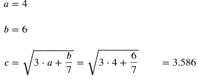
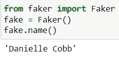
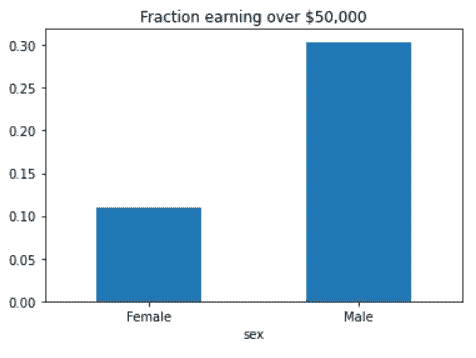
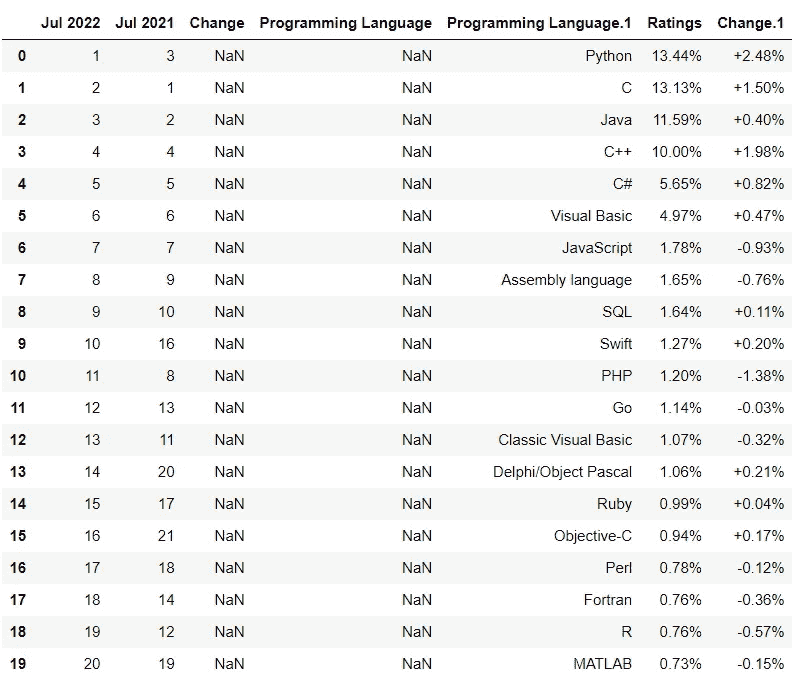
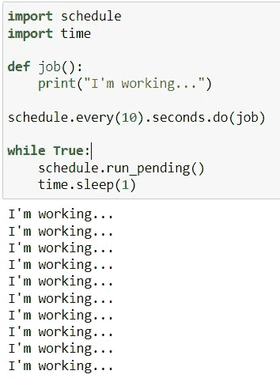

# 31 个独特的 Python 包来改进您的数据工作流

> 原文：<https://towardsdatascience.com/31-uniques-python-packages-to-improve-your-data-workflow-4f9762fc8f8b>

## 面向数据人员的各种 Python 包


亚历山大·席默克在 [Unsplash](https://unsplash.com?utm_source=medium&utm_medium=referral) 上的照片

数据是一个广阔的领域，有大量的社区支持技术发展。此外，Python 拥有热心的支持者，帮助数据世界变得更容易访问，并为数据工作流带来价值。

已经开发了各种 Python 包来帮助数据人员的工作。根据我的经验，许多有用的数据 Python 包缺乏认知度，或者仍在流行。

这就是为什么在本文中，我想向您介绍几个独特的 Python 包，它们将在许多方面帮助您的数据工作流。让我们开始吧！

## 1.敲门

[Knockknock](https://github.com/huggingface/knockknock/blob/master/README.md/) 是一个简单的 Python 包，用于在机器学习模型训练完成或崩溃时通知你。我们可以通过电子邮件、Slack、微软团队等多种渠道获得通知。

为了安装这个包，我们使用下面的代码。

```
pip install knockknock
```

例如，我们可以使用以下代码向您的 Gmail 电子邮件地址通知您的机器学习建模培训状态。

```
from knockknock import email_sender
from sklearn.linear_model import LinearRegression
import numpy as np@email_sender(recipient_emails=["<your_email@address.com>", "<your_second_email@address.com>"], sender_email="<sender_email@gmail.com>")def train_linear_model(your_nicest_parameters): x = np.array([[1, 1], [1, 2], [2, 2], [2, 3]])
    y = np.dot(x, np.array([1, 2])) + 3 
    regression = LinearRegression().fit(x, y) 

    return regression.score(x, y)
```

无论你返回哪个函数，你都会得到通知。

## 2.tqdm

当你做一个迭代或者循环过程时，你需要一个进度条吗？那么 [tqdm](https://github.com/tqdm/tqdm) 就是你的答案。这个包会在你的笔记本或命令提示符中提供一个简单的进度条。

让我们从安装包开始。

```
pip install tqdm
```

然后我们可以尝试使用下面的代码来显示循环过程中的进度条。

```
from tqdm import tqdm
q = 0
for i in tqdm(range(10000000)):
    q = i +1
```


作者 GIF

正如你在上面的 GIF 中看到的，你的笔记本中显示了一个漂亮的进度条。当您有一个复杂的迭代并且想要跟踪进度时，它会有用得多。

## 3.熊猫-日志

[Pandas-log](https://github.com/eyaltrabelsi/pandas-log) 是一个 Python 包，提供对熊猫基本操作的反馈，比如`.query`、`.drop`、`.merge`等等。它基于 R Tidyverse，在这里你可以理解所有的数据分析步骤。

让我们尝试安装软件包。

```
pip install pandas-log
```

安装软件包后，让我们使用以下代码创建一个示例数据框。

```
import pandas as pd
import numpy as np
import pandas_logdf = pd.DataFrame({"name": ['Alfred', 'Batman', 'Catwoman'],
                   "toy": [np.nan, 'Batmobile', 'Bullwhip'],
                   "born": [pd.NaT, pd.Timestamp("1940-04-25"),   pd.NaT]})
```

然后，让我们用下面的代码尝试做一个简单的熊猫执行。

```
with pandas_log.enable():
    res = (df.drop("born", axis = 1)
             .groupby('name')
          )
```


作者图片

有了 Pandas-log，我们可以获得所有的执行信息。

## 4.表情符号

顾名思义，[表情符号](https://github.com/carpedm20/emoji/)是一个支持表情符号文本数据分析的 Python 包。通常，我们在阅读 Python 的表情符号时会有困难，但是表情符号包可以帮助我们。

使用以下代码安装表情包。

```
pip install emoji
```

让我们尝试一个简单的包装表情符号。

```
import emoji
print(emoji.emojize('Python is :thumbs_up:'))
```


作者图片

有了这个包，我们可以输出表情符号，因为表情符号已经被解码成 Python 中可接受的。

## 5.TheFuzz

[TheFuzz](https://github.com/seatgeek/thefuzz) 是一个 Python 包，它使用 [Levenshtein 距离](https://en.wikipedia.org/wiki/Levenshtein_distance)计算相似度来匹配文本。

要使用这个包，我们需要先安装它。

```
pip install thefuzz
```

让我们试试这个包，看看我们如何使用 TheFuzz 包来进行相似性文本匹配。

```
from thefuzz import fuzz, process#Testing the score between two sentences
fuzz.ratio("Test the word", "test the Word!")
```


作者图片

Fuzz 还可以同时从许多单词中提取相似性分数。

```
choices = ["Atlanta Falcons", "New York Jets", "New York Giants", "Dallas Cowboys"]
process.extract("new york jets", choices, limit=2)
```


作者图片

Fuzz 适用于任何文本数据相似性活动。它应该是你的武器库中的一个包。

## 6.数字计算器

[Numerizer](https://github.com/jaidevd/numerizer) 是一个 Python 包，它将书写的数字文本转换成整数或浮点数。让我们试试这个包来了解更多。

首先，我们使用下面的代码安装这个包。

```
pip install numerizer
```

然后我们可以测试这个包。我们来试试几个词来转化。

```
from numerizer import numerize
numerize('forty two')
```


作者图片

如您所见，单词被转换成了它们的整数对应物。如果你使用另一种书写风格，比如下面的，它也是有效的。

```
numerize('forty-two')
```


作者图片

它也适用于表示浮点数字文本的单词。

```
numerize('nine and three quarters')
```


作者图片

如果单词不是一个数字表达式，它们会保持原样。

```
numerize('maybe around nine and three quarters')
```


作者图片

这个包很简单，但是在很多场合都很有用。

## 7.PyAutoGUI

PyAutoGUI 是一个简单的 Python 包，可以自动控制鼠标和键盘。它的工作原理是在你的 IDE 中传递代码并让它们为你工作。让我们从安装包开始。

```
pip install pyautogui
```

然后我们可以使用下面的代码来测试这个动作。

```
import pyautogui
pyautogui.moveTo(10, 15)
pyautogui.click()
pyautogui.doubleClick()
pyautogui.press('enter')
```

上面的代码会将鼠标移动到某个位置并点击你的鼠标。通过按下功能，你也可以按下某个键盘按钮。

当你需要像下载文件或收集数据这样的重复性动作时，这个包非常有用。

## 8.加权计算

[Weightedcalcs](https://github.com/jsvine/weightedcalcs) 是一个 Python 包，用于简化基于我们的数据框架的加权统计计算。从简单的统计，如加权平均值、中值和标准偏差，到加权计数和分布，用法各不相同。

为了使用这个包，我们需要使用下面的代码来安装它。

```
pip install weightedcalcs
```

让我们试着用现有的数据来计算一个加权分布。

```
import seaborn as sns
df = sns.load_dataset('mpg')
```

我会使用 seaborn 包中的 MPG 数据集。为了计算加权统计量，我们需要首先用加权变量声明类。

```
import weightedcalcs as wc
calc = wc.Calculator("mpg")
```

然后，我们将使用该类通过传递数据集和计算预期变量来进行加权计算。

```
calc.distribution(df, "origin")
```


作者图片

## 9.scikit-posthocs

[scikit-posthocs](https://github.com/maximtrp/scikit-posthocs) 是一个用于事后测试分析的 python 包，通常用于统计分析中的成对比较。这个包提供了简单的 scikit-learn API 来进行分析。让我们从安装软件包到试用它开始。

```
pip install scikit-posthocs
```

那么让我们从简单的数据集开始，在试用这个包之前做一个 ANOVA 测试。

```
import statsmodels.api as sa
import statsmodels.formula.api as sfa
import scikit_posthocs as sp
df = sa.datasets.get_rdataset('iris').data
df.columns = df.columns.str.replace('.', '')lm = sfa.ols('SepalWidth ~ C(Species)', data=df).fit()
anova = sa.stats.anova_lm(lm)
print(anova)
```


作者图片

我们获得了 ANOVA 测试结果，但不确定哪个变量类别对结果的影响最大。这就是为什么我们要使用下面的代码进行事后测试。

```
sp.posthoc_ttest(df, val_col='SepalWidth', group_col='Species', p_adjust='holm')
```


作者图片

使用 scikit-posthoc，我们简化了事后检验的成对分析过程，并获得了 P 值。如果你想了解更多的事后测试，你可以在我下面的另一篇文章中读到更多。

</multiple-hypothesis-testing-correction-for-data-scientist-46d3a3d1611d>  

## 10.youtube_dl

[youtube_dl](https://github.com/ytdl-org/youtube-dl) 是一个简单的 python 包，通过提供代码链接来下载 youtube 视频。让我们先安装包来试试这个包。

```
pip install youtube_dl
```

然后，我们使用以下代码将视频下载到您的环境中。

```
# Youtube Dl Example
import youtube_dl
ydl_opt = {}with youtube_dl.YoutubeDL(ydl_opt) as ydl:
    ydl.download(['[https://www.youtube.com/watch?v=ukzFI9rgwfU'](https://www.youtube.com/watch?v=ukzFI9rgwfU')])
```


作者图片

下载过程将开始，mp4 格式的视频将可用。

## 11.地狱犬座

Cerberus 是一个轻量级 python 包，用于数据验证活动。它旨在验证我们发起的任何模式数据以及基于它的数据。让我们从安装包开始。

```
pip install cerberus
```

Cerberus 的基本用法是启动验证器类来拥有数据模式。

```
from cerberus import Validator
schema = {'name': {'type': 'string'}, 'gender':{'type': 'string'}, 'age':{'type':'integer'}}
v = Validator(schema)
```

然后，使用我们传递给验证器类的模式，我们可以验证传递给代码的数据。

```
document = {'name': 'john doe', 'gender':'male', 'age': 15}
v.validate(document)
```


作者图片

如果传递的数据与模式相似，那么验证器类将得到真实的输出。这样，我们可以确保数据输入对于模式总是可靠的。

## 12.ppscore

[ppscore](https://github.com/8080labs/ppscore) 是一个 python 包，用来计算关于目标变量的变量预测能力。该软件包计算可以检测两个变量之间的线性或非线性关系的分数。得分范围从 0(无预测能力)到 1(完美预测能力)。

首先，我们将安装软件包进行测试。

```
pip install ppscore
```

然后使用可用的数据，我们将使用 ppscore 包来计算基于目标的分数。

```
import seaborn as sns
import ppscore as ppsdf = sns.load_dataset('mpg')
pps.predictors(df, 'mpg')
```


作者图片

结果是根据目标及其 ppscore 对变量进行排序。排名越低，变量对目标的预测能力越低。

## 13.玛雅人

Maya 是一个 python 包，用于尽可能轻松地解析日期时间数据。它使用一种简单的人类可读的交互来获取我们想要的日期时间数据。让我们通过首先安装它来开始使用这个包。

```
 pip install maya
```

然后我们可以使用下面的代码轻松访问当前日期。

```
import maya
now = maya.now()
print(now)
```


作者图片

我们还可以为明天的日期初始化一个对象类。

```
tomorrow = maya.when('tomorrow')
tomorrow.datetime()
```


作者图片

这个包对于任何与时间序列相关的活动都很有用，所以试试吧。

## 14.钟摆

[Pendulum](https://pendulum.eustace.io/) 是另一个关注日期时间数据的 python 包。它用于简化任何日期时间分析过程。让我们从导入包开始。

```
pip install pendulum 
```

使用一个简单的例子，我们可以很容易地访问时间，并用下面的代码更改它。

```
import pendulumnow = pendulum.now("Europe/Berlin")# Changing timezone
now.in_timezone("Asia/Tokyo")# Default support for common datetime formats
now.to_iso8601_string()# Day Shifting
now.add(days=2)
```


作者图片

## 15.类别 _ 编码器

[category_encoders](https://github.com/scikit-learn-contrib/category_encoders) 是一个 python 包，用于类别数据编码(转换成数值数据)。这个包是各种编码方法的集合，我们可以根据需要将这些方法应用于各种分类数据。

为了试用这个包，我们需要安装这个包。

```
pip install category_encoders
```

然后我们可以使用下面的例子来应用转换。

```
from category_encoders import BinaryEncoder
import pandas as pd# use binary encoding to encode two categorical features
enc = BinaryEncoder(cols=['origin']).fit(df)# transform the dataset
numeric_dataset = enc.transform(df)
numeric_dataset.head()
```


作者图片

## 16.sci kit-多重学习

[scikit-multilearn](http://scikit.ml/index.html) 是专门针对多类分类模型的机器学习模型的 python 包。该软件包提供了用于训练机器学习模型的 API，以预测具有两个以上类目标的数据集。

让我们通过首先安装它来开始使用这个包。

```
pip install scikit-multilearn
```

使用样本数据集，我们可以使用多标签 KNN 来训练分类器并测量性能指标。

```
from skmultilearn.dataset import load_dataset
from skmultilearn.adapt import MLkNN
import sklearn.metrics as metricsX_train, y_train, feature_names, label_names = load_dataset('emotions', 'train')
X_test, y_test, _, _ = load_dataset('emotions', 'test')classifier = MLkNN(k=3)
prediction = classifier.fit(X_train, y_train).predict(X_test)metrics.hamming_loss(y_test, prediction)
```


作者图片

## 17.多重集

Multiset 是一个简单的 Python 包，类似于内置的 set 函数，但是这个包允许多次出现。

```
pip install multiset
```

我们可以使用下面的代码来使用 Multiset 函数。

```
from multiset import Multiset
set1 = Multiset('aab')
set1
```


作者图片

您还可以测试用于比较和数据可变性的各种函数。

## 18.爵士音乐

[Jazzit](https://github.com/sangarshanan/jazzit) 是一个可爱而有趣的 python 包，可以在代码出错或等待代码运行时播放音乐。让我们从安装包开始。

```
pip install jazzit
```

然后，我们可以使用下面的代码在出错的情况下尝试样本音乐。

```
from jazzit import error_track[@error_track](http://twitter.com/error_track)("curb_your_enthusiasm.mp3", wait=5)
def run():
    for num in reversed(range(10)):
        print(10/num)
```

出错时会播放音乐，所以不要惊讶。

## 19.手摇计算器

[handcalcs](https://github.com/connorferster/handcalcs) 是一个 python 包，用来简化笔记本渲染的数学 latex 过程。它将任何数学函数转化为方程形式。

要安装这个包，我们可以使用下面的代码。

```
pip install handcalcs
```

首先，我们需要导入必要的包。

```
import handcalcs.render
from math import sqrt
```

然后我们将尝试使用下面的代码来测试 handcalcs 包。使用`%%render` magic 命令渲染 Latex 计算。

```
%%rendera = 4
b = 6
c = sqrt(3*a + b/7)
```



作者图片

## 20.整洁文本

NeatText 是一个简单的 python 包，它简化了文本清理和文本数据的预处理。它对任何 NLP 项目和文本机器学习项目数据都很有用。让我们从安装包开始。

```
pip install neattext
```

使用下面的代码，我们可以试用这个包。

```
import neattext as nt 
mytext = "This is the word sample but ,our WEBSITE is [https://exaempleeele.com](https://exaempleeele.com) 😊✨."
docx = nt.TextFrame(text=mytext)
```

`TextFrame`用于启动 NeatText 类，我们可以使用各种函数来描述数据和清理数据。

```
docx.describe()
```


作者图片

使用 describe 函数，我们可以理解我们需要知道的每个文本统计。

为了进一步清理数据，我们可以使用下面的代码。

```
docx.normalize()
```


作者图片

清理数据还是比较简单的，但是有很多功能改进了预处理。

## 21.小型爵士乐队

[Combo](https://github.com/yzhao062/combo) 是一个用于机器学习模型和分数组合的 python 包。该软件包提供了一个工具箱，允许将各种机器学习模型训练到一个模型中。它被视为集成学习模型中的一个子任务。

要试用这个包，让我们先安装它。

```
pip install combo
```

我们可以尝试使用从 scikit-learn 获得的乳腺癌数据集和从 scikit-learn 获得的各种分类模型来创建机器学习组合。

首先，让我们导入所有重要的包。

```
from sklearn.tree import DecisionTreeClassifier
from sklearn.linear_model import LogisticRegression
from sklearn.ensemble import GradientBoostingClassifier
from sklearn.ensemble import RandomForestClassifier
from sklearn.neighbors import KNeighborsClassifierfrom sklearn.model_selection import train_test_split
from sklearn.datasets import load_breast_cancerfrom combo.models.classifier_stacking import Stacking
from combo.utils.data import evaluate_print
```

接下来，让我们看看用于预测目标的单个分类器。

```
# Define data file and read X and y
random_state = 42
X, y = load_breast_cancer(return_X_y=True)X_train, X_test, y_train, y_test = train_test_split(X, y, test_size=0.4,
                                                        random_state=random_state)# initialize a group of clfs
classifiers = [DecisionTreeClassifier(random_state=random_state),
                   LogisticRegression(random_state=random_state),
                   KNeighborsClassifier(),
                   RandomForestClassifier(random_state=random_state),
                   GradientBoostingClassifier(random_state=random_state)]
clf_names = ['DT', 'LR', 'KNN', 'RF', 'GBDT']# evaluate individual classifiers
for i, clf in enumerate(classifiers):
    clf.fit(X_train, y_train)
    y_test_predict = clf.predict(X_test)
    evaluate_print(clf_names[i] + '   |   ', y_test, y_test_predict)
    print()
```


作者图片

接下来，让我们看看使用组合包的堆叠模型。

```
# build a Stacking model and evaluate
clf = Stacking(classifiers, n_folds=4, shuffle_data=False,
                   keep_original=True, use_proba=False,
                   random_state=random_state)clf.fit(X_train, y_train)
y_test_predict = clf.predict(X_test)evaluate_print('Stacking | ', y_test, y_test_predict)
```


作者图片

有所改善，但肯定还有进行另一项实验的空间。您可以使用该软件包尝试任何您认为必要的组合。

## 22.皮阿兹特罗

你需要星座数据还是只是好奇你今天的运气？然后你可以用 [PyAztro](https://github.com/sameerkumar18/pyaztro) 来实现！该软件包涵盖了独特的信息，如幸运数字，幸运标志，心情，等等。让我们试着通过安装来使用这个包。

```
pip install pyaztro
```

然后我们可以用下面的代码尝试访问今天的星座。

```
import pyaztro
pyaztro.Aztro(sign='gemini').description
```


作者图片

## 23.骗子

[Faker](https://github.com/joke2k/faker) 是一个 Python 包，用来简化生成合成数据。许多开发人员使用这个包来创建另一个合成数据生成器包。要使用这个包，让我们安装它。

```
pip install Faker
```

为了使用 Faker 包生成合成数据，我们需要初始化`Faker`类。

```
from faker import Faker
fake = Faker()
```

例如，我们将使用初始化的类创建一个合成数据名。

```
fake.name()
```



作者图片

每当我们运行 Faker 类中的属性`.name`时，Faker 会随机生成合成数据。您仍然可以尝试使用许多属性来生成数据。

## 24.费尔勒恩

[Fairlearn](https://fairlearn.org/) 是一个 python 包，用于评估和减轻机器学习模型中的不公平性。这个包提供了许多必要的 API 来查看偏差，这样我们就可以避免它。要试用这个包，让我们先开始安装它。

```
pip install fairlearn
```

然后，我们可以使用 Fairlearn 的数据集来查看模型中有多少偏差。出于教学目的，我们将简化模型预测。

```
from fairlearn.metrics import MetricFrame, selection_rate
from fairlearn.datasets import fetch_adultdata = fetch_adult(as_frame=True)
X = data.data
y_true = (data.target == '>50K') * 1
sex = X['sex']selection_rates = MetricFrame(metrics=selection_rate,
                              y_true=y_true,
                              y_pred=y_true,
                              sensitive_features=sex)fig = selection_rates.by_group.plot.bar(
    legend=False, rot=0,
    title='Fraction earning over $50,000')
```



作者图片

Fairlearn API 有一个`selection_rate`函数，我们可以用它来检测群体模型预测之间的分数差异，这样我们就可以看到结果的偏差。

## 25.tiobeindexpy

tiobeindexpy 是一个简单的 python 包，用于获取 TIOBE 索引数据。TIOBE index 是一个编程排名数据，遵循它可能很重要，因为我们不想错过编程世界中的下一件事。

要使用 tiobeindexpy，我们需要先安装它。

```
pip install tiobeindexpy
```

然后我们可以通过下面的代码获得当月排名前 20 的编程语言。

```
from tiobeindexpy import tiobeindexpy as tb
df = tb.top_20()
```



作者图片

## 26.pytrends

pytrends 是一个 python 包，使用他们的 API 获取 Google 上的趋势关键词。当我们想要跟上当前的网络趋势或与我们的关键词相关的趋势时，这个包是有用的。要使用这个包，我们需要先安装它。

```
pip install pytrends
```

假设我想知道与关键字“礼物”相关的当前趋势，那么我将使用下面的代码来了解当前趋势。

```
from pytrends.request import TrendReq
import pandas as pd
pytrend = TrendReq()keywords = pytrend.suggestions(keyword='Present Gift')
df = pd.DataFrame(keywords)
df
```


作者图片

该包将返回与关键字相关的前 5 个趋势。

## 27.视力

[visions](https://github.com/dylan-profiler/visions) 是一个用于语义数据分析的 python 包。该包可以检测数据帧类型，并推断该列的数据应该是什么。它旨在自动化数据推断并降低工作复杂性。让我们从安装包开始。

```
pip install visions
```

然后，我们可以使用下面的代码通过 visions 来检测 dataframe 中的列数据类型。我会使用来自 seaborn 的泰坦尼克号数据集。

```
import seaborn as sns
from visions.functional import detect_type, infer_type
from visions.typesets import CompleteSet
df = sns.load_dataset('titanic')
typeset = CompleteSet()# Inference works well even if we monkey with the data, say by converting everything to strings
print(detect_type(df, typeset))
```


作者图片

## 28.日程安排

[Schedule](https://github.com/dbader/schedule) 是一个 python 包，为任何代码创建作业调度功能。它的设计是为了方便用户在你可以设置的重复时间里安排他们想要的任何事情。让我们从安装包开始。

```
pip install schedule
```

例如，我想打印出我每 10 秒钟工作一次。然后我会用下面的代码来做这件事。

```
import schedule
import timedef job():
    print("I'm working...")schedule.every(10).seconds.do(job)while True:
    schedule.run_pending()
    time.sleep(1)
```



作者图片

## 29.自动更正

[自动更正](https://github.com/filyp/autocorrect)是一个 python 包，用于许多语言中的文本拼写更正。这种用法很简单，但对数据清理过程非常有用。让我们从安装包开始。

```
pip install autocorrect
```

然后我们可以使用类似于下面代码的自动更正包。

```
from autocorrect import Speller
spell = Speller()
spell("I'm not sleaspy and tehre is no place I'm giong to.")
```


作者图片

## 30.funcy

funcy 是一个 python 包，其中充满了日常数据分析使用的奇特实用函数。软件包中的函数太多了，我无法一一展示，还有一个备忘单[可以让它变得更简单。让我们从安装包开始。](https://funcy.readthedocs.io/en/stable/cheatsheet.html)

```
pip install funcy
```

我将只展示一个从 iterable 变量中选择偶数的示例函数，如下面的代码所示。

```
from funcy import select, even
select(even, {i for i in range (20)})
```


作者图片

## 31.冰淇淋

[IceCream](https://github.com/gruns/icecream) 是一个 python 包，用于打印目的，但使调试过程更容易。基本上，这个包在打印/记录过程中提供了稍微详细一点的输出。

为了使用这个包，我们需要使用下面的代码来安装它。

```
pip install icecream
```

然后我们可以用下面的代码来使用这个包。

```
from icecream import icdef some_function(i):
    i = 4 + (1 * 2)/ 10 
    return i + 35ic(some_function(121))
```


作者图片

该函数也可以用作函数检查器。

```
def foo():
    ic()

    if some_function(12):
        ic()
    else:
        ic()foo()
```


作者图片

对于我们所做的任何数据分析来说，详细程度都是非常好的。

# 结论

在本文中，我们研究了 31 个独特的 python 包，它们在数据工作流中很有用。大多数软件包易于使用且简单明了，但有些可能需要进一步阅读。

希望有帮助！

> *访问我的* [***社交媒体***](https://bio.link/cornelli)**进行更深入的交谈或有任何问题。**

> **如果您不是作为中等会员订阅，请考虑通过* [*我的推荐*](https://cornelliusyudhawijaya.medium.com/membership) *订阅。**