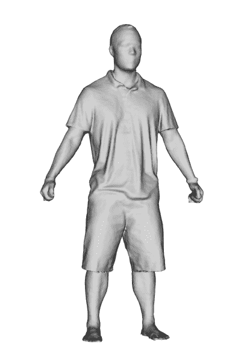
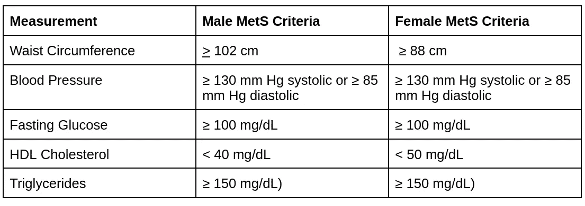
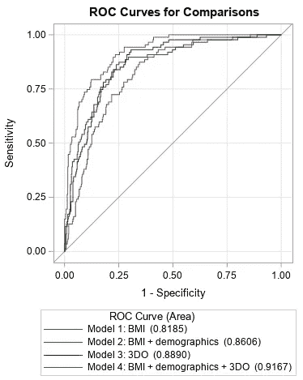
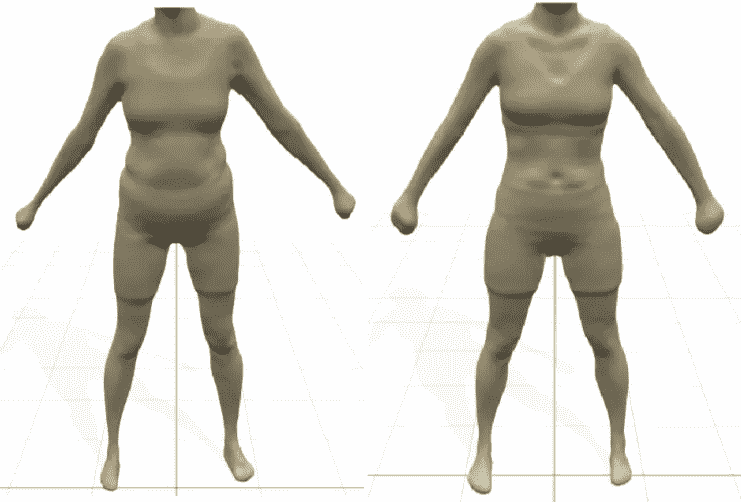
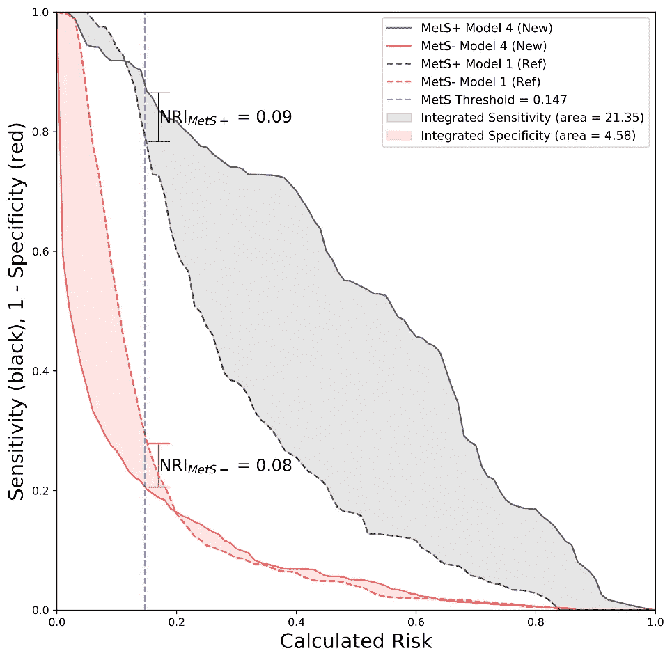

# 三维人体扫描改善了代谢综合征的预测模型

> 原文：<https://towardsdatascience.com/3d-body-scans-improve-predictive-models-for-metabolic-syndrome-6a05fc5aaa99>

## 健康和医学的 3D 数据

## 我们使用 3D 身体扫描数据来改进代谢疾病的模型预测

## 摘要 TL:DR

1.  3D 数据是高维的，可以用来构建强大的模型。
2.  在健康模型中使用 3D 数据(3D 生物标志物)有助于改善代谢综合征状态的预测。
3.  我们展示了另一个发表的例子，使用综合判别改进(IDI)和净重新分类指数(NRI)来评估和比较两个模型和新的生物标志物。
4.  [**阅读文章**](https://doi.org/10.1002/oby.23470)

# **3D 扫描和健康**

这些年来，三维(3D)扫描技术已经变得更便宜、更精确、更容易获得。Xbox kinect 等游戏平台包含能够捕捉 3D 身体数据的摄像头，非常容易访问。新的 iPhone 12 也有一个 3D 扫描摄像头，因此，展示了获取 3D 数据的障碍正在快速减少。因此，许多人已经开始探索强大的机器学习和深度学习模型，这些模型结合了图形和 3D 卷积等迷人的技术。在这项工作中，我们展示了如何更简单的模型可以受益于三维的适当利用。

30 秒内完成高分辨率 3D 扫描。与这种扫描不同，研究参与者穿着合身的衣服，以捕捉更准确的体型(图片由作者提供)

医疗保健和医学研究已经注意到 3D 身体扫描技术，许多人已经开始使用它来监测一个人的健康状况。这个想法是，你可以看着一个人，从视觉上对一个人的总体健康状况有一个很好的直觉。也有人认为，这种视觉直觉是一种比简单的身高和体重测量以及由这两种测量得出的身体质量指数(身体质量指数)更有力的健康指标。事实上，我目前的研究小组目前获得了美国国立卫生研究院(NIH)的拨款，以研究 2D 和 3D 体型如何与代谢疾病、癌症和整体健康状况相关联。我们发现，3D 扫描是一种强大、全面、信息密集的健康数据，易于获取。在这项工作中，我们观察了 3D 扫描仪捕捉到的体形如何帮助我们更好地预测某人是否患有代谢综合征。

# **什么是代谢综合征**

代谢综合征(MetS)在美国三分之一的成年人中流行，并在下面的文本中定义，但表格可能更容易阅读。基本上，如果三个或更多的测量值符合标准，那么这个人患有代谢综合征。患有代谢综合征的人患心脏病的风险更高，全因死亡率也更高。好消息是，一个人有能力通过修改上表中的任何测量值来改变他们的代谢综合征状态，干预越早，结果越好。

使用 2005 年国家胆固醇教育计划成人治疗小组 III (NCEP ATP III)指南将代谢综合征定义为具有≥3 个以下特征:高腰围(通过人工人体测量测量；男性≥102 cm，女性≥88 cm)，甘油三酯升高(≥150 mg/dL)，血压升高(≥130 mm Hg 收缩压或≥85 mm Hg 舒张压)，空腹血糖升高(≥100 mg/dL)，和/或 HDL-C 降低(< 40 mg/dL in men, <50 mg/dL in women). (Image by author)

# **使用 3D 数据改善代谢综合征模型**

除了腰围和血压之外，其他测量数据更难获得，需要抽血。因此，使用可获得的测量方法建立一个模型来预测代谢综合征状态将是有益的。身体质量指数是一种容易获得的常用测量方法；然而，我们认为它是有限的。我们也相信(或假设)3D 扫描能提供更多信息，而且同样容易获得。

作者图片

3D 扫描系统产生一个人的 3D 网格，并且还报告所有的 3D 人体测量值，包括腰围、体积以及腰、臂和腿的表面积等等。周长测量可以用卷尺手动获得，但是收集所有区域需要更多的时间。因此，在临床上，如果有的话，通常只收集腰围。使用逻辑回归和可获得的患者数据，而不是血液标志物，建立了几个模型来预测代谢综合征。最佳模型利用身体质量指数、年龄、性别、种族和 3D 数据预测代谢综合征，AUC 为 0.92。我们的结果表明，可以使用更容易获得的数据建立代谢综合征预测模型，而不需要抽血。我们还表明，身体质量指数是相当有限的，增加容易获得的三维数据大大提高了模型的性能。

# **进一步证明了身体质量指数的局限性**

下面是年龄相仿、身体质量指数相同的亚洲女性的 3D 扫描图。然而，当我们看扫描时，我们可以看到身体质量指数没有解释的体型差异。从 3D 数据中，你可以看到清晰度、脂肪分布、肌肉张力等方面的差异。此外，左边的女性有代谢综合征，而右边的女性没有，当你看 3D 扫描时，这在一定程度上是有意义的。它最终比身体质量指数一个人的信息量更大。

两位年龄相似、体重指数相同(身体质量指数)的参与者，但一位患有代谢综合征(左)，一位没有(右)。(图片由作者提供)

# **综合歧视改善(IDI)和净重新分类(NRI)**

综合判别改进(IDI)和净重新分类(NRI)对于比较模型和使用新的生物标志物是有用的。在这种情况下，我们从三维身体扫描数据中寻找三维生物标志物。我有一个以前的帖子/教程，演示了如何使用 python 计算它。

作者图片

我们再次使用这些图来显示包含 3D 数据的模型如何改进仅使用身体质量指数的模型。添加 3D 数据导致综合灵敏度和综合特异性分别为 21.35 和 4.58，表明灵敏度和特异性均有提高。使用 Youden 方法计算的阈值，代谢综合征和非代谢综合征的净再分类指数分别为 9%和 8%。这意味着利用 3D 数据，该模型能够正确地识别出 9%以上患有代谢综合征的个体，而身体质量指数模型仅遗漏了这些个体。这也意味着，使用 3D 数据，该模型能够比仅使用身体质量指数的模型多正确识别出 8%的未患代谢综合征的个体，这些个体被错误地识别为患有代谢综合征。

# **更多资源:**

## [在这里看报纸](https://doi.org/10.1002/oby.23470)

## 关于 AUC、IDI 和 NRI 的教程和更多信息

      

## **发表 IDI 的例子**

    

## **资助和研究数据请求**

 