# 3D 机器学习 201 指南:点云语义分割

> 原文：<https://towardsdatascience.com/3d-machine-learning-course-point-cloud-semantic-segmentation-9b32618ca5df>

## 完整的 python 教程，为非结构化 3D 激光雷达点云数据的语义分割创建监督学习 AI 系统

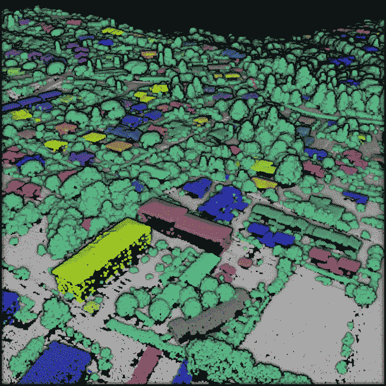

3D 机器学习教程:如何开发 3D LiDAR 点云数据的语义分割框架。F. Poux

拥有攻击点云处理的每个方面的技能和知识打开了许多想法和开发的大门。🤖它就像是 3D 研究创造力和开发灵活性的工具箱。核心是这个不可思议的人工智能空间，目标是 3D 场景理解。🏡

由于其对许多应用的重要性，如自动驾驶汽车、自主机器人、3D 地图、虚拟现实和元宇宙，它尤其相关。如果你是一个像我一样的自动化极客，你很难抗拒拥有新的路径来应对这些挑战的诱惑！

本教程的目的是给你我认为必要的立足点:开发三维点云语义分割系统的知识和代码技巧。

但实际上，我们如何应用语义分割呢？而 3D 机器学习的挑战性有多大？

让我介绍一个清晰、深入的 201 动手课程，重点是 3D 机器学习。在本教程中，我将详细介绍什么是 3D 机器学习，以及我们如何利用高效的 python 代码来为非结构化的 3D 点云生成语义预测。

```
Table of Contents[3D Scene Perception](#bba3)
✔️ 3D Sensors
✔️ 3D Scene Understanding
✔️ Classification[Semantics Addition Methods for 3D data](#92f1)
✔️ 3D Object Detection
✔️ 3D Semantic Segmentation
✔️ 3D Instance Segmentation[3D Predictions with Supervised learning](#ca39)[3D Python Workflow](#866a)
✔️ Step 1: Definition and Data Curation
✔️ Step 2\. Environment Set-up
✔️ Step 3\. 3D Feature Engineering
✔️ Step 4\. 3D Machine Learning
✔️ Step 5\. Performance Analysis[Conclusion](#b1fe)
```

让我们开始吧！🤿

# 三维场景感知:人工智能前言

由于 3D 捕获数据的复杂性质，在激光雷达(代表光探测和测距)中识别 3D 对象是一个巨大的挑战。通过 3D 扫描技术获得的原始点云是非结构化的、未精炼的、无序的，并且易于不规则采样，使得 3D 场景理解任务具有挑战性。那么，我们该怎么办呢？到底可行不可行？哈，这就是我们喜欢的！真正的挑战！😉

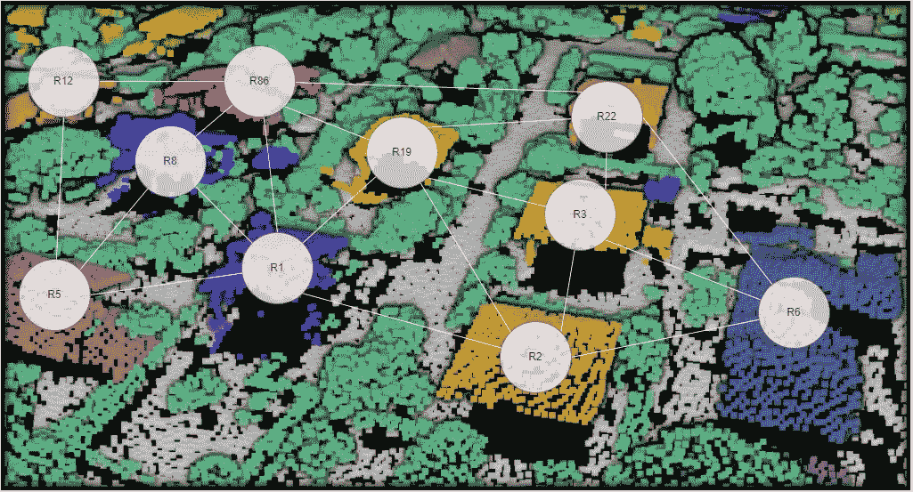

一个 3D 场景理解表示的示例，它将不同房屋的知识结合在一个相关的本地上下文中。F. Poux

## 👀3D 传感器

让我们从系统的输入开始。3D 传感器(激光雷达、摄影测量、SAR、雷达和深度感应相机)将通过空间中的许多 3D 点来描述场景。然后，这些可以托管有用的信息，并使使用这些输入的机器学习系统(例如，自动驾驶汽车和机器人)能够在现实世界中运行，并创建改进的元宇宙体验。好了，我们有了来自感官信息的基本输入，接下来是什么？

## 🏕️三维场景理解

你猜对了:场景理解。它描述了感知、分析和解释通过一个或多个传感器观察到的 3D 场景的过程(场景甚至可以是动态的！).接下来，这个过程主要包括将来自观察场景的传感器的信号信息与我们用来理解场景的“模型”相匹配。取决于神奇的🧙‍♂️有多蓬松，这些模型将允许一个相关的“场景理解”。在低级视图上，技术是从表征场景的输入数据中提取和添加语义。这些技术有名字吗？

## 🦘/🐈‍⬛分类

嗯，我们在 3D 场景理解框架中经典涉及的是分类的任务。这一步的主要目标是理解输入数据并解释传感器数据的不同部分。例如，我们有一个由自主机器人或汽车收集的户外场景的点云，如高速公路。分类的目标是找出场景的主要组成部分，因此知道点云中的哪些部分是道路，哪些部分是建筑物，或者人在哪里。从这个意义上说，它是一个旨在从我们的传感器数据中提取特定语义的总体类别。从那里，我们想添加不同粒度的语义。👇

# 三维数据的经典语义添加方法

正如您在下面看到的，可以通过各种策略为 3D 场景添加语义。这些不一定是独立的设计，当需要时，我们经常可以依靠混合装配。

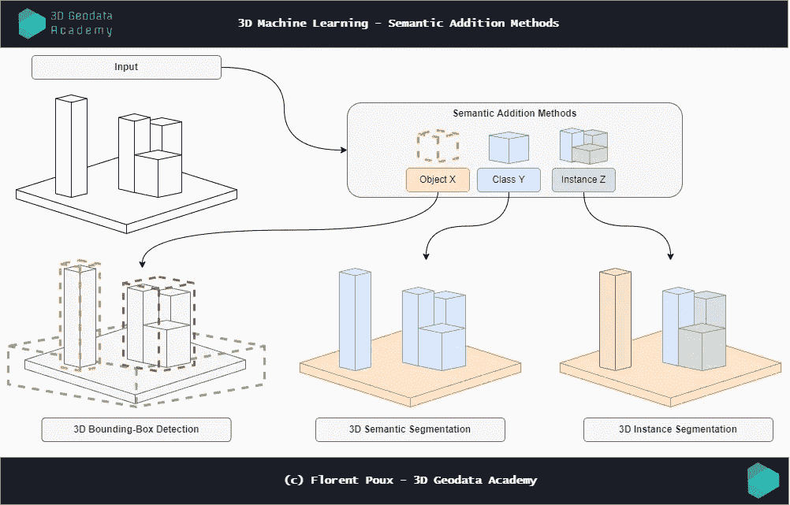

3D 机器学习方法:数据被馈送到模型，该模型将输出 3D 边界框、每个点的标签或者每个点的标签加上每个类的每个对象的实例指针。F. Poux

让我更详细地描述一下这些技术。

## 📦**三维物体检测**

第一个将包含 3D 对象检测技术。它是许多应用程序的重要组成部分。基本上，它使系统能够捕捉世界上物体的大小、方向和位置。因此，我们可以在现实世界的场景中使用这些 3D 检测，如增强现实应用程序、自动驾驶汽车或通过有限的空间/视觉线索感知世界的机器人。包含不同物体的漂亮的 3D 立方体。但是如果我们想要微调物体的轮廓呢？

## 🏘️ **3D 语义分割**

这就是我们要用语义分割技术解决问题的地方。将语义标签分配给属于感兴趣对象的每个基本单元(即，点云中的每个点)是最具挑战性的任务之一。本质上，3D 语义分割旨在更好地描绘场景中存在对象。一个 3D 包围盒检测。因此，它意味着每个点都有语义信息。我们可以深入那里。但是仍然存在一个限制:我们不能直接处理我们攻击的每个类别(类)的不同对象。我们也有这方面的技术吗？

## 🏠 **3D 实例分割**

是啊！这就是所谓的三维实例分割。它甚至有更广泛的应用，从自主系统中的 3D 感知到绘图和数字结对中的 3D 重建。例如，我们可以想象一个库存机器人，它可以识别椅子，能够数出有多少把椅子，然后通过第四条腿抓住它们来移动它们。实现这个目标需要区分不同的语义标签以及具有相同语义标签的不同实例。我认为实例分割是巨型立体图像上的语义分割步骤😁。

既然您已经对不同输出的当前方法有了基本的理解和分类，那么问题仍然存在:我们应该遵循哪种策略来注入语义预测？🤔

# 有监督学习的 3D 预测

如果你还在那里，那么你已经通过了 mumble bumble 3D charabia，并准备好抓住它的单角任务。🦄我们希望提取语义信息，并将其以点云的形式注入到我们的 3D 数据中。为此，我们将深化一种策略，帮助我们从传感器中获取此类信息。我们将专注于一个算法家族，监督学习方法——与下面显示的非监督方法相反。

[](/fundamentals-to-clustering-high-dimensional-data-3d-point-clouds-3196ee56f5da)  

使用监督学习方法，我们本质上向过去的系统显示特定的分类示例。这意味着我们需要给这些例子贴上标签。为此，您有以下教程:

[](/3d-point-cloud-clustering-tutorial-with-k-means-and-python-c870089f3af8)  

然后，我们使用场景中每个被考虑元素的标签来预测未来数据的标签。因此，目标是能够推断出尚未看到的数据，如下图所示。

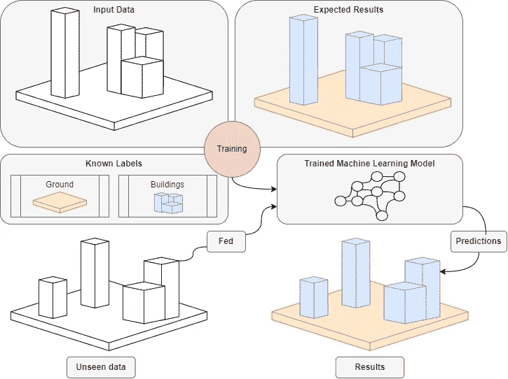

监督学习工作流程。训练阶段允许获得用于预测未知数据上的标签的机器学习模型。F. Poux

但是我们如何评估经过训练的模型的表现呢？一个直观的分析就够了吗(这是一个实际的问题吗？🙃)

好吧，视觉分析——姑且称之为定性分析——只是答案的一部分。另一个大块是通过使用各种度量标准评估的定量分析，这些度量标准将突出我们方法的特定性能。它将帮助我们描述特定分类系统的工作情况，并为我们提供工具来选择不同的分类器。

而现在，(光)论结束了！让我们通过五个步骤深入了解一个有趣的 python 代码实现🤲！我推荐一个很棒的🫐碗。

# 1.3D 机器学习工作流定义

## 航空激光雷达点云数据集来源

你知道规矩吗？我们做的第一步是潜入网络，寻找一些有趣的 3D 数据！这一次，我想深挖一个法国人(抱歉我这么势利😆)找到冷冻激光雷达数据集的地方:法国国家地理研究所(IGN)。随着 LiDAR HD 活动的开展，法国开始了开放式数据采集，您可以获得法国一些地区清晰的 3D 点云！在最上面，一些有标签，使它很容易不从头开始，你会在下面的链接中找到。

[](https://geoservices.ign.fr/lidarhd#telechargementclassifiees)  

但是为了使教程简单明了，我上了上面的门户，选择了覆盖洛汉斯城(71)部分的数据，删除了地理参考信息，计算了一些额外的属性(我将在另一个教程中解释)😜)，然后在我的[打开数据驱动文件夹](https://drive.google.com/drive/folders/1Ih_Zz9a6UcbUlaA-puEB_is7DYvXrb4w?usp=sharing)中提供。你感兴趣的数据是`3DML_urban_point_cloud.xyz`和`3DML_validation.xyz`。如果你想在网上可视化，你可以跳转到 [Flyvast WebGL 摘录](https://www.flyvast.com/flyvast/app/page-snapshot-viewer.html#/524/ff813c90-346f-5d7e-3633-b0fed0973a9d)。

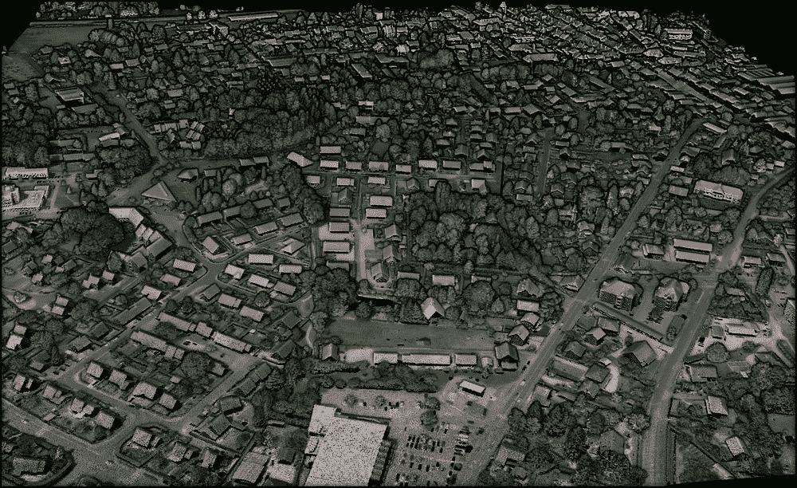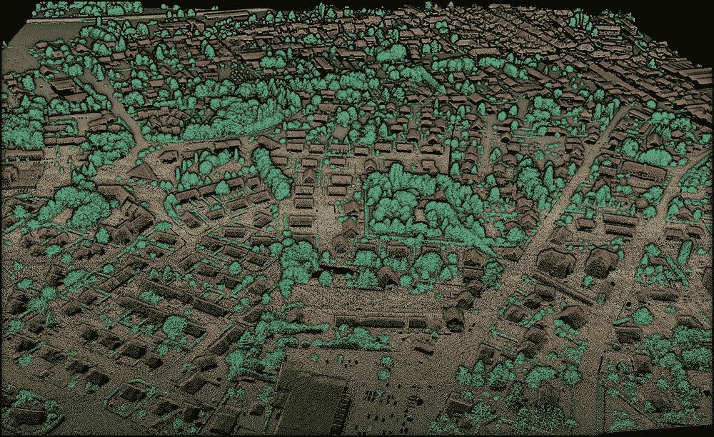

IGN 提供的 Louhans 市的航空激光雷达点云数据视图。左侧我们看到的是 RGB 颜色的点云，右侧是我们将研究的三个感兴趣的类别(地面、植被和建筑物)。F. Poux

## 整体循环策略

我建议遵循一个简单的程序，您可以快速复制来训练 3D 机器学习模型，并将其用于现实世界的应用程序，如下图所示。


3D 机器学习工作流程:点云语义分割。F. Poux 和 [3D 地理数据学院](https://learngeodata.eu)

🤓 ***注*** *:这个策略是我在* [*3D 地理数据学院*](https://learngeodata.eu/) *主持的在线课程中的一个文档的一点摘录。本教程将涵盖步骤 4 至 8 + 10 + 11，其他步骤将在课程中深入介绍，或者通过此* [*支持链接*](https://medium.com/@florentpoux/membership) *跟随其中一个教程。*

# 2.设置我们的 3D python 上下文

在这个动手操作的点云教程中，我主要关注高效和最小的库使用。为了掌握 python，我们只用两个库来完成这一切:`Pandas`和`ScikitLearn`。我们会创造奇迹😁。启动脚本的五行代码:

```
import pandas as pdfrom sklearn.model_selection import train_test_split
from sklearn.metrics import classification_reportfrom sklearn.ensemble import RandomForestClassifier
from sklearn.preprocessing import MinMaxScaler
```

🤓 ***注*** *:如你所见，我以不同的方式从库中导入函数和模块。对于熊猫，我使用* `*import module*` *，这样就减少了对* `*import*` *语句的维护。然而，当你想更多地控制一个模块的哪些项可以被访问时，我推荐使用* `*from module import foo*` *，这允许使用* `*foo*` *进行更少的输入。*

不错！从那里，我建议我们相对地表达我们的路径，将包含我们的数据集的`data_folder`与`dataset`名称分开，以便在运行中容易地切换:

```
data_folder=”../DATA/”
dataset="3DML_urban_point_cloud.xyz"
```

现在，我们可以使用`Pandas`在`pcd`变量中快速加载数据集。因为原始文件不干净并且包含`NaN`值，我们将使用非常方便的`dropna`方法`inplace`来确保我们从一个只有完整行的过滤数据帧开始。然而，这意味着我们会在前进的道路上丢掉一些分数(记录的`<1%`),但是这一次我们对此没有意见。

```
pcd=pd.read_csv(data_folder+dataset,delimiter=' ')
pcd.dropna(inplace=True)
```

🤓 ***注意*** *:将* `*inplace*` *参数设置为* `*True*` *允许直接替换 python 对象，而不是制作 dataframe 副本。*

# 3.特征选择和准备(步骤 4)

为了理解我们在使用机器学习框架时做了什么，你必须理解我们依赖于可变代表的特征集或特征向量。在我们的方法中，诀窍是很好地了解我们进化的环境，并创造性地设计我们认为将是我们数据中方差的优秀描述符的特征。或者至少帮助我们区分感兴趣的类别。

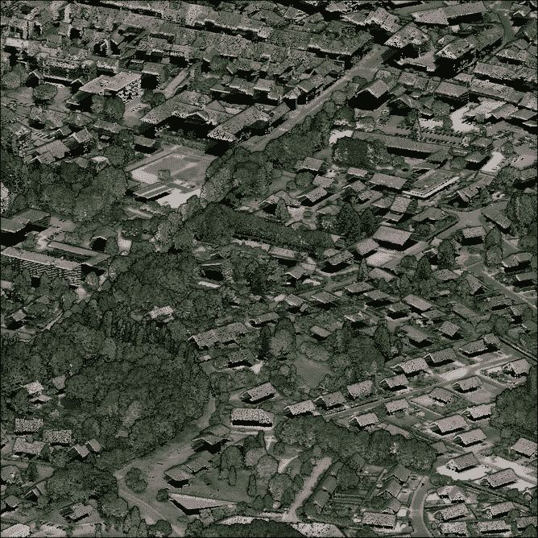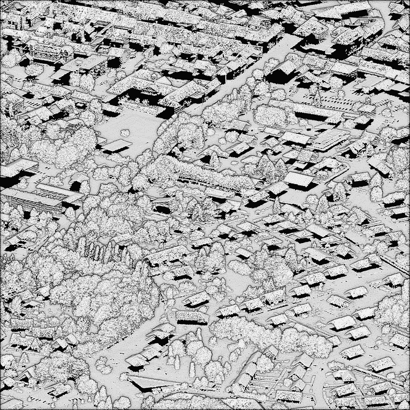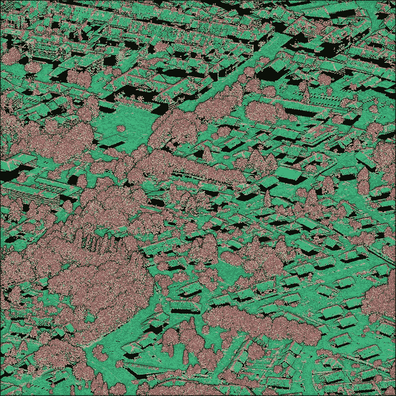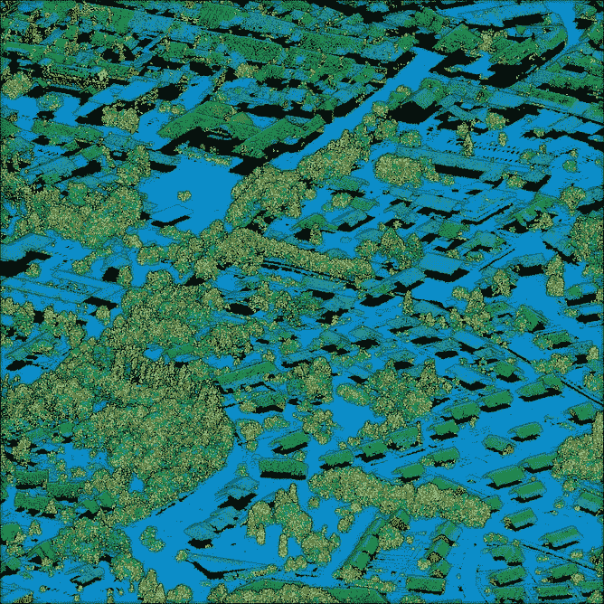

航空激光雷达点云训练特征集从左到右依次为:(1) RGB 颜色，(2)法线，(3)平面性，(4)垂直度，(5)全方差，(6)法线变化率。F. Poux

我决定创建另一个专注的教程，只讨论获得这些特性的准备步骤。但是为了简单起见，我已经为你计算了一堆，过滤的主要目的是与随后的语义分割任务相关。


数据帧的摘录。F. Poux

为了在坚实的基础上开始，我们将在标签之间组织我们的特征，即我们将尝试预测什么，以及特征，即我们将使用什么来进行预测。对于熊猫，我们可以通过两行代码轻松做到这一点:

```
labels=pcd['Classification']features=pcd[['X','Y','Z','R','G','B']]
```

这种数据帧结构允许在不使用数字索引的情况下快速切换到一组特定的相关特征。因此，您可以在这一步随意返回并更改`features`矢量集。

## 选择功能

特征选择是通过仅使用最相关的变量并消除数据中的噪声来减少输入模型的输入变量的方法。它是根据您试图解决的问题类型，为您的机器学习模型选择相关功能的过程。如果自动完成，这属于将机器学习应用于现实世界问题的任务自动化的 **AutoML** 过程。

这里有两个方向。您要么完全不受监督(例如，减少要素之间的相关性)，要么以受监督的方式进行(例如，在更改要素和参数后增加模型的最终得分)。

为了简单起见，我们将通过监督方向手动调整我们当前特征向量的选择:我们将运行实验，如果结果不够好，我们将进行调整。准备好了吗？🙂

## 准备功能

一旦我们的初始特征向量准备好了，我们就可以开始处理了！💨或者我们可以吗？要警惕！根据我们使用的机器学习模型，我们可能会遇到一些惊喜！事实上，让我们举一个简单的例子。

假设我们选择的特征向量如下:

```
features=pcd[['X','Y']]
```

在这里，如果我们用它来训练我们的算法，那么我们会被限制在可见的范围内，例如，X 在 0 到 100 之间变化。如果经过这个范围的训练后，模型被输入了具有相似分布但不同范围的未来数据，例如 X 从 1100 到 1200，那么我们可能会得到灾难性的结果，即使它是同一个数据集，只是中间有一个平移。事实上，对于某些模型，高于 100 的 X 值可能会使模型预测出错误的值，而如果事先保证，我们会将数据转换到训练中看到的相同范围内。这些预测更有可能有意义。

我转向了特征缩放和归一化的概念。这是数据预处理阶段的一个关键部分，但我看到许多初学者忽视了这一点(损害了他们的机器学习模型)。我们不会犯的错误！💪

因为我们处在一个空间密集的环境中，避免泛化问题的一个好方法是将其简化为我们所说的最小-最大归一化。为此，我们将使用`MinMaxScaler`功能:

```
from sklearn.preprocessing import MinMaxScaler
features_scaled = MinMaxScaler().fit_transform(features)
```

💡 ***提示*** *:该* `*MinMaxScaler()*` *通过对每个特征进行缩放和平移，使其位于给定的范围内，例如 0 到 1 之间，从而对特征进行变换。如果您的数据是正态分布的，那么您可以使用 StandardScaler。*

## 3D 机器学习培训设置

好的，我们有一个`labels`向量和一个合适的`features`向量。现在，我们需要为培训阶段做好准备。首先，我们将分割两个向量——同时保持标签和特征之间的适当索引匹配——以使用一部分用于训练机器学习模型，另一部分仅用于观察性能。我们用`60%`的数据进行训练，用`40%`的数据看表演，都是从同一个分布中随机抽取的。从`scikitlearn`使用`train_test_split`功能制作:

```
X_train, X_test, y_train, y_test = train_test_split(features_scaled, labels, test_size=0.4)
```

🤓 ***注*** *:我们在处理机器学习任务的数据时使用命名约定。* `*X*` *表示输入到模型中的特征(或数据)* `*y*` *表示标签。每一个都根据其终结性分解为* `*_train*` *或* `*_test*` *。*

然后，我们通过以下方式创建一个“分类器对象”:

```
rf_classifier = RandomForestClassifier()
```

🤓***注*** *:以上分类器为随机森林分类器。简而言之，它在特征的各个子样本上拟合几个决策树分类器，并使用平均来提高预测精度和控制过拟合。引人注目的东西*😁*。*

在分类器初始化之后，我们将分类器与训练数据进行拟合，以调整其核心参数。此阶段是训练阶段，可能需要几分钟，具体取决于我们之前使用的超参数(即，定义机器学习模型架构的参数)(树的数量、深度):

```
rf_classifier.fit(X_train, y_train)
```

最后，瞧！我们有训练有素的模特！是的，就是这么简单！所以走捷径也是那么容易。😉

对于预测阶段，无论是否有标签，都需要执行以下操作:

```
rf_predictions = rf_classifier.predict(X_test)
```

然后，您可以使用下面的代码块可视化结果和差异，该代码块将创建三个子图:3D 点云数据地面实况、预测以及两者之间的差异:

```
fig, axs = plt.subplots(1, 3, figsize=(20,5))
axs[0].scatter(X_test['X'], X_test['Y'], c =y_test, s=0.05)
axs[0].set_title('3D Point Cloud Ground Truth')
axs[1].scatter(X_test['X'], X_test['Y'], c = rf_predictions, s=0.05)
axs[1].set_title('3D Point Cloud Predictions')
axs[2].scatter(X_test['X'], X_test['Y'], c = y_test-rf_predictions, cmap = plt.cm.rainbow, s=0.5*(y_test-rf_predictions))
axs[2].set_title('Differences')
```

如果您想检查一些指标，我们可以使用`scikit-learn`的`classification_report`函数打印一个带有一串数字的分类报告:

```
print(classification_report(y_test, rf_predictions))
```

但是，我们难道不应该理解每个指标的含义吗？🤔

# 4.3D 机器学习调整(步骤 5)

## 绩效和指标

我们可以使用几个量化指标来评估语义分割和分类的结果。我将向您介绍对 3D 点云语义分割评估非常有用的四个指标:精确度、召回率、F1 分数和整体准确度。它们都取决于我们所说的真正的积极和真正的消极:

*   真阳性(TP):观察为阳性，预测为阳性。
*   假阴性(FN):观察结果为阳性，但预测结果为阴性。
*   真阴性(TN):观察为阴性，预测为阴性。
*   假阳性(FP):观察为阴性，但预测为阳性。

总准确度是对关于分类器正确预测标签的性能的所有观察的一般度量。精度是分类器不将阴性样品标记为阳性的能力；召回直观上是分类器找到所有阳性样本的能力。因此，您可以将精度视为了解您的模型是否精确的一个很好的度量，而将回忆视为了解您以何种穷尽性找到每个类(或全局)的所有对象的一个很好的度量。F1 分数可以被解释为精确度和召回率的加权调和平均值，因此给出了分类器在一个数字上表现如何的良好度量。

🤓*此后，在我们的实验中的 F1 分数指示了所提出的分类器的平均性能。*

## 型号选择

是时候选择具体的 3D 机器学习模型了。对于本教程，我将选择限制在三种机器学习模型:随机森林、K 近邻和属于深度学习类别的多层感知器。为了使用它们，我们将首先导入以下必要的函数:

```
from sklearn.neighbors import RandomForestClassifier
rf_classifier = RandomForestClassifier()from sklearn.neighbors import KNeighborsClassifier
knn_classifier = KNeighborsClassifier()from sklearn.neural_network import MLPClassifier
mlp_classifier = MLPClassifier(solver='lbfgs', alpha=1e-5,hidden_layer_sizes=(15, 2), random_state=1)
```

然后，您只需用想要的算法堆栈替换下面代码块中的`XXXClassifier()`:

```
XXX_classifier = XXXClassifier()
XXX_classifier.fit(X_train, y_train)
XXX_predictions = XXXclassifier.predict(X_test)
print(classification_report(y_test, XXX_predictions, target_names=['ground','vegetation','buildings']))
```

🤓***注意*** *:为了简单起见，我将对应于地面、植被和建筑物的树类列表传递给了* `*classification_report*` *。*

现在，进入使用上述三个分类器的测试阶段，参数如下:

```
Train / Test Data: 60%/40% 
Number of Point in the test set: 1 351 791 / 3 379 477 pts
Features selected: ['X','Y','Z','R','G','B'] - With Normalization
```

**随机森林**

我们从随机森林开始。某种神奇的树魔法，通过一个集合算法将多个决策树结合起来，给我们一个最终的结果:基于对`1.3 million points`的支持，总体精度为`98%`。它进一步分解如下:

```
╔════════════╦══════════════╦══════════╦════════════╦═════════╗
║  classes   ║    precision ║   recall ║   f1-score ║ support ║
╠════════════╬══════════════╬══════════╬════════════╬═════════╣
║ ground     ║         0.99 ║     1.00 ║       1.00 ║  690670 ║
║ vegetation ║         0.97 ║     0.98 ║       0.98 ║  428324 ║
║ buildings  ║         0.97 ║     0.94 ║       0.96 ║  232797 ║
╚════════════╩══════════════╩══════════╩════════════╩═════════╝
```


3D 航空激光雷达点云上监督机器学习随机森林方法的结果。F. Poux

🤓***注*** *:这里不多说什么，与其说它提供了令人印象深刻的结果。地面点几乎被完美分类:* `*1.00*` *召回意味着所有属于地面的点都被找到，* `*0.99*` *精确意味着仍有微小的改进余地，以确保没有假阳性。Auqlitqtivelym ze 注意到错误分布在各处，如果必须手动纠正，这可能会有问题。*

**K-NN**

K-最近邻分类器使用邻近度来预测单个数据点分组。我们获得了 91%的全局准确度，进一步分解如下:

```
╔════════════╦══════════════╦══════════╦════════════╦═════════╗
║  classes   ║    precision ║   recall ║   f1-score ║ support ║
╠════════════╬══════════════╬══════════╬════════════╬═════════╣
║ ground     ║         0.92 ║     0.90 ║       0.91 ║  690670 ║
║ vegetation ║         0.88 ║     0.91 ║       0.90 ║  428324 ║
║ buildings  ║         0.92 ║     0.92 ║       0.92 ║  232797 ║
╚════════════╩══════════════╩══════════╩════════════╩═════════╝
```


有监督的机器学习 K 最近邻方法在 3D 航空激光雷达点云上的结果。F. Poux

🤓 ***注*** *:结果低于随机森林，这是意料之中的，因为我们在当前向量空间中更容易受到局部噪声的影响。我们在所有的类上有一个同质的精度/召回平衡，这是一个好的迹象，表明我们避免了过度拟合问题。至少在目前的分布中是这样😁。*

**采用多层感知器的 3D 深度学习**

多层感知器(MLP)是一种学习线性和非线性数据关系的神经网络算法。MLP 需要调整几个超参数，如隐藏神经元的数量、层数和迭代次数，这使得很难获得开箱即用的高性能。例如，使用超参数集，我们有一个全局精度`64%`，进一步分解如下:

```
╔════════════╦══════════════╦══════════╦════════════╦═════════╗
║  classes   ║    precision ║   recall ║   f1-score ║ support ║
╠════════════╬══════════════╬══════════╬════════════╬═════════╣
║ ground     ║         0.63 ║     0.76 ║       0.69 ║  690670 ║
║ vegetation ║         0.69 ║     0.74 ║       0.71 ║  428324 ║
║ buildings  ║         0.50 ║     0.13 ║       0.20 ║  232797 ║
╚════════════╩══════════════╩══════════╩════════════╩═════════╝
```


监督深度学习 MLP 方法在 3D 航空激光雷达点云上的结果。F. Poux

🤓 ***注****:MLP 指标故意提供了一个被认为是糟糕指标的好例子。我们的准确率低于 75%，这通常是衡量目标的第一手指标，然后我们看到内部和内部类别之间的显著差异。值得注意的是，buildings 类还远远不够健壮，我们可能会有一个过度适应的问题。从视觉上来说，也发现了这一点，因为我们可以看到，这是关于深度学习模型的混乱的主要来源。*

在这一步，我们不会通过特性选择来改进，但是我们总是有这种可能性。在这一步，我们决定采用性能最好的模型，即随机森林方法。现在，我们必须调查当前训练的模型在挑战看不见的场景下是否表现良好，准备好了吗？😄

# 5.3D 机器学习性能:走向一般化

现在事情变得棘手了。看着上面我们所拥有的，如果我们想要将当前的模型扩展到扩展当前样本数据集范围的真实世界应用程序，我们可能会遇到巨大的麻烦。因此，让我们进入该模型的全面部署。

## 验证数据集

这是一个关键的概念，我建议，以确保避免过度拟合问题。我认为，与其只使用来自同一分布的训练数据集和测试数据集，不如使用另一个具有不同特征的未知数据集来衡量现实世界的性能，这一点至关重要。因此，我们有:

*   **训练数据**:用于拟合模型的数据样本。
*   **测试数据**:用于提供模型无偏评估的数据样本，该模型符合训练数据，但用于调整模型超参数和特征向量。因此，当我们用它来调整输入参数时，评估变得有点偏差。
*   **验证数据**:不相关的数据样本用于提供与训练数据相匹配的最终模型的无偏评估。

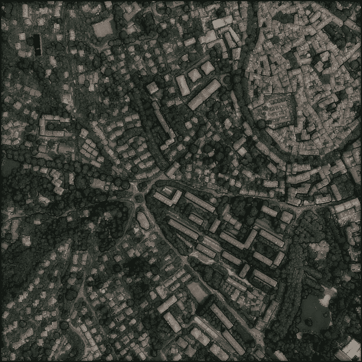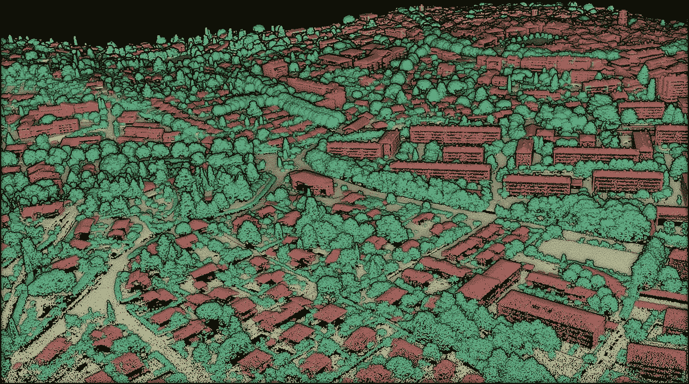

构成验证数据的 3D 点云的视觉渲染。它是从 Manosque 市上空的航空激光雷达 IGN HD 战役中捕获的(04)。它呈现出不同的语境和对象特征。F. Poux

以下是一些附加的澄清说明:

*   测试数据集也可以在其他形式的模型准备中发挥作用，例如特征选择。
*   最终的模型可以符合训练和验证数据集的集合，但我们决定不这样做。

所选的验证数据来自 Manosque 市(04)，该市呈现了不同的城市环境，例如，不同的地形和大不相同的城市环境，如下所示。这样，我们增加了应对泛化的挑战😆。


左边是我们在测试端训练和评估的数据集(40%不可见)。在右边，您有一个不同的验证数据集，这将是我们的模型给出的真实世界可能性的一个重要标志。

您可以从我的[打开的数据驱动器文件夹](https://drive.google.com/drive/folders/1Ih_Zz9a6UcbUlaA-puEB_is7DYvXrb4w?usp=sharing)中下载`3DML_validation.xyz`数据集(如果尚未下载的话)。正如下面所解释的，您还可以找到标签来研究我所做的不同迭代的度量和潜在收益。

## 改善概化结果

我们的目标是检查验证数据集的结果，看看我们是否忽略了一些可能性。

首先，我们用以下三行代码在脚本中导入验证数据:

```
val_dataset="3DML_validation.xyz"
val_pcd=pd.read_csv(data_folder+dataset,delimiter=' ')
val_pcd.dropna(inplace=True)
```

然后，我们准备特征向量以具有与用于训练模型的特征相同的特征:不多也不少。我们进一步归一化我们的特征向量，使其处于与我们的训练数据相同的条件下。

```
val_labels=val_pcd['Classification']
val_features=val_pcd[['X','Y','Z','R','G','B']]
val_features_scaled = MinMaxScaler().fit_transform(val_features)
```

然后，我们将已经训练好的模型应用于验证数据，并打印结果:

```
val_predictions = rf_classifier.predict(val_features_scaled)
print(classification_report(val_labels, val_predictions, target_names=['ground','vegetation','buildings']))
```

这就给我们留下了验证数据集中存在的`3.1 million`点的最终精度为`54%`(相对于包含`1.3 million`点的测试数据的`98%`)。它分解如下:

```
╔════════════╦══════════════╦══════════╦════════════╦═════════╗
║  classes   ║    precision ║   recall ║   f1-score ║ support ║
╠════════════╬══════════════╬══════════╬════════════╬═════════╣
║ ground     ║         0.65 ║     0.16 ║       0.25 ║ 1188768 ║
║ vegetation ║         0.59 ║     0.85 ║       0.70 ║ 1315231 ║
║ buildings  ║         0.43 ║     0.67 ║       0.53 ║  613317 ║
╚════════════╩══════════════╩══════════╩════════════╩═════════╝
```


验证点云数据集上随机森林分类器的定性结果。只有空间坐标和 R、G、B 通道被用作输入特征。F. Poux

你刚刚见证了机器学习的真正黑暗面:使模型过度适应样本分布，并且在推广方面有巨大的困难。因为我们已经确保对数据进行了规范化，所以我们可以调查这种低性能行为可能是由于功能不够独特造成的。我的意思是，我们使用了一些最常见/最基本的功能。因此，让我们通过更好的功能选择来进行改进，例如，下面的功能选择:

```
features=pcd[['Z','R','G','B','omnivariance_2','normal_cr_2','NumberOfReturns','planarity_2','omnivariance_1','verticality_1']]val_features=val_pcd[['Z','R','G','B','omnivariance_2','normal_cr_2','NumberOfReturns','planarity_2','omnivariance_1','verticality_1']]
```

很好，我们现在重新开始测试数据的训练阶段，我们检查模型的性能，然后检查它在验证数据集上的表现:

```
features_scaled = MinMaxScaler().fit_transform(features)
X_train, X_test, y_train, y_test = train_test_split(features_scaled, labels, test_size=0.3)
rf_classifier = RandomForestClassifier(n_estimators = 10)
rf_classifier.fit(X_train, y_train)
rf_predictions = rf_classifier.predict(X_test)
print(classification_report(y_test, rf_predictions, target_names=['ground','vegetation','buildings']))val_features_scaled = MinMaxScaler().fit_transform(val_features)
val_rf_predictions = rf_classifier.predict(val_features_scaled)
print(classification_report(val_labels, val_rf_predictions, target_names=['ground','vegetation','buildings']))
```

让我们研究一下结果。我们现在对测试数据有 97%的准确率，进一步分解如下:

```
╔════════════╦══════════════╦══════════╦════════════╦═════════╗
║  classes   ║    precision ║   recall ║   f1-score ║ support ║
╠════════════╬══════════════╬══════════╬════════════╬═════════╣
║ ground     ║         0.97 ║     0.98 ║       0.98 ║  518973 ║
║ vegetation ║         0.97 ║     0.98 ║       0.97 ║  319808 ║
║ buildings  ║         0.95 ║     0.91 ║       0.93 ║  175063 ║
╚════════════╩══════════════╩══════════╩════════════╩═════════╝
```

与只使用基本的`X, Y, Z, R, G, B`集合相比，添加特性会导致性能略微下降，这表明我们添加了一些噪声。但是为了一般化，这是值得的！我们现在在验证集上有 85%的全局准确率，所以仅通过特征选择就提高了 31%!它是巨大的。正如你所注意到的，建筑是影响表演的主要因素。这主要是因为它们与测试集中的特征非常不同，并且特征集不能在不相关的上下文中真实地表示它们。

```
╔════════════╦══════════════╦══════════╦════════════╦═════════╗
║  classes   ║    precision ║   recall ║   f1-score ║ support ║
╠════════════╬══════════════╬══════════╬════════════╬═════════╣
║ ground     ║         0.89 ║     0.81 ║       0.85 ║ 1188768 ║
║ vegetation ║         0.92 ║     0.92 ║       0.92 ║ 1315231 ║
║ buildings  ║         0.68 ║     0.80 ║       0.73 ║  613317 ║
╚════════════╩══════════════╩══════════╩════════════╩═════════╝
```


验证点云数据集上随机森林分类器的定性结果。选择了一个功能集。F. Poux

这非常非常好！我们现在有一个比你能找到的大多数模型都要好的模型，甚至使用深度学习架构！

假设我们想扩大规模。在这种情况下，从验证分布中注入一些数据来检查这是否是模型中所需要的可能是有趣的，代价是我们的验证失去了它的地位，成为测试集的一部分。我们采用 10%的验证数据集和 60%的初始数据集来训练随机森林模型。然后，我们使用它并检查构成测试数据的其余 40%的结果，以及验证数据的 90%的结果:

```
val_labels=val_pcd['Classification']
val_features=val_pcd[['Z','R','G','B','omnivariance_2','normal_cr_2','NumberOfReturns','planarity_2','omnivariance_1','verticality_1']]
val_features_sampled, val_features_test, val_labels_sampled, val_labels_test = train_test_split(val_features, val_labels, test_size=0.9)
val_features_scaled_sample = MinMaxScaler().fit_transform(val_features_test)labels=pd.concat([pcd['Classification'],val_labels_sampled])
features=pd.concat([pcd[['Z','R','G','B','omnivariance_2','normal_cr_2','NumberOfReturns','planarity_2','omnivariance_1','verticality_1']],val_features_sampled])
features_scaled = MinMaxScaler().fit_transform(features)
X_train, X_test, y_train, y_test = train_test_split(features_scaled, labels, test_size=0.4)rf_classifier = RandomForestClassifier(n_estimators = 10)
rf_classifier.fit(X_train, y_train)
rf_predictions = rf_classifier.predict(X_test)
print(classification_report(y_test, rf_predictions, target_names=['ground','vegetation','buildings']))val_rf_predictions_90 = rf_classifier.predict(val_features_scaled_sample)
print(classification_report(val_labels_test, val_rf_predictions_90, target_names=['ground','vegetation','buildings']))
```

令我们非常高兴的是，我们看到，在测试集上，我们的指标至少下降了 5%，而损失只有 1%，因此，代价是最小的特征噪声，如下所示:

```
40% Test Predicitions - Accuracy = 0.96    1476484

╔════════════╦══════════════╦══════════╦════════════╦═════════╗
║  classes   ║    precision ║   recall ║   f1-score ║ support ║
╠════════════╬══════════════╬══════════╬════════════╬═════════╣
║ ground     ║         0.97 ║     0.98 ║       0.97 ║  737270 ║
║ vegetation ║         0.97 ║     0.97 ║       0.97 ║  481408 ║
║ buildings  ║         0.94 ║     0.90 ║       0.95 ║  257806 ║
╚════════════╩══════════════╩══════════╩════════════╩═════════╝90% Validation Predicitions - Accuracy = 0.90    2805585╔════════════╦══════════════╦══════════╦════════════╦═════════╗
║  classes   ║    precision ║   recall ║   f1-score ║ support ║
╠════════════╬══════════════╬══════════╬════════════╬═════════╣
║ ground     ║         0.88 ║     0.92 ║       0.90 ║  237194 ║
║ vegetation ║         0.93 ║     0.94 ║       0.94 ║  263364 ║
║ buildings  ║         0.87 ║     0.79 ║       0.83 ║  122906 ║
╚════════════╩══════════════╩══════════╩════════════╩═════════╝
```


验证点云数据集上随机森林分类器的定性结果。来自验证的一些数据被用于训练。F. Poux

通常有趣的是用不同的模型和相同的参数检查最终结果，然后经历超参数调整的最后阶段。但那是以后的事了😉。你不累吗？我认为我们的大脑能量需要充电；让我们把其余的留到另一个时间来完成这个项目。😁

## 导出带标签的数据集

标题说明了一切:是时候导出结果，以便在另一个应用程序中使用它们了。让我们用下面几行将它导出为 Ascii 文件:

```
val_pcd['predictions']=val_rf_predictions
result_folder="../DATA/RESULTS/"
val_pcd[['X','Y','Z','R','G','B','predictions']].to_csv(result_folder+dataset.split(".")[0]+"_result_final.xyz", index=None, sep=';')
```

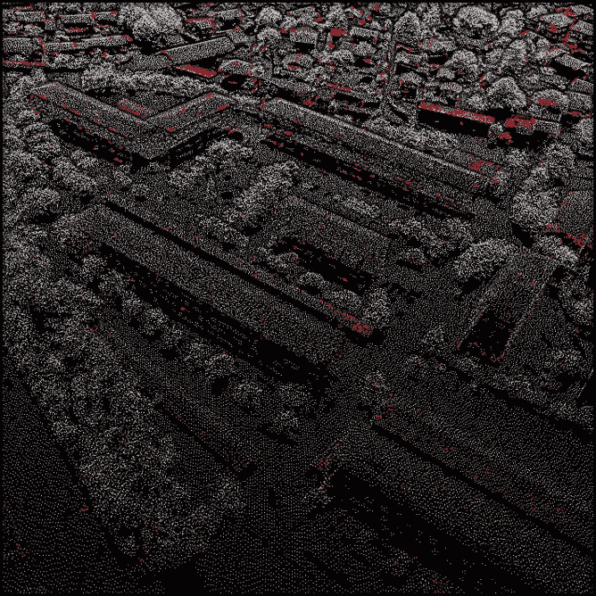

放大点云语义分割机器学习工作流的最终结果。从左至右:地面真相，红色差异，预测。F. Poux

## 导出 3D 机器学习模型

当然，如果您对您的模型满意，您可以永久保存它，然后将其放在某个地方，用于生产中不可见/未标记的数据集。我们可以使用 pickle 模块来做到这一点。三行代码:

```
import pickle
pickle.dump(rf_classifier, open(result_folder+"urban_classifier.poux", 'wb'))
```

当您需要重用模型时:

```
model_name="urban_classifier.poux"
loaded_model = pickle.load(open(result_folder+model_name, 'rb'))
predictions = loaded_model.predict(data_to_predict)
print(classification_report(y_test, loaded_predictions, target_names=['ground','vegetation','buildings']))
```

你可以用这个 Google Colab 笔记本直接在你的浏览器中访问完整的代码。

# 结论

那是一次疯狂的旅行！完整的 201 课程，带 3D 机器学习动手教程！😁您学到了很多东西，尤其是如何导入具有特征的点云，选择、训练和调整受监督的 3D 机器学习模型，并将其导出以检测户外课程，从而出色地概括到大型航空点云数据集！热烈祝贺！但这只是 3D 机器学习等式的一部分。为了扩展学习之旅的成果，未来的文章将深入探讨语义和实例分割[2–4]，动画和深度学习[1]。我们将研究如何管理大点云数据，如下文所述。

[](/the-future-of-3d-point-clouds-a-new-perspective-125b35b558b9)  

我的贡献旨在浓缩可操作的信息，以便您可以从零开始为您的项目构建 3D 自动化系统。你可以从参加[地理数据学院](https://learngeodata.eu/)的课程开始。

# 参考

1. **Poux，F.** ，& J.-J Ponciano。(2020).三维室内点云实例分割的自学习本体。 *ISPRS Int。拱门。Pho 的。&雷姆。B2，309–316；[https://doi . org/10.5194/ISPRS-archives-XLIII-B2–2020–309–2020](http://dx.doi.org/10.5194/isprs-archives-XLIII-B2-2020-309-2020)*

2. **Poux，F.** ，& Billen，R. (2019)。基于体素的三维点云语义分割:无监督的几何和关系特征与深度学习方法。 *ISPRS 国际地理信息杂志*。8(5), 213;[https://doi.org/10.3390/ijgi8050213](https://doi.org/10.3390/ijgi8050213)

3. **Poux，F.** ，纽维尔，r .，纽约，g .-a .&比伦，R. (2018)。三维点云语义建模:室内空间和家具的集成框架。*遥感*， *10* (9)，1412。[https://doi.org/10.3390/rs10091412](https://doi.org/10.3390/rs10091412)

4. **Poux，F.** ，Neuville，r .，Van Wersch，l .，Nys，g .-a .&Billen，R. (2017)。考古学中的 3D 点云:应用于准平面物体的获取、处理和知识整合的进展。*地学*， *7* (4)，96。[https://doi.org/10.3390/GEOSCIENCES7040096](https://doi.org/10.3390/GEOSCIENCES7040096)