# 基于 K-means 和 Python 的三维点云聚类教程

> 原文：<https://towardsdatascience.com/3d-point-cloud-clustering-tutorial-with-k-means-and-python-c870089f3af8>

## [实践教程](https://towardsdatascience.com/tagged/hands-on-tutorials)，3D Python

## 创建 3D 语义分割数据集的完整 python 实践指南。了解如何使用 K-Means 聚类通过无监督分割来转换未标记的点云数据。

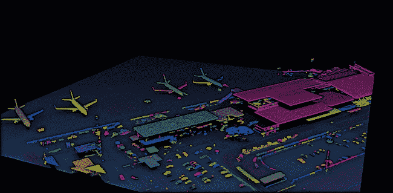

来自航空激光雷达数据的机场的 3D 点云无监督分割。聚类方案组合的示例，如 K-Means 聚类。F. Poux

如果你正在寻找一个语义分割的(监督的)深度学习算法——关键词警报😁—你肯定发现自己在寻找一些高质量的标签+大量的数据点。

在我们的 3D 数据世界中，3D 点云的未标记特性使得回答这两个标准特别具有挑战性:没有任何好的训练集，很难“训练”任何预测模型。

我们是否应该探索 python 技巧，并将其添加到我们的“箭筒”中，以快速生成出色的 3D 标注点云数据集？

让我们开始吧！🤿

# 无监督工作流聚类前言

> 为什么无监督的分割和聚类是“人工智能的主体”？

通过监督系统的深度学习(DL)非常有用。在过去的几年里，DL 架构深刻地改变了技术领域。然而，如果我们想要创造出出色的机器，深度学习将需要一次质的更新——拒绝“越大越好”的概念。今天有几种方法可以达到这个里程碑，最重要的是，无人监督或自我监督的方向是游戏规则的改变者。


点云不同细节层次的聚类策略。F. Poux

> 聚类算法通常用于探索性数据分析。它们也构成了人工智能分类管道中的大部分过程，以无监督/自学的方式创建良好标记的数据集。

这句话摘自上一篇文章“高维数据聚类的基础知识”，总结了我们快速探索创建半自动标签管道的实用方法的驱动因素。激动人心！但是当然，如果你觉得你需要一些快速的理论更新，你可以在下面的文章中找到完整的解释。

</fundamentals-to-clustering-high-dimensional-data-3d-point-clouds-3196ee56f5da>  

## 如何定义聚类？

一句话，聚类意味着将相似的项目或数据点组合在一起。K-means 是计算这种聚类的特定算法。

那么我们可能想要聚类的那些数据点是什么呢？这些点可以是任意点，例如使用激光雷达扫描仪记录的 3D 点。

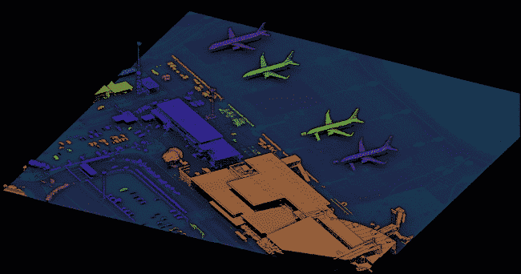

3D 点云中的点分组示例，尝试使用 K-Means 查找主要欧几里德区域。F. Poux

但是它们也可以表示空间坐标、数据集中的颜色值(图像、点云等)或其他特征，例如从图像中提取的关键点描述符，以构建单词字典包。

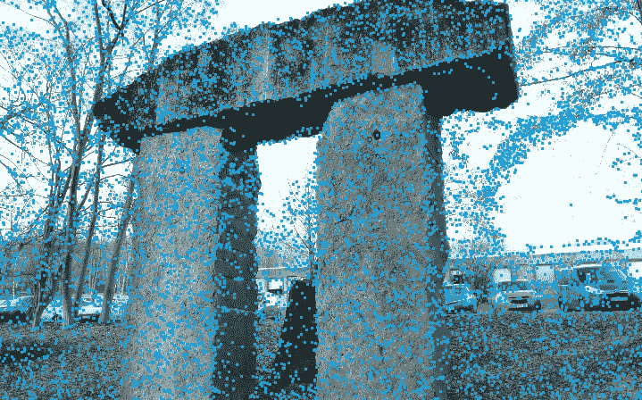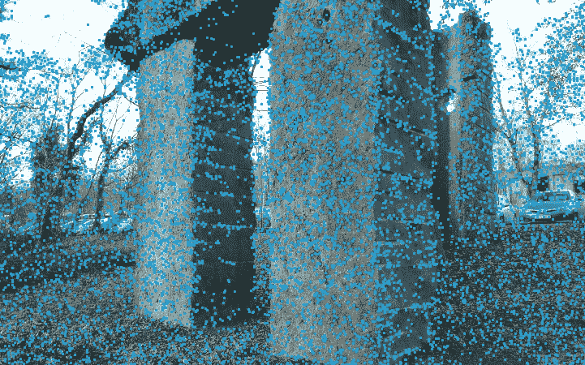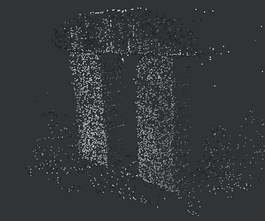

从两幅立体图像中提取 SIFT 特征点，并在聚类步骤后使用摄影测量重建相应的三维点云。更多信息，了解如何在 [3D 地理数据学院](https://learngeodata.eu/3d-reconstructor-formation/)用开源软件做到这一点。F. Poux

<https://learngeodata.eu/3d-reconstructor-formation/>  

您可以将它们视为空间中的任意向量，每个向量包含一组属性。然后，我们在一个定义的“特征空间”中收集许多这样的向量，我们希望用少量的代表来表示它们。但这里的大问题是，那些代表应该是什么样子？

# k 均值聚类

K-Means 是计算这种聚类的一种非常简单和流行的算法。这是一个典型的无人监管的过程，所以我们不需要任何标签，如在分类问题。

我们唯一需要知道的是一个距离函数。告诉我们两个数据点相距多远的函数。以最简单的形式，这就是欧几里德距离。但是根据您的应用，您可能还想选择不同的距离函数。然后，我们可以确定两个数据点是否彼此相似，从而确定它们是否属于同一个聚类。

## K-Means 是如何工作的？

它用 K 个代表来表示所有的数据点，这就是该算法的名字。所以 K 是我们放入系统的用户定义的数字。例如，取所有的数据点，用空间中的三个点来表示。

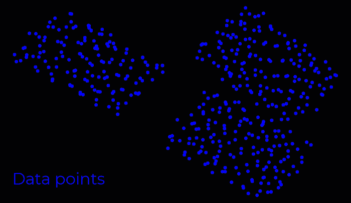

K 的意思是工作。首先，我们在特征空间中有一些数据点(欧几里得空间中的 X、Y 和 Z)。然后，我们计算 K 个代表，并运行 K-Means 将数据点分配给该代表所代表的聚类。F. Poux

所以在上面的例子中，蓝色的点是输入数据点，我们设置 K=3。这意味着我们希望用三种不同的代表来表示这些数据点。那么由红色点表示的那些代表将数据点的相应分配定向到“最佳”代表。然后我们得到三组点，绿色、紫色和黄色。

K-means 以最小化数据点与其最接近的代表点之间的平方距离的方式来实现。实现这一点的算法部分由两个简单的迭代步骤构成:初始化和赋值:

1.  我们随机初始化 K 个质心点作为代表，并计算每个数据点到最近质心的数据关联。所以我们在这里做的是最近邻查询。
2.  每个数据点都被分配到它最近的质心，然后我们在我们的空间中重新配置每个质心的位置。这是通过计算分配给质心的所有数据点的主向量来实现的，这改变了质心的位置。

所以在算法的下一次迭代中，我们会得到一个新的赋值，然后是一个新的质心位置，我们重复这个过程直到收敛。

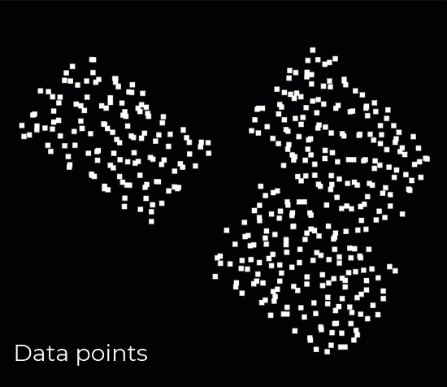

K-Means 是如何工作的？直观解释。F. Poux

💡**提示:**我们要注意，K-Means 并不是一个最优算法。这意味着 K-Means 试图最小化距离函数，但我们不能保证找到全局最小值。因此，根据您的起始位置，您可能会得到不同的 K 均值聚类结果。假设我们想以一种快速的方式实现 K-Means。在这种情况下，我们通常需要在我们的空间中有一个近似的最近邻函数，因为这是用该算法完成的最耗时的操作。好消息，稍后我会在中提示 `*k-means++*` *😉。*

因此，K-Means 是一种相对简单的两步迭代方法，用于寻找高维空间中潜在的大量数据点的代表。既然理论已经结束，让我们通过五个步骤深入到有趣的 python 代码实现中🤲！

# 1.点云工作流定义

## 航空激光雷达点云数据集

我们实践教程的第一步是收集一个好的数据集！这一次，我想分享另一个寻找酷炫激光雷达数据集的绝佳地点:法国国家地理研究所的地理服务。法国 ign 的 LiDAR HD 活动启动了一个开放式数据收集，在这里你可以获得法国一些地区清晰的 3D 点云！

<https://geoservices.ign.fr/lidarhd#telechargement>  

我进入上面的门户，选择一个切片，从中提取一个子切片，删除地理参考信息，准备一些激光雷达文件的额外属性部分，然后在我的 [Open Data Drive 文件夹](https://drive.google.com/drive/folders/1Ih_Zz9a6UcbUlaA-puEB_is7DYvXrb4w?usp=sharing)中提供它。你感兴趣的数据是`KME_planes.xyz`和`KME_cars.xyz`。如果你想在网上看到它们，你可以跳转到 Flyvast WebGL 摘录。

## 整体循环策略

我建议遵循一个简单的程序，您可以复制该程序来标记您的点云数据集，如下图所示。

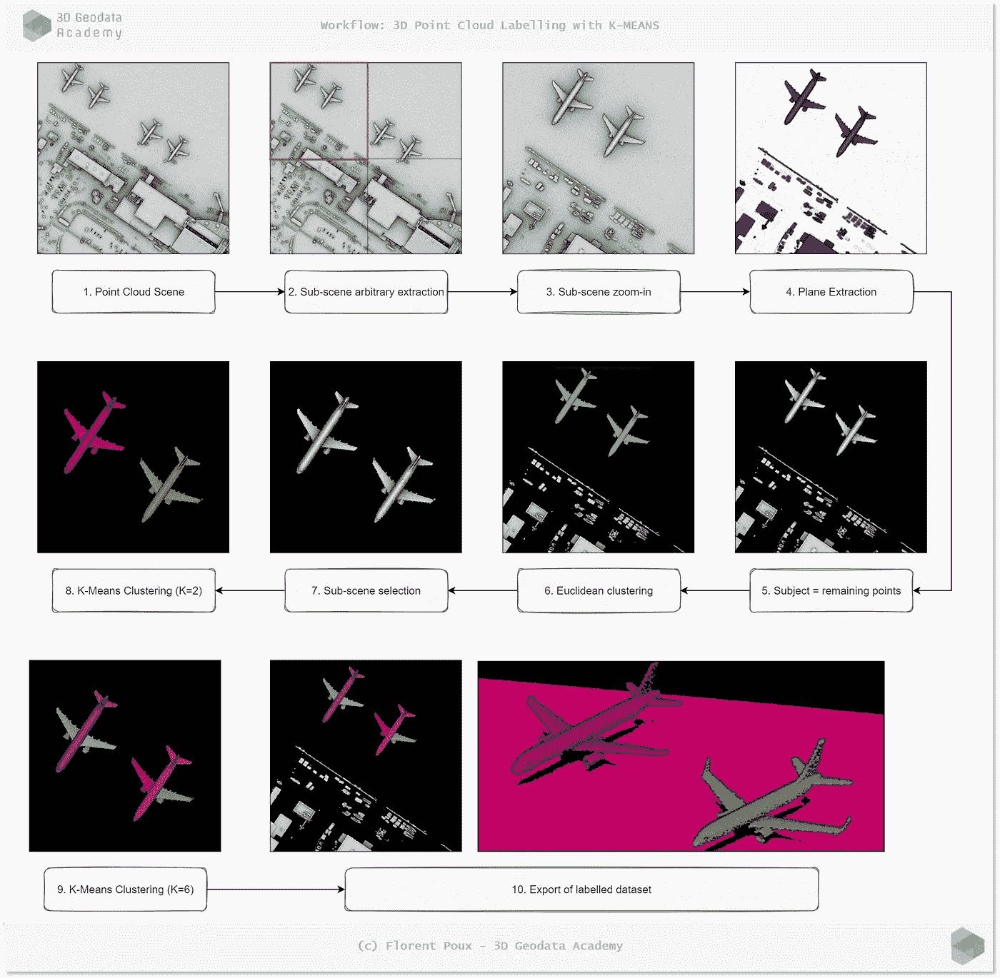

标注 3D 点云数据集的半监督工作流。F. Poux

🤓 ***注*** :这个策略是从我在 [3D 地理数据学院](https://learngeodata.eu/)主持的在线课程的一个文档中摘录的。本教程将涵盖第 7 步到第 10 步，其他步骤将在课程中深入讨论，或者按照下面的编码指南进行。

</how-to-automate-3d-point-cloud-segmentation-and-clustering-with-python-343c9039e4f5> [## 如何使用 Python 实现 3D 点云分割和聚类的自动化

towardsdatascience.com](/how-to-automate-3d-point-cloud-segmentation-and-clustering-with-python-343c9039e4f5) 

# 2.设置我们的 3D python 上下文

在这个动手操作的点云教程中，我主要关注高效和最小的库使用。我们可以用其他库做所有的事情，比如`open3d`、`pptk`、`pytorch3D` …但是为了掌握 python，我们将用`NumPy`、`Matplotlib`和`ScikitLearn`做所有的事情。启动脚本的六行代码:

```
import numpy as np
import matplotlib.pyplot as plt
from mpl_toolkits import mplot3d
from sklearn.cluster import KMeans
from sklearn.cluster import DBSCAN
```

很好，从这里开始，我建议我们相对地表达我们的路径，将包含我们的数据集的`data_folder`与`dataset`名称分开，以便在运行中容易地切换:

```
data_folder=”../DATA/”
dataset=”KME_planes.xyz”
```

从那里，我想说明一个用`Numpy`加载你的点云的好技巧。直观的方法是将所有内容加载到一个`pcd`点云变量中，比如`pcd=np.loadtxt(data_folder+dataset)`。但是因为我们将对这些特性稍加研究，所以让我们通过动态地解包变量中的每一列来节省一些时间。`Numpy`到底有多酷？😆

```
x,y,z,illuminance,reflectance,intensity,nb_of_returns = np.loadtxt(data_folder+dataset,skiprows=1, delimiter=’;’, unpack=True)
```

不错！我们现在有一切可以玩的东西了！由于 K-Means 的本质，我们必须小心地面元素的无所不在，这将提供一些奇怪的东西，如下所示:

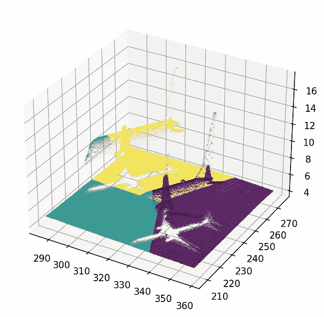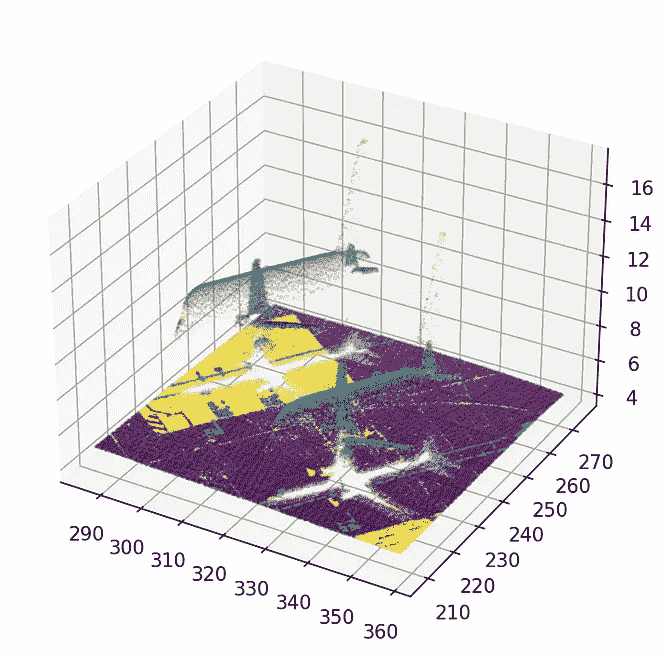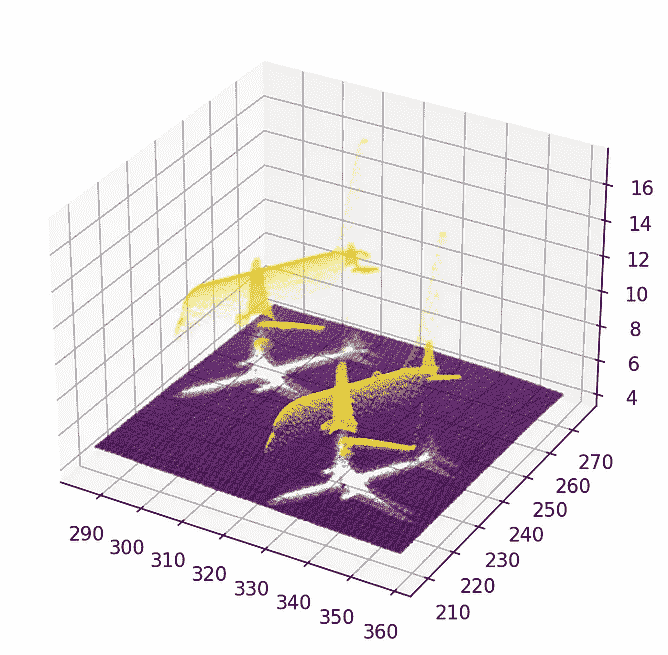

一些 K-Means 在 3D 点云上的结果，基于各种属性，没有智能注入。请注意，当仅使用空间属性时，第一幅图像上有规则的三角形分隔。不理想，嗯？弗·普克斯。

为了避免奇怪的结果，我们应该处理我们认为的异常值，即地面。下面是一个直接的窍门，不需要注入太多约束性的知识。

# 3.点云快速选择

让我通过`Matplotlib`用一个微小的监督步骤来说明如何处理这个问题。它还允许我给你一些代码，这些代码在创建支线剧情和线条分层时总是很方便的。我们将检查两个视图上的 2D 图，我们点的平均值落在哪里，看看这是否有助于在后面的步骤中过滤掉背景。

首先，让我们制作一个 subplot 元素，它将保存我们在`X, Z`视图上的点，并绘制 pour 空间坐标的平均值:

```
plt.subplot(1, 2, 1) # row 1, col 2 index 1
plt.scatter(x, z, c=intensity, s=0.05)
plt.axhline(y=np.mean(z), color=’r’, linestyle=’-’)
plt.title(“First view”)
plt.xlabel(‘X-axis ‘)
plt.ylabel(‘Z-axis ‘)
```

💡**提示:**如果你观察线条内部，我使用强度场作为我们的图的着色元素。我可以这样做，因为它已经在一个`[0,1]`间隔被标准化了。`s`代表尺寸，允许我们给我们的点一个尺寸。😉

然后，让我们做同样的把戏，但这次是在`Y, Z`轴上:

```
plt.subplot(1, 2, 2) # index 2
plt.scatter(y, z, c=intensity, s=0.05)
plt.axhline(y=np.mean(z), color=’r’, linestyle=’-’)
plt.title(“Second view”)
plt.xlabel(‘Y-axis ‘)
plt.ylabel(‘Z-axis ‘)
```

在那里，我们可以使用以下命令绘制该图:

```
plt.show()
```


哈哈，好听，hun？代表平均值的红线看起来可以让我们很好地过滤掉接地元素！所以，让我们利用它吧！

# 4.点云过滤

好的，我们想要找到一个掩码，允许我们去掉不满足查询的点。我们感兴趣的查询只考虑具有高于平均值的`Z`值的点，具有`z>np.mean(z)`。我们将把结果存储在变量`spatial_query`中:

```
pcd=np.column_stack((x,y,z))
mask=z>np.mean(z)
spatial_query=pcd[z>np.mean(z)]
```

💡**提示:***`*Numpy*`*的* `*column_stack*` *函数非常方便，但要小心使用，因为如果应用于太大的矢量，它会产生开销。尽管如此，它使得使用一组特征向量变得非常方便。**

*然后，您可以通过查看过滤后的点数来快速验证它是否有效:*

```
*pcd.shape==spatial_query.shape 
[Out] False*
```

*现在，让我们用以下命令绘制结果，这次是 3D 的:*

```
*#plotting the results 3D
ax = plt.axes(projection=’3d’)
ax.scatter(x[mask], y[mask], z[mask], c = intensity[mask], s=0.1)
plt.show()*
```

*同样，如果您想要一个与我们的激光雷达高清数据相适应的俯视图:*

```
*#plotting the results 2D
plt.scatter(x[mask], y[mask], c=intensity[mask], s=0.1)
plt.show()*
```

*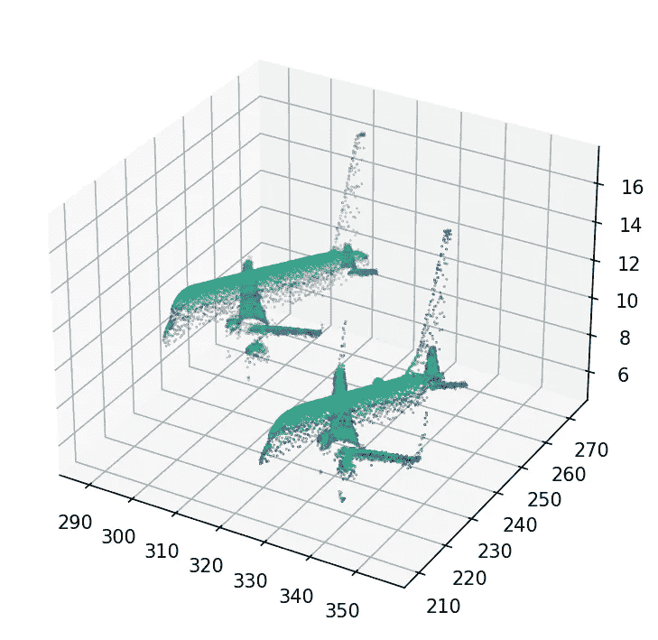**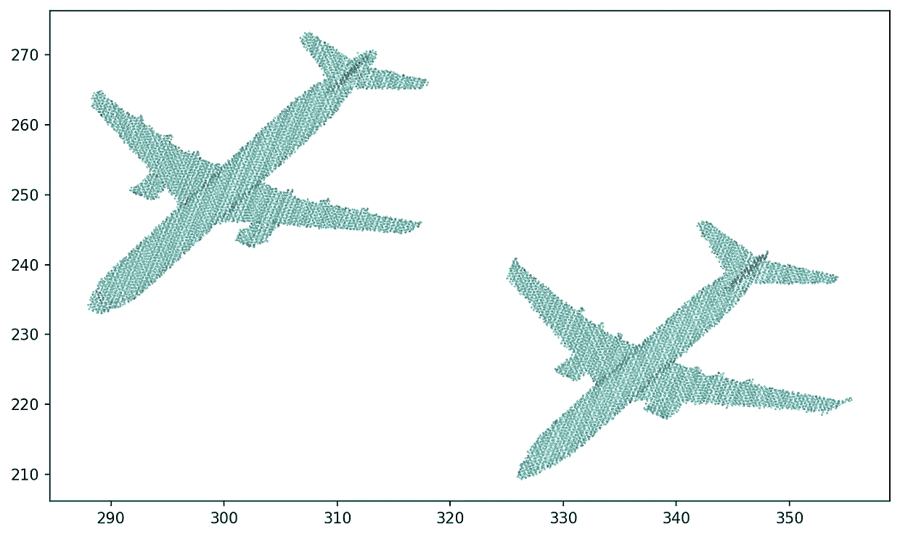*

*很好，我们去掉了恼人的离群点，现在我们可以专注于这两个平面，并尝试为每个平面附加语义。*

# *5.k-均值聚类实现*

*高水平`Scikit-learn`图书馆的建设会让你开心。只需一行代码，我们就可以拟合聚类 K 均值机器学习模型。我将强调标准符号，其中我们的数据集通常表示为`X`来训练或适应。在第一种情况下，让我们创建一个特征空间，仅保存屏蔽后的 X，Y 特征:*

```
*X=np.column_stack((x[mask], y[mask]))*
```

*从那里，我们将运行我们的 k-means 实现，K=2，看看我们是否可以自动检索两个平面:*

```
*kmeans = KMeans(n_clusters=2).fit(X)
plt.scatter(x[mask], y[mask], c=kmeans.labels_, s=0.1)
plt.show()*
```

*💡**提示:** *我们通过调用 sklearn.cluster._kmeans 上的* `*.labels_*` *方法，从 k-means 实现中检索标签的有序列表。k 表示* `kmeans` *对象。这意味着我们可以直接将列表传递给散点图的颜色参数。**

*如下所示，我们在两个集群中正确地检索了两个平面！增加簇的数量(K)将提供不同的结果，您可以在这些结果上进行实验。*

*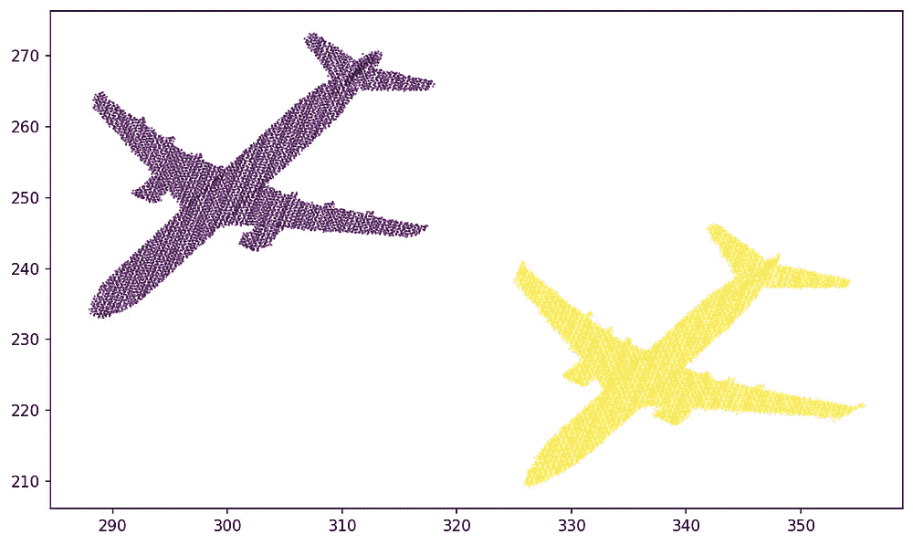**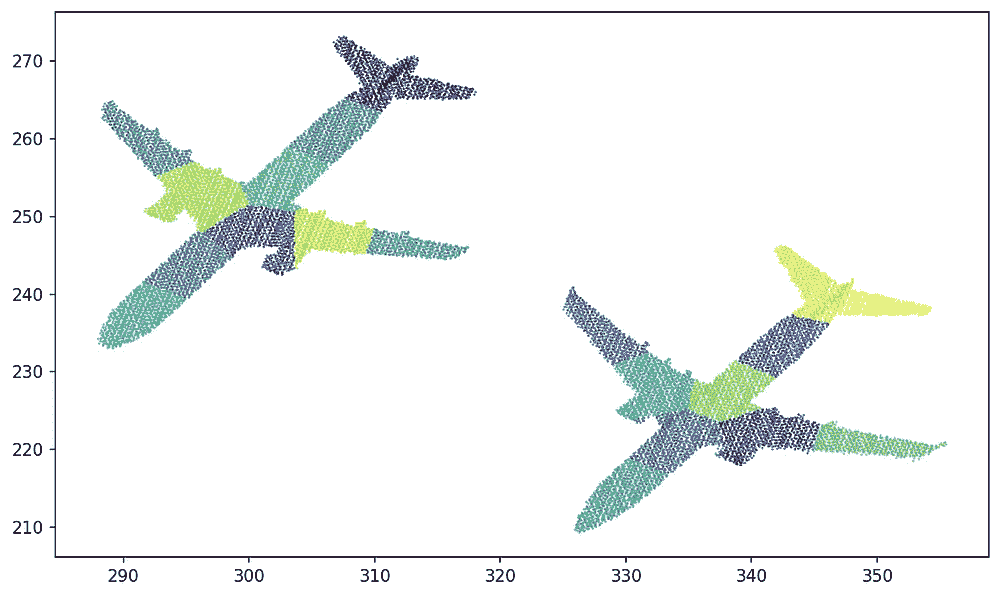*

*三维点云实例分割与零件分割可能的工作流程，由 K-Means 参数化给出。F. Poux*

*选择正确的集群数量最初可能并不那么明显。如果我们想有一些启发法来帮助以无人监督的方式决定这个过程，我们可以使用肘方法。我们正在使用肘方法中的参数 K，因此是我们想要提取的聚类数。*

*为了实现该方法，我们将循环`K`，例如，在`[1:20]`的范围内，使用`K`参数执行 K-Means 聚类，并计算 WCSS(类内平方和)值，我们将把该值存储在一个列表中。*

*💡**提示:***`init`*参数是初始化质心的方法，这里我们设置为* `k-means++` *进行聚类，重点是加速收敛。然后，* `wcss` *值到* `kmeans.inertia_` *表示每一个点与一个簇中的质心之间的平方距离之和。***

```
**X=np.column_stack((x[mask], y[mask], z[mask]))
wcss = [] 
for i in range(1, 20):
 kmeans = KMeans(n_clusters = i, init = ‘k-means++’, random_state = 42)
 kmeans.fit(X)
 wcss.append(kmeans.inertia_)**
```

**🦩 **有趣的事实:**如果你注意了 k 线的细节，你可能会想为什么是 42？嗯，没有什么聪明的理由😆。数字 42 是科学界一直在开的一个玩笑，来源于传说中的[银河系漫游指南](https://en.wikipedia.org/wiki/The_Hitchhiker%27s_Guide_to_the_Galaxy_(novel))，其中一台名为*深度思考*的巨型计算机计算出*“生命终极问题的答案……”***

**然后，一旦我们的`wcss`列表完成，我们可以根据`K`值绘制图形`wcss`，这看起来像一个肘(也许这与方法的名称有关？🤪).**

```
**plt.plot(range(1, 20), wcss)
plt.xlabel(‘Number of clusters’)
plt.ylabel(‘WCSS’) 
plt.show()**
```

****

**这看起来很神奇，因为我们看到我们创造肘部形状的值位于 2 个集群中，这非常有意义😁。**

## **与 DBSCAN 的聚类比较**

**在上一篇文章中，我们深入研究了 DBSCAN 的集群技术。**

**</how-to-automate-3d-point-cloud-segmentation-and-clustering-with-python-343c9039e4f5> [## 如何使用 Python 实现 3D 点云分割和聚类的自动化

towardsdatascience.com](/how-to-automate-3d-point-cloud-segmentation-and-clustering-with-python-343c9039e4f5) 

如果你跟随它，你可能想知道在 3D 点云的情况下 K-Means 比 DBSCAN 真正的好处是什么？好吧，让我举例说明你可能想转换的情况。我提供了航空激光雷达数据集的另一部分，其中包含三辆相互靠近的汽车。如果我们用`K=3`运行 K-Means，我们会得到:

```
data_folder="../DATA/"
dataset="KME_cars.xyz"
x,y,z,r,g,b = np.loadtxt(data_folder+dataset,skiprows=1, delimiter=';', unpack=True)
X=np.column_stack((x,y,z))
kmeans = KMeans(n_clusters=3).fit(X)
```

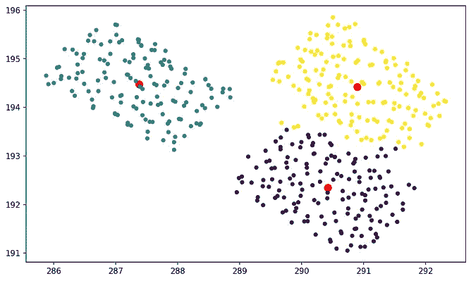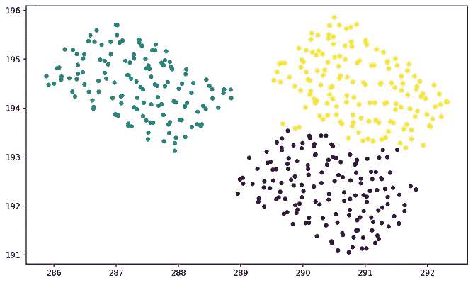

如你所见，即使我们不能在空间上描绘出物体，我们也能得到很好的聚类。用 DBSCAN 是什么样子的？好吧，让我们看看下面的代码行:

```
#analysis on dbscan
clustering = DBSCAN(eps=0.5, min_samples=2).fit(X)
plt.scatter(x, y, c=clustering.labels_, s=20)
plt.show()
```

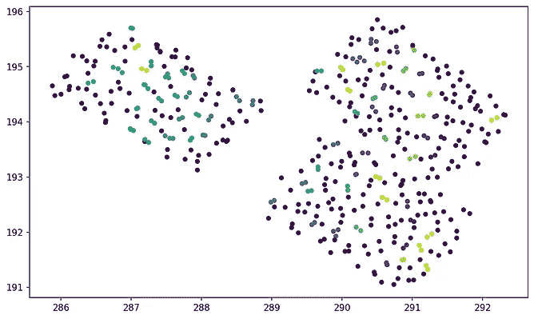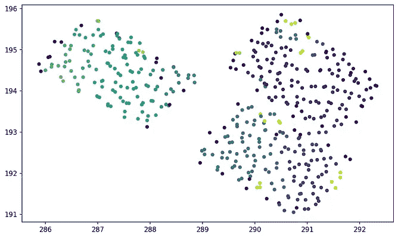

D3 点云的 DBSCAN 聚类。ε值分别被设置为 0.1、0.2 和 0.5。F. Poux

正如你所看到的，除了设置 epsilon 参数有困难之外，我们不能描绘，至少用这些特征，右边的两辆车。在这种情况下，K-均值为 1–0🙂。

## 玩弄特征空间。

现在，我们只使用空间特征来说明 K-Means。但是我们可以使用任何功能的组合，这使得它在不同的应用程序上使用起来非常灵活！

出于本教程的目的，您还可以使用照度、强度、返回次数和反射率进行实验。


从航空激光雷达高清数据集中提取三维点云特征。F. Poux

下面是使用这些功能的两个示例:

```
X=np.column_stack((x[mask], y[mask], z[mask], illuminance[mask], nb_of_returns[mask], intensity[mask]))
kmeans = KMeans(n_clusters=3, random_state=0).fit(X)
plt.scatter(x[mask], y[mask], c=kmeans.labels_, s=0.1)
plt.show()
```

或者再次

```
X=np.column_stack((z[mask] ,z[mask], intensity[mask]))
kmeans = KMeans(n_clusters=4, random_state=0).fit(X)
plt.scatter(x[mask], y[mask], c=kmeans.labels_, s=0.1)
plt.show()
```

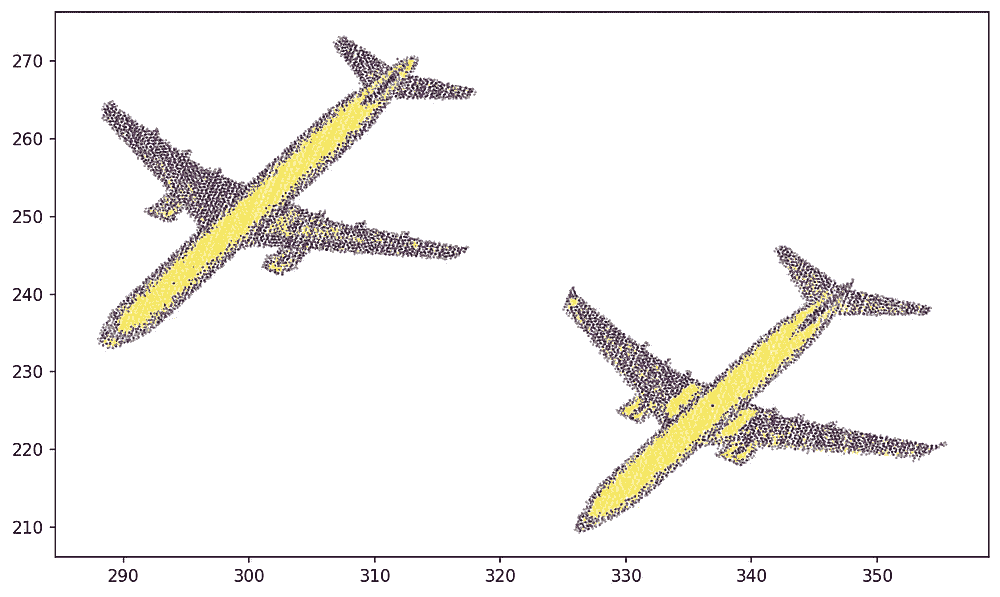

K-Means 使用不同的特征空间和 K 值在 3D 点云上产生结果。F. Poux

为了更深入，我们可以更好地描述每个点周围的局部邻域，例如，通过主成分分析。事实上，这可以允许提取一大组或多或少相关的几何特征。这将超出当前文章的范围，但是您可以肯定，我将在以后的某个特定问题上深入研究它。你也可以通过[点云处理器在线课程](https://learngeodata.eu/point-cloud-processor-formation/)直接钻研 PCA 专业知识。

<https://learngeodata.eu/point-cloud-processor-formation/>  

最后，我们只剩下将数据导出到一致的结构中，例如. xyz ASCII 文件，该文件仅保存空间坐标和可在外部软件中读取的标签信息:

```
result_folder=”../DATA/RESULTS/”
np.savetxt(result_folder+dataset.split(“.”)[0]+”_result.xyz”, np.column_stack((x[mask], y[mask], z[mask],kmeans.labels_)), fmt=’%1.4f’, delimiter=’;’)
```

如果你想让它直接工作，我还创建了一个 Google Colab 脚本，你可以在这里访问:[到 Python Google Colab 脚本](https://colab.research.google.com/drive/1HMC3bBGiuxsv7X49Apjv4L7MmPqOZU3W?usp=sharing)。

# 结论

热烈祝贺🎉！您刚刚学习了如何通过 K-Means 聚类开发一个自动半监督分割，当语义标记与 3D 数据一起不可用时，它非常方便。我们了解到，我们仍然可以通过研究数据中固有的几何模式来推断语义信息。

真心的，干得好！但是，这条道路肯定不会就此结束，因为您刚刚释放了在细分级别进行推理的智能过程的巨大潜力！

未来的帖子将深入探讨点云空间分析、文件格式、数据结构、对象检测、分割、分类、可视化、动画和网格划分。

# 更进一步

存在用于点云的其他高级分割方法。这是一个我深入参与的研究领域，你已经可以在文章[1-6]中找到一些设计良好的方法。一些更高级的 3D 深度学习架构的综合教程即将推出！

1.  **Poux，F.** ，& Billen，R. (2019)。基于体素的三维点云语义分割:无监督的几何和关系特征与深度学习方法。 *ISPRS 国际地理信息杂志*。8(5), 213;https://doi.org/10.3390/ijgi8050213——杰克·丹格蒙德奖([链接到新闻报道](https://www.geographie.uliege.be/cms/c_5724437/en/florent-poux-and-roland-billen-winners-of-the-2019-jack-dangermond-award))
2.  **Poux，F.** ，纽维尔，r .，纽约，g .-a .&比伦，R. (2018)。三维点云语义建模:室内空间和家具的集成框架。*遥感*、 *10* (9)、1412。[https://doi.org/10.3390/rs10091412](https://doi.org/10.3390/rs10091412)
3.  **Poux，F.** ，Neuville，r .，Van Wersch，l .，Nys，g .-a .&Billen，R. (2017)。考古学中的 3D 点云:应用于准平面物体的获取、处理和知识集成的进展。*地学*， *7* (4)，96。[https://doi.org/10.3390/GEOSCIENCES7040096](https://doi.org/10.3390/GEOSCIENCES7040096)
4.  Poux，F. ，Mattes，c .，Kobbelt，l .，2020 年。室内三维点云的无监督分割:应用于基于对象的分类，摄影测量、遥感和空间信息科学国际档案。第 111-118 页。[https://doi:10.5194/ISPRS-archives-XLIV-4-W1-2020-111-2020](https://doi:10.5194/isprs-archives-XLIV-4-W1-2020-111-2020)
5.  Poux，F. ，Ponciano，J.J .，2020。用于 3d 室内点云实例分割的自学习本体，ISPRS 摄影测量、遥感和空间信息科学国际档案。第 309-316 页。[https://doi:10.5194/ISPRS-archives-XLIII-B2-2020-309-2020](https://doi:10.5194/isprs-archives-XLIII-B2-2020-309-2020)
6.  巴斯尔，男，维高温，男，**普克斯，女**，【2020】。用于建筑物内部分类的点云和网格特征。*遥感*。12, 2224.[https://doi:10.3390/RS 12142224](https://doi:10.3390/rs12142224)**