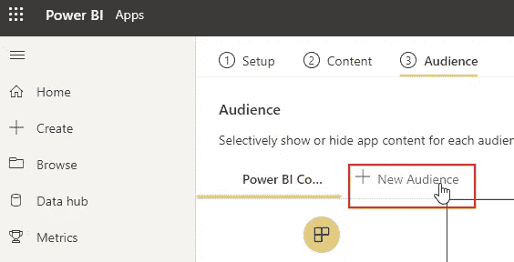
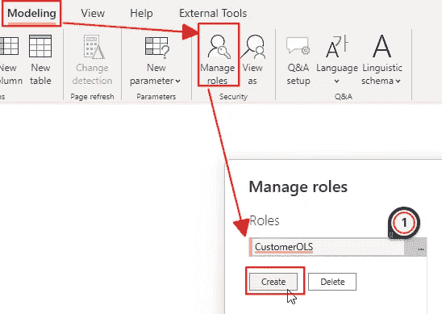
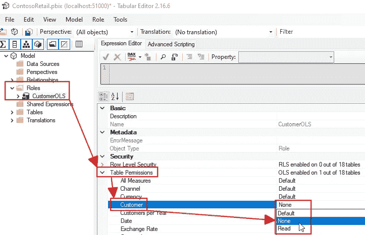
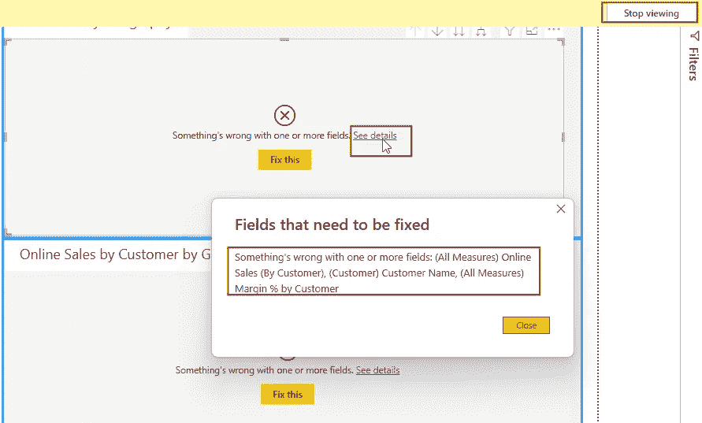

# Power BI 中的 4 + 2 安全特性

> 原文：<https://towardsdatascience.com/4-2-security-features-in-power-bi-4c5a21968e53>

## 一年前，我写了一篇关于 Power BI 的四个安全特性的文章。与此同时，我们获得了一些新的安全功能。让我们调查他们。

由[约翰·萨尔维诺](https://unsplash.com/@jsalvino?utm_source=medium&utm_medium=referral)在 [Unsplash](https://unsplash.com?utm_source=medium&utm_medium=referral) 上拍摄

# 介绍

去年，2021 年 11 月 03 日，我写了下面这篇文章:

  

此后，微软在 Power BI 中增加了两个新的安全特性。

这是一个很好的理由回到这个话题，并更新你。

在上面提到的文章中，我列出了 Power BI 的以下四个安全特性:

*   超级查询中的隐私级别
*   Power BI 中的行级安全性(RLS)
*   Office 365 敏感性标签
*   Power BI 工作空间安全性

虽然我在那篇文章中提到了应用程序安全性，但微软已经为应用程序添加了一个新功能:受众。

此外，微软还在 Power BI 中增加了对象级安全性。

那么，让我们来看看这两个特性:

# 应用受众

在探索 Power BI 服务中的应用体验时，重要的一点是不可能在每个工作空间创建多个应用。

向一个工作区添加另一个应用程序将允许我们定义哪个用户可以从工作区访问哪个报告。

新功能*受众*允许我们定义一组用户对应用程序中报告和报告页面的访问权限。

首先，你必须点击工作区的“创建应用”或“更新应用”按钮，才能跳转到编辑应用的功能。

然后，您可以直接切换到“受众”标签:

图 1 —转到“受众”选项卡(作者的图)

如果你没有看到观众页面，你必须升级你的应用体验。你可以在下面链接的视频中看到如何做-

现有受众允许所有用户完全访问。

现在，您可以向应用程序添加新的受众:

图 2 —添加新的受众(作者提供的数字)

要配置对应用程序每个元素的访问，您必须单击该元素。然后更改它的访问列表:

图 3 —设置应用程序中元素的访问权限(作者提供的图片)

设置新的访问群体后，您还可以更改第一个(默认)访问群体的访问权限。

请观看下面参考资料部分中 Guy in a Cube 的 YouTube 视频，了解如何使用该功能的详细演示。

正因如此，我就不深究这个特性了。

但是，看看这个出色的新功能，它可以彻底改变您使用 Power BI 应用程序的工作。

# 对象级安全性

顾名思义，我们可以使用对象级安全性(OLS)来控制对 Power BI 数据模型中对象的访问。

从一开始，我们就有了分析服务中的 OLS 列表。但这对于 Power BI 来说是全新的。

我们可以为表和列设置 OLS，但不能为度量、计算组或其他对象设置。

但是，当我们限制对某个度量使用的表或列的访问时，对该度量的访问也会受到限制。

在下面的参考资料一节中，您将找到一篇由 SQLBI 撰写的关于如何隐藏 OLS 度量值的文章的链接。

OLS 是另一个不能在 Power BI Desktop 中单独使用的功能。您必须使用[表格编辑器](https://www.sqlbi.com/tools/tabular-editor/)才能使用该功能。

首先，您需要在数据模型中创建一个新角色。

您必须在 Power BI Desktop 中创建角色:

图 4 —在 Power BI Desktop 中创建一个新角色(图由作者提供)

我在表格编辑器中创建了一个角色，但是我不能在 TE 中重命名这个角色，OLS 也不能像预期的那样工作。

因此，在 Power BI Desktop 中创建角色是正确的方法。

现在，您可以在表格编辑器中为对象配置 OLS。

例如，当您想要限制对客户表的访问时，您将单击该表并为其设置 OLS:

图 5 —为客户表配置 OLS(由作者提供)

现在，您必须保存对模型的更改，并返回到 Power BI Desktop。

要查看它是否有效，您可以测试它:

图 6 —测试 OLS(由作者提供)

我的报告“按地理位置显示客户”将显示以下消息:

图 7 —受限访问的错误(作者提供的图)

如您所见，Customer 表的 Customer Name 字段和所有度量依赖项都失败了。

在设置 OLS、测试它并向 Power BI Service 发布报告之后，您必须向角色分配成员，如上面链接的我的前一篇文章所示。

# 结论

这两项在过去几个月中增加的功能可以帮助我们为 Power BI 解决方案增加更多灵活性。

我已经有两个客户要求我使用这些新特性来满足他们需求的解决方案。

我不知道这两个哪个更酷。两者我都喜欢，方式相似。

无论如何，我希望在将它们添加到您的工具集之后，您可以从中获得乐趣。

由[山姆·克拉克](https://unsplash.com/@clarke_designs_photography?utm_source=medium&utm_medium=referral)在 [Unsplash](https://unsplash.com?utm_source=medium&utm_medium=referral) 上拍摄

# 参考

如何发布应用并创造受众:[在 Power BI 中发布应用—微软学习](https://learn.microsoft.com/en-us/power-bi/collaborate-share/service-create-distribute-apps)

YouTube 上的观众视频由[在立方体中的家伙](https://www.youtube.com/c/GuyinaCube):

Power BI 中的对象级安全性:[对象级安全性(OLS) —微软学习](https://learn.microsoft.com/en-us/power-bi/enterprise/service-admin-ols)

由 [SQLBI](https://www.youtube.com/c/SQLBI) 制作的关于对象级安全的 YouTube 视频:

[Power BI 中使用对象级安全的隐藏措施— SQLBI](https://www.sqlbi.com/articles/hiding-measures-by-using-object-level-security-in-power-bi/)

 