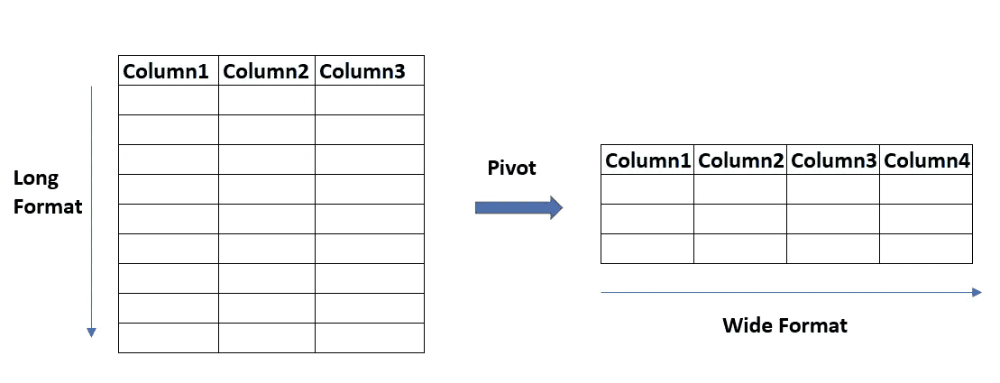
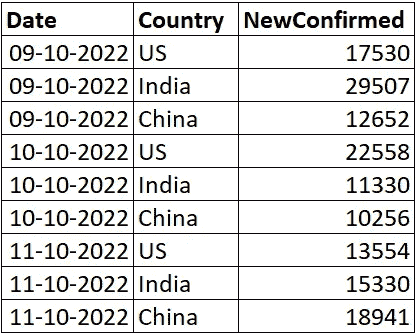
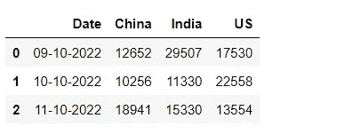
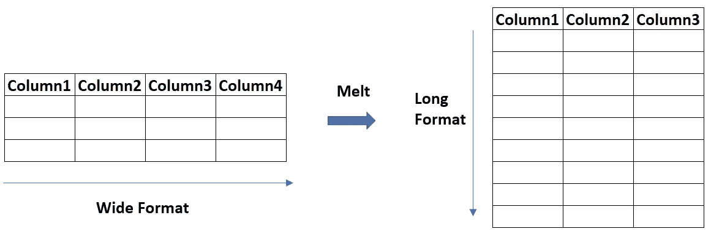
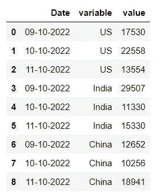
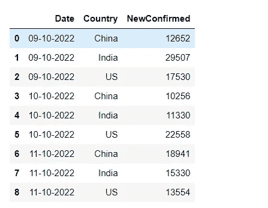

# 你可能已经忘记的 4 个高级 Python 操作

> 原文：<https://towardsdatascience.com/4-advance-python-operations-you-may-have-forgotten-58b0565b9f>

## 了解如何在 Python 中使用熔化、透视、堆叠和分解


Pic 鸣谢:Unsplash

默认情况下，数据不是可用的格式；数据科学专业人员必须将 70–80%的时间花在数据清理和处理上，以使其能够用于生成有意义的见解。

在数据操作过程中，数据科学家/分析师可能不得不进行各种类型的数据转换，有时我们会感到困惑，因为我们不知道 python 中是否存在执行所需转换的直接函数。

在这篇博客文章中，我们将看看 4 个高级 python 数据转换函数，它们将使您作为数据科学专业人员的生活变得更加轻松，并且将是您的数据操作函数库的一个巨大补充。

## 1.在枢轴上转动

pandas 中的透视功能与 excel 中的透视操作功能相同。我们可以将数据集从长格式转换为宽格式。



长到宽格式(图片由作者提供)

我们用一个例子来理解这个。想象一下，我们有一个跨国家的新冠肺炎病例数据集，如下所示。



作者图片

我们希望将数据集转换成一种形式，使每个国家成为一列，新确诊病例成为与这些国家相对应的值。我们可以使用 pivot 函数来执行这种数据操作。


枢纽功能(图片由作者提供)

```
### Pivot the dataset
pivot_df = pd.pivot(df, index =['Date'], columns ='Country', values =['NewConfirmed'])## renaming the columns  
pivot_df.columns = df['Country'].sort_values().unique()
```


透视后的数据集(作者提供的图片)

通过重置索引，我们可以使新列与索引列数据处于相同的级别。

```
## reset the index to modify the column levels
pivot_df = pivot_df.reset_index()
```



重置索引(图片由作者提供)

[](https://medium.com/codex/dont-use-iterrows-for-loops-in-python-instead-use-these-6363395dcea2)  

## **2。融化**

Melt 与 pivot 相反，它用于取消数据集的透视。它将数据从宽格式转换为长格式。



宽到长格式(图片由作者提供)

让我们看看如何取消我们在上面创建的宽格式新冠肺炎数据集的透视。

```
## The dataset is melted by setting the id column - a column that will not change.
## and value column - columns we want to unpivotmelted_df = pivot_df.melt(id_vars = 'Date', value_vars = ['US', 'India', 'China'])# we can rename the columns too
melted_df.columns = ['Date', 'Country', 'NewConfirmed']
```



作者图片


将数据从宽格式融合到长格式(图片由作者提供)

## 3.堆

stack 函数用于将多级列转换(或取消透视)为行。

我们来看几个例子！

如果我们选择透视新冠肺炎数据集而不重置索引，那么它看起来会像这样。


透视后的数据集(作者提供的图片)

我们可以使用 stack 函数将 country 列堆叠回行，如下所示。

```
## stack the dataset
stack_df = pivot_df.stack()## reset the index and set column names
stack_df = stack_df.reset_index()
stack_df.columns = ['Date','Country','NewConfirmed']
stack_df
```



堆叠数据集(按作者分类的图像)

现在，你可能会想同样的转换也可以用融化函数来完成，你是对的。但这两者还是有区别的，stack 函数更高级——它适用于多级列，而 melt 不能。例如，堆栈功能可以转换具有 2 个列级别的以下数据:


堆叠数据集(按作者排列的图像)

> “-1”级别表示倒数第一列。

## 4.出栈

解散堆叠与堆叠相反，它用于透视多级列数据集的一级/多级。

让我们看几个例子来更好地理解它！

使用 unstack，我们可以透视数据集的列，如下所示。


拆分数据集(按作者排列的图像)

分解功能也可以处理多级列数据集，而熔化功能则不能。


拆分功能(图片由作者提供)

> 枢轴/熔化功能是堆叠/分解功能的子集。透视/融合不适用于多层柱。

[](https://medium.com/codex/9-python-concepts-you-should-not-skip-for-effective-data-science-a8606c58a53b)  

## 结论

在这篇博客中，我们研究了 4 种高级数据转换技术，将数据格式从长格式转换为宽格式，反之亦然。

Pivot/Melt 适用于单级列数据集，而 Stack/Unstack 也可应用于任何复杂的多级列数据集。

## 谢谢你

我希望这个故事对你有用。你可以在收件箱里看到我所有的帖子。 [***做到这里*** *！*](https://anmol3015.medium.com/subscribe)

*如果你自己喜欢体验媒介，可以考虑通过* [***注册会员***](https://anmol3015.medium.com/membership) *来支持我和其他几千位作家。它每个月只需要 5 美元，它极大地支持了我们，作家，你可以在媒体上看到所有精彩的故事。*

## 你可能喜欢的故事！

[](https://medium.com/codex/dont-use-loc-iloc-with-loops-in-python-instead-use-this-f9243289dde7) 