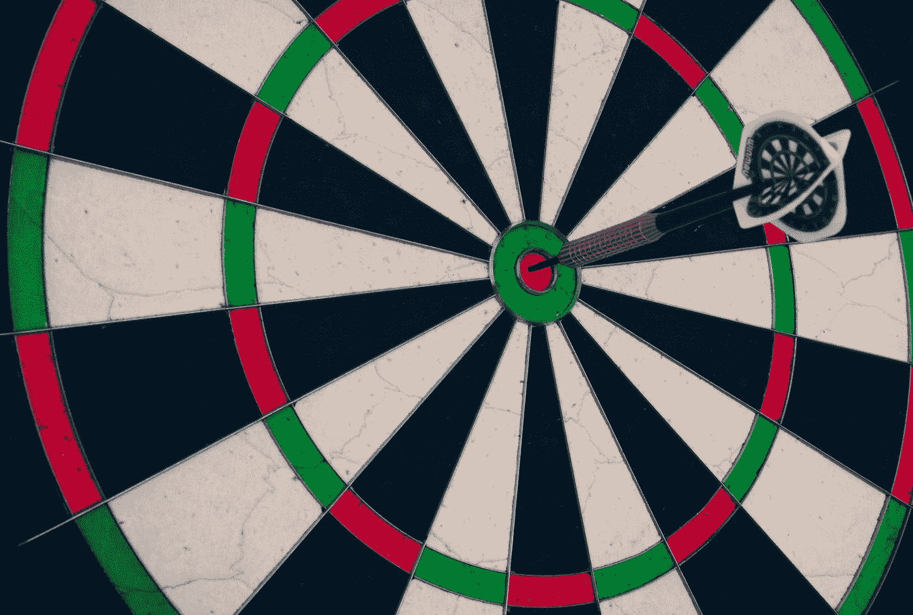

# 4 先进的机器学习技术

> 原文：<https://towardsdatascience.com/4-advanced-machine-learning-techniques-71d485e9fcab>

## 进一步提高模型分数的替代方法

在 [Unsplash](https://unsplash.com?utm_source=medium&utm_medium=referral) 上由 [Silvan Arnet](https://unsplash.com/@silvanarnet?utm_source=medium&utm_medium=referral) 拍摄的照片

改进机器学习模型的典型方法有哪些？添加更多功能。执行选择以移除冗余特征。优化超参数。将几个模型组装在一起。是的，所有这些都可能奏效，但还有许多其他方法可以提高分数。也许有些方法不太为人所知，有些方法并不适用于所有情况，但是在适当的时候应用它们可以带来显著的改善。让我们来看看其中的一些。

## 伪标记

对于数据科学任务，我们通常有一个带有已知标签的训练数据集。一般来说，我们拥有的训练数据越多，模型学到有用东西的可能性就越大。但是在大多数情况下，标记的训练数据的数量是有限的。在某些情况下，这是因为贴标签的过程成本太高(例如，每个箱子都需要人工贴标签)。

对此的一个解决方案是使用伪标记技术创建额外的训练数据。

为此，我们需要没有标签的额外数据。如果已经有可用的测试数据(例如，在比赛中)，我们可以使用它。否则，需要在某个地方收集数据——但由于它不需要标签，这应该比收集真实的训练数据容易得多。

一旦收集了数据，我们就使用我们的模型对其进行预测。没有标签，就不知道预测有多好。但在大多数情况下，越自信的预测意味着正确的概率越大。因此，我们选择一些百分比的最有信心的模型预测，并使用这些作为额外的训练数据标签。该模型然后在两者上被重新训练——原始训练数据+我们新的伪标记的附加训练数据。新模型可能会比原来的模型产生更好的分数。

*为什么会这样？*

此外，收集的数据可能与原始训练数据略有不同。在不同的时间间隔从另一个源收集，等等。因此，这些数据可能包含稍微不同的关系和信号。该模型不能从原始数据中学习这些关系，因为它们不存在或者至少在那里略有不同。但是如果分配给它们的标签大部分是正确的，这些可以从新的伪标签数据中学习。

然而，伪标签的工作有一个重要的要求——原始模型的精度必须足够高。否则，许多行将被错误地标记，并且伪标记数据将引入太多噪声。因此，在模型开发的最新阶段使用伪标注是一个很好的实践，此时它已经通过特征工程、参数优化和其他基本技术得到了改进。

## 通过模型预测去除异常值

从训练数据中移除离群值是大多数机器学习管道中的标准步骤。但是这里我不是在谈论这种简单的标准方法，它通常涉及到查看每个特性，并从两端删除一些百分点，以消除太小和/或太大的值。

威尔·梅尔斯在 [Unsplash](https://unsplash.com?utm_source=medium&utm_medium=referral) 上拍照

存在一种更高级的方法来处理异常值。该技术不仅允许去除单个特征的过大/过小值方面的异常值，还允许处理异常特征交互。

该技术的核心思想非常基本:

*   首先，以标准方式训练和调整模型，包括特征选择、超参数调整等等。
*   然后对训练数据行以 OOF(出折叠)方式进行预测。
*   为每一行计算预测的误差(或特定问题的任何其他相关度量)。
*   误差最大的行被定义为异常值。在每种情况下，要删除的行的百分比会有所不同。
*   该模型在训练数据上被重新训练，其中已识别的异常行被移除。

*为什么会这样？*

如果对于某个数据行，与该给定任务的平均误差相比，模型产生了较大的误差，这意味着对于该给定数据行，特征告诉模型一件事，但是标签非常不同。在现实生活中，这可能是由于各种原因造成的:

*   一个或多个重要特征中存在异常值；
*   标签不正确(由于标签错误、人为错误或其他原因)；
*   这是模型无法从给定数据中学习的一些特殊的罕见情况。

现在，如果它是某个特征中的异常值或错误值，我们要删除这一行。如果它有错误的标签，我们肯定也要删除它。我们可能更愿意在训练数据中保留这一特定行的唯一情况是它描述了一些罕见的情况。在大多数情况下，对于给定的行，不可能将这些情况分开，所以我们需要全局地决定——我们是否要保留这样的行？

从我的经验来看，在许多任务中，这种方法会带来轻微的改进。改进的大小显然取决于特定数据集有多少异常值、不良特征和不正确的目标值。但是，在某些情况下，可能会发生这样的情况，即大多数被检测为异常值的行实际上是有效的。发生这种情况主要是由于模型太弱——因此，我建议只在模型调整的最后阶段应用这种方法，此时现有模型已经用标准技术尽可能地提高了。

## 数据扩充

在某种程度上，这种技术类似于伪标记。从某种意义上说，这有助于获得更多的训练数据。并且更多的训练数据通常会产生更好的模型。主要区别在于我们获取更多训练数据的确切方式。

如果在伪标记中，我们使用额外的真实数据和自己分配的标记。但在某些情况下，我们根本没有任何额外的数据。在扩增的情况下，我们使用真实的标签，但数据本身以不同的方式被修改和转换，以创建与原始数据集具有相似特征的新数据。

对于各种类型的数据——数字数据、时间序列、图像和文本数据，有各种各样的数据扩充技术。例如，图像可以以不同的方式旋转、裁剪或倾斜。从逻辑角度来看，图像上的图片(因此，原始标签也是如此)没有改变。但是对于模型来说。这个新图像看起来不同，有助于使模型更加健壮。

对于文本数据，一种方法是翻译。我们可以把原来的句子翻译成其他语言，然后再翻译回来。在翻译过程中，原句会略有不同，但意思应该是一样的，因此保留了原标签。

对于数字和时间序列数据，确切的方法在很大程度上取决于数据究竟代表什么。可能需要一些领域知识来正确创建带有原始标签的新数据行。

我在处理图像的计算机视觉任务中看到了这项技术的最大改进。但是其他类型的数据也有潜力。

## 解释模型预测

机器学习模型有时被认为是一个黑箱。但实际上，并非如此。我们可以从这个模型中收集到大量的信息，确切地了解它是如何在这种或那种情况下做出决策的。我们可以获得的确切信息量取决于模型的类型。一些模型，如基于树的模型或线性回归，非常容易解释。但是，例如，神经网络模型对内部发生的事情提供的可解释信息较少。

[JESHOOTS.COM](https://unsplash.com/@jeshoots?utm_source=medium&utm_medium=referral)在 [Unsplash](https://unsplash.com?utm_source=medium&utm_medium=referral) 上拍照

在任何情况下，尽我们最大的努力去理解模型到底是如何使用这些特性的是很有帮助的。查看特征重要性图是一种方法。如果我们在特征重要性图的顶部发现了一些奇怪的特征，那么就有必要尝试找出该特征中是否真的有一些信号，或者这只是噪声。在最简单的情况下，尝试删除该特性，并比较有无该特性时的验证分数。

但是特性重要性图并不是关于特性使用的唯一信息来源。有更多的可能性深入挖掘模型内部。莱姆和 SHAP 就是其中的一些(如果你感兴趣，我会把关于它们的技术细节留给你自己研究)。这些方法的好处不仅在于检查模型使用了哪些特征，还在于检查特征影响的方向。它让我们明白，特定特性的较低值会导致目标的较低或较高值。这些知识允许我们使用领域知识来判断这样的特征解释是否有意义。

深入研究特征及其对模型的影响不是一件容易的事，而且速度也不快，所以在大多数情况下，对每个特征都这样做是没有好处的。但至少，检查最重要的特性并理解模型如何使用它们以及这样做是否有意义是值得的。根据结果，我们可能想要决定移除该特性，或者在某些情况下甚至完全审查我们的验证方法——如果我们看到使用明显错误的特性会导致更好的验证分数。

## 一些最后的话

在机器学习中，模型永远不会真正完成。总有一种可能性，所以挤出一些额外的微小改进。这里的关键时刻是在适当的时候停止改进——以便模型“足够好”,但也在合理的时间内开发出来。

希望这篇文章能给你一些想法，让你在不投入太多额外时间的情况下，尝试从你的模型中获得一些额外的改进。

感谢阅读！