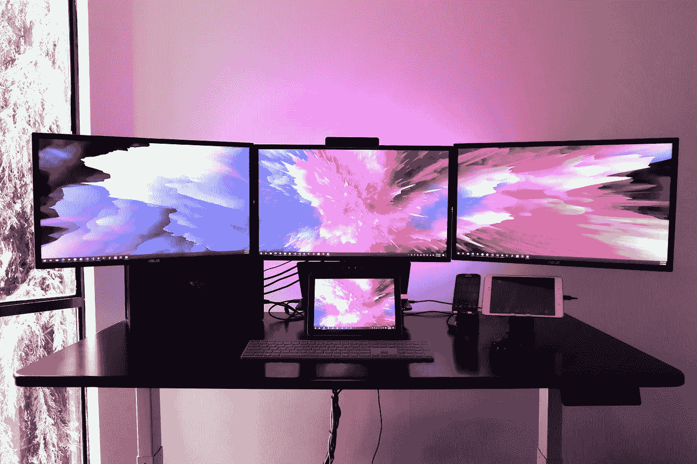
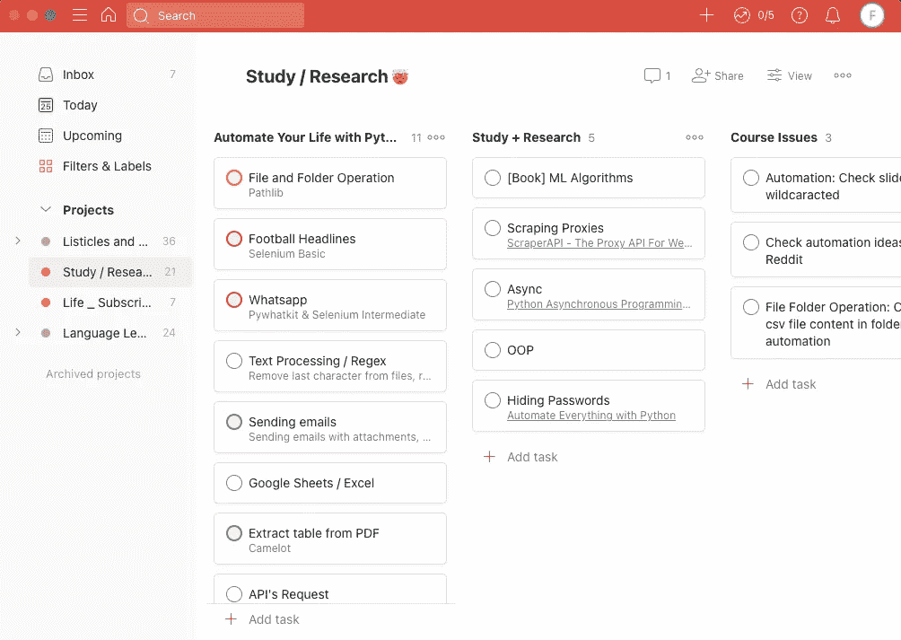
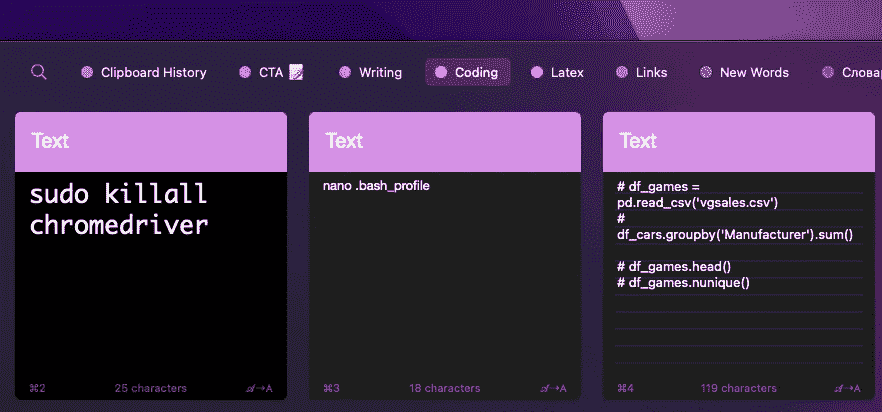

# 作为一名数据科学家，4 款应用将提高您的工作效率

> 原文：<https://towardsdatascience.com/4-apps-that-will-make-you-more-productive-as-a-data-scientist-4b0c19c6a0e7>

## 在编写代码、做笔记、组织任务、项目等方面变得更加高效！

照片由 [Unsplash](https://unsplash.com/photos/SVpWtjXmLZg) 上的[Jorge Ramirez](https://unsplash.com/@jorgedevs)**拍摄**

数据科学工作流充满了需要在昨天完成的任务。如果我们加上日常办公任务，比如去开会和回复邮件，要做的事情清单是无穷无尽的。

幸运的是，有一些应用程序可以帮助你变得更有效率，专注于最重要的事情。

在这篇文章中，我列出了一些应用程序，它们帮助我在编写代码和做笔记时变得更有效率，还用来组织我的任务、日历、电子邮件、项目，甚至 Github 卡。

*免责声明:此列表中的大多数应用程序都是免费的。也就是说，其中几个包含附属链接，如果你通过它们购买，我会赚取佣金，而不会额外增加你的成本。*

# Todoist

想想你一天中的所有任务。

作为一名数据科学家，您可能会觉得有太多事情要做，不知所措。你不仅要收集和清理数据集，还要参加会议，回复电子邮件，以及做一份办公室工作所期望的大量其他事情。

你甚至可能会忘记做其中的一些。

这时你需要一个像 [Todoist](https://todoist.com/) 这样的任务管理器。这个应用程序可以帮助你组织一天甚至一周的所有任务。不要把所有的任务都记在脑子里，用 Todoist 写下来。

作者图片

你只需要打开应用程序，添加任务、描述、优先级，如果有必要，还可以添加频率。

创建任务后，您可以将它们添加到项目中。免费计划的限制是 5 个项目，这在大多数情况下应该足够了。一个项目提供两种视图:列表和公告板。以上是我的“自动化”项目的董事会视图的一个例子。

最棒的是，所有这些任务在你的所有设备上都是同步的，所以你永远不会忘记做清单上的任何任务，但你可以随时勾选任务。

下次你感到无聊，不知道下一步该做什么的时候，拿起你的手机，打开 Todoist，你会发现一些有意义的任务要做。

# 孙萨玛

作为一名数据科学家，您可能会被工作中收到的所有电子邮件、日历上的会议甚至项目板上的 Github 卡片淹没。

你可以通过组织你的一天，制定计划，优先处理最重要的任务来避免被这些事情搞得筋疲力尽。

这款应用将日历应用推向了一个新的高度。Sunsama 与您的 Google/Outlook 日历同步，因此您可以在一个地方查看您的日程安排并管理您的任务。

更好的是，Sunsama 集成了 Todoist、Github、Slack 和 Trello 等应用程序。把那些你计划要做的事情做好，不要为剩下的事情感到压力！

这是你用 Sunsama 组织你的任务后得到的视图。

资料来源:Sunsama(保持生产力)

正如你所看到的，这个每日计划器帮助你在一个地方组织任务、电子邮件等等。

有了 Sunsama，您每天都可以优先处理工作。你只需要为你每天想要完成的事情设定目标。那些一天没有完成的任务会自动转到第二天。

# 概念

如果你喜欢苹果的 Notes 或 Evernote，你可能会喜欢 idea。

[理念](https://www.notion.so/)不仅仅是做笔记，还包括记录你的项目和创建路线图来跟踪你的工作流程。这个应用程序有工作区，您可以使用它来分离您拥有的每个项目。

好消息是，您不必从头开始创建工作区，而是可以使用模板。您会发现一些更有用的模板是在“工程”部分。

下面是概念工程部分的“文档”模板。

作者图片

一旦你有了模板，你就可以随心所欲地定制它。

例如，我有一个 Python 工作空间，在那里我有关于如何设置虚拟环境、如何对我的计算机进行故障诊断的说明，以及其他没有概念我就不会记得的事情。

# 粘贴(仅限 Apple 设备)

当你写代码的时候，有没有发生过这样的事情，你不记得保持你的工作流运行所必需的 Python 方法/函数？

这经常发生在我身上…直到我发现了浆糊。

[粘贴](https://pasteapp.io/)是一个剪贴板管理器，不仅仅是存储你用电脑复制的文本。这个应用程序将图像、文件、代码、链接等保存到剪贴板历史记录中，并在所有苹果设备上共享。

但这还不是全部！您可以根据需要创建任意数量的插接板，将项目分类到不同的类别中。

下面是我的名为“编码”的插接板，其中有我刚刚学会但有时会忘记的代码片段和终端命令。

作者图片

当您向每个类别添加更多项目时，您可能会丢失其中的一些项目，但粘贴提供了一个搜索功能，允许我们找到很久以前复制的任何内容。

最后但同样重要的是，该应用程序支持 macOS 上的快捷方式。每当你想使用其中一个项目时，只要按几个键，然后*瞧*，粘贴就会弹出来。

这是目前为止我最喜欢的应用程序。不幸的是，它只适用于苹果设备。

用 Python 学习数据科学？[通过加入我的 10k 多人电子邮件列表，获取我的免费 Python for Data Science 备忘单。](https://frankandrade.ck.page/26b76e9130)

如果你喜欢阅读这样的故事，并想支持我成为一名作家，可以考虑报名成为一名媒体成员。每月 5 美元，让您可以无限制地访问数以千计的 Python 指南和数据科学文章。如果你使用[我的链接](https://frank-andrade.medium.com/membership)注册，我会赚一小笔佣金，不需要你额外付费。

<https://frank-andrade.medium.com/membership> 