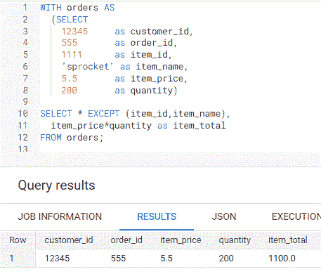
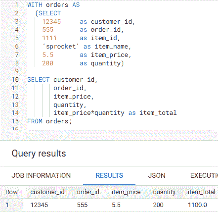
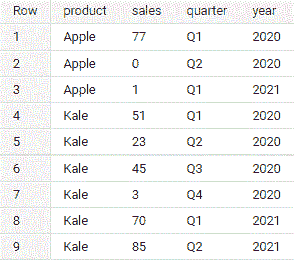
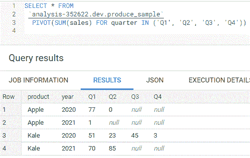
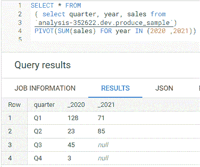
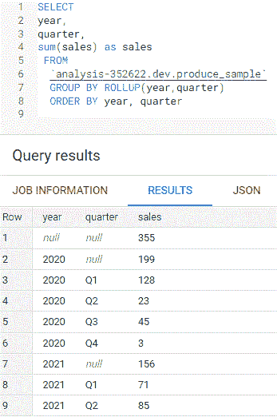
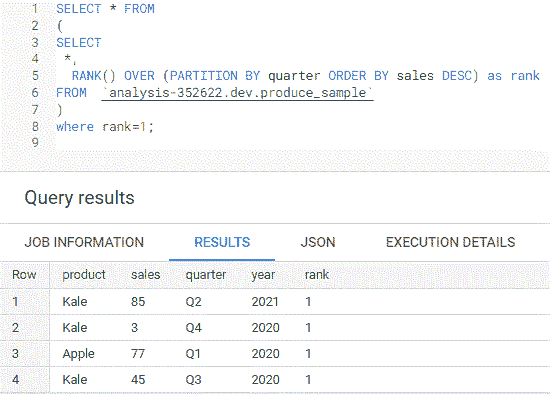

# 4 个可以简化查询的 BigQuery SQL 快捷方式

> 原文：<https://towardsdatascience.com/4-bigquery-sql-shortcuts-that-can-simplify-your-queries-30f94666a046>

## 检查您的数据库是否也有它们

来自 [Pexels](https://www.pexels.com/photo/woman-coding-on-computer-3861958/) 的 [ThisIsEngineering](https://www.pexels.com/@thisisengineering/) 摄影

开始学习 SQL 时，最常见的建议是练习基本语句，因为它们将跨多个数据库工作。缺点是您可能永远也不会发现可以简化查询的特定于数据库的语法，因为根本不需要阅读文档。对我来说就是这样，直到我开始使用 Google BigQuery，阅读了 [SQL 语法文档](https://cloud.google.com/bigquery/docs/reference/standard-sql/query-syntax)，发现了一些你应该知道的惊人的快捷方式。

## 1.除...之外

在 SELECT *中使用 EXCEPT 来选择表**中除**外的所有字段。在下面的例子中，我创建了一个名为**订单**的 [CTE](https://chartio.com/resources/tutorials/using-common-table-expressions/) ，并选择了**列**中除**之外的所有**用于**项目 _id** 和**项目 _ 名称**。

作者创建的 EXCEPT 查询示例的屏幕截图

在此之前，我将通过为 **item_id** 和 **item_name** 列出除之外的每一列来编写下面的选择。这看起来不像是有 6 列的捷径，但是想象一下，如果你有一个 20 列的表，而你只想排除 2 个字段。不用在 SELECT 语句中键入 18 个列名，只需使用 EXCEPT 来排除不需要的 2 列。

作者创建的不带 EXCEPT 查询示例的屏幕截图

## 2.在枢轴上转动

我不知道我从一个表中查询了多少次数据，然后输入到 Excel 中，使用数据透视表得到不同时间段的分类汇总。现在我可以用一个 PIVOT 语句绕过 Excel 轻松做到这一点。

屏幕截图示例生成由作者创建的数据

要使用上面的示例数据按季度计算销售额，您只需在数据透视表中指定季度。

作者创建的按季度透视的屏幕截图

或者，要按季度比较年与年的总销售额，您可以删除 product 列，并在 PIVOT 语句中指定年份。

作者创建的按年份划分的透视屏幕截图

## 3.卷曲

过去，我使用 Excel 数据透视表或运行多个查询来获得总计和小计，但现在我可以使用 ROLLUP 和 GROUP BY 来代替。使用上面显示的产品示例，我们可以在 GROUP BY 之后使用 **ROLLUP ( year，quarter )** 获得每年的总销售额和小计。 **2020** 和 **2021** 的总销售额为 **355** ，由**年**和**季度**列中的**空值**表示。 **2020** 销售额为 **199** 和 **2021** 为 **156** ，由**季度**列中的**空值**表示。

使用作者创建的汇总按年度和季度显示的销售屏幕截图

## 4.具有资格；合格；取得资格(或学历)

QUALIFY 允许您像在 SELECT 语句中创建的列上应用 WHERE 条件一样应用它，因为它是在 GROUP BY、HAVING 和 WINDOW 语句 **之后计算的 [**。**](https://cloud.google.com/bigquery/docs/reference/standard-sql/query-syntax#qualify_clause)**

只需使用 QUALIFY = 1，您就可以使用 QUALIFY 来获取用等级窗口函数计算的季度销售额最高的产品。

作者使用 QUALIFY = 1 创建的屏幕截图

不使用 QUALIFY 的传统方法是将 SQL 语句作为子查询，然后应用 WHERE rank = 1，如下所示。用 QUALIFY 看起来简单多了，对吧？

作者使用 WHERE rank =1 创建的屏幕截图

## 最后的想法

了解 SQL 基础知识是很重要的，但是回顾一下文档，看看是否有特定于数据库的 SQL 语法可以简化您的查询，因为它们可能在其他数据库中可用。例如，雪花还有 PIVOT、ROLLUP 和 QUALIFY。我强调了一些 SQL 快捷方式，但我确信我只是触及了皮毛。你还能找到多少？

*注意:以上所有查询都是在* [*BigQuery 沙箱*](https://cloud.google.com/bigquery/docs/sandbox) *上运行的，这对任何拥有谷歌账户的人都是免费的。*

## 你可能也会喜欢…

 [## 我如何使用机器学习模型来生成可操作的见解

### 将数据科学与数据分析相结合

medium.com](https://medium.com/swlh/how-i-used-a-machine-learning-model-to-generate-actionable-insights-3aa1dfe2ddfd)  [## 如何将数据转化为可操作的见解

### 使用这个过程来发展一个无价的分析技能

towardsdatascience.com](/how-to-translate-data-into-actionable-insights-83982eba7675)  [## 我作为数据工程师学到的 6 个最佳实践

### 以及作为数据科学家如何应用它们

towardsdatascience.com](/6-best-practices-i-learned-as-a-data-engineer-9d3ad512f5aa)