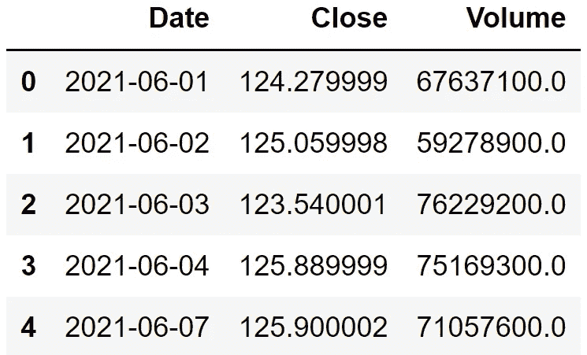
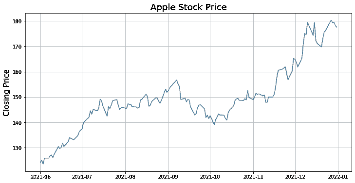
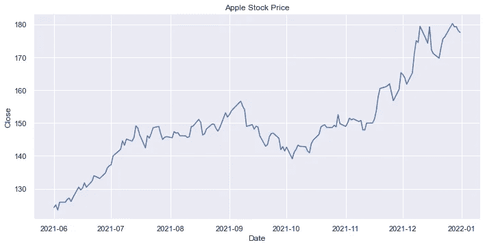
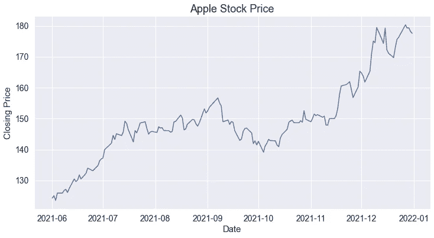
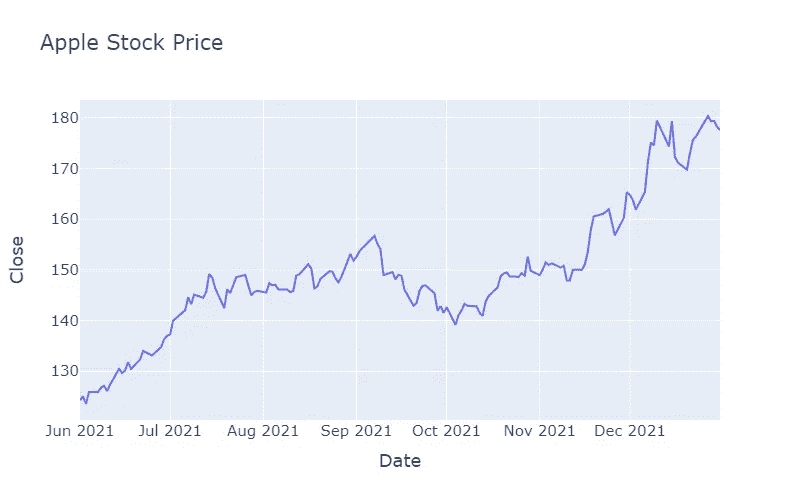

# Python 数据可视化生态系统中的 4 个主要参与者:Matplotlib、Seaborn、Altair 和 Plotly

> 原文：<https://towardsdatascience.com/4-key-players-in-python-data-visualization-ecosystem-matplotlib-seaborn-altair-and-plotly-23ae37a68227>

## 一张图胜过千言万语


照片由 [Unsplash](https://unsplash.com/s/photos/four?utm_source=unsplash&utm_medium=referral&utm_content=creditCopyText) 上的[尼克·费因斯](https://unsplash.com/@jannerboy62?utm_source=unsplash&utm_medium=referral&utm_content=creditCopyText)拍摄

事实证明，数据可视化在许多方面对数据科学家非常有帮助，例如:

*   探索性数据分析
*   特征工程和预处理
*   机器学习模型评估
*   报告

他们在创建数据相关产品的关键步骤中发挥着关键作用。因此，我们应该接受数据可视化库，它使得用几行代码创建大范围的可视化变得容易。

在本文中，我们将发现 4 个常用的 Python 数据可视化库。我们将对每一个进行举例，以了解它们的基本属性。这些例子也有助于比较这些库的语法。

当然，我们需要一个数据集作为例子。我们可以使用 [pandas datareader](https://pandas-datareader.readthedocs.io/en/latest/) 库创建一个包含股票价格数据的数据框架。下面的代码片段给出了在指定的开始和结束日期之间的苹果股票价格。

```
import pandas as pd
from pandas_datareader import datastart = '2021-06-01'
end = '2021-12-31'
source = 'yahoo'df = data.DataReader(
   "AAPL", start=start, end=end, data_source=source
)df = df.reset_index()[["Date","Close","Volume"]]
```



df(作者图片)

数据框架包含苹果股票的收盘价和每日交易量。

先说 Matplotlib。

# Matplotlib

Matplotlib 是一个非常流行的数据可视化库。它通常是数据科学课程中第一个涉及的内容。

我认为 Matplotlib 最大的优点是灵活性。您有许多选项来调整和定制绘图。

Matplotlib 由三个主要层组成，分别是后端层、艺术家层和脚本层。我们几乎总是使用脚本层来创建可视化。脚本层是 **matplotlib.pyplot** 接口。如果你想了解更多关于 Matplotlib 的结构，这里有一篇我不久前写的详细文章。

*   [了解 Matplotlib 的结构](/understanding-the-structure-of-matplotlib-23b97f507fac)

以下代码块创建了一个线形图。

```
import matplotlib.pyplot as plt# Create a figure object
plt.figure(figsize=(12,6))# Create the plot
plt.plot(df["Date"], df["Close"])# Add axis label and title
plt.ylabel("Closing Price", fontsize=15)
plt.title("Apple Stock Price", fontsize=18)# Add grid lines
plt.grid(True)
```



(图片由作者提供)

一旦我们创建了一个图，我们可以对它进行一些定制，例如修改标签和字体大小，添加网格线，等等。

下一个图是体积柱的直方图。直方图是一种常用的可视化类型，它为我们提供了连续变量分布的概况。

```
# Create a figure object
plt.figure(figsize=(10,6))# Create the histogram
plt.hist(df["Volume"])# Adjust ticks font size
plt.xticks(fontsize=14)
plt.yticks(fontsize=14)# Add title
plt.title("Histogram of Volume", fontsize=18)
```


(图片由作者提供)

除了对线图进行调整之外，我们还更改了 x 轴和 y 轴上记号的字体大小。

我们还可以对一个情节做许多其他的调整，使它更具知识性和吸引力。Matplotlib 提供了极大的灵活性，但代价是要编写额外的代码行。

# 海生的

Seaborn 是另一个流行的 Python 数据可视化库。它是基于 Matplotlib 构建的。

当我不需要做小的调整时，我更喜欢 Seaborn 而不是 Matplotlib。Seaborn 提供了一个更简单的语法，但是没有 Matplotlib 灵活。

要在 Seaborn 中创建一个线图，我们可以使用 relplot 或 line plot 函数。relplot 函数是一个图形级界面，用于绘制线图和散点图。

让我们首先使用 relplot 函数。

```
import seaborn as sns
sns.set_theme(style="darkgrid")sns.relplot(
    data=df, x="Date", y="Close",
    height=5, aspect=2, kind="line"
).set(
    title="Apple Stock Price"
)
```

高度和纵横比参数用于调整地块大小。



(图片由作者提供)

我们也可以使用 lineplot 函数来创建相同的图。由于 Seaborn 是基于 Matplotlib 构建的，因此我们可以利用 Matplotlib 特性来调整 Seaborn 创建的地块。

这里有一个例子来说明这种情况。

```
# Create a figure object
plt.figure(figsize=(12,6))# Adjust ticks font size
plt.xticks(fontsize=14)
plt.yticks(fontsize=14)# Create the lineplot
line = sns.lineplot(data=df, x="Date", y="Close")# Add axis label and title
line.set_title("Apple Stock Price", fontsize=18)
line.set_xlabel("Date", fontsize=15)
line.set_ylabel("Closing Price", fontsize=15)
```



(图片由作者提供)

感觉 Seaborn 比 Matplotlib 更高级。这也使得创建带有支线剧情的可视化效果变得非常容易。

我有一篇单独的文章详细解释了如何用 Seaborn 创建分布图(包括直方图)。

*   [用 Seaborn 掌握分布图的 10 个例子](/10-examples-to-master-distribution-plots-with-python-seaborn-4ea2ceea906a)

# 阿尔泰尔

Altair 是 Python 的统计可视化库。与 Matplotlib 和 Seaborn 相比，Altair 在统计特性上更重。它允许在创建可视化时进行多种数据转换和过滤。

让我们用 Altair 创建相同的线图。

```
import altair as altalt.Chart(df).mark_line().encode(
    alt.X("Date", title="Insurance Cost"),
    alt.Y("Close", title="Closing Price", scale=alt.Scale(zero=False))
).properties(
    height=300, width=600,
    title="Apple Stock Price"
).configure_title(
    fontSize=18
).configure_axis(
    titleFontSize=15,
    labelFontSize=14
)
```

第一步是创建一个顶级图表对象，它将熊猫数据帧的名称作为参数。然后，我们指定绘图类型(例如，标记圆、标记线等)。

我们指定要在编码函数中绘制的列名。剩下的步骤与根据大小、轴标签、标题等定制绘图相关。

下面是这段代码生成的图:


(图片由作者提供)

如果您想了解更多关于 Altair 的知识，我写了一系列文章来解释它的基本属性以及如何使用 Altair 进行数据转换和过滤。

*   第一部分:[简介](/altair-statistical-visualization-library-for-python-cfb63847c0c0)
*   第二部分:[过滤和转换数据](/altair-statistical-visualization-library-for-python-part-2-4c8ce134e743)
*   第三部分:[交互式绘图和动态过滤](/altair-statistical-visualization-library-for-python-part-3-c1e650a8411e)
*   第 4 部分:[定制可视化](/altair-statistical-visualization-library-for-python-part-4-9ec970fb12e8)
*   第 5 部分:[用 Python Altair 制作交互式可视化效果](/making-interactive-visualizations-with-python-altair-7880ab5cf894)

# Plotly

Plotly Python (plotly.py)是一个基于 Plotly Javascript (plotly.js)构建的开源绘图库。Plotly 提供了高级和低级 API。

高级 API 是 **plotly express** ，可以用很少的几行代码创建一个情节。**图形对象**是一个低级 API，它给了我们更多对可视化的控制，代价是编写更多的代码。

让我们用 plotly express 创建相同的线图。

```
import plotly.express as pxfig = px.line(
    df, x="Date", y="Close",width=800, height=500, 
    title="Apple Stock Price"
).update_layout(font_size=15)fig.show()
```



(图片由作者提供)

Plotly 是一个非常实用的库，可以用来创建交互式和动画可视化。如果你想了解更多关于 Plotly 的特性，这里有一个我写的文章列表:

*   [与 Plotly 的互动可视化](/interactive-visualizations-with-plotly-ea3f8feb87d1)
*   [如何用 Plotly 创建动态 3D 散点图](/how-to-create-animated-visualizations-with-plotly-c54b9c97b133)
*   [如何使用 Plotly 创建动画可视化效果](/how-to-create-animated-visualizations-with-plotly-c54b9c97b133)

# 最后的话

我们简要介绍了 4 个最常用的 Python 数据可视化库。在大多数情况下，任何一种都可以为您提供所需的解决方案。

正如我们在示例中看到的，语法方面只有微小的差异。但是，这些都是很基本的情节。随着我们添加更多的功能和自定义或创建更复杂的地块，差异也会增加。

*别忘了* [*订阅*](https://sonery.medium.com/subscribe) *如果你想在我发表新文章时收到电子邮件。*

*你可以成为* [*的媒介会员*](https://sonery.medium.com/membership) *解锁我的全部写作权限，外加其余媒介。如果您使用以下链接，我将收取您的一部分会员费，无需您支付额外费用。*

[](https://sonery.medium.com/membership)  

感谢您的阅读。如果您有任何反馈，请告诉我。