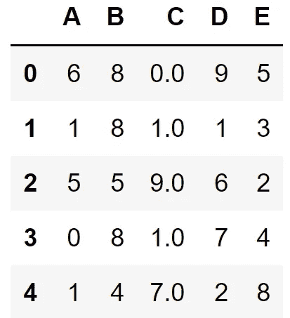
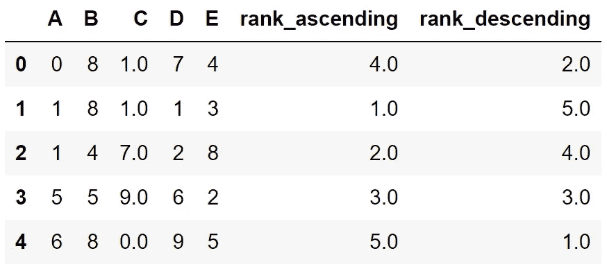

# Python Pandas 中的 4 个必须知道的参数

> 原文：<https://towardsdatascience.com/4-must-know-parameters-in-python-pandas-6a4e36f6ddaf>

## 这使得函数更加有用。


Jari hytnen 在 [Unsplash](https://unsplash.com/s/photos/four?utm_source=unsplash&utm_medium=referral&utm_content=creditCopyText) 上拍摄的照片

Pandas 是最流行的数据分析和操作库之一。它提供了许多功能来有效地解决问题。大多数 Pandas 函数都有增强其功能的参数。

参数自定义函数的行为，使函数更加灵活和实用。

大多数参数对于一个特定的函数是唯一的，但是有一些参数无论与什么函数一起使用都是一样的。它们可以被认为是通用的熊猫参数:)

了解并使用这些参数对充分利用熊猫非常有帮助。在这篇文章中，我们将讨论很多 Pandas 函数使用的 4 个参数。

让我们从创建一个样本数据帧开始。

```
import numpy as np
import pandas as pddf = pd.DataFrame(
    np.random.randint(10, size=(5,5)), 
    columns=list("ABCDE")
)
```


df(作者图片)

我们创建了一个 5 行 5 列的数据帧。

# 1.轴

轴参数用于为要应用的功能选择轴。0 表示索引，1 表示列。默认值通常为 0。我从未使用过默认轴参数值为 1 的函数。

考虑 sum 函数。当我们将它应用于数据帧时，它会计算行或列中值的总和。

```
df.sum(axis=0)A    13.0
B    33.0
C    18.0
D    25.0
E    22.0
dtype: float64--------------
df.sum(axis=1)0    28.0
1    14.0
2    27.0
3    20.0
4    22.0
dtype: float64
```

当轴为 0 时，求和运算是沿着索引进行的，因此输出给出列和。当轴为 1 时，计算行和。

对于 mean、sort_values、groupby、fillna、dropna、rank 等许多函数来说，轴是一个有效的参数。

# 2.忽略 _ 索引

默认情况下，使用整数索引创建数据帧。索引可以被认为是行标签。

有些函数会改变行的顺序，比如 sort_values 函数。在这种情况下，指数也会混淆。

另一个混合索引的函数是组合多个数据帧的 concat 函数。原始数据帧的索引没有改变，这可能导致重复的索引。

在这种情况下，ignore_index 参数会忽略当前数据帧的索引，结果数据帧会被赋予一个全新的好看的整数索引。

让我们用 sort_values 函数做一个例子。

```
df.sort_values(by="A")df.sort_values(by="A", ignore_index=True)
```


(图片由作者提供)

左边的 dataframe 是没有 ignore_index 参数的输出。

# 3.原地

有许多函数可以更新数据帧中的值或修改数据帧。使用此类函数时，为了保存更改，需要将 inplace 参数设置为 True。

下面是一个使用 sort_values 函数的示例。

```
df.sort_values(by="A", ignore_index=True)df
```



(图片由作者提供)

根据列 A 中的值对行进行排序，但是我们无法观察到数据帧中的任何变化。原因是更改没有保存。我们可以将排序后的数据帧赋给另一个变量，或者简单地将 inplace 参数设置为 True。

```
df.sort_values(by="A", ignore_index=True, inplace=True)df
```


(图片由作者提供)

这些行现在已排序。

Fillna、dropna、reset_index 和 sort_values 是一些具有 inplace 参数的 Pandas 函数。

# 4.上升的

每当我们做一个涉及排序值的操作时，我们都需要指定如何去做。它们可以按升序或降序排序。

升序参数用于确定如何对值进行排序。rank、value_counts 和 sort_values 函数有一个升序参数。

我们来做一个 rank 函数的例子。

```
df["rank_ascending"] = df["D"].rank(ascending=True)
df["rank_descending"] = df["D"].rank(ascending=False)
```

我们已经创建了两个列，其中包含基于列 d 中的值的等级。其中一个列基于按升序排序的值分配等级，因此最低值的等级为 1。另一个正好相反。

这是我们新列的数据框架:



(图片由作者提供)

这些参数通常执行特定于功能的调整，但是我们在本文中讨论的那些参数也用于相同的目的。如果您正在使用 Pandas 进行数据分析和操作，您可能会频繁使用这些参数。

*别忘了* [*订阅*](https://sonery.medium.com/subscribe) *如果你想在我发表新文章时收到电子邮件。*

*你可以成为* [*媒介会员*](https://sonery.medium.com/membership) *解锁我的全部写作权限，外加其余媒介。如果您使用以下链接，我将收取您的一部分会员费，无需您支付额外费用。*

<https://sonery.medium.com/membership>  

感谢您的阅读。如果您有任何反馈，请告诉我。