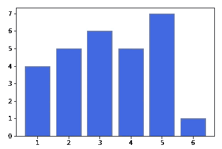
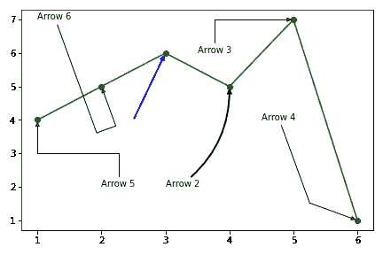
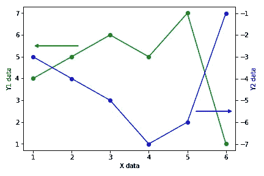
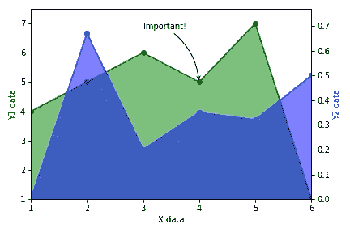

# Matplotlib 中更好的绘图的 4 个快速技巧

> 原文：<https://towardsdatascience.com/4-quick-tricks-for-better-plots-in-matplotlib-1efd82acd780>

## 轻松添加箭头、多轴、渐变填充等

当我们开始用 matplotlib 之类的工具学习数据可视化方法时，为了便于编码，我们通常从最简单的图开始。然而，当我们开始与他人分享我们的可视化时，定制我们的情节以精心制作我们的信息并使一切更具视觉吸引力是很重要的。

我们可以插入几行代码，使我们的情节更具功能性，并帮助数据向我们的观众讲述一个故事，而不是创建复杂的代码并花费数小时来使情节看起来“恰到好处”。

这里有 4 个快速提示，可以为基本 matplotlib 折线图和条形图增加重点、功能和视觉吸引力:

# 1.用颜色强调条形图

我们的目标是制作能够讲述一个故事的独立情节，无论你是否在那里展示幻灯片。在分享图表之前，你应该思考*“我想让我的观众从中得出什么结论？”*和*“我真的希望他们注意到数据的哪一部分？”*为了帮助实现这一点，我们可以使用**列表**来定制条形图中的大量可调参数。什么是`color='blue'`可以变成`color=['blue', 'red', ...]`,每个条目指示如何处理我们图中的每个条。

例如，一个简单的条形图看起来像这样:

然而，如果我们想引起对第三个条的注意(例如)，我们可以通过将`color`、`edgecolor`和`linewidth`输入更改为列表来实现:

# 2.用箭头强调线图

线形图很难突出重点。对于线图，最简单的通常是最好的——添加一个指向特定数据点的箭头是吸引观众眼球的好方法。虽然 matplotlib 有一个特定的[箭头函数](https://matplotlib.org/stable/api/_as_gen/matplotlib.pyplot.arrow.html)，但是要让箭头“恰到好处”地显示出来却非常不灵活，而且非常具有挑战性。更简单快捷的方法是使用[注释功能](https://matplotlib.org/stable/api/_as_gen/matplotlib.axes.Axes.annotate.html?highlight=annotate#matplotlib.axes.Axes.annotate)。在这里，我们得到了许多非常直观的功能。我们的两个主要变量`xytext`和`xy`分别告诉箭头**从哪里开始**和**从哪里结束**。`xytext`也是放置文本的箭头末端，我们应该选择给箭头加标签(但我们不是必须这样！).

我们可以使用`arrowprops=dict()`来调整箭头属性，其中我们可以使用标准键，如`color`、`linewidth`等等。那会让你得到简单的直线，但是事情会变得更有趣。我们可以用`arrowstyle`(此处完整列出[)调整箭头的形状，也可以偏离直线箭头路径。`connectionstyle`有三种主要口味](https://matplotlib.org/stable/gallery/text_labels_and_annotations/fancyarrow_demo.html)

*   `arc3`-以弧度设置曲率的弯曲路径(`rad`)。玩正负`rad`值，把你的曲线从凹变成凸。在直线连接的折线图中，给箭头路径增加一点曲率肯定有助于引起注意。
*   `angle` —以指定角度绘制的线段(`angleA`、`angleB`)。这个方法足够聪明，可以让你选择的任何角度在你的文本和`xy`坐标之间建立联系。
*   `bar`-尽管整个箭头可以基于一个共同的角度，但线段之间保持 90 度弯曲。通过在这里玩`fraction`，我们改变了**转弯**相对于端点的位置。在下面的代码中尝试负值，看看会发生什么！

考虑到你可以创建大量不同种类的箭头，最好试验一下这些参数来得到你想要的。这里有一个例子，6 个不同的箭头应用于我们的绘图，以帮助可视化什么是可能的。

# 3.添加辅助 Y 轴

将多列数据叠加在一个图上可以得出它们之间关系的结论。但是，两列在相同的数值范围内操作的情况很少见，这会导致其中一行在轴附近徘徊时出现缩放问题。为了构建一个辅助 y 轴，我们使用`twinx()`函数创建一个共享相同 x 轴的辅助 y 轴。该次轴将自动定位在最右侧，并根据输入到该`ax`项目的数据自动缩放。重要的是使用`color`来帮助我们的观众理解哪个情节与每个轴相关联。为了更好地理解这一点，可以使用我们刚刚学过的技巧来添加箭头。

旁注:添加一个辅助 y 轴也可以很容易地在本地熊猫中完成，使用`secondary_y = True`属性，产生几乎相同的结果。如果你好奇的话，这里的代码是[这里是](https://gist.github.com/bamattis/7ff2faa50ff5d884edad37350e8667ce)，结果图是[这里是](https://github.com/bamattis/Blog/blob/main/MatplotLib_Tips/pandas_lines.png)。

# 4.添加填充颜色

我们还可以通过填充线条下方的区域来增加线条图的重点和总体视觉吸引力。这是一个使用`fill_between()`函数的快速加法，在这里我们指出我们希望它填充的 x 范围，以及我们希望填充的两条“线”。在这种情况下，我们想要填充数据和图形底部之间的空间(在这种情况下 y=0)。用`plt.axis()`设置绘图区域以匹配您的数据也是一个好主意，否则颜色不会继续填充您的数据范围之外，在您的绘图中留下难看的白色区域。

定义和不定义绘图区以匹配数据的线形图填充-按作者排列的图像

我们可以把极限推得更远一点——把我们的填充变成颜色渐变。在这种情况下，我们必须发挥创造力。对于添加渐变来说是很棒的，但是传统上它是在我们的整个绘图区域添加渐变。为了克服这一点，我们用`imshow()`添加一个渐变，然后用`fill_between()`将上面的**都涂成白色。`imshow()`起步有点棘手，我在之前的一篇文章中对此进行了更深入的探讨，链接[此处](/custom-matplotlib-colormaps-for-danger-zone-plots-62310983eb67)。然而，简单的版本让我们设置我们在 X 中使用的颜色图的范围——这里我们选择使用带有`[[0.8, 0.8],[0,0]]`的`cm.Blues`颜色图底部 80%的垂直颜色渐变。(类似的水平梯度可以这样实现:`X=[[0,0.8][0,0.8]]`)。**

我们还设置了`imshow()`填充的`extent`，有效地设置了渐变图像填充的边界框。我们可以手动设置这些值，或者对我们的数据序列使用`min()`和`max()`函数。这些可以简单地增加以进一步向下扩展绘图区域。最后，我们在`fill_between()`函数中设置绘图区域的上限，因为我们现在从我们的数据到绘图的顶部(这里定义为`df.b.max()+0.5`)。

# 额外学分

根据我们所学的内容，我们现在可以将我们的方法结合起来，使用一个次轴连接两个线图，同时还可以添加填充并用箭头标注重要的点。

# 结论

通过对代码进行一些快速调整，我们可以为 matplotlib 图增加重点和视觉吸引力。强调的情节让我们的数据自己说话，能瞬间带动别人关注我们 认为值得关注的 ***数据点。幸运的是，我们只用几行代码就可以达到这个目标！***

像往常一样，整个代码走查笔记本可以从我的 github 中找到[。如果你觉得这个有用，请跟我来！ 欢呼声此起彼伏，快乐的编码声此起彼伏。](https://github.com/bamattis/Blog/tree/main/MatplotLib_Tips)

*作者生成的所有图像*