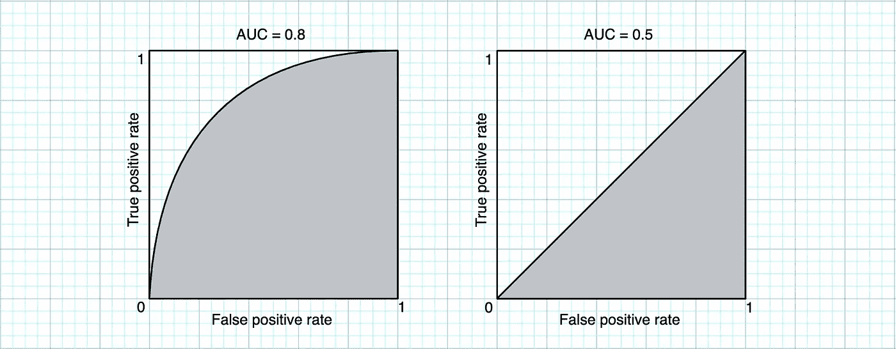

# 评估模型性能的 4 步程序

> 原文：<https://towardsdatascience.com/4-step-routine-to-assess-your-model-performance-ed5b3eb6ccd2>

# 评估模型性能的 4 步程序

## 回到基础

Kolleen Gladden 在 [Unsplash](https://unsplash.com?utm_source=medium&utm_medium=referral) 上拍摄的照片

我们怎么能说“这个模型概括得很好”，“那个算法执行得很好”，或者简单地说“那个很好”？

在这篇文章中，我们正在研究机器学习中广泛使用的方法和指标，以分析分类模型的性能。

你可能会问:只为了分类？

在回归的情况下，评估更简单，因为它通常只涉及计算平均损失函数，如均方误差(MSE)。该指标表明曲线与数据的拟合程度，并让我们比较不同回归模型之间的性能。

相比之下，分类模型的情况要复杂一些，但是下面的例程可以帮助我们系统地评估和比较模型的性能:

1.  计算**混淆矩阵**
2.  计算**精度并召回**
3.  看**精度**或**成本敏感精度**
4.  评估 ROC 曲线下的**面积**

# **混淆矩阵**

混淆矩阵是一个表格，显示了每个类别的正确和错误预测的数量。假设我们有一个计算机视觉算法，它将体育图片作为输入，并预测正在播放的内容。例如，我们可以有篮球、棒球和足球类，混淆矩阵如下所示:

体育类别混淆矩阵示例(*作者图片)*

在多类别分类的情况下，可以单独分析每个类别，但让我们将所有篮球示例视为**正面**而其他类别视为**负面**(我可能会有偏见，因为这是我最喜欢的运动)。我们可以观察到，在 14 个篮球示例中，该模型只正确分类了 2 个。换句话说，我们只有 2 个**真阳性(TP = 2)** 和 12 个**假阴性(FN = 12)** 。该模型给出了 4 个**假阳性(FP = 4)** : 3 个实际上是棒球，1 个例子是足球而不是篮球。并且该模型给出了 21 个(5 + 2 + 4 + 10) **真阴性(TN = 21)。**

这个练习可以针对每个类别进行，并且对于快速可视化我们的算法的性能特别有用。在我们的例子中，我们可以注意到该算法非常擅长识别足球，但很难区分篮球和棒球。

该模型倾向于错误地预测棒球而不是篮球。太可惜了！在这种情况下，我们可以决定向我们的数据集中添加更多篮球图片的示例，并重新训练该模型。

# **精确&召回**

精确度和召回率可能是评估一个模型最常用的两个比率。精度是所有肯定预测中正确的肯定预测的比例:

对于我们的篮球例子，我们有 2 个正确的预测(TP = 2)和 4 个不正确的肯定预测(FP = 4)。因此精度是 1/3。

召回率是算法能够从数据集中的所有正例中检测到的正例的比例:

对于篮球的例子，我们有 12 个错误的否定，这给了我们只有 1/7 的召回率。

在实践中，你通常会得到很好的精确度或很好的回忆，但不可能同时得到两者。我们通常可以调整超参数，以召回为代价最大化精确度，或者以精确度为代价最大化召回。

# **精度&对成本敏感的精度**

准确度给出了正确分类的例子在所有分类的例子中的比例:

准确度是算法能够做出正确预测的程度的指示。使用这种度量的一个缺点是所有的错误都被认为是一样的。

有时，我们有比其他课程更重要的课程，我们需要不同地惩罚错误。例如，如果我们有一个算法将电子邮件分类为*垃圾邮件*和*非垃圾邮件*。误报是指当你的收件箱收到垃圾邮件时，误报是指你朋友的邮件进入了垃圾邮件文件夹。在这种情况下，我会认为假阳性比假阴性更令人讨厌。

处理这个问题的一种方法是通过用两种不同的权重(C1 和 C2)对两种类型的误差(FP 和 FN)进行加权来计算成本敏感的精度。

对于我们的电子邮件示例，如果我们想认为一个错误较少的模型比另一个错误相同但错误较多的模型更准确，我们可以设置 C1 > C2。

# ROC 曲线下的面积

受试者工作特性(ROC)曲线是一种评估分类技术性能的直观方法。此方法仅适用于输出置信度的分类算法。例如，我们可以计算神经网络、逻辑回归或决策树的 ROC 曲线。

要绘制 ROC 曲线，我们需要两个指标:

*   真阳性率(TPR)被定义为(与回忆完全一样)正确预测的阳性样本的比例:

*   假阳性率(FPR)被定义为错误预测的阴性样本的比例:

如果我们以输出介于 0 和 1 之间的置信水平的逻辑回归分类器为例。我们可以选择阈值，在该阈值以上，我们认为预测是肯定的，例如 0.5。

为了绘制 ROC 曲线，我们将离散化所有可能阈值的区间(例如:[0，0.1，0.2，0.3，0.4，0.5，0.6，0.7，0.8，0.9，1])，并计算每个水平的 TPR 和 FPR。然后，我们可以计算曲线下面积(AUC ),如下图所示:

*作者图片*

阈值“1”不会给出任何肯定的预测(FPR=0 和 TPR=0)，阈值“0”只会带来肯定的预测(FPR=1 和 TPR=1)。中间的一切都取决于型号。

完美的分类器将给出 1 曲线下的面积，而随机分类器将给出 0.5 的面积(如右侧的图)。AUC 越大，性能越好，并且通常可以通过选择给出接近 1 的 TPR 和接近 0 的 FPR 的阈值来找到好的分类器。

# 最后的话

混淆矩阵是分析和比较分类算法性能的良好起点。该矩阵有助于了解我们的分类器是否有一些模式或明显的错误。但是这种方法也有它的局限性，重要的是要考虑其他关键指标，如精确度、召回率和准确度。

然而，在我们讨论的四种方法中，ROC 曲线下面积可能是最有效的技术。ROC 曲线捕获分类的不止一个方面(真阳性率和假阳性率)，并且该曲线相对容易理解和直观快速分析。

好奇想了解更多关于 Anthony 的工作和项目吗？在[媒体](https://medium.com/@anthonycvn)、 [LinkedIn](https://www.linkedin.com/in/anthonycavin/) 、 [Twitter](https://twitter.com/Anthony66333223) 上关注他。

*需要技术写手？将您的请求发送到*[*https://amigo CCI . io*](https://amigocci.io/blog/mlops-at-medium-scale/)*。*