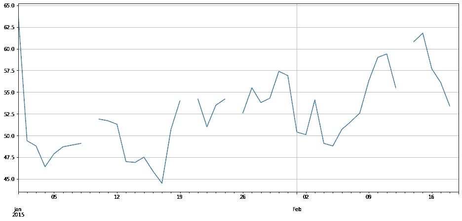
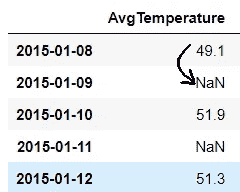
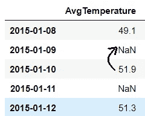

# 处理时间序列数据中缺失值的 4 种技术

> 原文：<https://towardsdatascience.com/4-techniques-to-handle-missing-values-in-time-series-data-c3568589b5a8>

## 时间序列分析基本指南


图片来自 [Pixabay](https://pixabay.com/?utm_source=link-attribution&amp;utm_medium=referral&amp;utm_campaign=image&amp;utm_content=693873) 的 [Willi Heidelbach](https://pixabay.com/users/wilhei-883152/?utm_source=link-attribution&amp;utm_medium=referral&amp;utm_campaign=image&amp;utm_content=693873)

真实世界的数据通常包含缺失值。包括时间序列数据在内的所有类型的数据集都存在缺失值的问题。丢失值的原因可能是数据损坏或无法在任何给定时间记录数据。

在我以前的一篇文章中，我讨论了处理非时序数据集缺失值的 7 种不同技术:

</7-ways-to-handle-missing-values-in-machine-learning-1a6326adf79e>  

时间序列模型使用完整的数据，因此需要在建模或实际时间序列分析之前估算缺失值。时间序列数据集中缺失的值可以使用两种广泛的技术来处理:

*   删除缺少值的记录
*   估算缺失的信息

然而，丢弃丢失的值不是一个合适的解决方案，因为我们可能会丢失相邻观测值的相关性。估计或估算缺失值是处理缺失值的一个很好的方法。

## 开始使用:

在本文中，我们将讨论 4 种可用于估算时间序列数据集中缺失值的技术:

```
**1) Last Observation Carried Forward (LOCF)
2) Next Observation Carried Backward (NOCB)
3) Rolling Statistics
4) Interpolation**
```

样本数据包含 50 天内收集的温度数据，其中有 5 个值随机缺失。



(图片由作者提供)，样本数据集随时间变化的快照

# 1)最后一次观察结转:

LOCF 是一个简单而优雅的技巧，它将之前没有丢失的值结转或复制，并用丢失的值替换。

> `**df[‘Forward_Fill’] = df[‘AvgTemperature’].ffill()**`

`[**ffill()**](https://pandas.pydata.org/docs/reference/api/pandas.DataFrame.ffill.html)`功能来自熊猫。DataFrame 函数可用于用以前的值估算缺失的值。



(图片由作者提供)，向前插补

# 2)下一次向后观测:

NOCB 是另一种简单的技术，它复制下一个没有丢失的值，并用前面丢失的值替换。

> `**df[‘Backward_Fill’] = df[‘AvgTemperature’].bfill()**`

`[**bfill()**](https://www.geeksforgeeks.org/python-pandas-dataframe-bfill/)`大熊猫的功能。DataFrame 函数可用于用以前的值估算缺失的值。



(图片由作者提供)，反向插补

# 3)滚动统计:

统计技术可用于通过聚合先前的非缺失值来估算缺失值。滚动统计技术可以是:

**a)简单移动平均线:**


> `**df[‘SMA’] = df['*AvgTemperature*'].rolling(window=5).mean()**`

**b)加权移动平均:**


> `***df[‘WMA’] =* data*['AvgTemperature']*.rolling(window=5).apply(lambda x: x[::-1].cumsum().sum() * 2 / n / (n + 1))**`

**c)指数(加权)移动平均:**


> `**df['EWA] = df['AvgTemperature'].ewm(halflife=4).mean()**`

# 4)插值:

插值技术通过假设数据点范围内的关系来估计缺失值。在滚动统计技术中，只有以前的值被认为是估算缺失值，插值技术使用过去和未来的已知数据点进行估计。

我们有各种插值方法:

*   线性:假设数据点范围呈线性关系
*   样条:估计使整体曲率最小化的值，从而获得通过输入点的平滑曲面。
*   时间:通过更多地关注附近的点而不是远处的点来估计缺失值。

还有各种其他插值技术可用于估算缺失值。所有这些都假设相邻的数据点是相似的，但事实并非总是如此。

> `**df[‘Interpolate_Spline’]= df[‘AvgTemperature’].interpolate(option=’spline’)**`

熊猫。DataFrame 软件包提供使用[插值](https://pandas.pydata.org/docs/reference/api/pandas.DataFrame.interpolate.html)技术估算缺失值。[插值](https://pandas.pydata.org/docs/reference/api/pandas.DataFrame.interpolate.html)实现中的选项参数采用算法('样条'、'线性'、'时间'、'二次'等等)。

# 结论:

在本文中，我们讨论了处理和估算时间序列数据集中缺失值的各种技术。熊猫。DataFrame 实现了大多数插补技术。

上面讨论的所有算法都假定相邻的数据点是相似的，但事实并非总是如此。有一些先进的插补技术不遵循这一假设。

# 参考资料:

[1]熊猫文献:[https://pandas.pydata.org/docs/reference/api/pandas.DataFrame.html](https://pandas.pydata.org/docs/reference/api/pandas.DataFrame.html)

> 感谢您的阅读