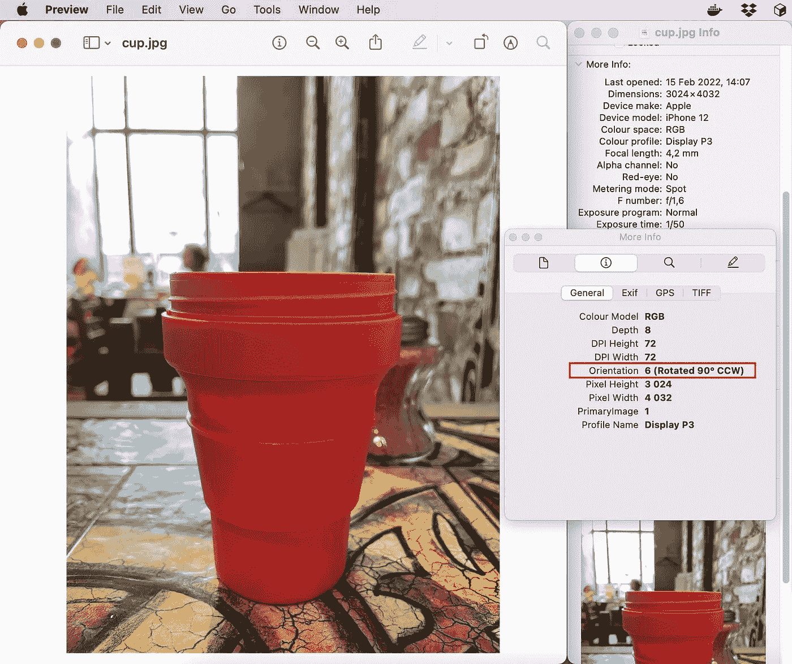
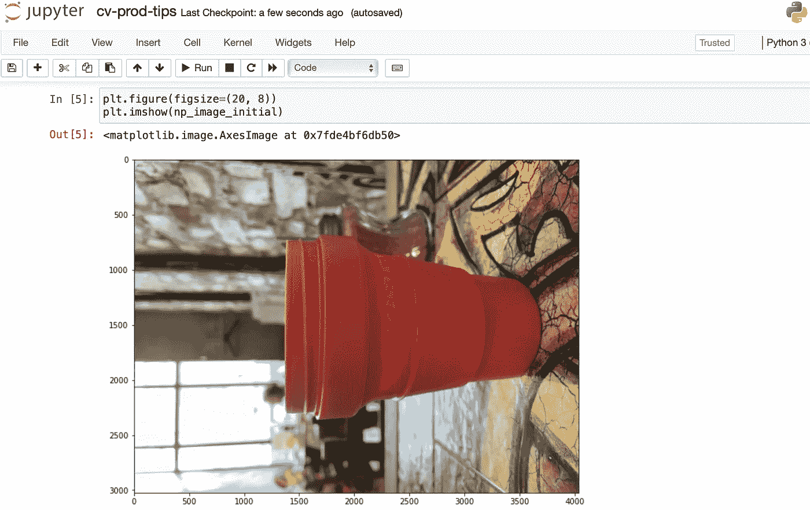
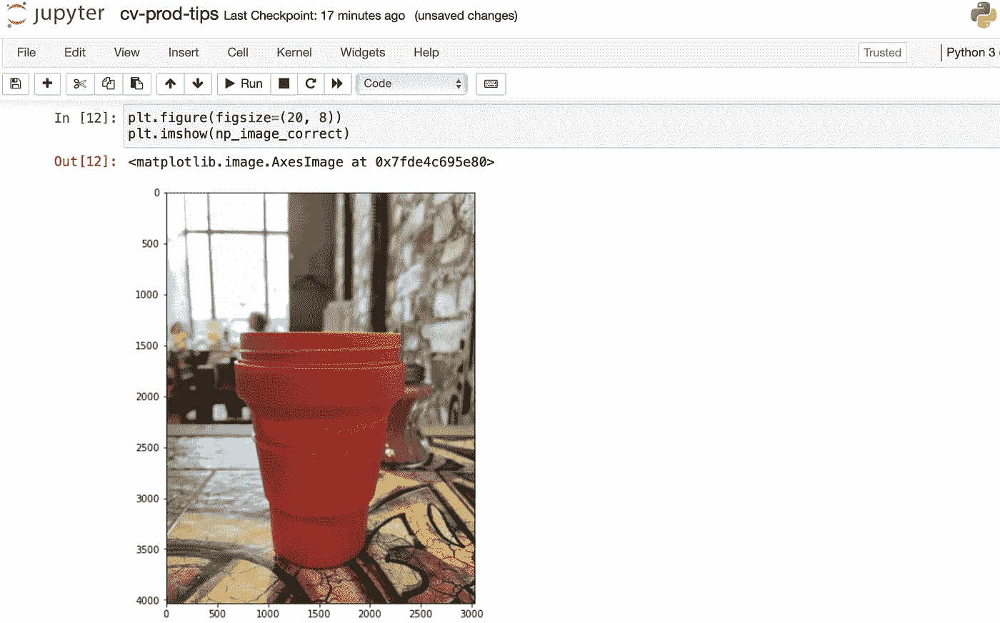
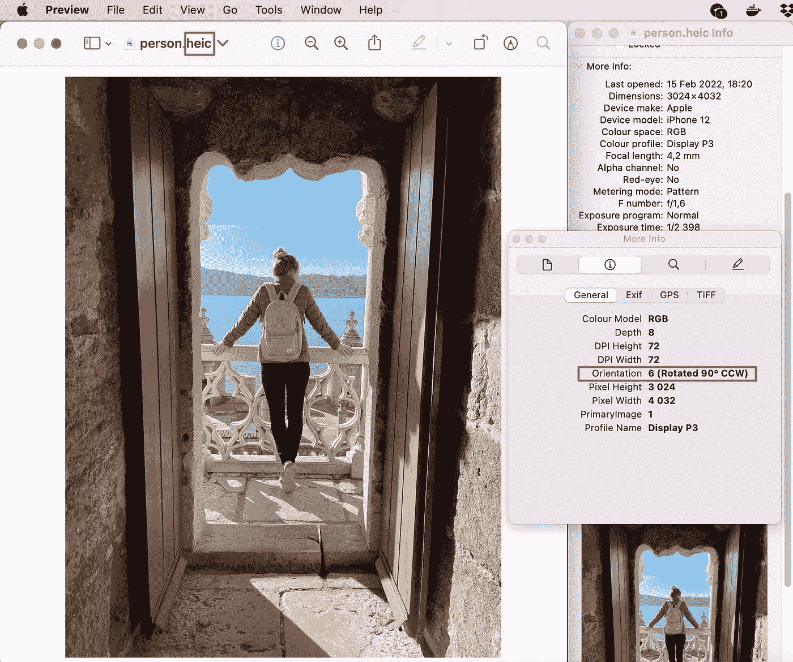
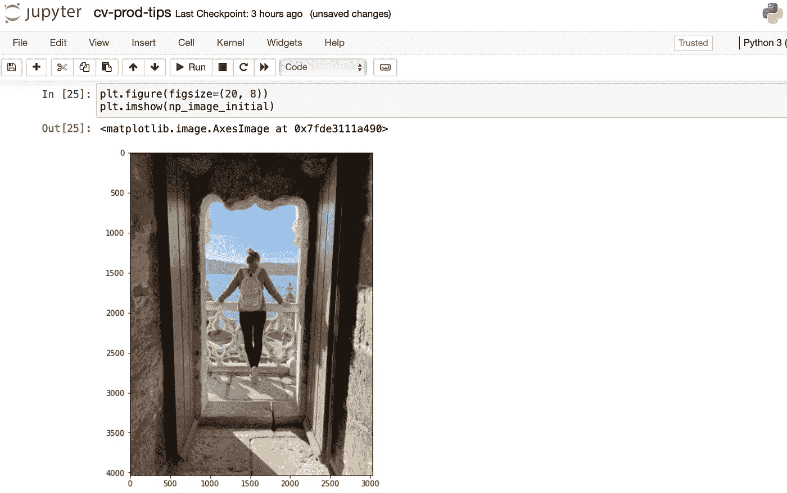
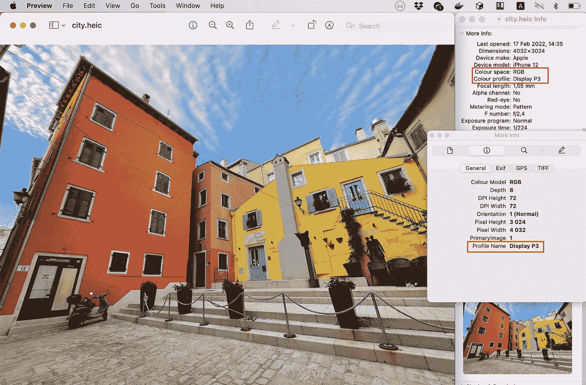
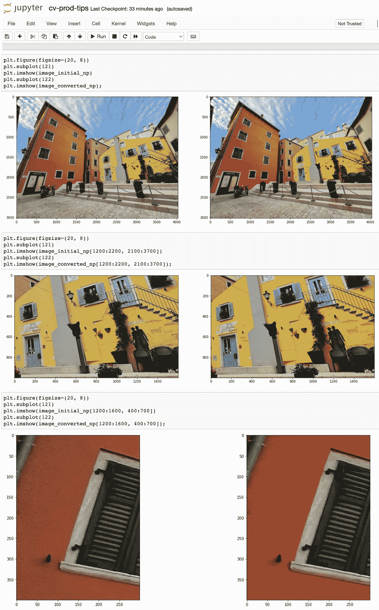

# 在生产中搞乱计算机视觉模型的 4 种方法

> 原文：<https://towardsdatascience.com/4-ways-to-mess-up-your-computer-vision-model-in-production-d4e198486928>

## 或者在将图像发送到神经网络之前仔细的图像预处理的重要性

凯文·Ku 在 [Unsplash](https://unsplash.com) 上的照片

# 介绍

这篇文章不是关于模型的质量。它甚至与扩展、负载平衡和其他开发无关。这是一个更普遍但有时会被忽略的事情:处理不同种类和不可预测的用户输入。

在训练模型时，数据科学家几乎总是有一个受控的数据环境。这意味着使用已经准备好的数据集，或者有时间和资源来手动收集、合并、清理和检查数据。通过准确地做到这一点，可以提高根据这些数据训练的模型的质量。

想象这个模型足够好，可以部署到生产中。在最好的情况下，仍然可以控制环境(传统的服务器端部署)。但即便如此，用户还是会从各种各样的设备和来源上传图片。在边缘部署的情况下，还有一层复杂性:人们无法控制环境。

在这两种情况下，模型应该立即回答，开发人员没有时间手动检查数据。因此，至关重要的是:

*   即时准备数据
*   尽可能接近训练时预处理

否则，实际生产模型的质量可能会比预期的低得多。发生这种情况是因为人们给数据引入了模型没有预料到的偏差。

# 真实案例

在接下来的内容中，我将讲述我在我的[修图](https://retouchee.com)初创公司中从事计算机视觉模型工作时遇到的 4 个问题。

每个都与图像处理相关，然后再传递给算法(主要是神经网络):

*   存储在 EXIF 的方向
*   非标准颜色配置文件
*   图像库的差异
*   调整大小算法

对于每一项，我都会提供一个案例研究，其中包含示例和一段在生产中为我解决该问题的代码。

所有代码示例、数据和环境细节都可以在 GitHub 资源库中找到:[https://github.com/vladimir-chernykh/cv-prod-tips](https://github.com/vladimir-chernykh/cv-prod-tips)

## 存储在 EXIF 的方向

如今，人们使用手机相机拍摄大多数照片(约 91%，这个数字还在增长)。【[来源](https://blog.mylio.com/how-many-photos-will-be-taken-in-2020/)】。

通常，移动设备以某个预先确定的固定方向存储图像，而不管拍摄照片时真实的相机位置如何。恢复初始方位所需的旋转角度作为元信息存储在 [EXIF](https://en.wikipedia.org/wiki/Exif) 中。例如:iPhone 总是横向存储 JPEG 图像。除此之外，在 EXIF 还有一个旋转(和镜像)角度。【[信号源 1](https://ruk.ca/content/fixing-problem-sideways-iphone-photos-uploaded-drupal) 、[信号源 2](https://news.ycombinator.com/item?id=21207411) 】。

iPhone 12 上作者的照片。方向储存在 EXIF 和 Mac 的“预览”正确处理它。

在移动设备或现代桌面软件上观看这样的图像可能没问题，因为它们可以处理这些 EXIF 信息。但是当 engineer 以编程方式加载图像时，许多库读取原始像素数据并忽略元信息。会导致错误的图像方向。在下面的例子中，我使用了 [PIL](https://github.com/python-pillow/Pillow) ，这是用于图像处理的最流行的 Python 库之一。

图像通过代码读取。

向神经网络发送这样的图像可能会产生完全随机的结果。

要解决这个问题，我们需要读取 EXIF 信息，并相应地旋转/镜像图像。

PIL 允许读取 EXIF 元信息并解析它。人们需要知道在哪里寻找方向。令人惊叹的 Exiftool 文档对此有所帮助。存储必要信息的字节是 0x0112。相同的文档提示如何处理每个值，以及如何处理图像以恢复初始方向。

考虑到 EXIF，图像通过代码读取。

这个问题似乎已经解决了，对吗？嗯，还没有。

让我们试试另一张照片。这一次我将使用现代的 [HEIF](https://en.wikipedia.org/wiki/High_Efficiency_Image_File_Format) 图像格式，而不是旧的 JPEG(注意，为此需要一个特殊的 PIL [插件](https://github.com/uploadcare/heif-image-plugin/))。iPhone 默认以这种格式拍摄 [HDR](https://en.wikipedia.org/wiki/Multi-exposure_HDR_capture) 图片。

iPhone 12 上作者的照片。方向储存在 EXIF 和 Mac 的“预览”正确处理它。

一切看起来都一样。让我们试着以一种天真的方式从代码中读出它，而不去看 EXIF。

图像通过代码读取，不考虑 EXIF。

原始图像方向正确！但是 EXIF 建议应该逆时针旋转 90 度！所以方向恢复代码会失败。

这是 HEIC 中 iPhone 拍摄的一个已知问题。【[信号源 1](https://github.com/ImageMagick/ImageMagick/issues/1232) 、[信号源 2](https://blog.feld.me/posts/2019/10/iphone-11-pro-has-broken-exif-orientation-data/) 、[信号源 3](https://github.com/photoprism/photoprism/issues/1064) 。由于某些不清楚的原因，iPhone 可以正确存储原始像素，但在以这种格式拍照时，仍然在 EXIF 保持传感器方向。

因此，当图像是在 iPhone 上以 HEIC 格式拍摄时，应该修正算法并省略旋转。

考虑到 EXIF，图像通过代码读取。

当然，来自其他设备的图像方向可能会有更多的问题，这段代码可能并不详尽。但是它清楚地显示了一个人在处理用户输入时应该有多小心，即使没有恶意，用户输入也是不可预测的。

## 非标准颜色配置文件

元信息隐藏了另一个挑战。图片可能被拍摄并存储在不同的[色彩空间](https://en.wikipedia.org/wiki/Color_space)和[色彩配置文件](https://en.wikipedia.org/wiki/ICC_profile)中。

有了色彩空间，就或多或少的清晰了。它定义了用于存储每个像素的图像颜色信息的通道。两种最常见的色彩空间是 [RGB](https://en.wikipedia.org/wiki/RGB_color_model) (红-绿-蓝)和 [CMYK](https://en.wikipedia.org/wiki/CMYK_color_model) (青-品红-黄-黑)。人们几乎不会错过 CMYK 的图像，因为它们有不同的通道数:RGB 是 4 对 3。因此，将它发送到网络会因为错误的输入通道数而立即中断它。所以这种从 CMYK 到 RGB 的转换很少被遗忘。

颜色配置文件是一件非常棘手的事情。它是输入(摄像机)或输出(显示)设备的特征。它说明了特定于设备的记录或显示颜色的方式。RGB 色彩空间有[许多不同的配置文件](https://en.wikipedia.org/wiki/RGB_color_spaces) : [sRGB](https://en.wikipedia.org/wiki/SRGB) ， [Adobe RGB](https://en.wikipedia.org/wiki/Adobe_RGB_color_space) ，[显示 P3](https://en.wikipedia.org/wiki/DCI-P3#Display_P3) 等。每个配置文件都定义了自己将原始 RGB 值映射到人眼感知的真实颜色的方式。

这导致相同的原始 RGB 值可能在不同的图片中暗示不同的颜色。为了解决这个问题，需要仔细地将所有图像的颜色配置文件转换成一个选定的标准。通常，它是 sRGB 配置文件，因为由于历史原因，它是所有 web 的默认颜色配置文件。

iPhone 12 上作者的照片。颜色配置文件是“显示 P3 ”,存储在 EXIF。

在 iPhone 上拍摄的图片通常会显示 P3 颜色配置文件。让我们从代码中读取图像，看看有无颜色配置文件转换的情况。

通过带有(右栏)和不带有(左栏)颜色配置文件信息的代码读取图像。

人们可以看到，用色彩简档转换读取的图像更鲜明，更接近原始图像。根据图片和颜色配置文件的不同，这种差异可能会更大或更小。有些图像甚至可能看起来像没有配置文件转换的棕褐色。

发送到神经网络中的颜色(即像素值)可能会影响最终质量并破坏预测。因此，恰当地与他们合作至关重要。

## 图像库的差异

正确读取图像极其重要。但同时，一个人应该尽可能快地做它。因为在云计算时代，时间就是金钱。此外，客户不希望等待太久。

这里的最终解决方案是切换到 C/C++。有时，它在生产推理环境中可能完全有意义。但是如果你想留在 Python 的生态系统中，还是有选择的。每个图像库都有自己的功能和速度。

到目前为止，我只使用 PIL 模块。为了便于比较，我将采用另外两个流行的库: [OpenCV](https://opencv.org) 和 [Scikit-image](https://scikit-image.org) 。

让我们看看每个库读取不同大小的 JPEG 图像的速度有多快。

该图显示了不同库的读取速度如何取决于图像大小。

对于小图像，几乎没有区别。但是对于大的，OpenCV 比 PIL 和 Scikit-image 快大约 1.5 倍。根据图像内容和格式(JPEG、PNG 等),这种差异可能从 1.4 倍到 2.0 倍不等。).但总的来说，OpenCV 要快得多。

网络上还有其他可靠的基准测试[ [源 1](https://www.kaggle.com/zfturbo/benchmark-2019-speed-of-image-reading) 、[源 2](https://github.com/ethereon/lycon#benchmarks) ]给出了大致相同的数字。对于图像写入来说，这种差异可能更加显著:OpenCV 快了 4-10 倍。

一个更常见的操作是调整大小。在将图像发送到神经网络之前，人们几乎总是会调整图像的大小。而这正是 OpenCV 真正闪光的地方。

这里我取了一张 7360x4100 的图片，并把它的尺寸缩小到 1000x1000。OpenCV 比 PIL 快 22 倍，比 Scikit-image 快 755 倍！

选择正确的库可以节省大量的时间。需要注意的是，相同的调整大小算法在不同的实现中可能会产生不同的结果:

这里可以注意到，我对 OpenCV 和 PIL 都使用线性插值进行下采样。原始图像是相同的。但是重新划分的结果是不同的。差异非常显著:每种像素颜色的平均得分为 255 分中的 5 分。

因此，如果在训练和推断期间使用不同的库来调整大小，可能会影响模型质量。所以应该密切关注。

## 调整大小算法

除了不同库之间的速度差异，即使在同一个库中也有不同的调整大小算法。应该选择哪一个呢？至少，这取决于想要减小图像尺寸(下采样)还是增大图像尺寸(上采样)。

有[多种算法](https://en.wikipedia.org/wiki/Image_scaling#Algorithms)来调整图像大小。它们产生的图像质量和速度不同。我将只看这 5 个，它们足够好和快，并且在主流库中得到支持。

下面提供的结果也符合一些准则和例子。【[源 1](https://pillow.readthedocs.io/en/stable/handbook/concepts.html#filters-comparison-table) 、[源 2](https://docs.opencv.org/4.5.5/da/d54/group__imgproc__transform.html#ga47a974309e9102f5f08231edc7e7529d) 、[源 3](https://chadrick-kwag.net/cv2-resize-interpolation-methods/) 。

亚历克斯·克里维克在 [Unsplash](https://unsplash.com) 上拍摄的照片。应用不同的调整大小算法对同一图像进行下采样。

对于下采样，“面积”算法看起来是最好的(描述幕后发生的事情超出了本文的范围)。它产生的噪音和伪像最少。事实上，它是遵循 OpenCV [指南](https://docs.opencv.org/4.5.5/da/d54/group__imgproc__transform.html#ga47a974309e9102f5f08231edc7e7529d)的下采样的首选。

现在让我们对这个“区域”进行上采样——将下采样图像恢复到原始大小，看看在这种情况下哪种算法效果最好。

Alex Krivec 在 [Unsplash](https://unsplash.com) 上拍摄的照片。应用不同的调整大小算法来对同一图像进行上采样。

对于上采样，算法产生更一致的结果。然而，“三次”插值看起来最不模糊，最接近原始值(“lanczos”提供了类似的结果，但要慢得多)。

因此，这里的最终结论是对下采样使用“区域”插值，对上采样使用“立方”算法。

请注意，正确的调整大小算法选择在训练期间也很重要，因为它提高了整体图像质量。更重要的是，训练和推理阶段的调整大小算法应该是相同的。否则你已经知道会发生什么。

# 结论

在这篇文章中，我描述了我在从事计算机视觉工作的这些年中多次遇到的真实案例和问题。如果处理不当，它们中的每一个都可能会显著降低生产中的模型质量(即使训练数量是可以的)。我很乐意在评论中讨论你的案例！