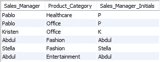
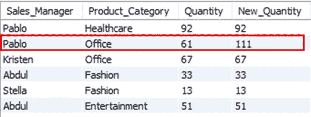
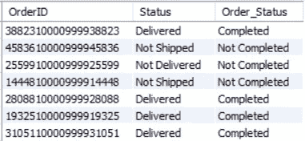
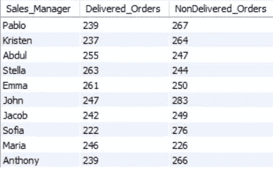
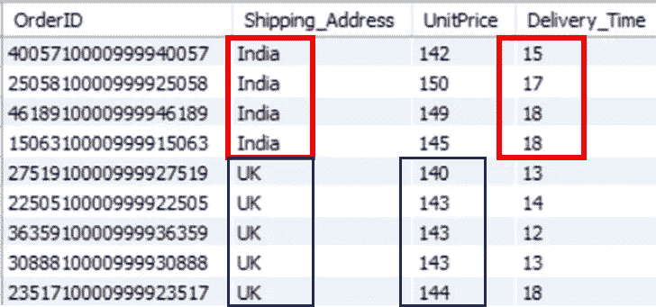

# 5 个 SQL 案例示例，让您轻松使用案例

> 原文：<https://towardsdatascience.com/5-advanced-sql-case-examples-that-will-make-you-use-case-when-easily-1040c1eb8857>

## 数据科学

## 掌握 SQL CASE-WHEN 语句的实例


照片由[斯蒂芬·莫尔特尔](https://unsplash.com/@shmdsgn?utm_source=medium&utm_medium=referral)在 [Unsplash](https://unsplash.com?utm_source=medium&utm_medium=referral) 拍摄

**SQL 案例的实际使用案例！**

在我之前的文章 [**5 个高级 SQL 概念**](/5-advanced-sql-concepts-you-should-know-in-2022-b50efe6c99) 中，您对 SQL 中的`**CASE..WHEN**`表达式有了一个大致的了解。这个表达式是 SQL 处理 *If-else* 逻辑的方式。

数据分析从来都不简单。通常，您需要根据几个条件转换提取的数据，以使其适合进一步的分析。这就是`**CASE..WHEN..THEN**`表达式的应用。

我列举了 5 个`CASE..WHEN..THEN`表达的实际用例，并附有例子和解释。理解这些例子肯定会让你成为 SQL 中 CASE 的专业用户。

这里是所有用例的快速参考—

```
**·** [**Two ways to write CASE statement in SQL**](#2577)**·** [**Simple CASE WHEN in SELECT statement**](#3c60) **·** [**Categorize the data using CASE WHEN**](#811d) **·** [**Data Standardization using SQL CASE**](#8f95) **·** [**CASE WHEN with Aggregate Functions**](#8eed) **·** [**CASE Statement in ORDER BY Clause**](#5d22)
```

> 📍注意:我使用 MySQL WorkBench & self created [销售数据](https://github.com/17rsuraj/data-curious/blob/master/TowardsDataScience/Dummy_Sales_Data_v1.csv)使用 [**Faker**](/faker-an-amazing-and-insanely-useful-python-library-b313a60bdabf) 创建。可以在我的 [**Github**](https://github.com/17rsuraj/data-curious/blob/master/TowardsDataScience/Dummy_Sales_Data_v1.csv) repo 上 [**MIT License**](https://github.com/17rsuraj/data-curious/blob/master/LICENSE.md) 下免费获得！

这是一个简单的 9999 x 11 数据集，如下所示。


虚拟销售数据集|作者图片

好了，我们开始吧…

从技术上讲，SQL 中的 CASE 表达式计算 WHEN 子句中提到的条件。如果条件为真，则执行 THEN 子句中提到的代码，如果条件为假，则执行 ELSE 部分中提到的代码。

在开始举例之前，让我们快速刷新一下表达式`**CASE..WHEN..THEN**`和它的写法。♻️

# 用 SQL 编写 CASE 语句的两种方法

该语句最常用的形式是在一个`CASE`表达式下编写多个`WHEN..THEN`子句。

例如，让我们通过在*销售经理*列中添加如下条件来创建一个新列— *销售经理姓名首字母*。

```
SELECT Sales_Manager,
       Product_Category,
       **CASE  
           WHEN Sales_Manager = 'Pablo' THEN 'P'
           WHEN Sales_Manager = 'Kristen' THEN 'K'
           ELSE Sales_Manager
       END AS Sales_Manager_Initials **   
FROM sql_practice.dummy_sales_data_v1;
```



SQL | Image 中的简单 CASE 语句(按作者)

> 📍注意:上面代码中的 ELSE 子句是可选的。如果不提及，那么所有 WHEN 子句中条件都为假的地方都会用`NULL`填充。

另一种方式，当被测试的条件只在一列上时，就像上面的例子一样，SQL 为您提供了一种简化的方式来编写如下的`CASE..WHEN`表达式。

```
SELECT Sales_Manager,
       Product_Category,
       **CASE Sales_Manager**
            WHEN 'Pablo' THEN 'P'
            WHEN 'Kristen' THEN 'K'
            ELSE Sales_Manager
       END AS Sales_Manager_Initials    
FROM sql_practice.dummy_sales_data_v1;
```

因此，您可以得到完全相同的输出，而不用在每个`WHEN`子句中提到列名。只需编写关键字`**CASE**`，后跟您想要应用条件的列名。

我没有发现这两种方法之间有任何执行时间或效率相关的差异。因此，采用哪种方法是个人的决定。

现在，既然你已经对如何写 CASE-WHEN 表达式有了深入的了解，让我们进入实际的用例。

# SELECT 语句中的简单情况

基于现有列创建新列是最常见的数据转换之一。大多数情况下，您需要在现有列上隐含条件。

正如您在上面的示例中注意到的，您可以有条件地测试单个列中的值，并基于此创建一个新列。但是，WHEN 子句也为您提供了在多列上添加条件的灵活性。✅

例如，假设对于*销售经理*为 *Pablo* 且*产品类别*为*办公室*的所有订单，您希望在*数量*中添加 *50* 。同时，对于*销售经理*和*产品类别的所有其他组合，*您希望保持*数量*列不变。

理想情况下，您需要两列上的条件，分别为— `Sales_Manager = ‘Pablo’`、`Product_Category = ‘Office’`。此外，这两个条件必须为真，才能获得新的数量值。因此，您需要使用逻辑 AND 连接这些条件。

```
SELECT Sales_Manager,
       Product_Category,
       Quantity,
       CASE 
           **WHEN Sales_Manager = 'Pablo'
                AND Product_Category = 'Office'
           THEN Quantity+50**
           **ELSE Quantity**
       END AS New_Quantity    
FROM sql_practice.dummy_sales_data_v1;
```



多列条件|按作者排序的图像

正如您所看到的，WHEN 子句中的两个条件是用关键字 AND 连接的。只有当两个条件都为真时，才会执行 THEN 子句中的代码，即 *Quantity+50* ，如上图所示。

这里，`ELSE Quantity`保持*销售经理*和*产品类别*的所有其他组合的数量列不变。

接下来，您通常需要将数据分成不同的类别，以便进一步分析。您可以在数据提取阶段使用 SQL 中的 CASE 表达式来实现这一点。

由于您将使用 *if-else* 逻辑来将记录分成不同的类别，`CASE..WHEN` expression 是这个应用程序中的完美工具。

# 在下列情况下，使用用例对数据进行分类

可以根据其他数字和非数字列将数据分成多个类别。

与将行分组到不同组的 GROUP BY 子句相反，CASE-WHEN 只是创建一个新列，并提到数据集的每一行所属的组名。✅

例如，销售数据中有每个订单的数量。假设您想根据列*数量*将订单量*分类为“高”、“低”或“中”。您可以使用如下 CASE-WHEN 语句—*

```
SELECT OrderID, 
       Quantity,
       **CASE 
           WHEN Quantity > 65 THEN 'High'
           WHEN Quantity < 15 THEN 'Low'
           ELSE 'Medium'
       END AS Order_Volume **   
FROM sql_practice.dummy_sales_data_v1;
```


使用 Case 语句分类|按作者分类的图像

简单！

您所需要做的就是提及条件，基于这些条件，您希望将数据集行分成不同的组。

您还可以像在前面的示例中一样，在`WHEN`子句中包含多个条件。当不同表中的列有多个条件时，这种分类也是有效的。

例如，假设您有两个表*订单*和*发货*，如下所示。


两个示例表格|作者图片

因为我没有准备好这些表格，所以我用 CTE 创建了如下的表格

```
WITH Orders AS
(
SELECT OrderID,
       Sales_Manager,
       Quantity
FROM sql_practice.dummy_sales_data_v1
LIMIT 20
),Shipments AS
(
SELECT OrderID,
       Product_Category,
       Shipping_Address,
       Shipping_Cost
FROM sql_practice.dummy_sales_data_v1
LIMIT 20
)
```

您可以在此了解更多关于使用</5-advanced-sql-concepts-you-should-know-in-2022-b50efe6c99>****的信息。****

****现在，假设您想根据列*数量*和*运输成本*中的值将*订单*表中的记录分类为“*高优先级*”、“*中优先级*”和“*低优先级*”。****

****这可能看起来很复杂，但是用下面的`CASE..WHEN`表达式就很简单了。****

```
**SELECT O.OrderID,
       O.Quantity,
       S.Shipping_Cost,
       **CASE
            WHEN O.Quantity > 50
            OR S.Shipping_Cost > 30
            THEN 'High Priority'

            WHEN O.Quantity < 15
            OR S.Shipping_Cost < 10
            THEN 'Low Priority'

            ELSE 'Medium Priority'
       END AS Order_Type**
FROM Orders O
LEFT JOIN Shipments S
ON O.OrderID = S.OrderID**
```

********

****使用 SQL | Image 中的 CASE 按作者进行数据分类****

****您需要使用`JOIN`子句和列别名。剩下的部分也是同样简单的`CASE..WHEN`表情。在上图中可以看到，创建了一个新列 *Order_Type* ，其中包含每个 *OrderID* 的优先级值。****

****接下来，有时您的数据集包含相同含义的不同值，这使得数据不一致且不一致。****

****最简单的例子就是——某些数据集中的性别列可以包含' *W* '、 *F* '、*女*'、*女*'等值，都表示性别为'*女*'。那为什么我们要用不同的术语来表示同一个意思呢？****

****最好将数据集标准化，使其更加一致。****

****下一个用例将详细演示这一点。****

# ****使用 SQL CASE 的数据标准化****

****数据标准化用于使数据更加一致，即确保每一列都有相同类型的内容和表示单一含义的单一术语或值。****

****CASE-WHEN 语句对于将不一致或不一致的数据转换成更加结构化和一致的数据非常有用。使用这个 SQL 功能，您总是可以创建一个具有标准化值的新列，并将其用于进一步的分析。****

****让我们看一个例子。****

****假设，在该数据集中，您希望获得订单状态为*已完成*或*未完成*，即将状态标准化为这两个值。但是，您可以看到“状态”列包含诸如“已交付”、“未交付”、“未发货”和“已发货”等值。****

****CASE WHEN 语句可以用在如下的场景中****

```
**SELECT OrderID,
       Status,
       **CASE
           WHEN Status = 'Delivered' THEN 'Completed'
           ELSE 'Not Completed'
       END as Order_Status ** 
FROM sql_practice.dummy_sales_data_v1;**
```

********

****SQL | Image 中的数据标准化用例****

****如上图所示， *Order_Status* 只包含两个值。如果*状态*为*交付*，则只有*订单 _ 状态*为*完成*，其他情况下为*未完成*。****

****嗯，我同意，这是一个很弱的例子，但是一旦你理解了用例，你就可以在复杂的场景中使用它。****

****此外，没有数据聚合，数据分析是不完整的。在我的上一篇文章中，[**Python 中你应该知道的 5 个熊猫分组技巧**](/5-pandas-group-by-tricks-you-should-know-in-python-f53246c92c94) 你读到了如何在 SQL 中使用带有 Group By 的聚合函数。****

> ****在数据的条件选择上使用聚合函数怎么样？？****

****是的，这在 SQL 中是可能的&总有一个“**简单的方式**”用例。****

# ****使用聚合函数时的情况****

****这是 CASE 语句的复杂用例之一，使用聚合函数有时会很棘手。****

****所以，我们试着用一个例子来理解一下。****

****假设，您想要获得每个*销售经理*处理的订单总数，其中显示了状态*已交付*和*未交付*。****

****理想情况下，您需要计算属于*销售经理*和*状态*组合的订单。但是对于 CASE 语句，您不需要键入每个组合。您可以简单地使用如下的聚合函数`COUNT`。****

```
**SELECT Sales_Manager,
       **COUNT(CASE WHEN Status = 'Delivered' THEN OrderID ELSE NULL END) AS Delivered_Orders,
       COUNT(CASE WHEN Status = 'Not Delivered' THEN OrderID ELSE NULL END) AS NonDelivered_Orders**        
FROM sql_practice.dummy_sales_data_v1
GROUP BY Sales_Manager;**
```

****如上所述，您应该在聚合函数中提到`CASE..WHEN..THEN`。这里，在 *Delivered_Orders 一栏中，*你正在统计所有订单`WHEN` *状态*为 *Delivered* 得到如下最终输出。****

********

****SQL | Image 中包含聚合函数的事例(按作者)****

****很简单！****

****使用另一个聚合函数`SUM()`也可以得到相同的结果。只有您需要稍微更改 CASE-WHEN 语句，如下所示。****

```
**SELECT Sales_Manager,
       **SUM(CASE WHEN Status = 'Delivered' THEN 1 ELSE 0 END) AS Delivered_Orders,
       SUM(CASE WHEN Status = 'Not Delivered' THEN 1 ELSE 0 END) AS NonDelivered_Orders **       
FROM sql_practice.dummy_sales_data_v1
GROUP BY Sales_Manager;**
```

****在上面的 CASE 语句中，您实际上是基于状态创建了一个中间列(`1` & `0`的*不可见*)，并最终对该列的值进行加法运算以获得所需的输出。****

****同样，您也可以使用其他聚合函数。****

****到目前为止，您已经看到了 SELECT 语句中的 CASE 用法。但是，它也可以用在 ORDER BY 子句中。****

# ****ORDER BY 子句中的 CASE 语句****

****在 SQL 中， **ORDER BY** 子句用于按升序或降序排列输出数据集。在`ORDER BY`中使用`CASE`为您提供了更多的灵活性，允许您对数据进行排序，而不仅仅是标准方式。****

****例如，假设您想将所有*‘已交付’*订单按*单价*升序排列(如果它们被运送到*英国*和*交付时间*升序排列(如果它们被运送到任何其他国家)。****

****使用标准的 ORDER BY 子句，这似乎是一项不可能完成的任务。****

****但是使用 CASE with ORDER BY，你的生活就轻松多了。💯****

****让我们使用下面的查询来理解它。****

```
**SELECT OrderID,
       Shipping_Address,
       UnitPrice,
       Delivery_Time
FROM sql_practice.dummy_sales_data_v1
WHERE Status LIKE 'Delivered'
      AND Shipping_Address IN ('UK', 'India')
      AND Delivery_Time <19
      AND UnitPrice BETWEEN 140 AND 150
ORDER BY **CASE
             WHEN Shipping_Address = 'UK' THEN UnitPrice
             ELSE Delivery_Time
         END;****
```

> ****📍注意:WHERE 子句中提到的条件绝对不是获得结果所必需的。我使用它们只是为了让结果更明显。****

****正如上面的查询中提到的，您可以使用`CASE..WHEN`表达式在`ORDER BY`子句中指定对数据集进行排序的条件，以获得如下输出。****

********

****使用 SQL 中的案例按自定义标准排序|按作者排序图像****

****所以当 *Shipping_Address* 为 *UK* 时，所有订单将按升序或*单价*排列。对于 *Shipping_Address* 中的任何其他值，所有订单都按 *Delivery_Time* 的升序排列，如上所示。****

****类似地，要获得降序排列的所有记录，只需在上述查询中的 END 关键字后使用关键字— **DESC** 。****

****就是这样！🏆****

****我希望您对 SQL `CASE..WHEN..THEN`语句及其提供的灵活性有了宝贵的见解。****

****在现实世界中，数据转换有时很复杂。掌握 SQL 中的 CASE 语句一定会帮助你高效地实现目标。****

****如果你喜欢阅读这些精彩的故事，并且想支持我成为作家，****

> ****💡 [**成为媒介会员**](https://medium.com/@17.rsuraj/membership) 到**无限制访问**媒介上的故事和每日有趣的媒介文摘。我会得到你的费用的一小部分，没有额外的费用给你。****

****<https://medium.com/@17.rsuraj/membership>  

💡此外， [**注册我的电子邮件列表**](https://medium.com/subscribe/@17.rsuraj) 永远不要错过另一篇关于数据科学指南、技巧和提示、SQL 和 Python 的文章。

**感谢您的阅读！******