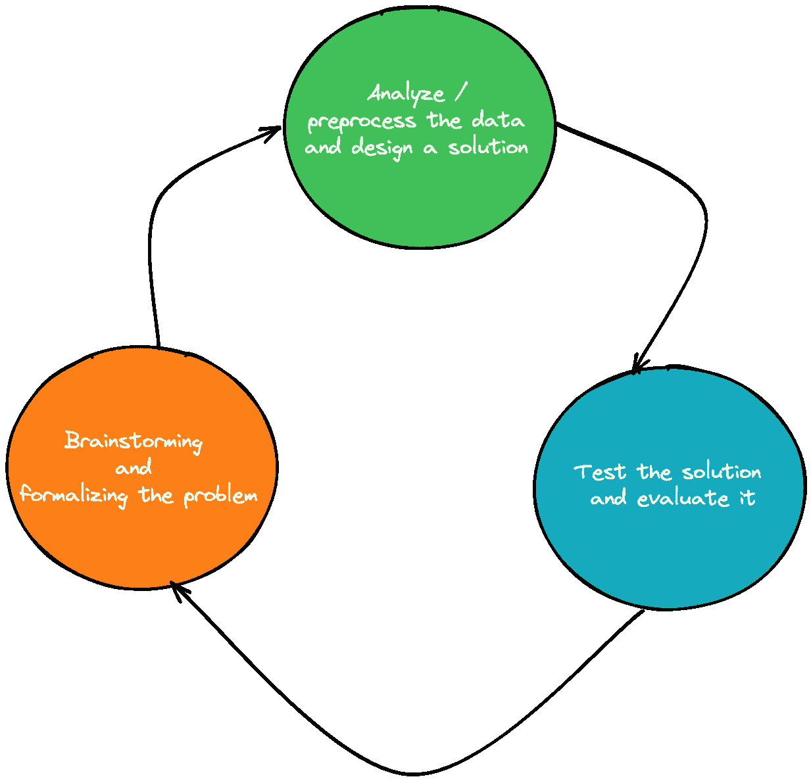
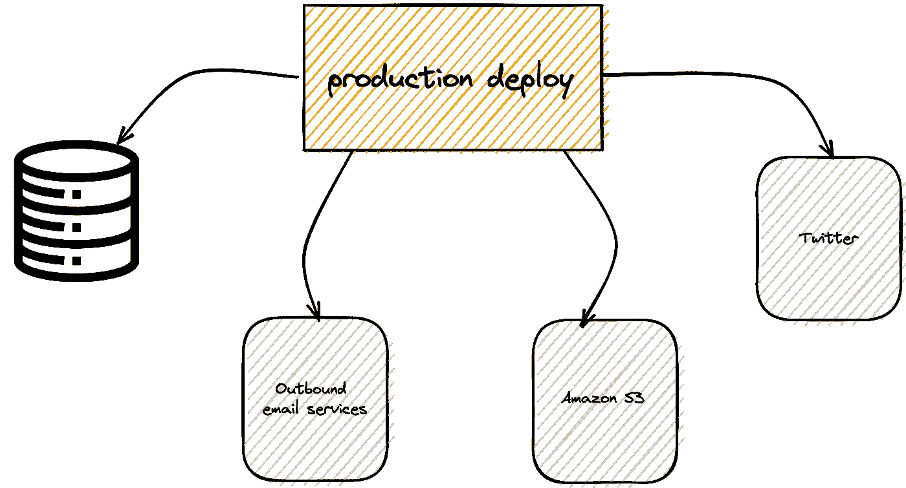

# 部署数据科学项目前要采用的 5 种最佳实践

> 原文：<https://towardsdatascience.com/5-best-practices-to-adopt-before-deploying-data-science-projects-f8061889d294>

## 如何应用 12 因素应用宣言中的一些想法

照片由 [Unsplash](https://unsplash.com?utm_source=medium&utm_medium=referral) 上的 [Dstudio Bcn](https://unsplash.com/@dstudiobcn?utm_source=medium&utm_medium=referral) 拍摄

在最近的[视频](https://youtu.be/zGDerGjNd8U)中，涵盖了 DevOps 推出 SaaS 平台的最佳实践， [ArjanCodes](https://www.youtube.com/channel/UCVhQ2NnY5Rskt6UjCUkJ_DA) 简要讨论了 [12 因素应用](https://12factor.net/)，这是 Heroku 工程团队撰写的关于构建和扩展基于云的应用的宣言。

我对这份文件的内容很感兴趣，所以我立即在谷歌上查找。令人惊讶的是，它引起了我和我作为数据科学家的工作的共鸣。

> ***在这篇文章中，我将首先从软件工程的角度讨论数据科学项目可能会出什么问题。
> 然后，我将向您展示如何将 12 因素应用宣言中陈述的一些原则应用于数据科学，以缓解一些问题。***

如果您是数据科学家或机器学习工程师，这组最佳实践有望帮助您设计更容易投入生产的应用程序。

事不宜迟，我们来看看。

# 首先，为什么这与数据科学家有关？🤔

> ***“为什么我应该关心 web 开发最佳实践？这不是我的工作。我是一名数据科学家”——我听到你说。***

实际情况比这要复杂一些。

如果你是一名在公司工作的数据科学家，你永远不要指望独自工作，摆弄自己的数据集和笔记本，而不与其他团队的任何人互动。
事实是，数据科学应用程序越来越多地嵌入到软件产品中(API、web 应用程序、交互式仪表盘……)，因此，为了将它们投入生产，您(作为一名数据科学家)必须与数据工程师、后端和前端开发人员组成的多学科团队合作。

因此，在为相同的代码库做出贡献的集体努力中，对标准和最佳实践的需求对每个人都变得至关重要，包括数据科学家。

# 是什么让数据科学家不遵循通用软件最好的 practices❓

鉴于他们的背景和他们正在解决的问题的性质，数据科学家有一种非常具体的方式来组织他们的工作，这种方式可能不同于其他开发人员的工作方式。

这是办公室典型的一天。

*   在与业务利益相关者进行讨论和头脑风暴后，数据科学家致力于将问题转化为计算问题。(如果幸运的话，有一个清晰的指标可以优化)
    在这个过程中，他们会提出几个假设，这些假设可以保留，也可以在以后抛弃
*   他们对可用数据进行分析和预处理，并提供算法解决方案来解决问题
*   他们在新数据上应用和测试他们的解决方案，并与团队分享结果。在这一步中，他们调查哪里出错了(例如不正确的预测)，并最终质疑最初的假设。这个过程又回到第一步，形成一个循环(假设审查、分析和模型改进、监测等。)

数据科学循环—作者图片

为了快速迭代这个循环，我们通常使用笔记本，它不过是从浏览器运行的交互式代码单元。

笔记本是将科学计算、降价和可视化结合在一起的有用平台，数据科学家经常用它们来构建复杂的算法。

Jupyter lab —作者修改的 GIF

⚠ **️然而，严重依赖笔记本是一个陷阱，可能会导致非常糟糕的编码实践。**

这一点已经讨论了很多(这里的、这里的和这里的)但简单来说，笔记本可能是有害的，因为:

*   它们不容易被复制，也不鼓励任何形式的依赖管理
*   它们很难版本化和协作
*   它们引入了一些坏习惯，比如将配置与代码混合，硬编码值，不使用单元测试，等等。

简而言之，笔记本电脑非常适合数据探索和快速原型制作。然而，一旦你的数据科学项目足够成熟，可以集成到一个产品中，你就需要把它作为一个软件项目来构建**并遵循一些标准。**

现在让我们来看看 12 因素应用程序中的 5 个最佳实践，它们将帮助您更好地构建项目。

# 1-对每个应用程序使用版本化的代码库💻

您的数据科学应用程序的代码应该始终在代码库中进行版本控制:不要只是将您的文件和笔记本放在一堆文件夹中。

必须使用版本控制系统(如 Git、Mercurial 或 SVN)来跟踪这个存储库。

将代码存储在版本控制系统中使团队能够协作，解决合并冲突，将代码回滚到以前的版本，并添加持续集成(CI)和持续部署(CD)。

从单个代码库中，我们可以构建不同版本的不同发布，并将它们部署在不同的环境中(*部署是应用程序*的运行 *实例)。*

当您开始对代码进行版本控制时，会出现两种常见的反模式:

*   多个应用程序不能有相同的代码库。如果存在多个应用程序，每个应用程序都必须有自己的代码库。
*   每个应用程序只能有一个代码库。如果多个应用程序共享相同的代码库，这就违反了 12 因素。在这种情况下，应该在库中重构相互代码，并将其用作外部依赖项

# 2-明确声明项目需求并隔离依赖关系🛠️

当构建一个应用程序时，你永远不应该做出隐含的假设，即它的需求之一已经安装在将运行该应用程序的操作系统上:**如果你的应用程序使用外部依赖项，你必须显式地声明它们，并将它们添加到你的代码库中。**

这使得第一次运行该应用程序的任何人都可以使用正确的版本安装适当的依赖项。

如果使用 Python，依赖关系可以在`requirements.txt`文件中锁定和跟踪，该文件必须在代码库中进行版本控制。然后，可以使用 Pip 安装它们。其他工具可用，如[诗歌](https://pypi.org/project/poetry/)和 [Pipenv](https://pypi.org/project/pipenv/) 。

requirements.txt 示例—作者图片

你的应用程序也应该在一个可复制的环境中被打包和隔离。这可以通过使用虚拟环境或容器化的 Docker 映像来实现。

# 3-将配置与代码分开🔒

现代云应用程序有许多配置设置(API 凭据、URL、数据库名称、端口号等)，这些设置可能会根据应用程序部署的环境(开发、试运行或生产)而变化。

出于隐私原因，这些配置设置应该与代码分开，并且永远不要签入版本控制。

解决这个问题的一种方法是使用配置文件，但更好的替代方法是在部署期间将配置设置作为环境变量注入。通过这样做，部署环境就决定了应该使用哪种配置。

此外，这种方法更加灵活，因为它允许轻松修改环境变量的值，并且不依赖于从外部文件解析设置的特定语言。

一个可用于存储凭证的第三方基于云的工具是 [AWS Secrets Manager。](https://aws.amazon.com/fr/secrets-manager/)

# 4 —应用应该平稳地依赖第三方服务📦

这个原则的主要思想是你的应用程序不应该区分本地和第三方服务。

这意味着您应该能够切换您的应用程序正在使用的任何第三方服务(数据库、SMTP 服务器、文件系统、消息传递/排队系统、缓存系统)，而无需更改应用程序的核心代码。

实现这一点的方法是只更改配置设置。

这样做的一个好处是，它使维护您的云应用程序变得更加容易，并减少了供应商锁定。例如，如果您希望通过从一个云提供商转移到另一个云提供商来更改存储服务，您只需移除旧资源并插入新资源。

这是在配置级别完成的，因为后台服务与代码是分离的。

后台服务—作者图片

# 5 —构建、发布、运行⚙️

例如，当您构建一个打包到 Python 库中的数据科学应用程序时，项目的部署过程应该有三个独立的阶段:构建、**发布、**和**运行**。

每一个阶段都会产生一个独一无二的藏物。

1.  构建阶段获取回购的代码，获取所需的库和资产，并将它们打包成一个可执行包，称为 ***构建***
2.  发布阶段结合构建工件，并将其与环境的配置相结合，以产生一个 ***发布***
3.  运行阶段在执行环境中启动发布

# 参考

*   十二因素 App[https://12factor.net/](https://12factor.net/)
*   Peter Hoffmann —使用 Python 的数据科学 12 要素应用—SPs 18:[https://youtu.be/TuO_W-tzlqs](https://youtu.be/TuO_W-tzlqs)
*   [https://medium . com/inspiredbrilliance/12-factor-spark-applications-eccb 78 BDC 371](https://medium.com/inspiredbrilliance/12-factor-spark-applications-eccb78bdc371)

# 结论

构建一个机器学习应用程序是一项集体努力，它结合了来自大量软件工程的多个概要文件。

虽然这些世界差异很大，相距甚远，但是存在一组将它们联合在一起的最佳实践。这些原则的流行列表被称为 12 因素应用程序。

虽然这篇文章只涵盖了 12 个中的 5 个，你仍然可以看看剩下的[个](https://12factor.net/)并了解更多。

我希望这篇文章让您对这些最佳实践有了一个大致的了解。

感谢阅读！

# 新到中？您可以每月订阅 5 美元，并解锁各种主题的无限文章(技术、设计、创业……)您可以通过点击我的推荐链接[来支持我](https://ahmedbesbes.medium.com/membership)

  

由[丽贝卡·约翰逊](https://unsplash.com/@rebeccajohnssn?utm_source=medium&utm_medium=referral)在 [Unsplash](https://unsplash.com?utm_source=medium&utm_medium=referral) 上拍摄的照片