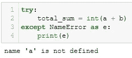

# 显著提高代码质量的 5 个最佳 Python 实践

> 原文：<https://towardsdatascience.com/5-best-python-practices-to-remarkably-improve-code-quality-30f528162a5e>

## 计算机编程语言

## 为了成为一名优秀的程序员，从初级阶段开始使用这些实践


[cotton bro 拍摄的照片](https://www.pexels.com/photo/the-power-text-sign-on-a-wall-7671464/)

**从最佳实践开始学习 Python 吧！**

当我开始使用 Python 时，情况有所不同。像我一样，许多其他人在初级阶段不知不觉中发现了一些糟糕的编码实践。

这些做法可能会让你的工作完成，但从长远来看，它会失败，然后它会变得非常复杂，找到并纠正错误。

从错误和经验中学习，我列出了 5 个最佳实践*和要避免的坏实践**😉***

*我把这篇文章写得很短，这样您就可以快速地完成它，并掌握最有用、最省时的 Python 最佳实践。🏆*

*可以用下面的索引跳转到自己喜欢的部分。*

```
***·** [**Stop importing all using import ***](#adfd) **·** [**Specify the exception in the Try-Except**](#228b) **·** [**Use Dictionary methods**](#1331) **·** [**Use zip() to iterate over multiple lists**](#7eda) **·** [**Open a file using “with”**](#29b4)*
```

*我们开始吧..🚀*

# *停止使用 import *导入所有内容*

*为了开始使用 Python 进行各种分析和自动化任务，我们需要从 Python 包中导入函数和类。*

*初学者遵循的一个最常见的做法是使用`**import ***` **从包中导入所有内容。***

*🚩`**import ***`语句导入所有可能与您定义的函数或您导入的其他库的函数冲突的函数和类。所以总会有函数覆盖或者变量覆盖的风险。*

*🚩另外，当您使用`**import ***`时，很难识别从哪个特定的库中导入了什么，从而降低了代码的可读性。*

*因此，一个好的做法是只从一个包中导入所需的方法/函数，比如`**import function_name from package_name**`。✔️*

*例如，从集合库中导入函数计数器*

```
*from collections import Counter*
```

*如果你仍然想从一个包中导入所有的功能，你可以不说`import *`就这么做。这种用例的一个经典例子是从 pandas 导入所有内容进行数据分析。*

*❌不好练:`from pandas import *`*

*✔️ ️Good 练习:`import pandas as pd`*

*然后你就可以使用 pandas 包中带有前缀`pd.`的所有功能，例如`pd.DataFrame()`*

# *在 Try-Except 中指定异常*

*就像每个初学者一样，我曾经有一个坏习惯，就是在 *try-except* 语句的 *except* 子句中不提 exception。*

*例如，在 except 子句中没有提到任何异常并不能让我们了解 except 子句执行时到底发生了什么。*

**

*除了作者|图片，没有例外*

*理想情况下，在`a`或`b`中应该有一些错误，但是在 except 子句中没有提到异常让我们不知道发生了什么。*

*此外，如果不提及异常，我们就无法捕获代码中的特定错误，因此对代码流的控制也很弱。*

*这可以通过提及下面的例外来转化为良好实践。*

**

*except 子句中的异常|作者提供的图像*

*处理`except`条款中的`NameError`给了我们不执行`try`条款的确切原因。✔️*

*你可以在这里找到 Python [***中的所有异常***](https://docs.python.org/3/library/exceptions.html)*以及关于如何使用 try 的细节——除了可以在这里找到[](https://www.freecodecamp.org/news/python-try-and-except-statements-how-to-handle-exceptions-in-python/)*。***

# ***使用字典方法***

***你可能知道字典方法 ***。按键()******。值()*** 和 ***。items()*** 分别只访问键、值和键-值对。***

**如果你不知道，这里有一个简单的例子。**

```
**# Create a dictionary with,
# keys 'A', 'B', 'C', 'D'
# values 1001, 2002, 3003, 4004 respectively
mydict = {'A': 1001,
          'B': 2002,
          'C': 3003,
          'D': 4004}**
```

****

**从 Python 字典中提取键、值和键值对|按作者排序的图片**

**如上图所示，***key-value***对作为元组，可以用`.items()`提取。**

**但是，有时使用不正确。例如，为了使用 for 循环显示字典中的键和值，一些编码人员编写，**

****

**mydict.keys() |作者图片**

**在上面的场景中，for 循环中的`mydict.keys()`是不必要的，print 语句中的`mydict[keys]`效率较低。🚩**

**相反，我们可以使用更有效的`mydict.items()`，如下所示。**

****

**mydict.items() |作者图片**

**这样，我们总能从`.items()`方法生成的键值元组中解包出键和值。✔️**

**如果你愿意学习更多关于 Python 中的字典，这里有一个快速阅读。**

**[](https://pub.towardsai.net/python-dictionary-10-practical-methods-you-need-to-know-cbeb1c962bed) [## Python 字典:你需要知道的 10 个实用方法

### ..学习如何在 5 分钟内掌握 Python 字典！

pub.towardsai.net](https://pub.towardsai.net/python-dictionary-10-practical-methods-you-need-to-know-cbeb1c962bed) 

# 使用 zip()遍历多个列表

我在初学者时注意到甚至遵循的一个常见的坏习惯是使用一个索引来迭代多个可迭代对象，比如列表、字典。

❌糟糕的做法看起来像，


遍历列表|按作者排序的图像

看，这并不是完全错误的，因为它产生了我们想要的输出。但是，这不是有效的好做法。

相反，使用可读性更强的`**zip()**`函数。根据定义，python 中的`zip()`函数用于将来自多个可迭代对象的元素按元素聚合到一个可迭代的元组中。✔️

`zip()`函数的这个属性可以在 for 循环中使用，在 Python 中迭代多个 iterables(列表或字典)。


并行遍历多个列表|按作者排序的图片

很简单！

# 使用“with”打开文件

*打开的文件必须在工作完成后立即关闭* —这是最佳实践。

我和其他数百万人一样，使用打开、关闭、读取、写入来处理如下文件，

```
f = open('new_file.txt', 'w')
f.write('This is first line')
f.close()
```

这个的问题是，最后一行`**f.close()**`大部分都忘记了！🚩

然后如果`write/read`方法抛出异常，文件不会被关闭。

这里最好的选择是使用`**with**`打开并编辑文件，如下所示。

```
with open('new_file.txt', 'w') as f:
    f.write('This is first line')
```

这样就不需要独占关闭文件了。一旦你在`with`语句缩进之外写了新的一行代码，文件会自动关闭。✔️** 

**希望你很快看完这篇文章，觉得有用。**

**当这些最佳实践被采用时，它可以节省大量的时间来调试和理解代码。💯**

**过去 4 年多以来，我一直在使用 Python，并且仍在学习一些好的实践来提高我的代码质量。💪**

> ***对阅读介质上的无限故事感兴趣？？***

**💡考虑 [**成为媒体会员**](https://medium.com/@17.rsuraj/membership)**访问媒体上无限的**故事和每日有趣的媒体文摘。我会得到你的费用的一小部分，没有额外的费用给你。**

**💡不要忘记注册我的电子邮件列表 来接收我文章的第一份拷贝。**

****感谢您的阅读！****