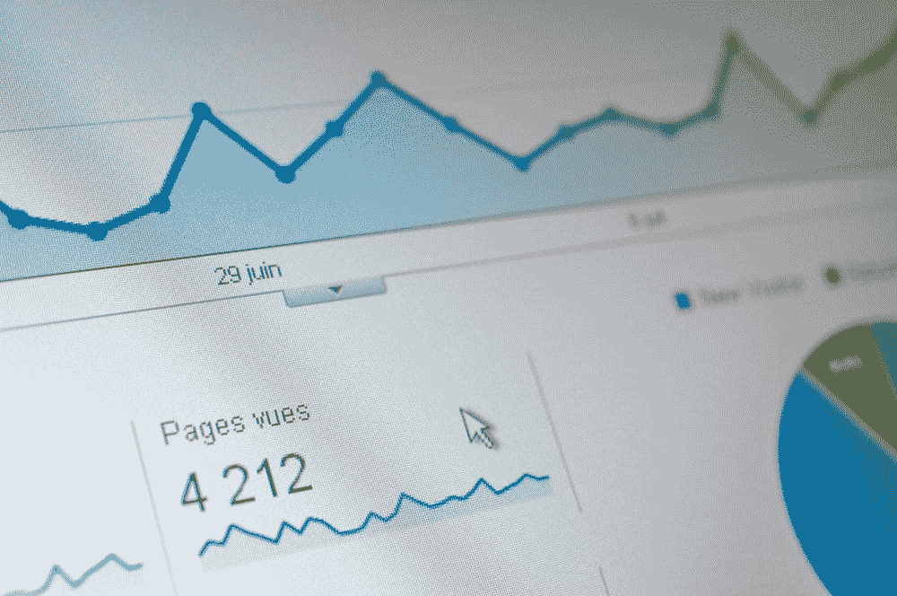

# 让非技术用户更好地理解人工智能的 5 本书

> 原文：<https://towardsdatascience.com/5-books-to-understand-ai-for-non-technical-users-6d138f095d1c>

## 一系列解释复杂概念的资源，不考虑读者的技术背景

photo by[@ owned photography](https://unsplash.com/@possessedphotography)@ unsplash . com

*【免责声明:此帖子包含图书保管处的附属链接】*

随着时间的推移，人工智能和数据科学越来越与社会相关。算法仅用于营销或销售目的的日子已经一去不复返了；今天，人工智能正在改变我们互动、通勤甚至驾驶的方式。

对于非技术人员来说，要理解大部分 AI 技术可能有点力不从心。通常，当有人谈到人工智能时，他们往往会用很多技术术语或令人困惑的行话来说话，这使得人们很难理解算法在当今生活中的影响。幸运的是，随着人工智能书籍的激增，有一些资源面向非技术用户，旨在用较低的技术层简单地解释这些概念。

在这篇文章中，我们将看到一些与非技术用户相关的书籍，以了解人工智能在当今世界的影响，以及他们可以从哪里了解该领域的发展方向。

开始吧！

## 商业数据科学:关于数据挖掘和数据分析思维，你需要知道什么

照片由 [@sortino](https://unsplash.com/@sortino) @Unsplash.com 拍摄

Provost & Fawcett 的书是对人工智能和数据科学技术的精彩介绍，是进入该行业的一个很好的方式。这本书提供了一些非技术用户在接触数据科学和人工智能时可能遇到的常见问题的答案:

*   培养一个“模特”是什么意思？
*   人工智能与数据工程和可视化有什么关系？
*   我们可以对哪些最常见的用例应用预测建模？
*   什么是文本挖掘？

这本书是一本非常好的入门书，包含了恰到好处的技术细节。如果您正在寻找一种轻量级的数据科学方法，这将是一个很好的选择！

在[书库](https://tidd.ly/3wTfc8v)找到。

## 人工智能基础:非技术性介绍—汤姆·陶利

图片由 [blocks](https://unsplash.com/@blocks) @Unsplash.com 提供

一本很好的入门书，详细介绍了人工智能和数据科学的不同分支，如自然语言处理、计算机视觉或机器人过程自动化。

通过巧妙的图表和易于理解的语言，这本书是对该领域的一个很好的快速介绍，有助于理解当前人工智能趋势的最新水平。

如果你已经对 AI 和通用数据科学有了一些接触和了解，这本书对你来说可能有点基础。然而，尽管很短，它包含了有趣的想法，特别是如果你刚刚开始学习像*大数据*、*神经网络、*或*深度学习*这样的术语。

你可以在[书库](https://tidd.ly/3cXYIoP)上找到。

## 数学毁灭武器:大数据如何增加不平等并威胁民主——凯西·奥尼尔

Markus Spiske @Unsplash.com 照片

当涉及到伦理和道德时，在社会的几个领域部署算法的扩散带来了很大的担忧。人工智能模型可能对公平公正的社会极其有害，因为它们可能会强化一些已经存在于模型数据中的偏见。

凯茜·奥尼尔的书非常简明扼要地讲述了将人工智能模型盲目应用于我们社会各个方面的危险。如果你刚刚开始了解人工智能在我们日常生活中的影响，这本书将为你提供一个深思熟虑的视角，说明应该如何部署机器学习模型，以及为什么你需要小心某些人工智能“神奇”的解决方案。

与大多数技术突破一样，人工智能有能力应用于大多数用例——其中一些可能会让社会变得极其富有成效，而另一些可能会带来极其有害的警告。这本书可能是详细而准确地解决这个问题的最佳资源之一。

你可以在[书库](https://tidd.ly/3D6RARM)上找到。

## 商业中的人工智能和机器学习:数据驱动技术的实用指南

photo by[@ donramxn](https://unsplash.com/@donramxn)@ unsplash . com

另一本关于人工智能和机器学习的非技术指南，史蒂夫·芬利的书是一个很好的介绍，几乎没有技术术语，并以非技术的方式接近人工智能。

虽然与 Provost & Fawcett 的书相比，这本书没有那么深刻，也不那么以商业为导向，但它将通过几个深思熟虑的章节对其进行很好的补充，这些章节针对的是你在其他资源中可能看不到的重要问题，例如:

*   *预测模型生成的分数代表什么？*
*   *什么是决策树？*
*   *什么时候能买到自动驾驶汽车？*

这本书将有助于你对过去十年的机器学习有一个很好的非技术性的概述，使用一种深思熟虑的和半时间顺序的方法。

你可以在[书库](https://tidd.ly/3qmXG8P)上找到。

## 如何对统计数据撒谎——达雷尔·赫夫

图片由[@ follow EB](https://unsplash.com/@olloweb)@ unsplash . com 提供

这是这个列表中最古老的书，在人类开始概念化现代“人工智能”领域之前就已经编辑好了！大多数人工智能算法依赖于统计数据——至少，数据科学家的主要目标是以一种可以推广到其他场景的方式对现实生活现象进行建模，而统计数据是我们目前在这方面的最佳猜测。

达雷尔·赫夫的书是一个开箱即用的建议，它总结了从业者在使用统计数据时可以使用的最常见的技术。虽然与人工智能不完全相关，但它是一个很好的资源，可以帮助你理解为什么人们可以用算法、汇总统计数据或情节来愚弄你。

这是一个很好的阅读，可以理解即使是最伟大的人工智能模型也可能会有极大的偏差和扭曲，以使它们看起来非常准确。虽然主要集中在图和汇总统计，但这本书的原则也适用于数据科学或机器学习项目，因为使用虚假统计愚弄他人的原则在一些项目中反复出现。

在[书库](https://tidd.ly/3cXRcKu)上找到。

感谢你花时间阅读这篇文章！

如果你是非技术读者(比如产品或项目经理，市场人员，或者只是一个好奇的人！)，希望这些资源能帮助你更好地理解 AI 一点。特别是当涉及到机器学习模型的非道德部署时，非技术用户能够理解人工智能模型如何工作以及它们如何在输入数据和预测之间建立关系是非常重要的。

当社会处于非技术人员能够理解不准确或有偏见的数据上的训练模型背后的含义的阶段时，我们将真正能够受益于更准确、公平和可靠的人工智能系统——我真的相信这些资源在为那个阶段做出贡献方面做得很好。

有其他推荐补充吗？写在评论里吧！

 [## 通过我的推荐链接加入 Medium-Ivo Bernardo

### 阅读我在 Medium 上的所有故事，了解更多关于数据科学和分析的信息。加入中级会员，您将…

medium.com](https://medium.com/membership/@ivopbernardo)