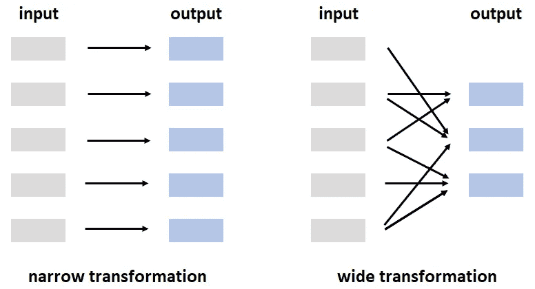

# 理解 Spark 大数据处理的 5 个基本概念

> 原文：<https://towardsdatascience.com/5-fundamental-concepts-to-understand-big-data-processing-with-spark-f2a6aadb1093>

## #5.懒惰评估


SpaceX 在 [Unsplash](https://unsplash.com/s/photos/spark?utm_source=unsplash&utm_medium=referral&utm_content=creditCopyText) 上拍摄的

你们中的许多人可能都经历过计算机在某些任务上表现不佳。它要么不能完成任务，要么永远无法完成。

数据处理，尤其是处理大型数据集时，就是这些任务之一。您的计算机可能没有足够的能力或资源来进行大规模数据处理。

一种解决方案是通过形成集群(即一组计算机)来组合来自许多计算机的资源。即使您有许多计算机，您也需要一种有组织的方式将任务分成小部分，并在计算机之间分配。这就是 Spark 所做的。

Spark 是一个框架，它管理和协调跨计算机集群的任务执行。它让您可以分散数据和计算，从而实现显著的性能提升。

Spark 的默认语言是 Scala，但是我们可以通过数据科学生态系统中流行的编程语言来使用 Spark。

例如，PySpark 是一个 Python 库，允许使用 Python 语法运行 Spark 代码。Spark 还通过 SparkR 和 sparklyr 库支持 R。

在本文中，我们将回顾 5 个概念，它们是理解 Spark 大数据处理的基础。当您开始使用 Spark 进行大规模数据处理时，它们也会很有帮助。

> 如果你想在我发表新文章时收到电子邮件，别忘了订阅。

# 1.火花应用

Spark 应用程序由一个驱动程序进程和一组执行器进程组成。这些进程由集群管理器管理。

用户通过驱动程序进程与 Spark 应用程序进行交互。它接受用户输入，并在执行者之间分配工作。假设我们编写一个程序来计算超市产品的平均周销售额。我们不把任务分成块，分别分配给执行者。驱动程序处理在执行器之间分配和调度任务。

驱动程序进程还通过维护相关信息来跟踪 Spark 应用程序。

执行者完成司机交给他们的任务。它们还通知驱动程序计算的状态。

# 2.火花会议

火花应用通过一个叫做 *SparkSession* 的驱动程序来控制。因此，编写 Spark 代码的第一步是实例化一个 *SparkSession* 。

例如，下面的 PySpark 代码创建一个 *SparkSession* ，然后通过这个会话读取一个 parquet 文件。

```
from pyspark.sql import SparkSessionspark = SparkSession.builder.getOrCreate()df = spark.read.parquet("myfile.parquet")
```

# 3.数据帧和分区

*DataFrame* 基本上就是一个有行有列的表格。定义列及其数据类型的列表称为*模式*。

Spark *数据帧*与熊猫或 R 数据帧非常相似，但有一个显著区别。在 Pandas 和 R 中，数据帧存储在一台机器或计算机上(有一些例外)，而 Spark 数据帧分布在许多计算机上。

Spark 将数据分成更小的块，称为*分区*。分区允许每个执行器并行工作，从而极大地提高了性能。

每个*分区*包含原始*数据帧中的一组行。*将数据划分为分区的原因是数据太大，无法在单台机器上运行，或者在单个分区上进行计算需要太多时间。

# 4.转换和操作

火花操作可分为两大类，即*转换*和*动作*。

修改数据帧的指令称为*转换*。例如，根据列中的值过滤数据帧就是一种转换。另一个例子是根据列中的不同值对行进行分组。

两种类型的变换是*窄变换*和*宽变换*。在窄转换中，每个输入分区只贡献给一个输出分区。过滤是窄变换的一个例子。一个分区中的值对其他分区没有任何影响。

宽转换包含宽依赖关系，这意味着一个输入分区可能对几个输出分区有贡献。对行进行分组(即 groupBy 操作)是广泛转换的一个例子。一个组可能包括来自许多不同输入分区的数据点(即行)。



(图片由作者提供)

当我们向 Spark 发出转换指令时，它不会立即转换数据。即使我们给出了一系列转换指令，它们也成为了转换计划的一部分。

当我们运行一个动作时，转换被执行或计算。动作告诉 Spark 通过执行转换来计算结果。`Count`、`collect`和`aggregate`是火花动作的一些例子。在控制台中显示数据也是一个操作。

让我们看一个例子来更清楚地解释这些术语。假设我们有一个数据框架，其中包含一家连锁超市的产品日销售量。我们需要找到蔬菜类产品的平均月销售额。

*   过滤属于蔬菜类别的产品(窄转换)
*   按月列对行进行分组(宽转换)
*   计算平均值(动作)

# 5.懒惰评估

我们刚刚提到，Spark 跟踪转换，直到一个动作被执行。Spark 不是立即修改或转换数据，而是根据给定的转换指令制定转换计划。这个过程叫做*懒评*。

当我第一次开始使用 Spark 时，我不知道懒惰评估。我被 Spark 执行数据转换的速度震惊了。然而，它实际上并没有进行转换，而是将它们保存起来以备后用。当我调用一个 action 操作时，所有的转换都被执行了，这需要相当长的时间。

惰性评估允许 Spark 优化整个操作集，这是一个很大的好处。考虑这样一种情况，我们进行了一系列转换，作为最后过滤操作的结果，只有一小部分数据受到影响。

由于惰性评估，Spark 可以通过只转换受影响的行来完成工作。否则，将完成所有转换，然后过滤受影响的行。

数据技术的进步使得收集、传输和存储数据比以往任何时候都更容易。面向数据的应用程序和产品是用非常大量的数据创建的。因此，Spark 等用于大规模数据处理的工具开始成为数据科学中的必要工具。

我们已经介绍了 5 个基本概念，可以帮助您开始学习 Spark。如果你是或者想成为一名数据科学家，我强烈建议你熟悉一下 Spark。

*别忘了* [*订阅*](https://sonery.medium.com/subscribe) *如果你想在我发表新文章时收到电子邮件。*

*你可以成为* [*媒介会员*](https://sonery.medium.com/membership) *解锁我的全部写作权限，外加其余媒介。如果您使用以下链接，我将收取您的一部分会员费，无需您支付额外费用。*

[](https://sonery.medium.com/membership) [## 通过我的推荐链接加入 Medium-Soner yl DRM

### 作为一个媒体会员，你的会员费的一部分会给你阅读的作家，你可以完全接触到每一个故事…

sonery.medium.com](https://sonery.medium.com/membership) 

感谢您的阅读。如果您有任何反馈，请告诉我。