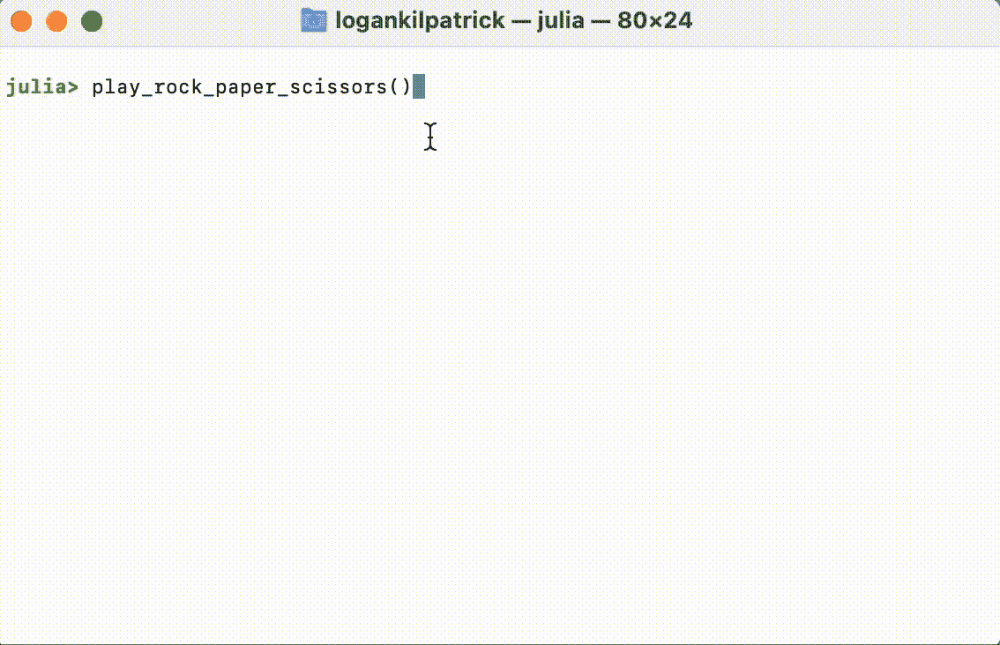

# 面向初学者的 5 个 Julia 项目——用 Julia 开始编码的简单方法

> 原文：<https://towardsdatascience.com/5-julia-projects-for-beginners-easy-ideas-to-get-started-coding-in-julia-938b823a0a08>


作者图片

Julia 被用于许多真正有影响力和有趣的挑战，如机器学习和数据科学。但是在你接触复杂的东西之前，有必要探索一下基础知识，为你打下坚实的基础。在本教程中，我们将通过构建 5 个小型的 Julia 项目来复习 Julia 的一些基础知识:

*   疯狂的 Libs ✍️
*   猜数字游戏💯
*   电脑号码猜测器🤖
*   岩石🗿，纸张📃、剪刀✂️
*   密码生成器🎫

如果你还没有下载 Julia，请前往 https://julialang.org/downloads/[或观看此视频:](https://julialang.org/downloads/)

编辑:我和我的合著者很高兴地告诉大家，我们的新书《朱莉娅速成班》已经开始预售了

[](https://logankilpatrick.gumroad.com/l/juliacrashcourse) [## 朱莉娅速成班(电子书预购)

### Julia 速成课程是使用 Julia 编程语言的实践指南，是为初学者编写的。我们接受…

logankilpatrick.gumroad.com](https://logankilpatrick.gumroad.com/l/juliacrashcourse) 

# 疯狂的 Libs ✍️

在 Mad Libs 中，用户被提示输入不同类型的单词。然后，用户输入的随机单词被插入到一个句子中。这导致了一些非常古怪和有趣的结果。让我们尝试使用 Julia 编写一个简单版本的程序。

在这个问题的核心，我们想要连接(或加在一起)多个字符串，以便我们从带有一些占位符的句子到带有用户输入的句子。在 Julia 中实现这一点的最简单方法是字符串插值:

```
**julia>** name = "Logan""Logan"**julia>** new_string = "Hello, my name is $name""Hello, my name is Logan"
```

这里我们可以看到，我们定义的 name 变量可以通过使用`$name`语法插入到字符串中。

有很多其他方法可以做到这一点，比如使用`string`函数:

```
**julia>** new_string = string("Hello, my name is ", name)"Hello, my name is Logan"
```

但是在这种情况下，字符串插值似乎是最直接、最易读的。

既然我们知道如何设置字符串，我们现在需要提示用户输入。为此，我们可以如下使用`readline`功能:

```
**julia>** my_name = readline()Logan"Logan"
```

`readline`函数接受用户的单行输入，这正是我们想要使用的。让我们将所有这些放在一个简单的例子中:

在这个例子中，我们接触到了处理字符串、定义函数、打印语句等等！如前所述，有很多其他的方法来做我们上面做的事情，如果你想了解更多关于使用字符串的内容，请查阅茱莉亚文档:[https://docs.julialang.org/en/v1/manual/strings/](https://docs.julialang.org/en/v1/manual/strings/)

# 猜数字游戏💯

在这个游戏中，我们将不得不产生一个随机数，然后猜猜它是什么。首先，我们需要生成一个随机数。像往常一样，有许多方法可以做到这一点，但最直接的方法是:

```
**julia>** rand(1:10)4
```

`rand`函数将您想要使用的数字范围作为您将生成的数字的界限。在这种情况下，我们将范围设置为包含这两个数字的`1-10`。

为了让这个例子正常工作，我们需要讨论的另一个新主题是 while 循环。while 循环的基本结构是:

```
while some_condition is true
   do something
end
```

该循环将继续迭代，直到不再满足 while 循环的条件。您将很快看到我们如何使用它来不断提示用户输入一个数字，直到他们猜对为止。

最后，为了让我们简单一点，我们将添加一个 if 语句，告诉我们是否猜测到一个接近目标数字的数字。Julia 中 if 语句的结构是:

```
if some_condition is true
   do something
end
```

最大的区别是 if 语句只检查一次，然后就完成了。除非 if 语句在循环中，否则不会重新检查初始条件。

现在我们已经有了基本的概念，让我们看看构建数字猜测器的实际代码。在检查下面的解决方案之前，我恳求你自己尝试一下。编码快乐！🎉

# 电脑号码猜测器🤖

既然我们已经看到了让我们尝试并猜测计算机随机生成的东西是什么样子，那么让我们看看计算机是否能比我们做得更好。在这个游戏中，我们将选择一个数字，然后看看计算机需要多长时间来猜测这个数字。为此，我们将引入一些新概念，如随机模块和 for 循环。

让我们从思考如何让计算机不重复地猜测随机数开始。一个简单的解决方案是使用`rand`函数，但问题是没有内置的方法来确保计算机不会多次猜测同一个数字，因为它毕竟是随机的！

我们可以通过结合`collect`功能和`shuffle`功能来解决这个问题。我们首先定义一个随机种子:

```
**julia>** rng = MersenneTwister(1234);
```

随机种子使得随机数生成器产生可重复的结果。接下来，我们需要定义所有可能的猜测:

```
**julia>** a = collect(1:50)
50-element Vector{Int64}:123⋮
```

我们现在需要使用`shuffle`函数使猜测变得随机:

```
**julia>** using Random
**julia>** shuffle(rng, a)50-element Vector{Int64}:41231349⋮
```

现在我们有了随机猜测设置，是时候一次一个地循环它们，看看这个数字是否等于用户输入的目标。同样，在查看以下解决方案之前，请尝试一下:

# 岩石🗿，纸张📃、剪刀✂️

如果你从未玩过石头、剪子、布，那你就错过了！基本要点是你试图用石头、布或剪刀击败你的对手。在这个游戏中，石头打败剪刀，剪刀打败布，布打败石头。如果两个人做同一个，你再来一次。

在这个例子中，我们将对着电脑玩石头、布、剪刀。我们还将使用`sleep`函数引入一个短暂的延迟，就好像有人在大声朗读单词一样(如果你亲自演奏，你就会这么做)。

sleep 函数接收一个数字，代表你想睡多久(以秒为单位)。我们可以用这个函数或循环来减慢速度，就像你在这个游戏中看到的那样。

```
sleep(1) # Sleep for 1 second
```

让我们也探索一下我在编写本教程时发现的一个函数，`Base.prompt` ，它帮助我们做我们之前使用`readline`所做的事情。然而，在这种情况下，`prompt` auto 在行尾附加了一个`:`，这样我们就可以避免打印和用户输入各占两行:

```
human_move = Base.prompt("Please enter 🗿, 📃, or ✂️")
```

我们还需要使用一个`elseif`来使这个示例游戏工作。为了完整起见，我们可以将`if`、`elseif`和`else`链接在一起。尝试将 if 条件、提示和休眠放在一起以获得期望的行为，然后查看下面的代码:



作者拍摄的视频

# 密码生成器🎫

**警告:请勿使用此代码生成真实密码！**

在这个数据泄露层出不穷、每个网站都使用同一个密码的时代，拥有一个安全的密码非常重要。在本例中，我们将生成任意数量的长度可变的密码。鉴于这可能需要很长时间，我们还将添加一个外部包 progress bars . JL:[https://github.com/cloud-oak/ProgressBars.jl](https://github.com/cloud-oak/ProgressBars.jl)来直观地显示我们的 for 循环的进度。如果您以前从未添加过外部包，可以考虑看看这个强大的教程:

[](https://logankilpatrick.medium.com/the-most-underrated-feature-of-the-julia-programming-language-the-package-manager-652065f45a3a) [## Julia 编程语言最被低估的特性👀，包管理器📦

### 在其他语言达不到的地方，Julia 的包管理器提供了健壮的特性和直观的语法。

logankilpatrick.medium.com](https://logankilpatrick.medium.com/the-most-underrated-feature-of-the-julia-programming-language-the-package-manager-652065f45a3a) 

要添加 Julia 包，请打开 REPL 并键入`]`，然后键入`add ProgressBars`。之后，正如我们对 Random 模块所做的那样(注意我们不需要添加它，因为它是基本 Julia 的一部分)，我们可以说`using ProgressBars`来加载它。

我们将在这里介绍的主要新概念是向量/数组。在 Julia 中，我们可以将任何类型放入数组。要创建空数组，我们需要:

```
password_holder = []
```

然后添加一些东西，我们使用`push!`函数，你将在下面的例子中看到。如前所述，我们将使用 ProgressBars 包在屏幕上显示进度。请注意，Julia 的速度非常快，它可能不会显示加载屏幕，除非您手动调用睡眠功能或输入大量密码来减慢速度。查看自述文件，了解在实践中使用它的示例。与另一个示例一样，在分析下面的示例之前，尝试将一些代码放在一起:

# 包扎🎁

我希望你和我一样，在工作和阅读这些项目时获得了很多乐趣。如果你想制作你自己版本的这篇文章，制作一些小的 Julia 项目并与世界分享，请这样做，并在这里打开一个 PR:[https://github . com/logankilpatrick/10-Julia-Projects-for-初学者](https://github.com/logankilpatrick/10-Julia-Projects-for-Beginners)我可以很容易地改变回购名称，以适应小项目的涌入。

我还会注意到，像这样的练习也是潜在地为朱莉娅做贡献的一个很好的方式。在我写这篇文章的时候，我为茱莉亚开了两个公关，我认为这将有助于改善开发者的体验:[https://github.com/JuliaLang/julia/pull/43635](https://github.com/JuliaLang/julia/pull/43635)和[https://github.com/JuliaLang/julia/pull/43640](https://github.com/JuliaLang/julia/pull/43640)。

如果你喜欢这个教程，让我们在推特上联系:[https://twitter.com/OfficialLoganK](https://twitter.com/OfficialLoganK)