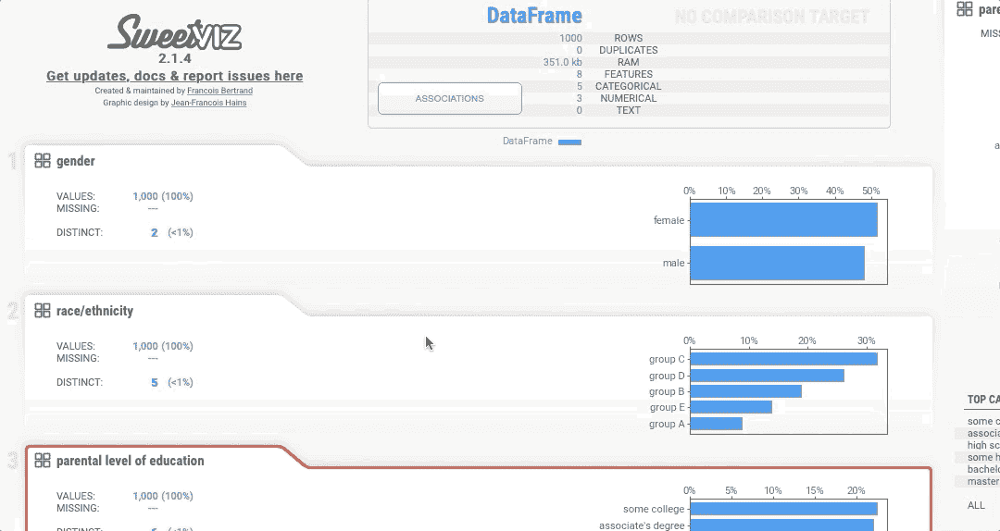

# 5 个鲜为人知的 Python 库可以帮助您的下一个数据科学项目

> 原文：<https://towardsdatascience.com/5-less-known-python-libraries-that-can-help-in-your-next-data-science-project-5970a81b32de>

## 使用这些库减少数据科学工作流程中的时间。


图片来自 Shutterstock，授权给 Frank Andrade

Python 有数百个库，让我们不用从头开始写代码。

有一些众所周知的数据科学库，如 pandas 和 numpy，我们离不开它们，但也有一些不太知名的库可以在您从事某个项目时助您一臂之力。

在本文中，我将向您展示一些您可能从未听说过的 Python 库，但它们可以帮助您加速数据分析、轻松创建报告、生成假数据等等。

## 1.米托:在几秒钟内完成数据分析

米托是一个 Python 库，允许我们在几秒钟内完成数据分析。有了米托，我们不需要记住 Pandas 的所有方法和函数，但是我们可以像处理 Excel 电子表格一样处理数据帧。

最好的部分是这个 Python 库为我们生成代码，所以我们甚至可以看到正在使用什么方法和函数。

假设我们有一个数据框架，我们想插入一个新列并更改它的名称。对于熊猫，我们会使用`.insert`和`.rename`方法，但是对于米托，这就像点击几下鼠标一样简单。


作者图片

记住，要使用米托，我们需要安装 Python 和 Jupyter Notebook 或 Jupyter Lab。要安装它，请在终端上运行以下命令。

```
python -m pip install mitoinstaller
python -m mitoinstaller install
```

如果你想知道更多关于米托的事情，请查阅[官方文件](https://docs.trymito.io/getting-started/installing-mito)。

## 2.SweetViz:一行代码的数据可视化

有时我们需要进行快速的探索性数据分析，但是我们没有时间或者不想写代码。在这些情况下，我们可以使用名为 sweetviz 的 Python 库生成多个可视化。

借助 sweetviz，我们可以快速构建一个具有漂亮可视化效果的报告，以分析数据集中的每一列。报告以 HTML 文件的形式导出，我们可以在工作目录中找到该文件。

要安装此库，请运行以下命令:

```
*# pip*
pip install sweetviz
```

一旦我们安装了库，我们就可以生成我们的报告。让我们用关于学生表现的数据集来测试一下，你可以在这里找到。

```
**import** sweetviz **as** sv **import** pandas **as** pd*# read dataset*
df = pd.read_csv('StudentsPerformance.csv')*# generate report*
my_report = sv.analyze(df)
my_report.show_html()
```

下面是生成的报告。



作者图片

## 3.Faker:为你的项目生成虚假数据

你有没有想过生成假数据来构建自己的数据集？在过去，我可以很容易地用 Numpy 生成随机数，但当我必须生成姓名，电子邮件和地址时，没有一个简单的解决方案…直到我发现了 Faker 库。

这个库帮助我们为项目生成假数据。使用 Faker 可以轻松生成工作、公司、社会安全号、住所、出生日期等数据。

```
**from** faker **import** Fakerfake = Faker()>>> fake.name()
Corey Edwards>>> fake.job()
Nurse, mental health>>> fake.company()
Patel-Porter>>> fake.ssn()
656-80-3536>>> fake.email()
stacey69@example.org>>> fake.address()
057 Bailey Club Suite 230 Jamieshire, WA 93828
```

默认情况下，区域设置是“en_US”，但是[您可以在实例化该类时更改它](https://faker.readthedocs.io/en/master/locales/es_ES.html)。

```
**from** faker **import** Fakerfake = Faker('es_ES')>>> fake.name()
'Amada Grande Valero'>>> fake.residence()
'Camino de Sandalio Segarra 61 Puerta 6 \nTeruel, 13054'
```

要安装此库，请运行以下命令:

```
*# pip*
pip install faker*# conda*
conda install -c conda-forge faker
```

## 4.OpenDataset:用一行代码获取工作目录中的数据集

如果你曾经跟随教程和指南，你可能已经下载了几十个 Kaggle 数据集到你的电脑上。这意味着进入 Kaggle，下载文件，并将其拖到您的工作目录中。这没什么大不了的，但是当你不得不重复这些步骤很多次时，就变得乏味了。

在这里，OpenDataset 可以提供帮助。不需要遵循前面提到的所有步骤，只需安装这个 Python 库，导入它，只需一行代码，数据集就可以使用了。

首先，让我们安装库。

```
*# pip*
pip install opendatasets
```

现在让我们导入它并下载一个数据集。在下面的例子中，我将下载一个国际足联数据集。

```
**import** opendatasets **as** oddataset_url = "https://www.kaggle.com/datasets/stefanoleone992/fifa-20-complete-player-dataset"od.download(dataset_url)
```

但这还不是全部！您还可以在`dataset_url`中引入 Google Drive 链接或原始文件 URL。

如果你想了解更多关于这个库的信息，可以查看它的[文档](https://pypi.org/project/opendatasets/)。

## 5.表情符号:将表情符号转换成文本

如果你曾经不得不从 Twitter 这样的社交网站中提取数据，你知道你不仅会找到纯文本，还会找到包含有用信息的表情符号。问题是，在提取推文时，我们可能会丢失表情符号。

举个例子，如果有人发微博说“生日快乐！❤️🎁“如果你提取那条推文，你会错过心脏和礼物表情符号内的信息。

幸运的是，我们可以使用一个名为表情符号的库来将表情符号转换为文本。首先，我们要安装表情库。

```
*# pip*
pip install emoji*# conda*
conda install -c conda-forge emoji
```

现在，我们可以将带有表情符号的推文转换成文本:

```
**import** emoji>>> emoji.demojize("Happy birthday! ️️❤️🎁")
Happy birthday! :red_heart::wrapped_gift:
```

我们也可以把表情符号的名字变成表情符号:

```
**import** emoji>>> emoji.emojize('Python is :thumbs_up:')
Python is 👍
```

你可以在这里看到一系列表情符号及其名称[。](https://unicode.org/emoji/charts/full-emoji-list.html)

## Bonus - PyForest:用 1 行代码导入 40 个 python 库(适合个人项目)

有多少次你试图使用 Python 库中的方法或函数，却发现还没有导入它？

这种情况过去经常发生在我身上，但现在我有时会使用一个名为 PyForest 的库，它只用一行代码就导入了用于数据分析的著名 Python 库。

要安装它，请运行下面的命令。

```
*# pip*
pip install pyforest
```

要导入它，请使用下面的代码。

```
**from** pyforest **import** *
```

如果您想查看所有导入的库，运行`lazy_imports()`。您将看到诸如 numpy、seaborn、matplotlib、pandas 等库被导入(实际上，如果您使用它们，它们也会被导入)。

顺便说一下，这个库仅供个人使用。如果您与团队合作并使用 PyForest，其他人不会知道您导入了哪些库。

用 Python 学习数据科学？ [**通过加入我的 10k+人电子邮件列表，获取我的免费 Python for Data Science 备忘单。**](https://frankandrade.ck.page/26b76e9130)

如果你喜欢阅读这样的故事，并想支持我成为一名作家，可以考虑报名成为一名媒体成员。每月 5 美元，让您可以无限制地访问数以千计的 Python 指南和数据科学文章。如果你用[我的链接](https://frank-andrade.medium.com/membership)注册，我会赚一小笔佣金，不需要你额外付费。

<https://frank-andrade.medium.com/membership> 