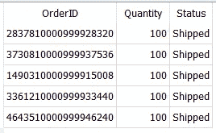
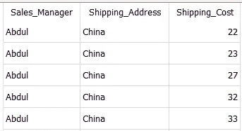

# 您应该遵循的 5 个最有用的 SQL 最佳实践

> 原文：<https://towardsdatascience.com/5-most-useful-sql-best-practices-you-should-follow-ef753a50ad26>

## 数据科学

## 避免经常犯的错误以改进您的代码


照片由[亚历克斯·莱昂](https://unsplash.com/@alexlionco?utm_source=unsplash&utm_medium=referral&utm_content=creditCopyText)在 [Unsplash](https://unsplash.com/collections/3381514/it%27s-about-time?utm_source=unsplash&utm_medium=referral&utm_content=creditCopyText) 拍摄

**SQL——所有数据专业人员最重要的技能之一！**🏆

考虑到 SQL 中庞大的命令集，有多种方法可以获得所需的结果数据集。然而，重要的是要知道并实现有效的、计算成本低的方法来实现你的目标。

因此，我在这里列出了作为数据专业人员应该知道的编写 SQL 查询的 5 个最佳实践。

我把这篇文章写得很短，这样你就可以很快地完成它，并掌握节省时间、编写 SQL 查询的正确方法。🏆

您可以使用此索引快速导航到您最喜欢的部分。

```
**·** [**Prefer using specific column names in SELECT**](#7ac8) **·** [**Use WHERE and HAVING wisely**](#8bcf) **·** [**Prioritize using SQL JOINs over WHERE**](#1db3) **·** [**Select unique records without using DISTINCT**](#669f) **·** [**Use LIKE for filtering the dataset Rows**](#bc5d)
```

> 📍注意:我使用的是 SQLite DB 浏览器&自己创建的 [Dummy_Sales_Data](https://github.com/17rsuraj/data-curious/blob/master/TowardsDataScience/Dummy_Sales_Data_v1.csv) 使用 [**Faker**](/faker-an-amazing-and-insanely-useful-python-library-b313a60bdabf) 创建的，你可以在我的 [**Github**](https://github.com/17rsuraj/data-curious/blob/master/TowardsDataScience/Dummy_Sales_Data_v1.csv) repo 下免费获得 [**MIT 许可**](https://github.com/17rsuraj/data-curious/blob/master/LICENSE.md) **！**

好了，我们开始吧…🚀

# 首选在 SELECT 中使用特定的列名

从数据库的特定表中检索所有数据的最常见和最简单的方法是`SELECT *`。但是，当您试图从一个拥有数十亿行、占用 100s GBs 数据的数据集中提取数据时，这将是最昂贵的方法。

在现实世界中，数据集中的所有列很少对特定任务有用。因此，在 SELECT 语句中传递所需的列名更有意义。

例如，当您需要虚拟销售数据集中的订单 ID、数量和状态列时，`SELECT * FROM Dummy_Sales_Data_v1`将生成包含数据集所有行和列的输出。

然而，你只需要三列，这意味着其他由`SELECT *`提取的信息对你的任务没有用。

相反，当你使用正确的方法时，

```
**SELECT OrderID,
       Quantity,
       Status**
FROM Dummy_Sales_Data_v1
```

您将仅获得任务所需的信息，如下所示


按作者选择 SQL | Image 中的列名

在我看来，以下是您不应该使用 SELECT *的 5 个原因

🔸**SQL 联接的复杂性:**
当 JOIN 语句中的两个表具有相同的列名时，在联接中使用 SELECT *可能会在列名之间引入歧义。

🔸**失去透明性:**
SELECT *无法让您的 SQL 查询读者知道您要从哪些列获取数据。

🔸**增加的网络流量:**
SELECT *返回的数据量肯定会超过您的任务需求，而且这不是免费的。您的数据库和网络正在遭受损失，因为它们正在处理所有的数据。

🔸**内存消耗增加:**
由于处理超过所需的数据会不必要地增加内存消耗。当您在单个计算集群上与一组专业人员一起工作时，这可能会特别成问题。

🔸**数据复制不正确:**
将数据从一个表复制到另一个表的常用方法之一是在 INSERT 语句中使用 SELECT。当使用 SELECT *而不是特定列时，如果两个表中的列顺序不同，可能会将不正确的数据复制到新表中。

最终， ***选择*是不好的做法，必须避免*** 。相反，使用特定的列名来编写一个易于阅读、易于调试、节省时间和内存的查询。💯

接下来，我们讨论一下为什么理解 WHERE 和 HAVING 子句的区别很重要。

# 明智地使用和拥有

这两个子句在 SQL 中用于逻辑过滤数据。然而，他们在工作中有一点小小的不同。

`**WHERE**`子句用于根据其中提到的条件选择记录，而`**HAVING**`子句用于根据一列或多列的聚合从组中选择记录。这就是为什么`HAVING`出现在`GROUP BY`子句之后，它本质上是对行进行分组。

此外，与`WHERE`子句不同，您可以在`HAVING`子句中使用任何聚合函数，比如 sum、min、max。

但是，有时编码人员会像下面这样互换使用它们，

❌坏方法——使用`HAVING`过滤使用非聚集列的记录

```
SELECT OrderID,
       Quantity,
       Status
FROM Dummy_Sales_Data_v1
GROUP BY OrderID, Quantity, Status
**HAVING Quantity = 100**
AND Status LIKE 'Shipped'
AND Shipping_Cost > 30
```

✅最佳方式——使用`WHERE`过滤使用非聚集列的记录

```
SELECT OrderID,
       Quantity,
       Status
FROM Dummy_Sales_Data_v1
**WHERE Quantity = 100**
AND Status LIKE 'Shipped'
AND Shipping_Cost > 30
```

上述两个查询返回如下相同输出:



WHERE 和 HAVING | Image by Author 的输出相同

然而，人们应该始终考虑 SQL 操作的执行顺序。

如前面提到的 [**Sisense**](https://www.sisense.com/blog/sql-query-order-of-operations/) ，
***在哪里被执行*** ***在分组前被*** 查询。这意味着，`WHERE`在对行进行分组或聚合列计算之前选择行。

并且， ***HAVING 是在 GROUP BY*** 子句之后执行的，意思是在对分组后的行执行了聚集函数之后选择行。

这就是为什么*是前置过滤器*而*是后置过滤器*的原因。
所以，`**WHERE**` **会更快。**

如果你的任务可以通过`WHERE`从句完成，那么我会建议不要用`HAVING`代替`WHERE`。

当您想要基于一些列聚合来选择行时,`HAVING`绝对是最佳解决方案。

另外，另一个常犯的错误是使用 WHERE 连接两个表，这在 SQL 中不是好的做法。下面我们来详细讨论一下。

# 优先使用 SQL 连接

在 SQL 中，`JOIN`子句用于根据多个表之间的相关列组合这些表中的行，而`WHERE`子句用于根据其中提到的条件选择行。

但是，有时 data professional 使用`WHERE`子句从两个表中选择行，此时某个列及其值同时出现在两个表中。

让我们看一个简单的例子。

首先，让我们创建两个[**cte 或公共表表达式**](/5-advanced-sql-concepts-you-should-know-in-2022-b50efe6c99) 订单和价格。然后我们可以看到如何从两个表中选择行。(*当您已经有两个表*时，绝对不需要这一步)

```
WITH orders AS
(
SELECT OrderID,
       Product_Category,
       Quantity
FROM Dummy_Sales_Data_v1
WHERE Quantity = 100
AND Status LIKE 'Shipped'
AND Product_Category LIKE 'Healthcare'
),prices AS
(
SELECT OrderID,
       UnitPrice,
       Shipping_Cost,
       Shipping_Address
FROM Dummy_Sales_Data_v1
WHERE Quantity = 100
AND Product_Category LIKE 'Healthcare'
)
```

现在，让我们从订单 ID 匹配的两个表中选择所有的行和列—订单 ID、产品类别、数量、单价。

❌不好的做法你应该避免

```
SELECT orders.OrderID,
       orders.Product_Category,
       orders.Quantity,
       prices.UnitPrice
FROM orders, prices
**WHERE orders.OrderID = prices.OrderID**
```

在这种情况下，`WHERE`子句自动充当`INNER JOIN`，这意味着您正在执行 join 而没有显式地提及 JOIN 子句。所以，这里的`**WHERE**` 就变成了的隐式连接。

这导致可读性和理解性差。

然而，显式连接才是正确的方式，比如显式地提到连接的类型，比如— `LEFT JOIN`、`RIGHT JOIN`、`INNER JOIN` 。这样，您的查询可读性更好，也更容易理解。💯

它还为您提供了更多的灵活性来选择您想要执行的连接操作的类型——左连接或右连接——而`WHERE`子句不需要。

✅是你应该遵循的好习惯。

```
SELECT orders.OrderID,
       orders.Product_Category,
       orders.Quantity,
       prices.UnitPrice
FROM orders
**INNER JOIN prices
ON orders.OrderID = prices.OrderID**
```

两个查询都检索相同结果集，如下所示:


SQL 联接-隐式和显式|作者图片

这样，您可以将两个表组合在一个公共列上，并将所有条件选择的行放在`JOIN`子句之后的`WHERE`子句上。

根据我的经验，使用`JOIN`而不是`WHERE`子句的主要优点是—

🔸SQL 联接使您能够控制扫描和联接表的顺序

🔸使用显式连接编写的查询易于阅读、理解和修改，因为`JOIN`标准与`WHERE`子句保持分离。

🔸在编写查询时，在 FROM 子句中提到表名后，您很容易忘记`WHERE`子句，而在 JOIN criteria 中却不是这样。当你想合并两个表格时，你肯定会在`FROM`后使用`JOIN`。

因此，显式总是比隐式好，因为它更容易理解和维护。💯

接下来，让我们讨论 DISTINCT 从表中选择唯一记录的最佳替代方法。

# 选择不使用 DISTINCT 的唯一记录

每当您需要从数据库中提取唯一的记录时，一个简单的答案就是使用`**DISTINCT**`！！

然而，`DISTINCT`可能很昂贵，因为它不会告诉您所使用的连接和过滤器是正确的还是不正确的，而这实际上是重复的原因。

只要您想从单个列中选择唯一的值，`DISTINCT`就能很好地工作。但是，当你想选择唯一的行(多列的组合)时，`**GROUP BY**`是最好的选择。💯

例如，从我们的数据集中选择销售经理、送货地址和运费的唯一行。

```
***--*** *Using* ***DISTINCT***SELECT **DISTINCT** Sales_Manager,
                Shipping_Address,
                Shipping_Cost
FROM Dummy_Sales_Data_v1
WHERE Status LIKE 'Shipped'
AND Product_Category LIKE 'Healthcare' ***--*** *Using* ***GROUP BY***SELECT Sales_Manager,
       Shipping_Address,
       Shipping_Cost
FROM Dummy_Sales_Data_v1
WHERE Status LIKE 'Shipped'
AND Product_Category LIKE 'Healthcare'
**GROUP BY** Sales_Manager, 
         Shipping_Address, 
         Shipping_Cost
```

两个查询返回完全相同的行



使用 DISTINCT 和 GROUP BY | Image by Author 选择唯一记录

由于在这个查询中没有提到任何复杂的 join 语句，并且数据集与商业数据集相比也很小，所以两个查询具有相同的性能。

然而，几乎 90%的时候，我发现`GROUP BY`更方便，因为我总是想使用集合函数做一些其他的计算，这可以使用`GROUP BY`来完成。

除了 GROUP BY 之外，还有 3 种最好的方法可以在不使用 DISTINCT 的情况下获得唯一的记录。

> UNION()、INTERSECT() & ROW_NUMBER()

在我的上一篇文章中，了解更多关于在 SQL 中寻找唯一记录的 3 种终极方法。

[](/3-ultimate-ways-to-find-unique-records-in-sql-6ddf8ae567b0) [## 在 SQL 中查找唯一记录的 3 种终极方法

### 停止使用 DISTINCT！开始使用这些快速的替代方法来避免混淆！

towardsdatascience.com](/3-ultimate-ways-to-find-unique-records-in-sql-6ddf8ae567b0) 

最后，让我们讨论如何使用 SQL 的内置特性(如索引)来提高查询性能。

# 使用 LIKE 筛选数据集行

过滤行最常见的方法是使用数学表达式，如`**=**`、`**>**`等等。然而，它们会生成布尔值——真或假*——并且只选择那些表达式为`TRUE`的行。*

这个过程很慢，因为它不使用 SQL 索引，而 SQL 索引是一种与表相关联的磁盘结构，可以加快从表中检索行的速度。

根据 [**微软**](https://docs.microsoft.com/en-us/sql/relational-databases/indexes/clustered-and-nonclustered-indexes-described?view=sql-server-ver16) ，

> 索引包含从表或视图中的一列或多列构建的键。这些键存储在一个结构(B 树)中，该结构使 SQL Server 能够快速有效地找到与键值关联的一行或多行。

这些表达式的快速替代方法是使用像`**LIKE**`这样的操作符。

当然，当你需要对数值或聚合值使用过滤器时，这并不是一个好的选择。

但是，对于文本值，您总是可以使用 LIKE 运算符。💯

例如，让我们检索数据集的所有行，其中产品类别为“医疗保健”，状态为“已发货”

❌的不良做法是，

```
SELECT OrderID, 
        Product_Category,
        Status
FROM Dummy_Sales_Data_v1
WHERE Product_Category **=** 'Healthcare'
AND Status **=** 'Shipped'
```

✅的良好做法是，

```
SELECT OrderID, 
        Product_Category,
        Status
FROM Dummy_Sales_Data_v1
WHERE Product_Category **LIKE** 'Healthcare'
AND Status **LIKE** 'Shipped'
```

这样，即使您不知道要比较的确切文本值，也可以在 LIKE 运算符中使用通配符。

我推荐阅读 2022 年 你应该知道的 [**5 个实用 SQL 查询，深入了解如何使用 LIKE 运算符。**](/5-practical-sql-queries-you-should-know-in-2022-11b428560a30#4750)

仅此而已！

我希望你很快完成这篇文章，并发现它对提高 SQL 技能很有用。

过去 3 年来，我一直在使用 SQL，并通过经验找到了这些最佳实践。此外，这些实践在数据科学工作面试中也会得到间接测试。采用它们肯定会为您的 SQL 技能增加更多价值。

> 对阅读媒体上的无限故事感兴趣？？

💡考虑 [**成为媒体会员**](https://medium.com/@17.rsuraj/membership) 到**访问媒体上无限的**故事和每日有趣的媒体文摘。我会得到你的费用的一小部分，没有额外的费用给你。

💡请务必 [**注册我的电子邮件列表**](https://medium.com/subscribe/@17.rsuraj) **和 800+其他**千万不要错过另一篇关于数据科学指南、技巧和提示、SQL 和 Python 的文章。

**感谢您的阅读！**